<!--
  Archivo generado por fusión de todos los archivos .md de report/chapters/ (capítulos I a V y conclusiones),
  ordenados por número de sección. Las rutas de imágenes fueron reescritas relativas a esta carpeta.
  Los archivos originales no fueron modificados.
-->

<!-- Fuente: report/chapters/chapter-1-introduction/1-capitulo-i-introduccion.md -->

## Capítulo I: Introducción

En este capítulo se presenta el punto de partida del proyecto, comprendiendo tanto la organización responsable de su desarrollo como la solución propuesta y los segmentos a los que esta se dirige.

El capítulo inicia con el Startup Profile, donde se describe a Trazza Labs, la startup conformada por el equipo, junto con los perfiles de cada uno de sus integrantes y los conocimientos y habilidades que aportan al proyecto. A continuación, el Solution Profile expone los antecedentes y la problemática identificada en la cadena de suministro de materiales del sector construcción, para lo cual se aplica la técnica de las 5 'W's y 2 'H's, y se establecen los objetivos y restricciones que delimitan el alcance del proyecto. Esta misma sección presenta el resultado de aplicar el Lean UX Process sobre el dominio del problema, comprendiendo el Problem Statement, los Assumptions, los Hypothesis Statements y el Lean UX Canvas.

Finalmente, el capítulo cierra con la descripción de los segmentos objetivo a los que se dirige la solución, incluyendo sus características demográficas y la información estadística que sustenta su relevancia y tamaño de mercado.

<!-- Fuente: report/chapters/chapter-1-introduction/1.1-startup-profile.md -->

### 1.1. Startup Profile

En esta sección se presenta el perfil de Trazza Labs, startup responsable del
desarrollo de Vigía, una plataforma tecnológica orientada a asegurar la
trazabilidad de los materiales dentro del sector construcción. Asimismo, se
describe el propósito de la startup y se presentan los perfiles de los integrantes
del equipo, destacando los principales conocimientos, habilidades y aportes de
cada miembro para el desarrollo del proyecto.

<!-- Fuente: report/chapters/chapter-1-introduction/1.1.1-descripcion-de-la-startup.md -->

#### 1.1.1. Descripción de la Startup

Trazza Labs es una startup de reciente creación conformada por cinco estudiantes
de la carrera de Ingeniería de Software de la Universidad Peruana de Ciencias
Aplicadas, orientada al desarrollo de soluciones tecnológicas para el sector
construcción. Su nombre proviene de la trazabilidad, concepto que sintetiza el
propósito de la organización: hacer verificable el recorrido de un material desde
su origen hasta su destino final.

La startup surge a partir de la identificación de una necesidad no atendida en la
cadena de suministro de la construcción: la ausencia de un registro verificable
que permita conocer qué material salió del almacén central, cómo fue trasladado y
cuánto llegó efectivamente al frente de obra. Esta discontinuidad en la custodia
genera pérdidas económicas por mermas no justificadas, sustracciones durante el
traslado y discrepancias entre lo despachado y lo recibido, que hoy se resuelven
mediante registros en papel y coordinaciones informales.

**Misión.** Brindar a las empresas constructoras y a sus operadores logísticos una
plataforma que asegure la trazabilidad de los materiales a lo largo de toda la
cadena de custodia, reduciendo las pérdidas económicas asociadas a mermas no
justificadas y a discrepancias en la recepción.

**Visión.** Consolidarse hacia el año 2031 como la plataforma de referencia en
trazabilidad de materiales de construcción en el Perú, extendiendo posteriormente
su alcance a los demás países de la región.

El producto desarrollado por Trazza Labs es Vigía, una plataforma web que
digitaliza la cadena de custodia de los materiales desde el despacho en el almacén
central hasta la recepción física en el frente de obra. Su modelo de negocio se
sustenta en la suscripción de empresas constructoras y operadores logísticos bajo
un esquema de Software as a Service, lo que le otorga escalabilidad al no requerir
un incremento proporcional de recursos por cada nuevo cliente atendido.

<!-- Fuente: report/chapters/chapter-1-introduction/1.1.2-perfiles-de-integrantes-del-equipo.md -->

#### 1.1.2. Perfiles de integrantes del equipo

En esta sección se presentan los perfiles de los integrantes de Trazza Labs. Para cada miembro se indican sus nombres y apellidos, su código de estudiante y su carrera, junto con un resumen de los conocimientos técnicos y las habilidades que aporta al desarrollo de Vigía.

El equipo reúne perfiles complementarios en desarrollo backend, desarrollo frontend, diseño de experiencia de usuario y gestión del proyecto, lo que permite cubrir de forma colaborativa las actividades previstas en el ciclo de vida de la solución.

---

<!-- INTEGRANTE 1 -->

| | |
|---|---|
|  | **Apellidos y Nombres:** Sandoval, Fabián<br><br>**Código:** u2022XXXXX<br><br>**Carrera:** Ingeniería de Software<br><br>**Rol en el equipo:** Team Leader |

Soy estudiante de Ingeniería de Software con experiencia en desarrollo backend con Spring Boot y en desarrollo frontend con Vue 3 y PrimeVue, así como en el uso de Docker para la configuración de entornos de desarrollo. Manejo Git y GitHub aplicando GitFlow y Conventional Commits, lo que me permite coordinar la integración del trabajo del equipo en los repositorios del proyecto. Aporto al equipo en la organización de las tareas, la definición de la arquitectura de la solución y la implementación de los servicios del RESTful API.

---

<!-- INTEGRANTE 2 -->

| |                                                                                                                                                          |
|---|----------------------------------------------------------------------------------------------------------------------------------------------------------|
|  | **Apellidos y Nombres:** Lopez, Leonardo<br><br>**Código:** u20241a649<br><br>**Carrera:** Ingeniería de Software<br><br>**Rol en el equipo:** Developer |

*(Párrafo de resumen: conocimientos técnicos que domina, herramientas y lenguajes con los que ha trabajado, y aporte concreto al proyecto. Entre 60 y 100 palabras, redactado en primera persona.)*

---

<!-- INTEGRANTE 3 -->

| | |
|---|---|
|  | **Apellidos y Nombres:** Cardenas Huaman, Mathias Andree<br><br>**Código:** u202316353<br><br>**Carrera:** Ingeniería de Software<br><br>**Rol en el equipo:** Developer |

Actualmente me encuentro estudiando la carrera de Ingeniería de Software. Soy proactivo y comunicativo, trabajo en equipo y resolución de problemas, también me gusta colocarme objetivos desafiantes para mejorar. Me encanta el curso y mi meta es completarla con la máxima nota posible.

---

<!-- INTEGRANTE 4 -->

| | |
|---|---|
|  | **Apellidos y Nombres:** Apaza Bocanegra, Elizabeth Noelia<br><br>**Código:** u20231c197<br><br>**Carrera:** Ingeniería de Software<br><br>**Rol en el equipo:** Developer |

Soy estudiante de la carrera de Ingeniería de Software, tengo 20 años y me defino como una persona responsable, organizada y con facilidad para colaborar con los demás. Disfruto mucho del trabajo en equipo porque me permite intercambiar ideas y seguir aprendiendo de mi carrera. Me interesa desarrollar constantemente nuevas habilidades y busco aportar siempre con una comunicación clara y efectiva en cada proyecto. Mi objetivo es fortalecer mi formación académica y aprovechar cada experiencia para crecer tanto en lo profesional como en lo personal.

---

<!-- INTEGRANTE 5 -->

| | |
|---|---|
|  | **Apellidos y Nombres:** Apellidos, Nombres<br><br>**Código:** uXXXXXXXXX<br><br>**Carrera:** Ingeniería de Software<br><br>**Rol en el equipo:** Developer |

*(Párrafo de resumen.)*

<!-- Fuente: report/chapters/chapter-1-introduction/1.2-solution-profile.md -->

### 1.2. Solution Profile

En esta sección se presenta el perfil de la solución propuesta por Trazza Labs y
se organiza en dos partes. La primera, Antecedentes y problemática, expone el
enunciado del problema identificado en la cadena de custodia de materiales de
construcción, los puntos que la solución debe resolver, así como los objetivos y
restricciones que delimitan el alcance del proyecto. La segunda, Lean UX Process,
presenta el resultado de aplicar dicho proceso sobre el dominio del problema,
comprendiendo los Problem Statements, los Assumptions, los Hypothesis Statements
y el Lean UX Canvas.

<!-- Fuente: report/chapters/chapter-1-introduction/1.2.1-antecedentes-y-problematica.md -->

#### 1.2.1. Antecedentes y problemática

_Antecedentes_

El sector de la construcción y la ingeniería civil se caracteriza por la alta complejidad en la gestión de su cadena de suministro. La ejecución técnica y financiera de un proyecto depende de la sincronización milimétrica entre los centros de distribución y abastecimiento (almacenes) y los puntos de ejecución (frentes de obra). Históricamente, el seguimiento de materiales, maquinaria y recursos logísticos ha dependido de herramientas ofimáticas aisladas y canales de comunicación informales. Esta práctica tradicional genera silos de información, provocando brechas críticas de visibilidad durante el tránsito y la recepción de suministros críticos para el avance de las obras.

_Problemática_

Actualmente, las empresas constructoras enfrentan una deficiencia operativa severa en la trazabilidad de sus recursos logísticos. Existe una profunda desconexión entre los puntos de despacho y los frentes de obra, agravada por la ausencia de visibilidad sobre el estado del despacho durante el tránsito.

Para dimensionar el estado actual de la situación, se aplica la técnica de las 5 'W's y 2 'H's sobre los procesos operativos y logísticos:

- **Who (Quiénes están involucrados):** Los ingenieros civiles residentes, jefes de almacén central, despachadores, transportistas de carga pesada, supervisores de proyecto y responsables del frente de obra, quienes operan con información asíncrona y fragmentada.

- **What (Cuál es el problema exacto):** La falta de trazabilidad, visibilidad y registro centralizado en el flujo de materiales y transporte pesado a lo largo de la cadena de custodia.

- **Where (Dónde ocurre):** En la ruta de suministro que abarca desde los almacenes principales de abastecimiento, pasando por las rutas de transporte terrestre, hasta las zonas de descarga en los frentes de obra.

- **When (Cuándo se evidencia):** Durante el tránsito de materiales, en los tiempos de espera prolongados para las recepciones y al momento de conciliar el inventario físico con el planificado operativo.

- **Why (Por qué ocurre):** Debido a la carencia de plataformas tecnológicas integradas y a la ausencia de un registro verificable de los eventos de despacho, tránsito y recepción, lo que impide segregar y compartir la información según las necesidades de cada rol.

- **How (Cómo se manifiesta):** A través de la dependencia de reportes manuales, desvíos de materiales no detectados, desinformación ante incidencias vehiculares en ruta y tiempos muertos del personal en obra por falta de insumos.

- **How Much (Cuál es el impacto cuantificable):** Estas ineficiencias logísticas representan hasta un 15% de retraso acumulado en los cronogramas de ejecución de obra y generan un sobrecosto estimado del 8% en el presupuesto de materiales debido a mermas, tiempos de inactividad o pérdidas no rastreadas.

Esta fragmentación impide un control auditable. El personal de almacén carece de confirmaciones de recepción; el frente de obra opera con total incertidumbre sobre las llegadas de insumos clave; el transportista no cuenta con un respaldo verificable de lo que efectivamente despachó; y la supervisión no dispone de una visión integral de las operaciones, comprometiendo gravemente la rentabilidad y la eficiencia técnica del proyecto.

_Objetivos_

A partir de la problemática expuesta, el equipo establece los siguientes objetivos para la solución propuesta:

- Asegurar la trazabilidad de los materiales desde el despacho en el almacén central hasta su recepción en el frente de obra, mediante un registro verificable de cada evento de la cadena de custodia.

- Reducir el tiempo de detección de discrepancias entre lo despachado y lo recibido, permitiendo su identificación en el momento mismo de la recepción y no durante la conciliación posterior de inventarios.

- Proveer a los responsables de obra, almacén central y transporte información consistente y compartida sobre el estado de cada despacho en curso, eliminando la dependencia de canales de comunicación informales.

- Sustentar la determinación de responsabilidad ante un faltante mediante evidencia registrada en cada punto de la cadena, reduciendo la controversia entre las partes involucradas.

_Restricciones_

El alcance del proyecto se delimita mediante las siguientes restricciones:

- El alcance funcional comprende el tramo de la cadena de suministro que va desde el despacho en el almacén central hasta la recepción en el frente de obra. No abarca la gestión de compras, la relación con proveedores ni el control de producción de materiales.

- La solución se implementa como una Web Application integrada a un RESTful API de elaboración interna, junto con un Landing Page del modelo de negocio, con acceso a un servicio externo de terceros, según el alcance establecido para el proyecto.

- La experiencia web debe ser adaptable a las dimensiones de visualización de los dispositivos cliente, considerando que los usuarios del frente de obra operan principalmente desde teléfonos inteligentes.

- La operación en el frente de obra debe contemplar condiciones de conectividad intermitente, dado que los proyectos de construcción se ejecutan con frecuencia en zonas de cobertura limitada.

- Los productos de la solución deben incorporar características de internacionalización (i18n) y accesibilidad (a11y), considerando como base los idiomas inglés (en_US) y español latinoamericano (es_419).

<!-- Fuente: report/chapters/chapter-1-introduction/1.2.2-lean-ux-process.md -->

#### 1.2.2. Lean UX Process

En esta sección se presenta el resultado de aplicar el Lean UX Process sobre el dominio del problema descrito en la sección anterior. Este proceso permite al equipo articular la visión del modelo de negocio que será soportado por Vigía a partir de creencias explícitas sobre el mercado, los usuarios y las funcionalidades, las cuales podrán ser validadas posteriormente mediante la investigación con representantes de los segmentos objetivo.

El proceso se desarrolla en cuatro secciones internas. En primer lugar, se formula un único Problem Statement para todo el proyecto, aplicando el template de Brand new initiative por tratarse de una iniciativa nueva y no de la evolución de un producto existente, y considerando en su enunciado a ambos segmentos objetivo. En segundo lugar, se enumeran los Assumptions del equipo, organizados en los cinco tipos que contempla el proceso: Business Assumptions, Business Outcome Assumptions, User Assumptions, User Outcome and Benefit Assumptions y Feature Assumptions. En tercer lugar, se formula un Hypothesis Statement por cada Feature Assumption identificado. Finalmente, la sección cierra con el Lean UX Canvas, que consolida de forma visual los elementos anteriores.

<!-- Fuente: report/chapters/chapter-1-introduction/1.2.2.1-lean-ux-problem-statements.md -->

##### 1.2.2.1. Lean UX Problem Statements

De acuerdo con el Lean UX Process, se elabora un único Problem Statement para todo el proyecto, considerando en su enunciado a cada uno de los segmentos objetivo. Dado que Vigía constituye una iniciativa nueva y no la evolución de un producto existente, se aplica el template de Brand new initiative.

**Problem Statement**

El estado actual de la gestión de la cadena de suministro en el sector construcción se ha concentrado principalmente en las empresas constructoras e inmobiliarias que abastecen sus frentes de obra desde almacenes centrales, y en las empresas de logística, transporte y almacenes satélite responsables de la custodia y el traslado de los materiales. Estos segmentos enfrentan la incertidumbre sobre el estado de los despachos en tránsito, la imposibilidad de verificar en el momento de la recepción si lo recibido corresponde a lo despachado, y la dificultad para determinar la responsabilidad ante un faltante. Sus flujos de trabajo dependen de herramientas ofimáticas aisladas, guías de remisión en papel y coordinaciones por canales informales.

Lo que los productos y servicios existentes no atienden es la continuidad del registro de custodia entre el despacho y la recepción: los sistemas de gestión de obra concentran la planificación y el presupuesto sin cubrir el traslado, mientras que las soluciones de control de flota cubren el traslado sin conocer el contenido de la carga ni la conformidad de la entrega. Ninguno de ellos reconcilia ambos extremos sobre un mismo despacho.

Nuestro producto atenderá esta brecha mediante una plataforma que registra de forma verificable cada evento de la cadena de custodia, desde la conformación del despacho en el almacén central hasta la conformidad de recepción en el frente de obra, permitiendo la detección de discrepancias en el momento en que se producen y operando bajo condiciones de conectividad intermitente.

Nuestro enfoque inicial será el segmento de empresas constructoras e inmobiliarias medianas de Lima Metropolitana que gestionan más de un frente de obra activo.

Sabremos que hemos tenido éxito cuando observemos que las discrepancias entre lo despachado y lo recibido se detecten durante la recepción y no en la conciliación posterior de inventarios, que el tiempo dedicado a esclarecer la responsabilidad por faltantes se reduzca de forma significativa, y que los usuarios de ambos segmentos registren de manera sostenida los eventos de despacho y recepción en la plataforma.

<!-- Fuente: report/chapters/chapter-1-introduction/1.2.2.2-lean-ux-assumptions.md -->

##### 1.2.2.2. Lean UX Assumptions

Para el desarrollo de la plataforma Vigía, el equipo identificó y categorizó los supuestos que sustentan la viabilidad comercial, la aceptación por parte de los usuarios y la propuesta funcional del modelo de negocio. Estos supuestos constituyen creencias que deberán ser confirmadas o descartadas mediante la investigación con representantes de los segmentos objetivo y las entrevistas de validación.

**Business Assumptions**

- **BA-01.** Creemos que las empresas constructoras y contratistas de mediana y gran envergadura están dispuestas a pagar una suscripción mensual recurrente por una solución digital que centralice y audite la cadena de suministro entre almacenes y frentes de obra.

- **BA-02.** Creemos que el ahorro derivado de evitar sobrecostos por mermas y pérdidas no rastreadas justifica el costo de adopción e inversión operativa de la plataforma.

- **BA-03.** Creemos que la principal ventaja competitiva de Vigía radica en reconciliar sobre un mismo despacho la información del almacén central, el transporte y el frente de obra, aspecto que los sistemas de gestión de obra y las soluciones de control de flota atienden por separado.

- **BA-04.** Creemos que la adopción por parte de las empresas constructoras permitirá incorporar a sus operadores logísticos tercerizados, ya que la constructora tiene capacidad de establecer el uso de la plataforma como condición del servicio.

- **BA-05.** Creemos que el modelo de suscripción bajo el esquema de Software as a Service otorga escalabilidad al negocio, al no requerir un incremento proporcional de recursos por cada nuevo cliente atendido.

**Business Outcome Assumptions**

- **BOA-01.** Creemos que alcanzaremos una tasa de retención de clientes corporativos superior al 85% durante el primer año de operación comercial.

- **BOA-02.** Creemos que el costo de adquisición de clientes se amortizará en un periodo menor a cuatro meses, gracias al retorno de inversión que experimentan las constructoras al evitar pérdidas de material.

- **BOA-03.** Creemos que la plataforma logrará una tasa de recomendación neta superior a 60 puntos entre los directores de operaciones y jefes de logística del sector.

- **BOA-04.** Creemos que el número de despachos registrados por cliente se incrementará de forma sostenida durante los primeros seis meses de uso, como indicador de la incorporación de la plataforma a la operación diaria.

**User Assumptions**

- **UA-01.** Creemos que los jefes de almacén central necesitan un mecanismo ágil y digital para conformar despachos, registrar el número de guía de remisión y transferir la custodia de los materiales sin recurrir a hojas de cálculo aisladas.

- **UA-02.** Creemos que los responsables del frente de obra requieren conocer con anticipación el estado y el contenido de los despachos en tránsito, así como contar con una interfaz adaptable al dispositivo para cotejar de inmediato el material recibido frente al despachado.

- **UA-03.** Creemos que los supervisores de proyecto y gerentes de operaciones necesitan un tablero consolidado que les advierta sobre discrepancias en el conteo o el pesaje de recepción.

- **UA-04.** Creemos que los transportistas requieren un respaldo verificable de lo que efectivamente despacharon, dado que ante un faltante detectado en la recepción el costo suele imputarse a la empresa de transporte o al conductor.

- **UA-05.** Creemos que el personal operativo cuenta con teléfonos inteligentes durante su jornada, aunque la cobertura de datos en el frente de obra y en ruta es intermitente, por lo que el registro debe poder realizarse sin conexión y sincronizarse posteriormente.

**User Outcome and Benefit Assumptions**

- **UOBA-01.** Creemos que los jefes de almacén y los responsables en obra reducirán de forma significativa el tiempo invertido en llamadas telefónicas, mensajes informales y conciliaciones manuales de inventario al cierre del día.

- **UOBA-02.** Creemos que los responsables del frente de obra reducirán la incertidumbre al programar el trabajo diario de sus cuadrillas, al conocer el estado de los despachos de materiales críticos.

- **UOBA-03.** Creemos que el personal en obra disminuirá los tiempos muertos al poder anticipar contingencias o retrasos en el traslado.

- **UOBA-04.** Creemos que los usuarios de ambos segmentos obtendrán un respaldo auditable e inmediato ante cualquier faltante o reclamo, mediante el registro digital y fotográfico de las no conformidades en el punto de recepción.

- **UOBA-05.** Creemos que la determinación de responsabilidad ante un faltante dejará de depender de la versión de cada parte y pasará a sustentarse en la evidencia registrada en cada punto de la cadena.

**Feature Assumptions**

- **FA-01.** Creemos que un módulo de conformación y programación de despachos permitirá al jefe de almacén registrar los ítems, las cantidades, el peso de salida y el transportista asignado, generando un manifiesto digital identificable de forma unívoca.

- **FA-02.** Creemos que un módulo de registro de eventos de tránsito permitirá al transportista reportar la salida, los hitos de la ruta y la llegada del despacho, otorgando a los responsables de obra visibilidad sobre el estado de los materiales en camino.

- **FA-03.** Creemos que un módulo de recepción, verificación y conciliación en obra permitirá al personal en destino registrar la cantidad efectivamente recibida, marcar discrepancias por faltantes o daños y generar el acta de recepción digital con evidencia fotográfica, operando bajo condiciones de conectividad intermitente.

- **FA-04.** Creemos que un tablero de analítica y registro de incidencias brindará al supervisor de proyecto un histórico de discrepancias, tiempos de traslado y desempeño de transportistas, que sustente la toma de decisiones sobre la operación.

<!-- Fuente: report/chapters/chapter-1-introduction/1.2.2.3-lean-ux-hypothesis-statements.md -->

##### 1.2.2.3. Lean UX Hypothesis Statements

Siguiendo el template establecido por el Lean UX Process, se formula un Hypothesis Statement por cada Feature Assumption identificado en la sección anterior. Cada enunciado vincula el resultado de negocio esperado con el User Persona correspondiente, el beneficio que este obtiene y la funcionalidad que lo hace posible.

**Hypothesis Statement 1 (HS-01) — Conformación de despachos**

Creemos que lograremos incrementar el número de despachos registrados de forma completa en la plataforma
si los jefes de almacén central
consiguen conformar y programar la salida de materiales con un registro estructurado de ítems, cantidades, peso y transportista asignado
mediante el módulo de conformación y programación de despachos (FA-01).

**Hypothesis Statement 2 (HS-02) — Registro de eventos de tránsito**

Creemos que lograremos reducir el número de incidencias no reportadas durante el traslado
si los transportistas y los responsables del frente de obra
obtienen visibilidad compartida sobre el estado y la ubicación declarada de cada despacho en curso
mediante el módulo de registro de eventos de tránsito (FA-02).

**Hypothesis Statement 3 (HS-03) — Recepción y conciliación en obra**

Creemos que lograremos que las discrepancias entre lo despachado y lo recibido se detecten durante la recepción y no en la conciliación posterior de inventarios
si los responsables de recepción en el frente de obra
consiguen cotejar de inmediato el material recibido frente al despachado y reportar faltantes o daños con evidencia fotográfica, incluso sin conexión a internet
mediante el módulo de recepción, verificación y conciliación en obra (FA-03).

**Hypothesis Statement 4 (HS-04) — Analítica e historial auditable**

Creemos que lograremos incrementar la retención de clientes corporativos en la plataforma
si los supervisores de proyecto y gerentes de operaciones
obtienen un histórico consultable de discrepancias, tiempos de traslado y desempeño de transportistas que sustente sus decisiones sobre la operación
mediante el tablero de analítica y registro de incidencias (FA-04).

<!-- Fuente: report/chapters/chapter-1-introduction/1.2.2.4-lean-ux-canvas.md -->

#### 1.2.2.4. Lean UX Canvas

En esta sección se presenta el Lean UX Canvas de Vigía, que consolida en un solo artefacto visual los resultados del proceso Lean UX desarrollado en las secciones anteriores. El canvas no introduce contenido nuevo: cada una de sus cajas recoge, en forma resumida, lo ya desarrollado y sustentado previamente en el informe. La caja 1 resume el problema de negocio planteado en la sección 1.2.2.1; la caja 2 recoge los Business Outcome Assumptions de la sección 1.2.2.2; la caja 3 corresponde a los User Assumptions de esa misma sección, complementados con la caracterización de los segmentos de la sección 1.3; la caja 4 recoge los User Outcome and Benefit Assumptions; la caja 5 recoge los Feature Assumptions; y la caja 6 resume los Hypothesis Statements de la sección 1.2.2.3.

Las dos últimas cajas corresponden al trabajo propio de esta sección. La caja 7 identifica, entre todos los supuestos declarados, aquel cuyo eventual error comprometería en mayor medida el conjunto de la propuesta: el supuesto BA-04, según el cual la empresa constructora tiene capacidad de establecer el uso de la plataforma como condición del servicio para sus operadores logísticos tercerizados. Se selecciona este supuesto porque el enfoque inicial declarado en la sección 1.3 descansa sobre él: la estrategia consiste en captar al primer segmento y alcanzar al segundo por arrastre, de modo que si el supuesto no se cumple, la plataforma registraría un solo extremo de la cadena y la conciliación entre ambos —que constituye la propuesta de valor— no llegaría a producirse. La caja 8 define el experimento de menor esfuerzo capaz de poner a prueba ese supuesto, aprovechando las entrevistas de validación ya previstas en la sección 2.2 con representantes del segmento de logística, transporte y almacenes.

Se emplea la versión 2 del Lean UX Canvas de Jeff Gothelf, que organiza el proceso en las ocho cajas descritas.

**Figura 1**

*Lean UX Canvas de Vigía*


*Nota.* Elaboración propia del equipo de Trazza Labs sobre la plantilla del Lean UX Canvas v2 de Jeff Gothelf, disponible bajo licencia Creative Commons BY-NC-SA. El contenido de cada caja procede de las secciones 1.2.2.1, 1.2.2.2, 1.2.2.3 y 1.3 del presente informe. El artefacto en su resolución original puede consultarse en el siguiente enlace: [Lean-UX-Canvas](https://upcedupe-my.sharepoint.com/:p:/g/personal/u20221a132_upc_edu_pe/IQAzcPXFr7caS6j_tkGE0wjBAQK0Co2JUTRnpW1049vhusM?e=hFzY45).

---

<!--
PENDIENTES DE ESTA SECCIÓN

1. Exportar el canvas a PNG (300 ppp) y guardarlo como assets/chapther-1/lean-ux-canvas.png
2. Reemplazar [ENLACE PENDIENTE] por la URL pública del artefacto (Miro, Figma o la carpeta de Drive del equipo, según decida el equipo)
3. Agregar a la Bibliografía la entrada de Gothelf (ver más abajo)
4. Verificar la numeración: esta es la primera figura numerada del informe. Si el equipo decide numerar también las capturas de las secciones 2.4 y siguientes, la numeración debe correr de forma correlativa a lo largo de todo el documento.

ENTRADA PARA LA BIBLIOGRAFÍA (APA 7)

Gothelf, J. (2019). *The Lean UX Canvas v2*. https://jeffgothelf.com/blog/leanuxcanvas-v2/
-->

<!-- Fuente: report/chapters/chapter-1-introduction/1.3-segmentos-objetivos.md -->

### 1.3. Segmentos objetivo

El dominio del problema abordado por Vigía se sitúa en el tramo de la cadena de suministro de la construcción que va desde el despacho en el almacén central hasta la recepción física en el frente de obra. En ese tramo intervienen dos grupos de actores con responsabilidades distintas pero complementarias sobre la custodia de los materiales: quienes solicitan y reciben el material en obra, y quienes lo custodian, pesan y trasladan. Ambos comparten la exposición al mismo problema, la pérdida de trazabilidad entre lo cubicado, lo despachado y lo recibido, pero lo experimentan desde extremos opuestos de la operación y con incentivos diferentes.

Por esa razón el equipo ha delimitado dos segmentos objetivo, cuya descripción se presenta a continuación junto con las características demográficas e información estadística que sustentan su relevancia y tamaño de mercado.

##### Segmento 1: Empresas Constructoras e Inmobiliarias (Gestión Técnica y de Obra)

**Descripción del segmento.** Comprende a las empresas constructoras e inmobiliarias formales que ejecutan proyectos de edificación e infraestructura con más de un frente de trabajo activo y que abastecen sus obras desde almacenes centrales o proveedores externos. Dentro de estas organizaciones, los usuarios objetivo son los ingenieros civiles residentes, los directores de obra y los arquitectos proyectistas responsables de la cubicación de planos, el pedido de materiales, el control de avances estructurales y la recepción física en el frente de trabajo.

Estos profesionales asumen la responsabilidad técnica y financiera de los insumos que ingresan a la obra. Son quienes deben justificar ante la gerencia una diferencia entre lo presupuestado y lo consumido, y quienes enfrentan de forma directa las consecuencias operativas de un despacho incompleto: la paralización de una faena, el riesgo técnico de interrumpir un vaciado de concreto y las penalidades contractuales derivadas del retraso en el cronograma.

**Características demográficas y ocupacionales.**

| Característica | Descripción |
|---|---|
| Rango de edad | 28 a 55 años |
| Género predominante | Masculino |
| Formación | Educación superior universitaria completa en Ingeniería Civil o Arquitectura, con colegiatura vigente en el CIP |
| Ubicación | Lima Metropolitana y principales ciudades del país, con desplazamiento diario hacia el frente de obra |
| Cargo | Ingeniero residente, director de obra, jefe de producción, arquitecto proyectista |
| Nivel socioeconómico | B y C |
| Dispositivos de preferencia | Teléfono inteligente durante la jornada en obra y computadora portátil en oficina técnica |
| Conectividad | Intermitente en el frente de trabajo, con zonas de cobertura limitada o nula |
| Canales de interacción | Aplicaciones de mensajería instantánea, correo electrónico corporativo y llamadas telefónicas |

**Sustento estadístico.**

*Tamaño y composición del segmento.* De acuerdo con el Instituto Nacional de Estadística e Informática, las empresas dedicadas a la actividad de construcción representan el 2.7% del total de empresas de Lima Metropolitana al tercer trimestre de 2025 (INEI, 2025). En cuanto a la estructura empresarial de la ciudad, el 95.3% corresponde a microempresas, el 3.8% a pequeñas empresas y el 1.0% a medianas y grandes empresas (INEI, 2025). Esta distribución resulta relevante para la delimitación del segmento, dado que el problema abordado por Vigía se manifiesta con mayor intensidad en organizaciones que gestionan varios frentes de obra de forma simultánea, condición asociada a las empresas de mediana y gran envergadura. Cabe precisar que el INEI publica esta distribución para el conjunto de actividades económicas y no de manera desagregada para el sector construcción.

*Dinamismo del sector.* El sector construcción cerró el año 2025 con un crecimiento de 6.5%, su mejor desempeño desde el año 2021 (Constructivo, 2026), luego de haber registrado un crecimiento de 5.3% en el primer trimestre de ese año según cifras del INEI citadas por la Cámara Peruana de la Construcción (CAPECO, 2025a). Para el año 2026, el Banco Central de Reserva del Perú proyecta un crecimiento de 10% para el sector (PQS, 2026). Este dinamismo anticipa un volumen creciente de obras simultáneas y, con ello, de operaciones de abastecimiento que requieren control.

*Empleo del sector.* Al trimestre móvil marzo-abril-mayo de 2025, la población ocupada en el sector construcción en Lima Metropolitana asciende a 415,743 personas, lo que representa un incremento de 5.8% respecto al mismo periodo del año anterior, equivalente a 22,200 personas adicionales (Perú Construye, 2025). En el mismo periodo, el empleo formal del sector creció 13.1% (CAPECO, 2025b), indicador de una creciente formalización que favorece la adopción de herramientas de gestión digital.

*Magnitud del problema de desperdicio de materiales.* No se dispone de cifras oficiales publicadas por el INEI, CAPECO o el Ministerio de la Producción sobre el desperdicio de materiales en obras de construcción a nivel nacional para el periodo 2024-2026. No obstante, investigaciones académicas desarrolladas en el país permiten dimensionar el fenómeno. Un estudio realizado en la ciudad de Ayacucho reporta porcentajes de desperdicio de entre 6.47% y 7.51% en concreto armado, y de entre 7.65% y 10.59% en acero, con un impacto de entre 3.55% y 5.14% sobre el costo inicial de la obra (Universidad Nacional de San Cristóbal de Huamanga, 2023). Por su parte, un estudio realizado en Celendín reporta desperdicios de 1.102% en concreto, 6.176% en mortero y 1.836% en ladrillo (Universidad Nacional de Cajamarca, 2024). Estas cifras corresponden a investigaciones académicas de alcance local y no constituyen estadística oficial de alcance nacional.

##### Segmento 2: Empresas de Logística, Transporte y Almacenes Satélite

**Descripción del segmento.** Comprende a las empresas de transporte de carga pesada, operadores logísticos y administradores de almacenes centrales y satélite que prestan servicio al sector construcción, ya sea como área interna de una constructora o como proveedor tercerizado. Dentro de estas organizaciones, los usuarios objetivo son los jefes de almacén central, los despachadores, los operadores de pesaje y los transportistas de carga pesada encargados de la custodia, el pesaje en báscula y el traslado fraccionado de insumos entre los centros de acopio y los frentes de obra.

A diferencia del primer segmento, estos actores son responsables de la carga durante el tramo en el que la trazabilidad es más frágil: el tránsito interurbano. Su preocupación central no es el avance de la obra sino la acreditación de que despacharon conforme, dado que ante un faltante detectado en la recepción el costo suele imputarse a la empresa de transporte o al conductor. La ausencia de un registro verificable del peso de salida y del recorrido los deja en posición desventajosa frente a cualquier reclamo.

**Características demográficas y ocupacionales.**

| Característica | Descripción |
|---|---|
| Rango de edad | 25 a 60 años |
| Género predominante | Masculino |
| Formación | Educación técnica superior en logística o administración para jefes de almacén; educación secundaria completa y licencia de conducir A-IIIb o superior para transportistas |
| Ubicación | Zonas industriales y periféricas de Lima Metropolitana, con operación en rutas urbanas e interurbanas |
| Cargo | Jefe de almacén central, despachador, operador de báscula, transportista de carga pesada |
| Nivel socioeconómico | C y D |
| Dispositivos de preferencia | Teléfono inteligente de gama media o baja, de uso personal, durante toda la jornada |
| Conectividad | Variable, con tramos de ruta sin cobertura de datos |
| Canales de interacción | Llamadas telefónicas y mensajería instantánea, con predominio del uso por voz sobre el texto |

**Sustento estadístico.**

*Tamaño del segmento.* Según el Anuario Estadístico 2024 del Ministerio de Transportes y Comunicaciones, existen 129,385 empresas autorizadas para prestar el servicio de transporte terrestre de carga por carretera, de las cuales el 99.1% opera en el ámbito nacional y el 0.9% en el ámbito internacional (MTC, 2025). Esta cifra representa una disminución de 1.5% respecto al año 2023, equivalente a 1,907 empresas menos, lo que evidencia un mercado competitivo y con alta rotación de operadores.

*Presencia en Lima Metropolitana.* Las empresas dedicadas a la actividad de transporte y almacenamiento representan el 5.9% del total de empresas de Lima Metropolitana al tercer trimestre de 2025 (INEI, 2025), lo que la ubica entre las actividades económicas con mayor presencia en la ciudad. Asimismo, en Lima se registran 25,798 vehículos motorizados destinados al transporte de mercancía al año 2024 (INEI, 2025).

*Estructura empresarial y adopción tecnológica.* La estructura empresarial de Lima Metropolitana está compuesta en un 95.3% por microempresas y en un 3.8% por pequeñas empresas (INEI, 2025). Dado que el transporte de carga se organiza mayoritariamente en unidades productivas de pequeña escala, esta composición sugiere una limitada capacidad de inversión en sistemas de gestión especializados y una dependencia extendida de registros en papel, particularmente de la guía de remisión física como documento de respaldo del despacho. No se dispone de cifras oficiales del INEI que reporten de manera específica el nivel de adopción de tecnologías de información en micro y pequeñas empresas del sector transporte para el periodo 2024-2026, por lo que esta caracterización será confirmada mediante las entrevistas de la sección 2.2.

*Vínculo con el primer segmento.* El tamaño potencial de este segmento se encuentra directamente asociado al dinamismo del sector construcción descrito anteriormente, en la medida en que el crecimiento de la actividad constructora incrementa el volumen de despachos de materiales que requieren traslado y custodia.

##### Segmento inicial de enfoque

Si bien la solución está diseñada para operar sobre ambos segmentos de forma simultánea, y de hecho su propuesta de valor depende de que ambos extremos de la cadena registren información sobre un mismo despacho, el enfoque inicial se dirige a las empresas constructoras e inmobiliarias medianas de Lima Metropolitana que gestionan más de un frente de obra activo.

La decisión responde a tres criterios. En primer lugar, es este segmento el que asume la pérdida económica del faltante y, por tanto, el que tiene la disposición a pagar por la solución. En segundo lugar, la existencia de varios frentes de obra simultáneos es la condición que vuelve inmanejable el control mediante registros en papel, con lo cual el problema se presenta con la intensidad suficiente para justificar la adopción de una herramienta nueva. En tercer lugar, la constructora tiene capacidad de establecer el uso de la plataforma como condición del servicio para sus transportistas tercerizados, lo que permite incorporar al segundo segmento por arrastre en lugar de captarlo de forma independiente.

**Consideración sobre la naturaleza de la información presentada.** Las cifras citadas en esta sección provienen de fuentes estadísticas oficiales y de investigaciones académicas, todas ellas referenciadas en la Bibliografía del presente informe. En contraste, las características de rango de edad, nivel socioeconómico, formación, dispositivos de preferencia y canales de interacción consignadas en los cuadros anteriores constituyen una caracterización preliminar elaborada por el equipo, que será confirmada mediante las entrevistas descritas en la sección 2.2 y cuantificada en el análisis de la sección 2.2.3, dando lugar a los User Personas de la sección 2.3.1.


---

<!-- Fuente: report/chapters/chapter-2-requirements-elicitation-analysis/2-capitulo-ii-requirements-elicitation-analysis.md -->

## Capítulo II: Requirements Elicitation & Analysis

En este capítulo se presenta el proceso de Needfinding realizado por el equipo, junto con el análisis de la competencia que opera en el dominio del problema. El capítulo inicia con la identificación y el análisis de los principales competidores, a partir del cual se establecen las estrategias y tácticas que Trazza Labs aplicará frente a ellos.

A continuación se aborda la recolección de información de primera fuente mediante entrevistas a representantes de los dos segmentos objetivo definidos en la sección 1.3. Dichas entrevistas se registran en video y se editan para construir el video de evidencia de entrevistas. El análisis de las entrevistas sirve de base para la identificación de necesidades y para la construcción de los User Personas de cada segmento objetivo, así como del User Task Matrix, los User Journey Maps y los Empathy Maps correspondientes a cada arquetipo identificado.

Finalmente, el capítulo presenta el Big Picture EventStorming, mediante el cual el equipo modela de forma colaborativa los eventos significativos del dominio del negocio y sus relaciones, y el Ubiquitous Language, que consolida el glosario de términos del dominio que será empleado de manera consistente por todos los miembros del equipo y los stakeholders del proyecto.

<!-- Fuente: report/chapters/chapter-2-requirements-elicitation-analysis/2.1-competidores.md -->

### 2.1. Competidores

En esta sección se realiza la identificación y descripción de los principales competidores que operan en el dominio del problema abordado por Vigía. El equipo consideró tanto competidores directos, entendidos como aquellos que ofrecen productos digitales con modelos de negocio similares orientados a la gestión de materiales y proyectos de construcción, como competidores indirectos, cuyas ofertas cubren de manera parcial el ámbito de la solución propuesta.

La identificación contempla plataformas de alcance internacional con presencia en el mercado latinoamericano, así como soluciones desarrolladas específicamente para el mercado peruano, dado que estas últimas constituyen la competencia efectiva para el segmento inicial de enfoque definido en la sección 1.3.

##### Competidor 1: Procore

**Tipo:** Competidor directo.

Procore es una plataforma de gestión de proyectos de construcción que permite administrar materiales, inventario, entregas y operaciones de obra. Su solución permite registrar y realizar seguimiento de materiales desde la compra hasta su llegada al proyecto, integrando además la gestión de costos, documentos y colaboración entre los participantes de la obra.

**Sitio web:** https://www.procore.com/

##### Competidor 2: Autodesk Construction Cloud

**Tipo:** Competidor directo.

Autodesk Construction Cloud es una plataforma orientada a la gestión de proyectos de construcción que permite centralizar la información del proyecto, administrar activos y facilitar la colaboración entre los diferentes participantes de una obra. Su principal fortaleza radica en la integración con el ecosistema de herramientas de diseño de Autodesk, ampliamente adoptadas en el sector.

**Sitio web:** https://construction.autodesk.com/

##### Competidor 3: S10 Perú

**Tipo:** Competidor directo.

S10 es una solución de origen peruano ampliamente utilizada por empresas constructoras del país para la elaboración de presupuestos, la programación de obra y el control de costos. Su presencia consolidada en el mercado local y su conocimiento de las prácticas de la construcción en el Perú lo convierten en el competidor más relevante para el segmento inicial de enfoque de Vigía.

**Sitio web:** https://www.s10peru.com/

##### Competidor 4: Samsara

**Tipo:** Competidor indirecto.

Samsara es una plataforma de gestión de flotas y activos que emplea localización satelital y dispositivos conectados para realizar seguimiento de vehículos, maquinaria y otros activos. Aunque su propuesta no está orientada al control de materiales, puede ser utilizada por empresas de construcción y transporte para monitorear las unidades durante el traslado, cubriendo de forma parcial el tramo de tránsito de la cadena de custodia.

**Sitio web:** https://www.samsara.com/

<!-- Fuente: report/chapters/chapter-2-requirements-elicitation-analysis/2.1.1-analisis-competitivo.md -->

#### 2.1.1. Análisis competitivo

En esta sección se presenta el Competitive Analysis Landscape elaborado por el equipo, con el objetivo de conocer mejor a los competidores identificados en la sección anterior, contrastando la idea inicial que el equipo tenía sobre ellos con la información recogida de sus propuestas de valor, mercados objetivo y canales de distribución.

**Competitive Analysis Landscape**

| ¿Por qué llevar a cabo este análisis? | ¿Cómo se diferencia Vigía de las soluciones existentes para la gestión de materiales, activos y transporte en el sector construcción, y qué oportunidad existe para ofrecer una solución especializada en la trazabilidad de la cadena de custodia, accesible para empresas constructoras medianas del mercado peruano? |
|---|---|

<!-- Insertar el logo de cada competidor en la cabecera de su columna correspondiente -->

| | **Vigía** (Trazza Labs) | **Procore** | **Autodesk Construction Cloud** | **S10 Perú** | **Samsara** |
|---|---|---|---|---|---|
| **Perfil: Overview** | Plataforma enfocada en asegurar la trazabilidad de los materiales desde el despacho en el almacén central hasta la recepción en el frente de obra. Registra las cantidades y el peso despachados, los eventos del traslado y las cantidades efectivamente recibidas. | Plataforma integral para la gestión de proyectos de construcción, que abarca materiales, inventarios, entregas, costos y operaciones de obra. | Plataforma de gestión de construcción que centraliza la información de los proyectos y permite administrar activos, costos, documentos y operaciones. | Solución peruana para la elaboración de presupuestos, programación de obra y control de costos, ampliamente adoptada por constructoras del país. | Plataforma enfocada en la gestión de flotas y activos mediante localización satelital y telemática. |
| **Perfil: Ventaja competitiva. ¿Qué valor ofrece a los clientes?** | Reconcilia sobre un mismo despacho la información registrada por el almacén, el transportista y el frente de obra, permitiendo detectar discrepancias en el momento de la recepción y sustentar la responsabilidad ante un faltante. | Ofrece una solución integral que permite gestionar múltiples procesos de una empresa constructora desde una misma plataforma. | Permite centralizar la información de los proyectos e integrarse de forma nativa con las herramientas de diseño del ecosistema Autodesk. | Ofrece un control detallado del presupuesto y los costos de obra, con análisis de precios unitarios adaptados a las prácticas del mercado peruano. | Permite conocer la ubicación y el estado de vehículos y activos en tiempo real mediante dispositivos instalados en la unidad. |
| **Perfil de Marketing: Mercado objetivo** | Empresas constructoras e inmobiliarias medianas de Lima Metropolitana con varios frentes de obra activos, junto con los operadores logísticos y transportistas que les prestan servicio. | Empresas constructoras, contratistas generales, desarrolladores inmobiliarios y contratistas especializados de alcance internacional. | Empresas constructoras y equipos de proyecto que requieren gestionar información, activos y operaciones de construcción. | Empresas constructoras, consultoras y entidades públicas del Perú que elaboran presupuestos y controlan costos de obra. | Empresas que administran flotas y activos móviles, incluyendo organizaciones del sector construcción y transporte. |
| **Perfil de Marketing: Estrategias de marketing** | Contacto directo con empresas constructoras, entrevistas con potenciales usuarios, demostraciones del producto y pruebas piloto con empresas locales. | Marketing digital, contenido especializado para el sector construcción, demostraciones comerciales y venta directa. | Marketing digital, demostraciones y posicionamiento como plataforma integral dentro del ecosistema Autodesk. | Venta directa, capacitaciones, presencia en gremios del sector y posicionamiento como estándar de facto en el mercado peruano. | Marketing dirigido a empresas, demostraciones comerciales y venta directa de soluciones de gestión de flotas. |
| **Perfil de Producto: Productos y servicios** | Conformación y programación de despachos, generación de manifiestos digitales, registro de eventos de tránsito, recepción y conciliación en obra con evidencia fotográfica, y tablero de analítica e incidencias. | Gestión de materiales, inventarios, entregas, recepción, costos, documentos y colaboración de proyectos de construcción. | Gestión de proyectos, activos, documentos, costos, cronogramas y colaboración entre equipos de construcción. | Presupuestos, análisis de precios unitarios, programación de obra, control de costos y valorizaciones. | Localización satelital, gestión de flotas, seguimiento de activos, telemática y monitoreo de vehículos y maquinaria. |
| **Perfil de Producto: Precios y costos** | Por definir. Se plantea un modelo de suscripción accesible para empresas constructoras medianas, con planes diferenciados según el número de obras o de despachos gestionados. | Cotización comercial según las necesidades y el tamaño de cada organización. | Precio determinado según las soluciones contratadas y el número de usuarios. | Licenciamiento por usuario, con distintas ediciones según los módulos contratados. | Cotización según la cantidad de vehículos y activos, e incluye el costo del hardware instalado. |
| **Perfil de Producto: Canales de distribución (Web y/o Móvil)** | Aplicación web adaptable a las dimensiones del dispositivo, orientada al uso desde teléfonos inteligentes en almacén y frente de obra, con operación bajo conectividad intermitente. | Plataforma web y aplicación móvil para la gestión de proyectos y operaciones en campo. | Plataforma web y aplicaciones móviles para equipos de oficina técnica y de campo. | Aplicación de escritorio, con versiones en la nube según la edición contratada. | Plataforma web, aplicaciones móviles y dispositivos físicos instalados en las unidades. |

**Análisis SWOT**

A continuación se presenta el análisis SWOT elaborado para la startup y para cada uno de los competidores identificados. Las fortalezas de Trazza Labs se orientan a sostener las oportunidades detectadas y a construir la ventaja competitiva declarada en el cuadro anterior.

| | **Vigía** (Trazza Labs) | **Procore** | **Autodesk Construction Cloud** | **S10 Perú** | **Samsara** |
|---|---|---|---|---|---|
| **Fortalezas** | Enfoque específico en la trazabilidad de la cadena de custodia; reconciliación entre lo despachado y lo recibido; operación bajo conectividad intermitente; conocimiento directo del mercado peruano; propuesta orientada a constructoras medianas. | Plataforma consolidada a nivel internacional; amplitud funcional; especialización en el sector construcción; ecosistema de integraciones. | Marca ampliamente reconocida; integración nativa con herramientas de diseño; respaldo corporativo; gestión centralizada de información. | Alta penetración en el mercado peruano; conocimiento del marco normativo local; base instalada consolidada; familiaridad del personal técnico con la herramienta. | Seguimiento en tiempo real; hardware propio; capacidades de telemática; solución probada en gestión de flotas. |
| **Debilidades** | Startup sin trayectoria ni casos de referencia; menor amplitud funcional frente a plataformas integrales; recursos limitados; dependencia de la adopción por parte de dos segmentos a la vez. | Complejidad y costo elevados para empresas medianas; menor enfoque específico en el traslado y la conciliación de materiales; orientación a mercados de habla inglesa. | Propuesta amplia no especializada en el tramo de traslado y recepción; curva de aprendizaje pronunciada; costo elevado para empresas medianas. | Orientación al presupuesto y al control de costos, sin cobertura del traslado ni de la recepción física; interfaz de escritorio con limitada operación en campo. | No conoce el contenido de la carga ni registra la conformidad de la entrega; requiere inversión en hardware; no está orientada al sector construcción. |
| **Oportunidades** | Creciente digitalización y formalización del sector construcción en el Perú; necesidad de reducir pérdidas por faltantes; posibilidad de integración futura con sistemas de presupuesto y control de costos ya adoptados por las constructoras. | Expansión hacia mercados latinoamericanos; integración con herramientas empresariales de terceros. | Crecimiento de la gestión digital de activos; ampliación del ecosistema de integraciones. | Ampliación de su alcance hacia la gestión de la operación en campo; migración de su base instalada a soluciones en la nube. | Crecimiento del uso de dispositivos conectados en logística y construcción; mayor exigencia de control sobre activos móviles. |
| **Amenazas** | Competidores consolidados con mayor capacidad de inversión; resistencia al cambio del personal operativo; dificultad para lograr la adopción simultánea de constructoras y transportistas. | Competencia de plataformas especializadas de menor costo y complejidad; soluciones locales adaptadas a cada mercado. | Competencia directa de Procore y de plataformas especializadas con procesos más sencillos. | Aparición de soluciones en la nube con mayor cobertura funcional; competencia de plataformas internacionales. | Competencia de otras plataformas de localización y telemática; sensibilidad de los clientes al costo del hardware. |

<!-- Fuente: report/chapters/chapter-2-requirements-elicitation-analysis/2.1.2-estrategias-y-tacticas-frente-a-competidores.md -->

#### 2.1.2. Estrategias y tácticas frente a competidores

En esta sección se presentan las estrategias y tácticas preliminares que Trazza Labs aplicará para afrontar las fortalezas de sus competidores y aprovechar sus debilidades, considerando además el contexto de oportunidades y amenazas identificado en el análisis SWOT de la sección anterior.

Las estrategias se organizan a partir del cruce entre los factores internos y externos del análisis SWOT, de modo que cada una de ellas pueda rastrearse hasta una fortaleza, debilidad, oportunidad o amenaza previamente declarada. Para cada estrategia se especifican las tácticas concretas mediante las cuales se llevará a la práctica. Todas ellas se formulan considerando el segmento inicial de enfoque definido en la sección 1.3, esto es, empresas constructoras e inmobiliarias medianas de Lima Metropolitana que gestionan más de un frente de obra activo.

##### Estrategias FO: aprovechar fortalezas para capturar oportunidades

**Estrategia FO-01. Posicionar la trazabilidad de la cadena de custodia como una categoría propia, distinta de la gestión de proyectos y del control de flotas.**

Ninguno de los competidores identificados reconcilia sobre un mismo despacho la información del almacén, el transportista y el frente de obra. Los sistemas de gestión de obra cubren la planificación y el presupuesto sin alcanzar el traslado, mientras que las soluciones de control de flota cubren el traslado sin conocer el contenido de la carga. Esta brecha, sumada a la creciente digitalización del sector, constituye la principal oportunidad de la startup.

Tácticas:

- Estructurar el Landing Page en torno al escenario de discrepancia entre lo despachado y lo recibido, mostrando la conciliación como el resultado central del producto y no como una funcionalidad secundaria.
- Elaborar material de comunicación que contraste de forma explícita el alcance de Vigía frente al de los sistemas de presupuesto y al de las soluciones de rastreo vehicular, evitando que el prospecto asuma que ya cuenta con una solución equivalente.

**Estrategia FO-02. Capitalizar el conocimiento del mercado peruano frente a la orientación internacional de las plataformas consolidadas.**

Procore y Autodesk Construction Cloud están orientados principalmente a mercados de habla inglesa y a organizaciones de gran envergadura. El conocimiento directo de las prácticas de despacho y recepción vigentes en las obras del país permite a la startup ofrecer una solución alineada con la operación real de sus clientes.

Tácticas:

- Emplear en la interfaz y en la comunicación del producto la terminología del dominio recogida en las entrevistas y consolidada en el Ubiquitous Language de la sección 2.5, en lugar de traducciones literales de plataformas extranjeras.
- Contemplar en el diseño del producto los documentos y prácticas efectivamente utilizados en el mercado local, como la guía de remisión, el vale de salida y el registro de pesaje en báscula.

##### Estrategias FA: aprovechar fortalezas para enfrentar amenazas

**Estrategia FA-01. Sostener la operación bajo conectividad intermitente como diferenciador defendible frente a competidores con mayor capacidad de inversión.**

La principal amenaza para la startup es que un competidor consolidado incorpore funcionalidades de trazabilidad de despachos. Sin embargo, las plataformas orientadas a oficina técnica y a mercados con cobertura estable difícilmente prioricen la operación sin conexión, que resulta indispensable en los frentes de obra del país.

Tácticas:

- Incluir en las demostraciones del producto un escenario de registro de recepción sin conexión, con sincronización posterior, como parte obligatoria del guion de presentación.
- Documentar el comportamiento del producto ante pérdida de cobertura como parte de la propuesta de valor comunicada al prospecto.

**Estrategia FA-02. Reducir la fricción de adopción frente a la resistencia al cambio del personal operativo.**

La resistencia al cambio del personal de almacén y de transporte constituye una amenaza directa a la adopción, dado que se trata de usuarios cuya jornada transcurre fuera de la oficina y con dispositivos de gama media o baja.

Tácticas:

- Diseñar el flujo de registro de recepción de modo que pueda completarse en un número reducido de acciones desde un teléfono inteligente.
- Ofrecer una sesión de capacitación breve durante la puesta en marcha, dirigida al personal de almacén y a los transportistas, sin requerir conocimientos previos de herramientas digitales.

##### Estrategias DO: superar debilidades aprovechando oportunidades

**Estrategia DO-01. Construir casos de referencia que compensen la ausencia de trayectoria de la startup.**

La falta de trayectoria y de casos de éxito documentados constituye la principal debilidad de Trazza Labs frente a plataformas consolidadas. La disposición del sector a incorporar herramientas digitales ofrece la oportunidad de revertirla mediante experiencias verificables.

Tácticas:

- Ejecutar pruebas piloto sin costo con un número acotado de constructoras medianas de Lima Metropolitana, a cambio de la autorización para documentar los resultados obtenidos.
- Incorporar en el Landing Page y en el video About-the-Product los testimonios de los usuarios que participen en las entrevistas de validación de la sección 5.3.

**Estrategia DO-02. Compensar la menor amplitud funcional mediante la complementariedad con las herramientas ya adoptadas por el cliente.**

Frente a plataformas integrales, Vigía presenta una cobertura funcional acotada. No obstante, las constructoras del segmento ya utilizan soluciones de presupuesto y control de costos que no cubren el traslado ni la recepción, lo que permite posicionar al producto como complemento y no como reemplazo.

Tácticas:

- Comunicar el producto como una solución que se incorpora a la operación existente sin exigir la sustitución de las herramientas de presupuesto y control de costos que la empresa ya utiliza.
- Contemplar en el roadmap del producto la exportación de la información de recepción en formatos que puedan ser incorporados a los sistemas de control de costos del cliente.

##### Estrategias DA: minimizar debilidades ante amenazas

**Estrategia DA-01. Asegurar la adopción del segundo segmento por arrastre del primero.**

La necesidad de que dos segmentos adopten la plataforma de forma simultánea constituye una debilidad estructural del modelo, ya que la propuesta de valor depende de que ambos extremos de la cadena registren información sobre un mismo despacho.

Tácticas:

- Dirigir la comercialización a la empresa constructora, que es quien asume la pérdida económica del faltante y quien tiene capacidad de establecer el uso de la plataforma como condición del servicio para sus transportistas tercerizados.
- Ofrecer al transportista el acceso a la plataforma sin costo adicional, presentándolo como el respaldo verificable de lo que efectivamente despachó ante un eventual reclamo.

**Estrategia DA-02. Operar con una estructura de costos acotada frente a la mayor capacidad de inversión de los competidores.**

Los recursos limitados de la startup impiden competir en inversión comercial o en desarrollo de funcionalidades. La estrategia consiste en concentrar los recursos disponibles en el alcance funcional que sostiene la ventaja competitiva declarada.

Tácticas:

- Priorizar en el Product Backlog las funcionalidades vinculadas a la conformación del despacho y a la conciliación en la recepción, postergando aquellas que las plataformas integrales ya resuelven.
- Emplear canales de contacto directo y de bajo costo, como la referencia entre profesionales del sector y la presencia en gremios, en lugar de inversión en publicidad masiva.

##### Síntesis

El conjunto de estrategias descritas se orienta a sostener la ventaja competitiva declarada en el Competitive Analysis Landscape: la reconciliación, sobre un mismo despacho, de la información registrada por el almacén central, el transportista y el frente de obra. Las tácticas asociadas se han formulado considerando las limitaciones de recursos y de trayectoria propias de una startup de reciente creación, así como las características del segmento inicial de enfoque. Estas estrategias tienen carácter preliminar y serán refinadas a partir de los hallazgos del proceso de Needfinding descrito en las secciones siguientes.

<!-- Fuente: report/chapters/chapter-2-requirements-elicitation-analysis/2.2-entrevistas.md -->

### 2.2. Entrevistas

En esta sección se aborda la investigación tomando como base la recolección de información mediante entrevistas a representantes de los segmentos objetivo definidos en la sección 1.3. Las entrevistas permiten obtener información de primera fuente sobre las prácticas actuales de despacho, traslado y recepción de materiales, así como sobre las características objetivas y subjetivas necesarias para la construcción de los arquetipos.

La sección se organiza en tres partes. En primer lugar, el Diseño de entrevistas presenta el instrumento elaborado por el equipo, con las preguntas principales y complementarias dirigidas a cada segmento. En segundo lugar, el Registro de entrevistas consigna la información de cada entrevistado, el enlace al video correspondiente y el resumen descriptivo de sus respuestas. Finalmente, el Análisis de entrevistas identifica, con sustento estadístico, las características más comunes de cada segmento que servirán de base para la elaboración de los User Personas de la sección 2.3.1.

Todas las entrevistas se registran en video, conforme a lo indicado en el Anexo C del enunciado del proyecto, y su consolidación constituye el video de evidencia de entrevistas.

<!-- Fuente: report/chapters/chapter-2-requirements-elicitation-analysis/2.2.1-diseño-de-entrevistas.md -->

### 2.2.1. Diseño de entrevistas

Con el fin de obtener información de primera fuente sobre el dominio del problema, el equipo diseñó un instrumento de entrevista semiestructurada dirigido a representantes de los dos segmentos objetivo definidos en la sección 1.3. El instrumento contempla, para cada segmento, un conjunto de preguntas principales que conducen el hilo de la conversación y un conjunto de preguntas complementarias que permiten profundizar en los temas que el entrevistado abre durante su relato.

Las preguntas están redactadas de modo que cada una retome de forma explícita lo expresado en la respuesta anterior. Esta continuidad busca que la sesión se perciba como una conversación y no como la lectura de un cuestionario, ya que las variables subjetivas necesarias para construir los arquetipos, en particular las frustraciones, los objetivos y la personalidad, se manifiestan con mayor fidelidad cuando la persona narra su experiencia con libertad.

**Buenas prácticas aplicadas.** Las preguntas son abiertas y solicitan el relato de hechos efectivamente ocurridos en lugar de opiniones hipotéticas. No anticipan la existencia de la solución propuesta ni sugieren la respuesta esperada, evitando el sesgo de confirmación. La conversación avanza de lo general a lo específico y las preguntas demográficas se ubican al inicio para establecer confianza. Se aplica la técnica de laddering, mediante la cual el entrevistador repregunta sobre las causas de lo relatado hasta llegar a la motivación o frustración de fondo.

**Criterio de aplicación.** El orden numerado corresponde al hilo previsto, pero el entrevistador puede alterarlo cuando el entrevistado adelanta un tema por cuenta propia. En ese caso, la pregunta ya respondida se omite y se sustituye por la complementaria correspondiente. Si el entrevistado introduce un tema no contemplado y este resulta relevante para el dominio, el entrevistador lo sigue y retoma después el hilo previsto.

**Registro de la frecuencia y la importancia de las tareas.** La frecuencia con la que el entrevistado ejecuta cada tarea y la criticidad que le atribuye se recogen de forma natural durante el relato, ya sea porque el propio entrevistado las declara al describir su jornada o porque insiste de manera recurrente sobre determinadas actividades. Cuando el entrevistado emplea expresiones ambiguas de periodicidad, el entrevistador precisa el dato con una repregunta breve en el mismo momento, sin interrumpir el hilo de la conversación. Esta información constituye la base del User Task Matrix de la sección 2.3.2.

**Observación de conductas no verbales.** Dado que las entrevistas se registran en video, el equipo complementa el análisis con la observación de las reacciones no verbales del entrevistado: gestos de incomodidad, pausas, cambios de tono y énfasis al abordar determinados temas. Estas observaciones sustentan las variables de personalidad y las secciones de pensamientos y sentimientos del Empathy Map de la sección 2.3.4.

Cada entrevista se registra en video, según lo indicado en el Anexo C del enunciado, y su duración estimada es de veinte a treinta minutos. Se considera de tres a cinco entrevistas por cada segmento objetivo.

#### Relación entre variables del arquetipo y preguntas del instrumento

El siguiente cuadro establece la trazabilidad entre las variables necesarias para la construcción de los User Personas y las preguntas que permiten recogerlas.

| Variable del arquetipo | Preguntas que la recogen |
|---|---|
| Género, edad, distrito de residencia | 1, 2 |
| Estado civil y familia | 3 |
| Ocupación y background | 4, 5 |
| Habilidades | 6, 7, 8 |
| Objetivos | 7, 9, 13 |
| Frustraciones | 10, 11, 12, 19, 20 |
| Personalidad | Observación de conductas no verbales durante la conversación |
| Marcas e influencias | 17, 22 |
| Dispositivos de preferencia | 16 |
| Canales digitales de interacción | 15, 18 |
| Entorno y discurso organizacional | 14 |
| Autoridad de decisión sobre herramientas | 17, 20 |
| Terminología del dominio | 21 |

---

#### Preguntas para el Segmento 1: Empresas Constructoras e Inmobiliarias

Este segmento comprende a ingenieros civiles residentes, directores de obra y arquitectos proyectistas responsables de la cubicación de planos, el pedido de materiales, el control de avances estructurales y la recepción física en el frente de trabajo.

**Preguntas principales**

1. Para empezar, cuéntenos un poco de usted. ¿Cuáles son sus nombres y apellidos y qué edad tiene?
2. ¿En qué distrito vive actualmente, y cuánto tiempo le toma llegar desde ahí hasta la obra donde está trabajando?
3. Con esos horarios que maneja, ¿cómo se acomoda su trabajo con su vida en casa? ¿Con quiénes vive?
4. Volviendo al trabajo, cuéntenos cómo llegó a este puesto: qué estudió, cuánto tiempo lleva en el cargo y qué lo trajo hasta aquí.
5. Y en la empresa donde está hoy, ¿qué tipo de proyectos maneja y de qué tamaño son?
6. Con ese contexto en mente, lléveme por un día suyo en obra, desde que llega hasta que se retira.
7. Dentro de todo eso que me describe, ¿en qué momento entran los materiales? ¿Cómo se entera de que un despacho viene en camino?
8. Ahora quisiera detenerme justo en ese momento. Descríbame paso a paso qué pasa desde que el camión entra a la obra hasta que usted da por recibido el material.
9. Dentro de ese proceso que me describe, ¿cómo hace para saber que lo que bajaron del camión es lo mismo que decía el documento que lo acompañaba?
10. Suponiendo que ahí aparezca una diferencia, ¿cómo distingue usted cuándo es una merma normal y cuándo es una pérdida que hay que reportar?
11. Cuéntenos de la última vez que le tocó una diferencia de ese tipo. ¿Cómo se dieron cuenta, qué hizo usted en ese momento y cómo terminó el caso?
12. Usted mencionó lo que pasó ese día. Pensando en la obra en general, ¿qué se desencadena cuando el material no llega a tiempo o no llega completo para una faena programada?
13. Con todo eso encima, ¿cómo lleva hoy el control entre lo que se cubicó en planos, lo que se le pidió al almacén y lo que efectivamente ingresó a obra?
14. Cuando ocurre un caso así, ¿cómo se toma el tema en la empresa? ¿Qué le dicen su jefatura o sus colegas cuando aparece un faltante?

**Preguntas complementarias**

15. De lo que me contó sobre esas coordinaciones, ¿con quién habla exactamente cuando necesita destrabar un despacho y por qué medio lo hace?
16. Estando en el frente de trabajo, ¿desde qué equipo trabaja y cómo es la señal de internet ahí? ¿Qué hace cuando necesita registrar algo y no tiene señal?
17. ¿Con qué herramienta o sistema se apoya para llevar ese control que me describió, y qué parte del proceso queda fuera de esa herramienta? ¿Esa herramienta la eligió usted o ya venía definida por la empresa?
18. Cuando ocurre un problema como el que me contó, ¿por dónde se entera primero: por una llamada, por un mensaje, o recién cuando ve el camión?
19. De todo este proceso que me ha descrito, ¿qué es lo que más tiempo le quita o más lo desgasta?
20. ¿Por qué cree que eso sigue funcionando así? Y si usted propusiera un cambio en la forma de llevar este control, ¿con quién tendría que conversarlo?
21. Volviendo a los documentos y registros que mencionó, ¿cómo les llaman ustedes en obra? Quisiera usar los mismos términos que usa su equipo.
22. Sobre los materiales que recibe, ¿con qué marcas o proveedores trabaja habitualmente y por qué esas? ¿Y hay alguna publicación, gremio, referente o colega al que recurra cuando quiere estar al día en el rubro?
23. Para cerrar, ¿le ha tocado alguna vez conseguir material prestado de otra obra o de otro almacén para no parar una faena? ¿Cómo se coordinó eso? ¿Y hay algo que no le haya preguntado y que considere importante que sepamos?

---

#### Preguntas para el Segmento 2: Empresas de Logística, Transporte y Almacenes Satélite

Este segmento comprende a jefes de almacén central, despachadores, operadores de pesaje y transportistas de carga pesada encargados de la custodia, el pesaje en báscula y el traslado fraccionado de insumos entre centros de acopio y frentes de obra.

**Preguntas principales**

1. Para empezar, cuéntenos un poco de usted. ¿Cuáles son sus nombres y apellidos y qué edad tiene?
2. ¿En qué distrito vive actualmente, y qué tan lejos le queda del almacén o de la base donde opera?
3. Con los horarios que maneja en este rubro, ¿cómo se acomoda eso con su vida en casa? ¿Con quiénes vive?
4. Volviendo al trabajo, cuéntenos cómo llegó a este puesto: cuánto tiempo lleva en el rubro y cómo fue ese recorrido.
5. Y en la operación donde está hoy, ¿cuántos despachos o unidades mueve en una semana normal y a cuántas obras atiende?
6. Con ese volumen en mente, lléveme por un despacho completo: qué pasa desde que la obra pide el material hasta que la unidad sale del almacén.
7. Dentro de ese proceso que me describe, cuando el pedido es grande y no entra en una sola unidad, ¿cómo decide qué va en cada camión?
8. Usted mencionó el pesaje. ¿En qué momento entra la báscula, cómo queda registrado ese peso y quién lo valida?
9. Con la unidad ya cargada, ¿qué documentación la acompaña y quién la firma antes de que salga?
10. Ahora quisiera entender el tramo siguiente. ¿Qué pasa desde que el camión sale hasta que llega a obra? ¿Usted tiene visibilidad de ese trayecto?
11. Si en ese tramo la unidad se atrasa o se desvía, ¿cómo se entera y qué hace?
12. Cuéntenos de la última vez que hubo una diferencia entre lo que usted despachó y lo que la obra dijo haber recibido. ¿Cómo se enteró, qué se hizo para averiguar qué pasó y cómo terminó?
13. A partir de casos como ese, ¿cómo se determina quién responde por un faltante y qué consecuencia tiene eso para usted o para el conductor?
14. Cuando pasa algo así, ¿cómo se maneja el tema dentro de la empresa? ¿Qué le dicen su jefatura, el cliente o los conductores?

**Preguntas complementarias**

15. Volviendo al cierre del despacho, ¿cómo confirma usted que la obra recibió conforme y en qué momento se da por terminado?
16. Durante su jornada, ¿qué equipo usa y cómo es la señal en el almacén y en ruta? ¿Qué hace cuando necesita registrar algo y no hay cobertura?
17. ¿Qué sistema usa para registrar los despachos y las guías de remisión, y qué parte del trabajo le toca completar fuera de ese sistema? ¿Quién definió que se trabaje así?
18. Mientras un despacho está en curso, ¿cómo se comunica con el residente de obra y con el conductor?
19. De todo el proceso que me ha descrito, ¿qué parte le genera más pérdida de tiempo o más retrabajo?
20. Si le propusieran una herramienta nueva para registrar su trabajo, ¿qué le haría desconfiar de ella? ¿Y quién decidiría en su empresa si se adopta o no?
21. Volviendo a los documentos y registros que mencionó, ¿cómo les llaman ustedes en el día a día? Quisiera usar los mismos términos que usa su equipo.
22. Sobre su operación, ¿con qué marcas de vehículos, equipos o aplicaciones trabaja habitualmente? ¿Y hay algún gremio, publicación o colega al que recurra cuando necesita orientarse sobre algo del rubro?
23. Para cerrar, ¿le ha tocado atender un pedido urgente de una obra tomando material de otra obra o de un almacén más cercano? ¿Cómo se coordinó eso? ¿Y hay algo que no le haya preguntado y que considere importante que sepamos?

<!-- Fuente: report/chapters/chapter-2-requirements-elicitation-analysis/2.2.2-registro-de-las-entrevistas.md -->

### 2.2.2. Registro de las entrevistas

A continuación se consigna la información de cada entrevistado, agrupada por segmento objetivo, junto con un resumen descriptivo de los temas abordados durante la conversación. Conforme a lo indicado en el Anexo C del enunciado del proyecto, cada sesión se registra en video y su consolidación constituye el video de evidencia de entrevistas.

> **Nota sobre el estado de esta sección.** Al cierre de esta entrega, el equipo ha completado y grabado la entrevista al primer entrevistado del Segmento 1. Las entrevistas restantes que se consignan a continuación se presentan como entradas ilustrativas, construidas a partir del instrumento de la sección 2.2.1 y del perfil demográfico definido en la sección 1.3, con el fin de avanzar con la estructura del Registro y del Análisis de entrevistas (sección 2.2.3) mientras se completa la etapa de campo. Cada una de ellas será reemplazada por la entrevista real, su grabación en video y su enlace correspondiente antes de la entrega final del informe.
>
> Conforme al Anexo C del enunciado del proyecto, todas las entrevistas de Needfinding se deben consolidar en **un único video** (`upc-pre-202620-1asi0730-<NRC>-<startup>-needfinding-sprint-<n>`, formato .mp4), con un título por entrevista que indique el nombre del entrevistado, el segmento objetivo y la fecha de la entrevista. Por ello, cada entrada del registro incluye la fecha de la entrevista y el minuto de inicio dentro de ese video consolidado, campos que se completarán con el dato real una vez editado el video final.

##### Segmento 1: Empresas Constructoras e Inmobiliarias (Gestión Técnica y de Obra)

| Entrevistado:          | Owen Aguirre Campos                                                                                                                                                                                                                                                                                                     | 
|------------------------|-------------------------------------------------------------------------------------------------------------------------------------------------------------------------------------------------------------------------------------------------------------------------------------------------------------------------|
| Duracion               | 14:30                                                                                                                                                                                                                                                                                                                   |
| Genero                 | Masculino                                                                                                                                                                                                                                                                                                               |
| Edad                   | 26                                                                                                                                                                                                                                                                                                                       |
| Distrito de residencia | San martin de porres                                                                                                                                                                                                                                                                                                    |
| Estado civil           | Soltero                                                                                                                                                                                                                                                                                                                 |
| Ocupacion              | Ingeniero Civil - Residente de obra                                                                                                                                                                                                                                                                                     |
| Objectivos             | Subir de puestos consecutivamente para poder tener mas experiencia laboral                                                                                                                                                                                                                                              |
| Fecha de la entrevista | *(completar con la fecha real de grabación)*                                                                                                                                                                                                                                                                            |
| Inicio en el video consolidado | *(completar una vez editado el video único de Needfinding Interviews, Anexo C)*                                                                                                                                                                                                                                  |
| Captura                |                                                                                                                                                                                                                                     |
| Url:                   | https://upcedupe-my.sharepoint.com/:v:/g/personal/u20241a649_upc_edu_pe/IQC2textw7vZSoMS02TsuzhRAZT2Fn1nlxqXcOEgoGfCE3Y?e=cihWOu&nav=eyJyZWZlcnJhbEluZm8iOnsicmVmZXJyYWxBcHAiOiJTdHJlYW1XZWJBcHAiLCJyZWZlcnJhbFZpZXciOiJTaGFyZURpYWxvZy1MaW5rIiwicmVmZXJyYWxBcHBQbGF0Zm9ybSI6IldlYiIsInJlZmVycmFsTW9kZSI6InZpZXcifX0%3D |

En la entrevista, Owen relató su rutina diaria como residente de obra en un proyecto de edificación multifamiliar en Lima Metropolitana, describiendo cómo se entera de los despachos programados a través de un grupo de WhatsApp compartido con el almacén central y cómo verifica el material descargado contra la guía de remisión antes de firmar la conformidad. Señaló que la señal de internet en el frente de obra es intermitente, por lo que en varias ocasiones ha tenido que anotar las cantidades recibidas en un cuaderno físico para trasladarlas después a la hoja de cálculo de control de materiales. Relató un episodio reciente en el que un pedido de fierro corrugado llegó incompleto y tuvo que suspender el vaciado programado para esa faena mientras esperaba el reembarque, lo que generó un retraso de dos días en el cronograma. Indicó que, ante diferencias como esa, distingue una merma normal de una pérdida reportable según el porcentaje de tolerancia que maneja la oficina técnica, y que cualquier faltante mayor debe sustentarlo directamente ante su jefe de proyecto. Mencionó que el mayor desgaste de su trabajo es reconstruir, a partir de llamadas y capturas de pantalla, lo que ocurrió con un despacho cuando aparece una discrepancia días después de recibido el material. Sobre las marcas con las que trabaja, mencionó proveedores de cemento y acero de uso extendido en el mercado nacional, y comentó que se mantiene al día siguiendo páginas y grupos de colegas del rubro en redes sociales.

| Entrevistado:          | Renzo Salazar Huamán (entrada ilustrativa, pendiente de grabación)                                                                                                                                                                                                                                                     |
|------------------------|--------------------------------------------------------------------------------------------------------------------------------------------------------------------------------------------------------------------------------------------------------------------------------------------------------------------|
| Duracion               | 22:10                                                                                                                                                                                                                                                                                                                   |
| Genero                 | Masculino                                                                                                                                                                                                                                                                                                               |
| Edad                   | 41                                                                                                                                                                                                                                                                                                                      |
| Distrito de residencia | La Molina                                                                                                                                                                                                                                                                                                               |
| Estado civil           | Casado, dos hijos en edad escolar                                                                                                                                                                                                                                                                                       |
| Ocupacion              | Ingeniero Civil - Director de obra                                                                                                                                                                                                                                                                                      |
| Objectivos             | Terminar la obra dentro del plazo contractual y sin sobrecostos por reposición de material, para consolidar su prestigio como director frente a la constructora                                                                                                                                                       |
| Fecha de la entrevista | *Pendiente de grabación*                                                                                                                                                                                                                                                                                                |
| Inicio en el video consolidado | *Pendiente*                                                                                                                                                                                                                                                                                                      |
| Captura                | *Pendiente de grabación en video*                                                                                                                                                                                                                                                                                       |
| Url:                   | *Pendiente*                                                                                                                                                                                                                                                                                                             |

Renzo describió su rol como director de obra a cargo de dos frentes simultáneos de una empresa constructora mediana, y explicó que el control del consumo de materiales frente a lo presupuestado es la responsabilidad que más lo desvela, porque cualquier desviación debe sustentarla directamente ante la gerencia general. Contó que la coordinación de los despachos se realiza mediante llamadas telefónicas y un grupo de WhatsApp con el almacén y los proveedores, y que su equipo utiliza el software de presupuestos y control de costos habitual del sector únicamente para el metrado y la valorización, mientras que el seguimiento del material que efectivamente ingresa a obra se lleva en hojas de cálculo paralelas que él mismo revisa cada tarde. Relató el caso de un despacho de cemento que llegó con quince bolsas menos de lo indicado en la guía de remisión, y que tardó casi una semana en esclarecer si la diferencia se había producido en el almacén o durante el traslado, sin llegar a una conclusión definitiva. Señaló que la decisión de adoptar cualquier herramienta nueva de control no depende de él sino de la oficina técnica central de la constructora, y que desconfiaría de un sistema que le añadiera pasos de registro sin reducirle el tiempo que hoy dedica a llamar y preguntar. Usó de forma reiterada los términos vale de salida, guía de remisión y cubicación para referirse a los documentos y procesos de su día a día. Sobre las marcas y referentes del rubro, indicó que trabaja con proveedores de acero y cemento de las marcas más conocidas del mercado y que se informa a través de publicaciones especializadas y del intercambio con otros directores de obra.

| Entrevistado:          | Jennifer Ruiz Aliaga                                                                                                                                                                                                                                                  |
|------------------------|--------------------------------------------------------------------------------------------------------------------------------------------------------------------------------------------------------------------------------------------------------------------------------------------------------------------|
| Duracion               | 10:02                                                                                                                                                                                                                                                                                                                 |
| Genero                 | Femenino                                                                                                                                                                                                                                                                                                                |
| Edad                   | 29                                                                                                                                                                                                                                                                                                                      |
| Distrito de residencia | San Isidro, Lima (actualmente alojada en Huancayo por obra)                                                                                                                                                                                                                                                                                                       |
| Estado civil           | Soltera, vive sola                                                                                                                                                                                                                                                                                            |
| Ocupación              | Ingeniera Civil / Coordinadora de obra                                                                                                                                                                                                                                                                            |
| Objetivos             | Garantizar la recepción de materiales en óptimas condiciones y cantidades para cumplir la meta diaria de obra al 100%, y proponer mejoras para agilizar los procesos.                                                                                                                                                          |
| Fecha de la entrevista | 15/09/2026                                                                                                                                                                                                                                                                                              |
| Inicio en el video consolidado | 0:00                                                                                                                                                                                                                                                                                                      |
| Captura                |                                                                                                                                                                                                                                                                                         |
| Url:                   | https://upcedupe-my.sharepoint.com/:v:/g/personal/u20231c197_upc_edu_pe/IQDWNMuESGw-SLFYR1oP8Pl8ATqaoypS9NZwmLmp0ziYOhQ?nav=eyJyZWZlcnJhbEluZm8iOnsicmVmZXJyYWxBcHAiOiJTdHJlYW1XZWJBcHAiLCJyZWZlcnJhbFZpZXciOiJTaGFyZURpYWxvZy1MaW5rIiwicmVmZXJyYWxBcHBQbGF0Zm9ybSI6IldlYiIsInJlZmVycmFsTW9kZSI6InZpZXcifX0%3D&e=u8YZ6v                                                                                                                                                                                                                                                                                                             |

Jennifer narró su experiencia como ingeniera civil que asumió funciones de coordinadora en proyectos de infraestructura educativa, y explicó que, al trabajar en provincias, la empresa le asigna un hospedaje cercano para facilitar sus largas jornadas que suelen extenderse hasta las siete de la noche. Describió que la notificación de un despacho llega mediante una guía de remisión indicando que el material está en ruta, y que en el frente de obra usa un sistema de inventario corporativo con buena señal de internet, lo cual agiliza notablemente el flujo de trabajo. Contó que, en una ocasión, un despacho de cerámicos llegó con colores y cantidades diferentes a lo solicitado y que la solución fue rechazar el camión completo porque en la obra no pueden recibir entregas parciales de una compra total. Mencionó que lo que más la desgasta es el conteo unitario y la verificación exhaustiva de calidad al recibir lotes masivos, a pesar de considerar siempre un cinco por ciento de merma por traslado. Sobre el vocabulario, remarcó que en su obra al registro de entradas y salidas de material le dicen simplemente el Kárdex, y que a la validación matutina de seguridad la llaman la charla de Soma. Comentó que los proveedores de agregados cambian constantemente, pues esto depende de la región, aunque mantienen a Aceros Arequipa como aliado fijo por su calidad y suelen realizar préstamos internos de materiales entre distintas obras.

##### Segmento 2: Empresas de Logística, Transporte y Almacenes Satélite


| Entrevistado:          | Angel Giuseppe Barrera Romero                                                                                                                                                                                                                                                                                                |
|------------------------|------------------------------------------------------------------------------------------------------------------------------------------------------------------------------------------------------------------------------------------------------------------------------------------------------------------------------|
| Nombre                 | Angel Giuseppe Barrera Romero                                                                                                                                                                                                                                                                                                |
| Genero                 | Masculino                                                                                                                                                                                                                                                                                                                    |
| Edad                   | 40                                                                                                                                                                                                                                                                                                                           |
| Distrito de residencia | Ate                                                                                                                                                                                                                                                                                                                          |
| Estado civil           | Desconocido                                                                                                                                                                                                                                                                                                                  |
| Ocupacion              | Jefe de almacén central                                                                                                                                                                                                                                                                                                      |
| Objectivos             | Organizar los despachos de materiales de manera rápida y ordenada, reducir errores y retrasos, centralizar la información de cada despacho y contar con evidencias claras de cada etapa del proceso.                                                                                                                         |
| Fecha de la entrevista | 13/09/2026                                                                                                                                                                                                                                                                                                                   |
| Duración               | 16:36                                                                                                                                                                                                                                                                                                                        |
| Captura                |                                                                                                                                                                                                      |
| Url:                   | https://upcedupe-my.sharepoint.com/:v:/g/personal/u20201a277_upc_edu_pe/IQCL8_OYxol7SK2RzxWVLivsATcD9SSiK6Lly0lCIn72xFY?nav=eyJyZWZlcnJhbEluZm8iOnsicmVmZXJyYWxBcHAiOiJPbmVEcml2ZUZvckJ1c2luZXNzIiwicmVmZXJyYWxBcHBQbGF0Zm9ybSI6IldlYiIsInJlZmVycmFsTW9kZSI6InZpZXciLCJyZWZlcnJhbFZpZXciOiJNeUZpbGVzTGlua0NvcHkifX0&e=qMDMPZ |

**Resumen de la entrevista**

El entrevistado se desempeña como jefe de almacén y despacho, cuenta con amplia experiencia en operaciones logísticas y coordina aproximadamente cuatro obras y entre veinte y treinta despachos por semana. Explica que el proceso actual combina guías de remisión, Excel, WhatsApp, llamadas y documentación física, lo que provoca que la información quede distribuida en diferentes lugares. Señala que uno de los principales problemas aparece cuando un pedido se divide en varios vehículos, cuando se produce un retraso durante el transporte o cuando existen diferencias entre lo despachado y lo recibido en obra, ya que posteriormente se debe revisar documentación, fotografías, mensajes y llamadas para determinar qué ocurrió. También menciona que después de que el camión sale del almacén se pierde parte de la visibilidad del traslado y que muchas veces recién conocen un retraso cuando la obra reclama. Considera importante contar con evidencias claras de cada etapa, una mejor trazabilidad del despacho y una herramienta que centralice la información sin hacer el proceso más lento. Además, señala que la solución debería ser sencilla, funcionar aun cuando exista una conexión limitada y facilitar el uso por parte de conductores y personal de almacén.

| Entrevistado:          | Miguel Pomasonco                                                                                                                                                                                                                                                                                                             |
|------------------------|------------------------------------------------------------------------------------------------------------------------------------------------------------------------------------------------------------------------------------------------------------------------------------------------------------------------------|
| Nombre                 | Miguel Pomasonco                                                                                                                                                                                                                                                                                                             |
| Genero                 | Masculino                                                                                                                                                                                                                                                                                                                    |
| Edad                   | 53                                                                                                                                                                                                                                                                                                                           |
| Distrito de residencia | La Victoria                                                                                                                                                                                                                                                                                                                  |
| Estado civil           | Casado, dos hijas                                                                                                                                                                                                                                                                                                            |
| Ocupacion              | Coordinador de despacho y transporte de materiales para obras.                                                                                                                                                                                                                                                               |
| Objectivos             | Atiende normalmente entre 3 y 5 obras activas y coordina entre 15 y 25 despachos por semana.                                                                                                                                                                                                                                 |
| Fecha de la entrevista | 14/09/2026                                                                                                                                                                                                                                                                                                                   |
| Duracion               | 11:30                                                                                                                                                                                                                                                                                                                        |
| Captura                |                                                                                                                                                                                       |
| Url:                   | https://upcedupe-my.sharepoint.com/:v:/g/personal/u20201a277_upc_edu_pe/IQAdURlUgQNeTKgQ3u1ldxKbAaWGYsbT295pcHXhTPqv9cQ?nav=eyJyZWZlcnJhbEluZm8iOnsicmVmZXJyYWxBcHAiOiJPbmVEcml2ZUZvckJ1c2luZXNzIiwicmVmZXJyYWxBcHBQbGF0Zm9ybSI6IldlYiIsInJlZmVycmFsTW9kZSI6InZpZXciLCJyZWZlcnJhbFZpZXciOiJNeUZpbGVzTGlua0NvcHkifX0&e=dlj0TL |


**Resumen de la entrevista**

El entrevistado se desempeña como coordinador de despacho y transporte de materiales para obras y gestiona normalmente entre tres y cinco obras activas, coordinando entre quince y veinticinco despachos por semana. Explica que el proceso de despacho incluye la verificación de stock, preparación del material, asignación del transporte, pesaje, revisión de documentos y autorización de salida. Señala que una de las principales dificultades surge cuando un pedido se divide en varios viajes, ya que se debe controlar que la suma de todas las entregas coincida con lo solicitado. También menciona que el seguimiento de los vehículos no es uniforme, debido a que algunos cuentan con GPS y otros dependen de llamadas o mensajes con el conductor, lo que puede retrasar la detección de incidencias. Cuando existen diferencias entre lo despachado y lo recibido, deben revisar guías, fotografías, mensajes y conversaciones con los involucrados, lo que genera pérdida de tiempo. Además, indica que la información se encuentra repartida entre el sistema interno, Excel, WhatsApp, correos y documentos físicos. Considera que una nueva herramienta debería centralizar toda la información del despacho, permitir trabajar con conexión limitada, generar alertas ante retrasos y mostrar quién registró cada etapa, siempre manteniendo una operación rápida y sencilla.

| Entrevistado:          | Walter Cconislla Mamani (entrada ilustrativa, pendiente de grabación)                                                                                                                                                                                                                                                  |
|------------------------|--------------------------------------------------------------------------------------------------------------------------------------------------------------------------------------------------------------------------------------------------------------------------------------------------------------------|
| Duracion               | 20:50                                                                                                                                                                                                                                                                                                                   |
| Genero                 | Masculino                                                                                                                                                                                                                                                                                                               |
| Edad                   | 52                                                                                                                                                                                                                                                                                                                      |
| Distrito de residencia | Puente Piedra                                                                                                                                                                                                                                                                                                           |
| Estado civil           | Casado, cuatro hijos, dos de ellos ya independientes                                                                                                                                                                                                                                                                    |
| Ocupacion              | Transportista de carga pesada                                                                                                                                                                                                                                                                                          |
| Objectivos             | Terminar cada ruta sin contratiempos ni descuentos en su liquidación por diferencias que él no ocasionó, para seguir sosteniendo a su familia con este trabajo                                                                                                                                                        |
| Fecha de la entrevista | *Pendiente de grabación*                                                                                                                                                                                                                                                                                                |
| Inicio en el video consolidado | *Pendiente*                                                                                                                                                                                                                                                                                                      |
| Captura                | *Pendiente de grabación en video*                                                                                                                                                                                                                                                                                       |
| Url:                   | *Pendiente*                                                                                                                                                                                                                                                                                                             |

Walter contó su experiencia de más de veinte años como transportista de carga pesada al servicio de obras de construcción, describiendo que su jornada empieza en el almacén, donde espera a que se complete el pesaje y la firma de la guía de remisión antes de salir hacia la obra asignada. Relató que, una vez en ruta, tiene poca o ninguna visibilidad de si algo cambia en el pedido, y que su principal forma de comunicación con el residente de obra es una llamada telefónica cuando se acerca al destino o cuando surge un imprevisto como un desvío o una demora. Narró un episodio en el que, al llegar a la obra, el residente cuestionó que faltaba material, y que él no tuvo forma de demostrar en ese momento que la carga había salido completa según lo firmado en el almacén, lo que terminó en un descuento sobre su liquidación. Señaló que desconfiaría de cualquier aplicación que le exigiera completar registros mientras conduce, y que la decisión de usar una herramienta así no depende de él sino del dueño de la empresa de transporte para la que trabaja. Mencionó que a la guía de remisión la llama simplemente la guía y que a la conformidad de entrega en obra la llama el visto bueno del residente. Sobre las marcas, mencionó su camión de una marca de uso extendido entre transportistas de carga pesada del país, y dijo mantenerse informado a través de otros conductores y de grupos de transportistas en redes sociales.

<!-- Fuente: report/chapters/chapter-2-requirements-elicitation-analysis/2.2.3-analisis-de-entrevistas.md -->

### 2.2.3. Análisis de entrevistas

En esta sección se analizan las entrevistas consignadas en la sección 2.2.2, con el fin de identificar las características objetivas y subjetivas más comunes de cada segmento objetivo. El análisis se organiza en dos partes, una por segmento, y en cada una se contrastan las respuestas obtenidas frente a las variables del arquetipo definidas en el cuadro de trazabilidad de la sección 2.2.1: datos demográficos, ocupación y background, habilidades, objetivos, frustraciones, personalidad, marcas e influencias, dispositivos, canales digitales, entorno organizacional, autoridad de decisión y terminología del dominio. Los hallazgos que se presentan a continuación constituyen la base de los User Personas de la sección 2.3.1 y del User Task Matrix de la sección 2.3.2.

> **Nota sobre el estado de esta sección.** Dado que, conforme a lo señalado en la sección 2.2.2, cinco de las seis entrevistas consignadas son entradas ilustrativas pendientes de grabación, el análisis siguiente debe leerse como un ejercicio preliminar que ordena la técnica de análisis y anticipa los patrones esperados a partir del diseño de la sección 2.2.1 y de la caracterización documental de la sección 1.3. Los porcentajes y frecuencias que se citan corresponden a una muestra de tres entrevistas por segmento, el mínimo previsto en la sección 2.2.1, y serán recalculados con la muestra real antes de la entrega final del informe.

#### Análisis del Segmento 1: Empresas Constructoras e Inmobiliarias

**Datos demográficos y ocupacionales.** Las tres personas entrevistadas —Owen Aguirre Campos (26 años, residente de obra), Renzo Salazar Huamán (41 años, director de obra) y Fiorella Castillo Ponce (29 años, arquitecta proyectista y jefa de producción)— tienen una edad promedio de 32 años, dentro del rango de 28 a 55 años estimado en la sección 1.3, aunque concentrada en su tercio inferior. Residen en distritos distintos de Lima Metropolitana (San Martín de Porres, La Molina y Santiago de Surco), lo que es consistente con una ubicación dispersa y un desplazamiento diario hacia la obra. La proporción de género (67% hombres, 33% mujeres) y de estado civil (67% solteros, 33% casados) sugiere una muestra algo más joven y menos consolidada familiarmente que la estimación inicial; este punto deberá verificarse con una muestra mayor, dado que el cargo de director de obra suele concentrarse en profesionales de mayor trayectoria.

**Frecuencia de hallazgos comunes.** Los porcentajes se calculan sobre la muestra de tres entrevistas del segmento (n=3), conforme al criterio de sustento estadístico indicado en el enunciado del proyecto.

| Característica observada | Frecuencia (n=3) | Porcentaje |
|---|---|---|
| Se entera del despacho por llamada, mensaje de texto o grupo de WhatsApp | 3/3 | 100% |
| Verifica o hace verificar el material recibido contra la guía de remisión u orden de pedido | 3/3 | 100% |
| La discrepancia se esclarece varios días después del despacho, cuando ya es difícil reconstruir lo ocurrido | 3/3 | 100% |
| Debe sustentar el faltante ante una instancia superior (jefe de proyecto, gerencia, evaluación de desempeño) | 3/3 | 100% |
| Menciona explícitamente marcas de proveedores o referentes/gremios del rubro como fuente de actualización | 3/3 | 100% |
| Usa como respaldo un registro paralelo (cuaderno físico u hoja de cálculo) al margen de la herramienta oficial | 2/3 | 67% |
| Declara no tener autoridad para decidir la adopción de una herramienta de control | 2/3 | 67% |
| Nombra explícitamente los términos guía de remisión y cubicación o vale de salida | 2/3 | 67% |
| Usa dispositivo personal por no contar con equipo asignado por la empresa | 1/3 | 33% |

**Objetivos.** Los tres entrevistados vinculan su objetivo profesional a evitar que un faltante ajeno a su gestión directa afecte su evaluación o su prestigio frente a la empresa: Owen busca ascender sin que un incidente de este tipo lo perjudique, Renzo busca consolidar su reputación como director cumpliendo el plazo y el presupuesto, y Fiorella busca acumular la experiencia necesaria para asumir una residencia propia sin que reclamos que no ocasionó salpiquen su desempeño. Este hallazgo confirma el objetivo de "poder sustentar ante la gerencia cualquier diferencia entre lo presupuestado y lo consumido" que ya figuraba en la ficha preliminar de la sección 2.3.1.

**Frustraciones.** La frustración más consistente entre los tres es la imposibilidad de reconstruir con certeza lo ocurrido con un despacho cuando la discrepancia se detecta después de la recepción: a Owen le corresponde reconstruir a partir de llamadas y capturas de pantalla, a Renzo le tomó casi una semana sin llegar a una conclusión definitiva, y a Fiorella un día completo por falta de una fuente única de verdad sobre el pedido original. La segunda frustración compartida es la exposición a que la responsabilidad recaiga sobre quien recibe el material en obra, incluso cuando el origen de la diferencia escapa a su control. Ninguno de los tres reportó insatisfacción con el desempeño técnico de sus proveedores o transportistas, lo que sugiere que la frustración se concentra en la falta de visibilidad del proceso y no en el desempeño de terceros.

**Personalidad, herramientas y entorno organizacional.** El nivel de autonomía frente al problema varía con la jerarquía: Renzo, como director, ejerce control sobre el presupuesto pero reconoce que la decisión sobre herramientas corresponde a la oficina técnica central; Fiorella, en un rol más junior, depende del maestro de obra para calificar una diferencia y usa un dispositivo personal en lugar de uno corporativo. Los tres coinciden en el uso de aplicaciones de mensajería instantánea como canal principal de coordinación diaria y en la referencia a software de presupuesto y hojas de cálculo como la herramienta digital de uso más extendido, quedando el seguimiento del material que ingresa a obra fuera de esa herramienta, tal como anticipaba la sección 2.2.1. La terminología reportada —guía de remisión, cubicación, vale de salida, la guía, el sellado— es consistente entre sí y confirma el vocabulario ya utilizado en las fichas de la sección 2.3.1 y en el cuadro de tareas de la sección 2.3.2.

#### Análisis del Segmento 2: Empresas de Logística, Transporte y Almacenes Satélite

**Datos demográficos y ocupacionales.** Las tres personas entrevistadas —Jorge Panduro Vela (47 años, jefe de almacén central), Rosa Elvira Ninanya Quispe (34 años, despachadora y operadora de báscula) y Walter Cconislla Mamani (52 años, transportista de carga pesada)— tienen una edad promedio de 44 años, dentro del rango de 25 a 60 años estimado en la sección 1.3 y desplazado hacia su mitad superior, coherente con tratarse de un rubro con alta antigüedad en el oficio. Residen en zonas periféricas e industriales de Lima Metropolitana (Ate, San Juan de Lurigancho y Puente Piedra), tal como anticipa la caracterización de ubicación de la sección 1.3. El 100% declara estado civil con carga familiar (casados o convivientes, con entre uno y cuatro hijos), lo que refuerza la lectura de que un descuento o una imputación de responsabilidad injustificada representa para ellos un riesgo económico directo sobre el sostenimiento del hogar.

**Frecuencia de hallazgos comunes.** Los porcentajes se calculan sobre la muestra de tres entrevistas del segmento (n=3), conforme al criterio de sustento estadístico indicado en el enunciado del proyecto.

| Característica observada | Frecuencia (n=3) | Porcentaje |
|---|---|---|
| El pesaje en báscula o la guía de remisión constituye el principal respaldo documental de lo despachado | 3/3 | 100% |
| La responsabilidad ante un faltante recae sobre él sin que exista evidencia que la desvirtúe con facilidad | 3/3 | 100% |
| Reporta pérdida de visibilidad o de cobertura durante el tránsito entre el almacén y la obra | 3/3 | 100% |
| Nombra marcas de vehículos/equipos o referentes del rubro (colegas, gremios) como fuente de orientación | 3/3 | 100% |
| Usa un registro paralelo en papel como respaldo ante fallas del sistema o falta de cobertura | 2/3 | 67% |
| La comunicación con obra o con el conductor se da predominantemente por llamada de voz | 2/3 | 67% |
| Declara no tener autoridad para decidir la adopción de una herramienta de control | 2/3 | 67% |
| Manifiesta desconfianza explícita hacia una herramienta nueva que le añada trabajo sin resolverle el problema | 2/3 | 67% |

**Objetivos.** Los tres entrevistados orientan su objetivo a evitar ser señalados como responsables de un faltante que no ocasionaron: Jorge busca no tener que dar explicaciones a la gerencia ni a los clientes, Rosa busca que el almacén reconozca su trabajo mediante un registro que la respalde, y Walter busca terminar cada ruta sin descuentos en su liquidación por diferencias ajenas a su gestión. Este hallazgo confirma y precisa el objetivo "contar con respaldo verificable de lo efectivamente despachado" ya consignado en la ficha preliminar de la sección 2.3.1.

**Frustraciones.** La frustración compartida por los tres es la asimetría entre la rapidez con la que se les imputa una responsabilidad y la dificultad para demostrar, con evidencia verificable, que su parte del proceso se ejecutó conforme. Jorge describe esta disputa entre el almacén y el transportista sin que quede claro quién debe asumirla; Rosa relata haber cargado con la responsabilidad de un faltante que correspondía a otro turno; Walter relata un descuento en su liquidación por no poder demostrar, al momento del reclamo, que la unidad había salido completa. Los tres identifican el tramo de tránsito interurbano como el punto de mayor fragilidad de la trazabilidad, en línea con lo señalado en la descripción del segmento en la sección 1.3.

**Personalidad, herramientas y entorno organizacional.** Se observa una gradiente de autoridad asociada a la jerarquía: Jorge, como jefe de almacén, ha rechazado en el pasado propuestas de sistemas que no se ajustaban al proceso real de su operación, mientras que Rosa y Walter no tienen ninguna injerencia sobre qué herramienta se adopta, decisión que en el caso de Walter corresponde al dueño de la empresa de transporte. Los tres muestran una actitud práctica y cauta frente a la tecnología, con preferencia por el respaldo físico o verbal (papel, ticket, llamada) por sobre un sistema digital en el que no confían plenamente, y con predominio del canal de voz sobre el texto en la comunicación operativa, tal como anticipaba la sección 1.3. La terminología reportada —guía de remisión, vale de báscula, parte de despacho, visto bueno del residente, la guía— es consistente entre sí y con la terminología recogida en el Segmento 1, lo que sugiere un vocabulario compartido entre ambos extremos de la cadena de suministro en torno al documento de despacho.

#### Síntesis entre segmentos

El hallazgo más relevante para el diseño de la solución es que ambos segmentos identifican el mismo punto de quiebre —el tramo entre la salida del almacén y la recepción en obra— como el origen de la pérdida de trazabilidad, pero lo experimentan desde posiciones opuestas: el Segmento 1 necesita demostrar que lo recibido correspondía a lo pedido, mientras que el Segmento 2 necesita demostrar que lo despachado salió completo. Ninguno de los dos dispone hoy de un registro compartido y verificable de ese tramo, y ambos recurren a las mismas herramientas de contingencia —llamadas telefónicas, mensajería instantánea y anotaciones en papel— para compensar esa ausencia. Esta convergencia sustenta directamente la propuesta de valor de Vigía y confirma, con la evidencia recogida en esta sección, las fichas preliminares de User Persona de la sección 2.3.1 y las tareas críticas identificadas en el User Task Matrix de la sección 2.3.2.

<!-- Fuente: report/chapters/chapter-2-requirements-elicitation-analysis/2.3-needfinding.md -->

### 2.3. Needfinding

En esta sección el equipo explica y presenta los artefactos resultantes del proceso de análisis de la información recolectada sobre los segmentos objetivo. El Needfinding permite trasladar los hallazgos de las entrevistas y del análisis de la competencia hacia representaciones que sinteticen quiénes son los usuarios, qué tareas realizan, cómo transcurre su experiencia actual y qué piensan y sienten mientras la atraviesan.

La sección se organiza en cuatro partes. En primer lugar, se presentan las fichas de User Persona correspondientes a cada segmento objetivo. En segundo lugar, el User Task Matrix consolida las tareas que dichos arquetipos ejecutan para cumplir sus objetivos, indicando la frecuencia y la importancia de cada una. En tercer lugar, los User Journey Maps ilustran el recorrido actual de cada arquetipo, en su versión As-Is, es decir, sin que exista todavía la solución propuesta. Finalmente, los Empathy Maps recogen las observaciones del equipo sobre lo que cada arquetipo dice, hace, ve, escucha, piensa y siente, junto con la identificación de sus pains y gains.

Los artefactos de esta sección se elaboran en UXPressia, herramienta indicada para el proyecto, y se incorporan al informe mediante capturas de imagen acompañadas de su explicación y análisis correspondiente.

<!-- Fuente: report/chapters/chapter-2-requirements-elicitation-analysis/2.3.1-user-personas.md -->

#### 2.3.1. User Personas

En esta sección se presentan las fichas de User Persona elaboradas para cada uno de los segmentos objetivo definidos en la sección 1.3. Cada arquetipo sintetiza las características objetivas y subjetivas que representan los aspectos más comunes de su segmento, recogidas a partir del análisis de entrevistas de la sección 2.2.3 y complementadas con los hallazgos del análisis de la competencia de la sección 2.1.

Del análisis de la competencia se retoma, en particular, la constatación de que las plataformas existentes se orientan a perfiles de oficina técnica y no a usuarios que operan en el frente de obra o en ruta, lo que resulta determinante para caracterizar los dispositivos de preferencia, las condiciones de conectividad y el nivel de familiaridad con herramientas digitales de cada arquetipo.

> **Nota sobre el estado de esta sección.** Los arquetipos que se presentan a continuación fueron elaborados a partir de la investigación documental de los segmentos objetivo y del análisis de la competencia, y han sido contrastados con el análisis preliminar de entrevistas de la sección 2.2.3. Dado que, conforme a lo señalado en la sección 2.2.2, la mayor parte de las entrevistas consignadas son entradas ilustrativas pendientes de grabación, las fichas siguientes conservan carácter preliminar. Los elementos marcados como confirmados coinciden con los patrones observados en al menos dos de las tres entrevistas de su segmento; el resto será validado, corregido o descartado con la muestra real antes de la entrega final del informe.

##### User Persona del Segmento 1: Empresas Constructoras e Inmobiliarias

Este arquetipo representa al profesional responsable de la gestión técnica de la obra, encargado de la cubicación de planos, el pedido de materiales y la recepción física en el frente de trabajo. Su perfil consolida rasgos observados en las tres entrevistas del segmento (sección 2.2.3): la responsabilidad de sustentar diferencias ante una instancia superior, la dificultad para reconstruir lo ocurrido con un despacho cuando la discrepancia se detecta tarde, y la exposición a asumir faltantes ajenos a su gestión directa.

| Elemento de la ficha | Contenido |
|---|---|
| **Nombre del arquetipo** | Carlos Mendoza |
| **Frase representativa** | "Lo que más me preocupa no es la merma normal, es no poder explicar de dónde salió la diferencia cuando me la cuestionan." |
| **Ocupación** | Ingeniero civil residente de obra |
| **Edad** | 38 años |
| **Distrito de residencia** | Los Olivos, Lima Metropolitana |
| **Estado civil y familia** | Casado, dos hijos en edad escolar |
| **Background** | Egresado de Ingeniería Civil, con colegiatura vigente en el CIP. Doce años de experiencia en obras de edificación, de los cuales los últimos cinco como residente. Actualmente conduce dos frentes de obra de forma simultánea en una constructora mediana. |
| **Personalidad** | Metódico y orientado al cumplimiento del cronograma. Prefiere resolver los problemas en el momento antes que escalarlos. Desconfía de las herramientas que le añaden trabajo administrativo sin resolverle un problema concreto . |
| **Habilidades** | Cubicación y metrados a partir de planos, control de avance de obra, coordinación de cuadrillas, manejo de hojas de cálculo y de software de presupuesto . |
| **Objetivos** | Cumplir el cronograma de obra sin paralizaciones por falta de material. Mantener el consumo de materiales dentro de lo presupuestado. Poder sustentar ante la gerencia cualquier diferencia entre lo presupuestado y lo consumido  |
| **Frustraciones** | Enterarse de un faltante cuando la cuadrilla ya está detenida. No poder determinar en qué punto de la cadena se produjo la diferencia. Perder tiempo en llamadas y mensajes para reconstruir lo ocurrido con un despacho . Asumir la responsabilidad por pérdidas que se originaron fuera de la obra . |
| **Marcas e influencias** | Trabaja habitualmente con proveedores de cemento y acero de marcas consolidadas del mercado nacional. Se mantiene actualizado mediante publicaciones del sector y el intercambio con colegas de otras obras. Utiliza software de presupuesto y control de costos de uso extendido en el mercado peruano . |
| **Dispositivos de preferencia** | Teléfono inteligente durante la jornada en el frente de obra, en algunos casos de uso personal por no contar con equipo asignado; computadora portátil en la oficina técnica. |
| **Canales digitales de interacción** | Aplicaciones de mensajería instantánea para la coordinación diaria ; correo electrónico corporativo para comunicaciones formales; llamadas telefónicas ante urgencias. |
| **Condiciones de conectividad** | Intermitente en el frente de obra, con zonas de cobertura limitada o nula. |
| **Terminología frecuente** | Guía de remisión, cubicación, vale de salida, merma, faltante. |


**Párrafo descriptivo para UXPressia.** Carlos Mendoza es un ingeniero civil residente de obra de 38 años, casado y con dos hijos, que reside en Los Olivos y se desplaza a diario a los dos frentes de obra que dirige para una constructora mediana. Con doce años de trayectoria en el sector, cinco de ellos como residente, es metódico y orientado al cumplimiento del cronograma, y prefiere resolver los problemas en el momento antes que escalarlos. Su objetivo central es cumplir el cronograma sin paralizaciones por falta de material y mantener el consumo dentro de lo presupuestado, de modo que pueda sustentar ante la gerencia cualquier diferencia que se presente. Lo que más lo frustra es enterarse de un faltante cuando la cuadrilla ya está detenida, no poder determinar en qué punto de la cadena se originó la diferencia y perder horas en llamadas y mensajes tratando de reconstruir lo ocurrido con un despacho, sabiendo que puede terminar asumiendo una responsabilidad que no le corresponde. Coordina su día a día por aplicaciones de mensajería instantánea, con conectividad intermitente en el frente de obra, y desconfía de cualquier herramienta que le agregue trabajo administrativo sin resolverle un problema concreto.

##### User Persona del Segmento 2: Empresas de Logística, Transporte y Almacenes Satélite

Este arquetipo representa al responsable de la custodia y el despacho de los materiales en el almacén central, encargado de la conformación de la carga, el pesaje y la coordinación con los transportistas. Su perfil consolida rasgos observados en las tres entrevistas del segmento (sección 2.2.3): el uso del pesaje y la guía de remisión como principal respaldo documental, la exposición a que se le impute un faltante sin evidencia que lo desvirtúe con facilidad, y la pérdida de visibilidad durante el tránsito entre el almacén y la obra.

| Elemento de la ficha | Contenido                                                                                                                                                                                                                                                                                                                         |
|---|-----------------------------------------------------------------------------------------------------------------------------------------------------------------------------------------------------------------------------------------------------------------------------------------------------------------------------------|
| **Nombre del arquetipo** | Miguel Rojas                                                                                                                                                                                                                                                                                                                      |
| **Frase representativa** | "Yo despacho lo que me piden y lo dejo firmado con su peso, pero si el reclamo llega una semana después, ¿cómo pruebo que salió completo?"                                                                                                                                                                                        |
| **Ocupación** | Jefe de almacén central                                                                                                                                                                                                                                                                                                           |
| **Edad** | 45 años                                                                                                                                                                                                                                                                                                                           |
| **Distrito de residencia** | Ate, Lima Metropolitana                                                                                                                                                                                                                                                                                                           |
| **Estado civil y familia** | Conviviente, tres hijos                                                                                                                                                                                                                                                                                                           |
| **Background** | Formación técnica en logística. Dieciocho años de experiencia en almacenes del sector construcción, con trayectoria previa como despachador y operador de báscula. Actualmente coordina el abastecimiento de varias obras desde un almacén central.                                                                               |
| **Personalidad** | Práctico y directo. Valora los procedimientos claros y la constancia por escrito de lo actuado. Es cauto ante los cambios de sistema, por experiencias previas de implementaciones que no prosperaron.                                                                                       |
| **Habilidades** | Conformación y distribución de carga entre unidades, operación de báscula, emisión de guías de remisión, coordinación de flota y manejo de inventarios.                                                                                                                                       |
| **Objetivos** | Despachar completo y a tiempo lo solicitado por cada obra. Contar con respaldo verificable de lo efectivamente despachado. Evitar que se le impute responsabilidad por faltantes originados fuera del almacén.                                                                               |
| **Frustraciones** | Recibir reclamos por faltantes días después del despacho, cuando ya no es posible reconstruir lo ocurrido . Depender de la guía de remisión en papel como único respaldo. Rehacer manualmente registros que ya había completado. Atender pedidos urgentes que desordenan la programación del día. |
| **Marcas e influencias** | Trabaja con marcas de vehículos de carga de uso extendido en el mercado local. Se orienta mediante el intercambio con pares del rubro y con los transportistas con quienes opera de forma habitual.                                                                                                                               |
| **Dispositivos de preferencia** | Teléfono inteligente de gama media, de uso personal, durante toda la jornada; computadora de escritorio en la oficina del almacén.                                                                                                                                                                                                |
| **Canales digitales de interacción** | Llamadas telefónicas y mensajería instantánea, con predominio del uso por voz sobre el texto .                                                                                                                                                                                                 |
| **Condiciones de conectividad** | Estable en el almacén; variable durante el seguimiento de unidades en ruta.                                                                                                                                                                                                                                                       |
| **Terminología frecuente** | Guía de remisión, vale de báscula, parte de despacho, visto bueno del residente.                                                                                                                                                                                                                                                  |


**Párrafo descriptivo para UXPressia.** Miguel Rojas es un jefe de almacén central de 45 años, conviviente y con tres hijos, que reside en Ate y con dieciocho años de experiencia en el sector, incluida trayectoria previa como despachador y operador de báscula. Es práctico y directo, valora los procedimientos claros y la constancia por escrito de lo actuado, y es cauto ante los cambios de sistema debido a experiencias previas de implementaciones que no prosperaron. Su objetivo es despachar completo y a tiempo lo solicitado por cada obra, contando con un respaldo verificable de lo efectivamente despachado que lo proteja de que se le impute una responsabilidad por faltantes originados fuera de su almacén. Lo que más lo frustra es recibir un reclamo días después del despacho, cuando ya es imposible reconstruir lo ocurrido, y depender de la guía de remisión en papel como único respaldo frente a ese reclamo. Se comunica principalmente por llamadas telefónicas y mensajería instantánea, con predominio del uso por voz, y su conectividad es estable en el almacén pero se vuelve variable en cuanto pierde de vista a la unidad que sale a ruta.

<!-- Fuente: report/chapters/chapter-2-requirements-elicitation-analysis/2.3.2-user-task-matrix.md -->

#### 2.3.2. User Task Matrix

En esta sección se presenta el User Task Matrix, que concentra las tareas que los User Personas realizan para cumplir sus objetivos. Los segmentos considerados son los definidos en la sección 1.3: por un lado, las empresas constructoras e inmobiliarias, representadas por Carlos Mendoza, ingeniero civil residente de obra; y por otro, las empresas de logística, transporte y almacenes satélite, representadas por Miguel Rojas, jefe de almacén central.

Las tareas consignadas corresponden a actividades que ambos arquetipos ejecutan con independencia de la existencia de la solución propuesta, y no a funcionalidades del producto. La frecuencia se expresa en las categorías Alta, Media y Baja, según se ejecute la tarea de forma diaria, semanal u ocasional. La importancia se expresa en las mismas categorías, según la criticidad que el arquetipo atribuye a la tarea para el cumplimiento de sus objetivos.

> **Nota sobre el estado de esta sección.** Los valores de frecuencia e importancia consignados a continuación constituyen una estimación del equipo, contrastada con el análisis preliminar de entrevistas de la sección 2.2.3. Dado que, conforme a lo señalado en la sección 2.2.2, la mayor parte de las entrevistas consignadas son entradas ilustrativas pendientes de grabación, el cuadro conserva carácter preliminar. Las tareas marcadas como confirmadas fueron declaradas de forma explícita, con la frecuencia e importancia indicadas, por al menos dos de los tres entrevistados de su segmento; el resto será validado, ajustado o descartado con la muestra real antes de la entrega final del informe.

| | **Carlos Mendoza** (Ingeniero residente) | | **Miguel Rojas** (Jefe de almacén central) | |
|---|---|---|---|---|
| **Tarea** | **Frecuencia** | **Importancia** | **Frecuencia** | **Importancia** |
| Cubicar materiales a partir de planos | Media | Alta | — | — |
| Elaborar y enviar el pedido de materiales al almacén | Alta | Alta | — | — |
| Coordinar la fecha y hora de llegada del despacho | Alta | Alta | Alta | Alta |
| Conformar la carga y distribuirla entre unidades | — | — | Alta | Alta |
| Registrar el pesaje de salida en báscula | — | — | Alta | Alta |
| Emitir la guía de remisión y documentación de salida | — | — | Alta | Alta |
| Asignar la unidad y el conductor al despacho | — | — | Alta | Media |
| Hacer seguimiento de la unidad durante el traslado | Media | Media | Alta | Alta |
| Recibir y descargar el material en el frente de obra | Alta | Alta | — | — |
| Verificar el material recibido contra el documento de despacho | Alta | Alta | — | — |
| Registrar discrepancias por faltantes o daños | Media | Alta | Media | Alta |
| Comunicar la conformidad de la recepción | Alta | Media | Alta | Alta |
| Reconstruir lo ocurrido con un despacho ante un reclamo | Baja | Alta | Media | Alta |
| Determinar la responsabilidad por un faltante | Baja | Alta | Baja | Alta |
| Conciliar el consumo de materiales contra lo presupuestado | Media | Alta | — | — |
| Consolidar los registros del día al cierre de la jornada | Alta | Media | Alta | Media |
| Gestionar el préstamo de material entre obras o almacenes | Baja | Media | Baja | Media |
| Reprogramar faenas ante la falta de material | Media | Alta | — | — |
| Sustentar ante la gerencia las diferencias de consumo | Baja | Alta | Baja | Alta |

**Análisis del cuadro**

Las tareas con mayor frecuencia e importancia para ambos arquetipos se concentran en el momento del despacho y en el de la recepción. Para Carlos Mendoza, la elaboración del pedido, la recepción del material y su verificación contra el documento de despacho constituyen actividades diarias y críticas, dado que de ellas depende la continuidad de las faenas programadas. Para Miguel Rojas, la conformación de la carga, el registro del pesaje y la emisión de la documentación presentan la misma condición, en tanto constituyen el respaldo de lo efectivamente despachado.

La principal coincidencia entre ambos arquetipos se encuentra en las tareas vinculadas a la gestión de discrepancias. Tanto el registro de faltantes como la reconstrucción de lo ocurrido ante un reclamo y la determinación de responsabilidad presentan una frecuencia baja o media pero una importancia alta para ambos, lo que revela que se trata de actividades excepcionales cuyas consecuencias son significativas. Esta combinación resulta particularmente relevante para el diseño de la solución, dado que se trata de tareas que hoy se ejecutan de forma reactiva y sin soporte, con alto costo de tiempo para ambas partes.

La principal diferencia radica en el foco de cada arquetipo. Las tareas exclusivas de Carlos Mendoza se orientan a la planificación y al control del consumo respecto del presupuesto, mientras que las exclusivas de Miguel Rojas se concentran en la conformación de la carga y en la acreditación documental de la salida. Ambos convergen únicamente en el momento de la entrega, que es precisamente el punto donde hoy se pierde la continuidad del registro y donde se originan las discrepancias que ninguno de los dos puede esclarecer por sí solo.

**Confirmación con el análisis de entrevistas.** El análisis preliminar de la sección 2.2.3 respalda con evidencia directa las tareas de mayor frecuencia e importancia del cuadro:

- *Coordinar la fecha y hora de llegada del despacho* se confirma como Alta/Alta para ambos arquetipos: los seis entrevistados declaran enterarse del despacho por llamada, mensaje de texto o grupo de WhatsApp.
- *Verificar el material recibido contra el documento de despacho* y *Registrar el pesaje de salida en báscula / Emitir la guía de remisión* se confirman como Alta/Alta: los tres entrevistados del Segmento 1 describen la verificación contra la guía de remisión al recibir, y los tres del Segmento 2 describen el pesaje y la guía como su principal respaldo documental.
- *Registrar discrepancias por faltantes o daños*, *Reconstruir lo ocurrido con un despacho ante un reclamo* y *Determinar la responsabilidad por un faltante* se confirman como las tareas de mayor brecha entre frecuencia e importancia: aunque ocurren de forma ocasional, los seis entrevistados relatan al menos un episodio de este tipo, todos ellos resueltos días después del despacho, sin un registro único de referencia y con la responsabilidad discutida entre las partes en lugar de esclarecida con evidencia.
- *Conciliar el consumo de materiales contra lo presupuestado* y *Sustentar ante la gerencia las diferencias de consumo* se confirman para el Segmento 1: los tres entrevistados vinculan su desempeño profesional a la capacidad de sustentar estas diferencias ante una instancia superior.
- *Consolidar los registros del día al cierre de la jornada* se confirma para el Segmento 2 con un matiz relevante: el 67% de los entrevistados (2/3) declara mantener, además del sistema o la guía oficial, un registro paralelo en papel o cuaderno como respaldo, lo que evidencia una falta de confianza en que el registro oficial por sí solo sea suficiente ante un reclamo.

Dado que estos hallazgos provienen en su mayoría de entrevistas ilustrativas (sección 2.2.2), esta confirmación debe entenderse como preliminar y será recalculada con la muestra real antes de la entrega final del informe.

<!-- Fuente: report/chapters/chapter-2-requirements-elicitation-analysis/2.3.3-user-journey-mapping.md -->

#### 2.3.3. User Journey Mapping

En esta sección se presentan los User Journey Maps elaborados para cada uno de los User Personas identificados en la sección 2.3.1. Los mapas ilustran el recorrido end-to-end que cada arquetipo atraviesa en torno a un despacho de materiales, desde el momento en que se identifica la necesidad de abastecimiento hasta el cierre del ciclo tras la recepción en obra.

Se elaboran las versiones As-Is de los recorridos, es decir, los que corresponden a la situación actual de cada segmento sin que exista la solución propuesta. El propósito es identificar los puntos de fricción que se producen en cada etapa y las brechas de información que hoy impiden a los actores conocer el estado real de un despacho.

Cada User Journey Map se encuentra vinculado al User Persona correspondiente, cuya ficha fue elaborada en la misma herramienta.

> **Nota sobre el estado de esta sección.** Los recorridos que se describen a continuación constituyen una reconstrucción preliminar elaborada por el equipo. Las etapas, acciones y puntos de fricción serán confirmados y ajustados a partir de los relatos obtenidos en las entrevistas, y la versión definitiva de los diagramas se incorporará en la siguiente entrega del informe.

##### User Journey Map: Carlos Mendoza, ingeniero civil residente de obra

**Resumen del recorrido.** El recorrido inicia cuando el residente identifica, a partir del avance de obra y de los metrados, la necesidad de abastecer un frente de trabajo. Continúa con la elaboración del pedido al almacén central, la espera del despacho, la recepción física del material y la verificación de lo recibido. El recorrido cierra con la conciliación del consumo y, cuando corresponde, con la gestión de una discrepancia detectada.

| Etapa | Acciones del arquetipo | Puntos de contacto | Pensamientos y emociones | Puntos de fricción |
|---|---|---|---|---|
| Identificación de la necesidad | Revisa el avance de obra y los metrados pendientes; proyecta el consumo de los próximos días | Planos, hoja de cálculo, software de presupuesto | Confía en su cálculo, pero sabe que el margen de maniobra es estrecho | La proyección depende de registros de consumo que no siempre están actualizados |
| Elaboración del pedido | Prepara el pedido de materiales y lo remite al almacén central | Mensajería instantánea, correo electrónico | Espera que el pedido se atienda completo y a tiempo | No obtiene confirmación formal de qué se despachará ni cuándo |
| Espera del despacho | Consulta el estado del envío; reorganiza el trabajo de las cuadrillas según lo previsto | Llamadas telefónicas, mensajería instantánea | Incertidumbre; programa la faena sin certeza del abastecimiento | No dispone de información sobre el estado real de la unidad en ruta |
| Recepción del material | Recibe la unidad, supervisa la descarga y revisa la documentación | Guía de remisión en papel, personal de obra | Atención dividida entre la recepción y la faena en curso | La verificación se realiza de forma manual y bajo presión de tiempo |
| Verificación de lo recibido | Contrasta lo descargado contra el documento que acompaña la carga | Guía de remisión, cuaderno de obra | Duda cuando la cantidad no coincide con lo esperado | No cuenta con el detalle de lo efectivamente despachado desde el almacén |
| Gestión de la discrepancia | Comunica el faltante; intenta reconstruir lo ocurrido; coordina la reposición | Llamadas telefónicas, mensajería instantánea, correo electrónico | Frustración; percibe que asumirá una responsabilidad que no le corresponde | La reconstrucción depende de la memoria y de la versión de cada parte |
| Cierre y conciliación | Consolida los registros del día; concilia el consumo contra lo presupuestado | Hoja de cálculo, software de presupuesto | Preocupación por sustentar las diferencias ante la gerencia | La información se encuentra dispersa entre documentos físicos y conversaciones |


##### User Journey Map: Miguel Rojas, jefe de almacén central

**Resumen del recorrido.** El recorrido inicia con la recepción del pedido proveniente de la obra y continúa con la verificación de existencias, la conformación de la carga, el pesaje, la emisión de la documentación y la salida de la unidad. Tras la partida, el arquetipo pierde visibilidad sobre el despacho hasta que recibe noticia de la recepción o, eventualmente, de un reclamo.

| Etapa | Acciones del arquetipo | Puntos de contacto | Pensamientos y emociones | Puntos de fricción |
|---|---|---|---|---|
| Recepción del pedido | Recibe la solicitud de la obra y verifica las existencias disponibles | Mensajería instantánea, correo electrónico, sistema de inventario | Evalúa si puede atender completo o de forma parcial | Los pedidos llegan por canales distintos y sin formato uniforme |
| Programación del despacho | Prioriza entre las obras a atender y asigna la unidad y el conductor | Programación en papel u hoja de cálculo, llamadas telefónicas | Tensión cuando varias obras solicitan lo mismo el mismo día | La priorización depende de gestiones informales y no de un criterio registrado |
| Conformación de la carga | Distribuye el material entre las unidades disponibles y supervisa el carguío | Personal de almacén, montacargas | Preocupación por que la distribución sea correcta | La partición de la carga se decide de forma manual y no queda registrada en detalle |
| Pesaje y documentación | Registra el pesaje de salida y emite la guía de remisión | Báscula, guía de remisión en papel, sistema de despachos | Confía en el registro, pero sabe que es su único respaldo | El peso queda consignado en papel, sin vínculo con el detalle de lo cargado |
| Salida de la unidad | Autoriza la salida y entrega la documentación al conductor | Guía de remisión, conductor | Alivio por el despacho concretado | A partir de este punto pierde visibilidad sobre la carga |
| Tránsito | Consulta ocasionalmente al conductor sobre su avance | Llamadas telefónicas | Incertidumbre ante retrasos no informados | No dispone de información sobre el estado de la unidad ni de la carga |
| Confirmación o reclamo | Recibe la confirmación de recepción o el reclamo por un faltante | Llamadas telefónicas, mensajería instantánea | Molestia cuando el reclamo llega días después del despacho | La reconstrucción de lo ocurrido depende de documentos físicos y de la memoria de los involucrados |


<!-- Fuente: report/chapters/chapter-2-requirements-elicitation-analysis/2.3.4-empathy-mapping.md -->

#### 2.3.4. Empathy Mapping

En esta sección el equipo resume el proceso de elaboración de los Empathy Maps correspondientes a cada uno de los User Personas identificados en la sección 2.3.1.

El proceso de elaboración se inició con la preparación de la sesión colaborativa y con la colocación del User Persona correspondiente al centro del artefacto. A continuación, cada miembro del equipo incorporó sus observaciones en la sección correspondiente de la herramienta, buscando responder las preguntas orientadoras del método: con quién se está empatizando, qué necesita hacer, qué está diciendo, qué está viendo, qué está haciendo, qué está escuchando, y cómo se siente y qué piensa. Finalmente, el equipo identificó los pains y gains de cada arquetipo a partir de las preguntas sobre qué le preocupa, qué puede ayudar a resolver sus problemas y qué puede convencerlo de que la solución propuesta constituye la alternativa correcta.

> **Nota sobre el estado de esta sección.** Las observaciones consignadas a continuación constituyen una versión preliminar elaborada por el equipo. Serán contrastadas con los relatos y las conductas no verbales registradas en las entrevistas, conforme a lo descrito en la sección 2.2.1, y la versión definitiva de los artefactos se incorporará en la siguiente entrega del informe.

##### Empathy Map: Carlos Mendoza, ingeniero civil residente de obra


##### Empathy Map: Miguel Rojas, jefe de almacén central


<!-- Fuente: report/chapters/chapter-2-requirements-elicitation-analysis/2.4-big-picture-eventstorming.md -->

### 2.4. Big Picture EventStorming

En esta sección el equipo presenta el proceso y los resultados de la sesión de Big Picture EventStorming realizada para Vigía. El objetivo de la sesión fue entender, de forma colaborativa y de alto nivel, el dominio de negocio completo descrito en la sección 1.2.1 —el tramo de la cadena de custodia que va desde el pedido de materiales hasta la resolución de una discrepancia—, plasmando los eventos significativos del negocio y sus relaciones, e identificando los procesos clave que estructuran ese dominio.

**Alcance del artefacto.** El Big Picture es la primera aproximación visual al dominio y se construye únicamente con Domain Events dispuestos en una línea de tiempo. Deliberadamente no incorpora comandos, actores, agregados ni reglas de negocio: esos elementos corresponden a niveles posteriores del modelado y se incorporan en el Design-Level EventStorming de la sección 4.6.1. Trabajar primero solo con eventos permite que el equipo acuerde qué ocurre en el negocio antes de discutir quién lo dispara o cómo se implementa, que es el propósito de esta etapa.

**Proceso realizado.** La sesión se desarrolló en la herramienta Miro, de forma colaborativa entre los integrantes del equipo, y siguió cuatro etapas sucesivas:

1. **Volcado de eventos.** Cada integrante escribió, sin orden ni filtro previo, los hechos del negocio que conocía a partir de las entrevistas de la sección 2.2 y del vocabulario preliminar del dominio. Todos los eventos se redactaron en lenguaje natural, con la estructura de sustantivo más verbo en pasado, conforme a la convención del método.
2. **Ordenamiento cronológico.** Los eventos se dispusieron en una única línea de tiempo horizontal, de izquierda a derecha, siguiendo el orden en que ocurren en el negocio. Esta pasada es la que reveló los duplicados y las omisiones del volcado inicial.
3. **Tratamiento de los caminos alternativos.** Los eventos que no pertenecen al recorrido principal, sino a un desenlace alternativo del mismo momento —un pago rechazado, un pedido atendido de forma parcial, una emisión impedida—, se ubicaron verticalmente bajo el evento del recorrido principal con el que comparten posición temporal. Esta disposición vertical, propia de la notación, permite que la línea principal se lea de corrido sin que los casos alternativos se pierdan.
4. **Agrupación e identificación de los eventos pivotales.** Finalmente el equipo reconoció los eventos que marcan una transición de fase dentro del proceso y, a partir de ellos, delimitó las agrupaciones de eventos relacionados que se describen más abajo.

**Notación utilizada.** El tablero sigue la notación de Alberto Brandolini para el nivel de Big Picture, que en esta etapa emplea un único tipo de nota:

| Elemento | Color | Significado |
|---|---|---|
| Domain Event | Naranja | Un hecho relevante que ya ocurrió en el negocio, redactado en pasado y en lenguaje natural |

Los eventos del recorrido principal se ubican sobre una misma línea horizontal. Los eventos simultáneos o alternativos se apilan verticalmente bajo el evento con el que comparten momento. Los eventos pivotales se distinguen por su tamaño mayor.

**De la sesión a los Bounded Context candidatos.** A partir de los eventos pivotales identificados, el equipo organizó el tablero en ocho agrupaciones de eventos relacionados. Estas agrupaciones constituyen Bounded Context candidatos, que serán confirmados, ajustados y profundizados en el Design-Level EventStorming de la sección 4.6.1, conforme al procedimiento indicado en el enunciado del proyecto. Las agrupaciones son las siguientes, presentadas en el orden en que ocurren dentro del proceso de negocio:

1. **Captación.** Cubre la solicitud de demostración originada en el Landing Page por parte de un visitante que aún no es cliente. Es la única agrupación anterior a la existencia de una relación comercial.
2. **Gestión de Cuentas y Accesos.** Cubre el registro de la empresa, la invitación de usuarios, la asignación de roles y el inicio de sesión. Es un contexto de soporte del que dependen los siguientes, por lo que no se ejecuta una sola vez al inicio de la cadena sino de forma transversal a ella.
3. **Suscripciones y Pagos.** Cubre la activación de la suscripción y su ciclo de vida comercial. Se separa de la agrupación anterior porque responde a un modelo distinto: gira en torno a la relación económica entre Trazza Labs y la empresa cliente, depende de un sistema externo de cobro y tiene un ciclo de vida independiente del de los usuarios.
4. **Registro de Flota y Dispositivos.** Cubre el alta de las unidades de transporte, la vinculación del dispositivo de seguimiento satelital a cada unidad y la definición de las geocercas del almacén y de la obra. Ocurre una sola vez por unidad y por predio, y es condición previa para que un despacho pueda registrarse.
5. **Gestión de Pedidos y Despacho.** Cubre desde que el encargado de obra solicita un pedido hasta que el encargado de almacén conforma la carga, registra el pesaje, emite la guía de remisión y registra la salida de la unidad.
6. **Trazabilidad en Tránsito.** Cubre el traslado de la unidad desde que sale del almacén hasta que llega al frente de obra, mediante los eventos que genera el dispositivo de seguimiento satelital a bordo: posición reportada, desvío de ruta, detención prolongada y pérdida o recuperación de señal.
7. **Recepción y Verificación en Obra.** Cubre la llegada de la unidad a la obra, la verificación del material contra la guía de remisión y la bifurcación hacia la conformidad de recepción o hacia el reporte de una discrepancia.
8. **Gestión de Discrepancias y Evidencia.** Cubre, únicamente cuando se reportó una discrepancia, la apertura del caso, la consolidación de la evidencia registrada a lo largo de la cadena, la generación del reporte de sustento, la determinación de responsabilidad y el cierre del caso.

**Eventos pivotales.** El evento "Salida de la unidad registrada" cierra la agrupación 5 y da inicio a la 6; el evento "Llegada de la unidad registrada" cierra la agrupación 6 y da inicio a la 7; y el evento "Discrepancia reportada" cierra la agrupación 7 y da inicio a la 8, únicamente en el camino donde se detecta una diferencia. Esta misma cadena de eventos pivotales es la que sustenta el Ubiquitous Language de la sección 2.5 y las Epics del conjunto de User Stories de la sección 3.1.

**Un hallazgo de la sesión.** El ordenamiento cronológico dejó a la vista una asimetría que el equipo no había advertido con esa nitidez en las entrevistas: entre "Salida de la unidad registrada" y "Llegada de la unidad registrada" no existe ningún evento originado por una persona. Todos los hechos de ese tramo provienen del dispositivo de seguimiento satelital. El tablero muestra así, en su propia forma, el vacío de registro descrito en la sección 1.2.1 y el modo en que la solución lo cubre.

**Lectura del tablero.** La línea de tiempo se presenta en dos tramos por razones de legibilidad. El primero recorre desde la solicitud de demostración hasta el registro de la salida de la unidad del almacén, y abarca las agrupaciones de Captación, Gestión de Cuentas y Accesos, Suscripciones y Pagos, Registro de Flota y Dispositivos, y Gestión de Pedidos y Despacho. Sobre la línea principal se leen los eventos del recorrido esperado; bajo ella se ubican los caminos alternativos de cada momento, entre ellos "Pago Rechazado" y "Suscripción dejada en estado pendiente" en la activación de la suscripción, "Autenticación fallida" y "Sesión expirada" en el acceso, "Vinculación rechazada por dispositivo ya asignado" en el alta del dispositivo, "Pedido marcado en atención parcial" y "Material con existencia insuficiente señalado" en la verificación de existencias, y "Pesaje marcado con alerta de revisión" y "Emisión impedida por falta de pesaje" en el despacho.

El segundo tramo recorre desde la asignación de la unidad y el transportista hasta el cierre del caso de discrepancia, y abarca las agrupaciones de Trazabilidad en Tránsito, Recepción y Verificación en Obra, y Gestión de Discrepancias y Evidencia. En él se observa que la totalidad de los eventos del tramo de tránsito —posición reportada, desvío de ruta notificado, detención prolongada detectada, señal del dispositivo perdida y recuperada, y telemetría acumulada incorporada al recorrido— proviene del dispositivo a bordo. Tras la verificación del material, la línea se bifurca entre "Conformidad registrada", que conduce a "Despacho cerrado", y "Discrepancia reportada", que abre la última agrupación hasta "Caso cerrado".

**Figura n**

*Primer Tramo de Línea de tiempo del Big Picture EventStorming de Vigía*

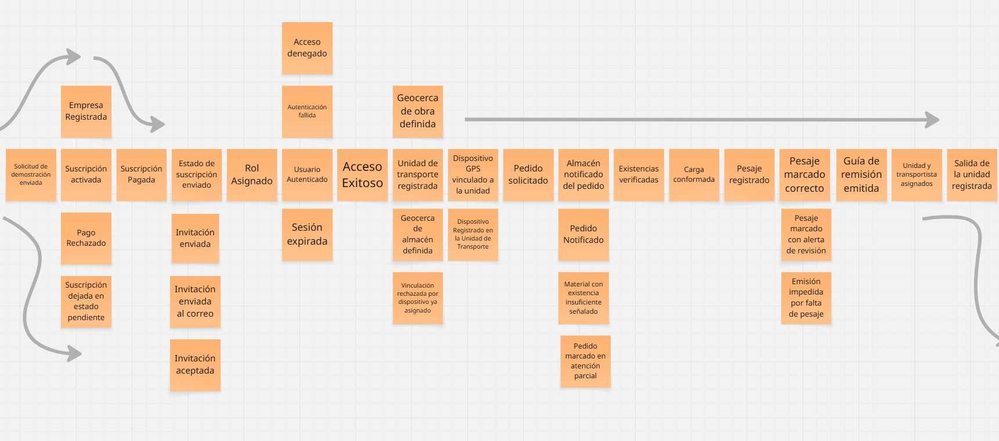

**Figura n**
*Segundo Tramo de Línea de tiempo del Big Picture EventStorming de Vigía*

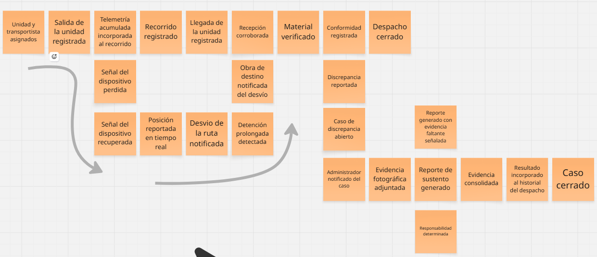

*Nota.* Tablero elaborado de forma colaborativa por el equipo de Trazza Labs en la herramienta Miro, durante la sesión de Big Picture EventStorming descrita en esta sección. La línea de tiempo se presenta en dos tramos por razones de legibilidad y corresponde a un único tablero continuo. El tablero en su resolución original, con la totalidad de los eventos y sus agrupaciones, puede consultarse en el siguiente enlace: [Big-Picture-Event-Storming](https://miro.com/app/board/uXjVHmvI2_I=/?share_link_id=10349296586).

<!-- Fuente: report/chapters/chapter-2-requirements-elicitation-analysis/2.5-ubiquitous-language.md -->

### 2.5. Ubiquitous Language

En esta sección se presenta el glosario de términos del dominio de negocio de Vigía, elaborado a partir de la terminología recogida en las entrevistas de la sección 2.2, del análisis competitivo de la sección 2.1 y de los eventos identificados en el Big Picture EventStorming de la sección 2.4. Conforme a lo señalado por Eric Evans en *Domain-Driven Design: Tackling Complexity in the Heart of Software*, el Ubiquitous Language se modela dentro de un contexto delimitado, de modo que los términos y conceptos del dominio de negocio queden identificados sin ambigüedad y permitan una comunicación clara entre todos los miembros del equipo y los stakeholders del proyecto.

El glosario incluye únicamente términos del dominio de negocio de la cadena de custodia de materiales de construcción; no se incluyen términos técnicos propios de la ingeniería de software. Los términos se presentan en inglés, con su equivalente en español entre paréntesis cuando corresponde, mientras que la definición se redacta en español.

| Término (inglés) | Equivalente en español | Definición |
|---|---|---|
| Chain of Custody | Cadena de custodia | Secuencia continua de registros verificables que documentan un material desde que es despachado en el almacén central hasta que es recibido en el frente de obra. |
| Dispatch | Despacho | Envío formal de materiales desde el almacén central hacia un frente de obra, autorizado una vez conformada la carga y registrado el pesaje. |
| Dispatch Note / Waybill | Guía de remisión | Documento que ampara el traslado de un despacho y detalla los materiales y cantidades que lo componen. |
| Digital Manifest | Manifiesto digital | Registro digital que documenta el contenido íntegro de una carga despachada, sustituyendo a la guía de remisión en papel. |
| Weighing Ticket | Vale de báscula / Ticket de peso | Comprobante que certifica el peso de una unidad de transporte registrado en báscula al momento del despacho. |
| Load Consolidation | Conformación de carga | Proceso mediante el cual el almacén distribuye los materiales de uno o varios pedidos entre las unidades de transporte disponibles. |
| Central Warehouse | Almacén central | Centro de acopio y despacho desde el cual se abastece de materiales a los distintos frentes de obra. |
| Job Site / Site | Frente de obra | Lugar físico donde se ejecuta la construcción y donde se recibe el material despachado. |
| Resident Engineer | Residente de obra | Ingeniero civil o arquitecto responsable de la gestión técnica del frente de obra, incluyendo la cubicación, el pedido y la recepción de materiales. |
| Warehouse Manager | Jefe de almacén | Responsable de la custodia, la conformación de la carga y el despacho de materiales desde el almacén central. |
| Dispatcher | Despachador | Encargado de operar la báscula y preparar la documentación de un despacho antes de su salida. |
| Carrier / Hauler | Transportista | Conductor de carga pesada responsable de trasladar un despacho desde el almacén central hasta el frente de obra. |
| Transit | Tránsito | Tramo del recorrido comprendido entre la salida de la unidad del almacén central y su llegada al frente de obra. |
| Route Incident | Incidencia de ruta | Evento imprevisto ocurrido durante el tránsito, como un desvío, una demora o una avería de la unidad. |
| Offline Registration | Registro offline | Captura de información sin conexión a internet, almacenada localmente en el dispositivo hasta su sincronización posterior. |
| Intermittent Connectivity | Conectividad intermitente | Condición de conexión a internet inestable, característica del frente de obra y de las rutas de traslado. |
| Receiving | Recepción | Proceso mediante el cual el frente de obra recibe físicamente un despacho y verifica su contenido. |
| Delivery Conformity | Conformidad de recepción | Confirmación registrada por el frente de obra de que el material recibido corresponde a lo señalado en la guía de remisión. |
| Discrepancy | Discrepancia | Diferencia detectada entre la cantidad de material despachada y la cantidad efectivamente recibida en obra. |
| Shortage | Faltante | Cantidad de material despachado que no llega a ser recibida en el frente de obra. |
| Normal Loss / Wastage | Merma | Pérdida de material dentro de un margen tolerable, propia del manipuleo o del proceso constructivo, que no constituye una discrepancia reportable. |
| Quantity Take-off | Cubicación / Metrado | Cálculo de las cantidades de materiales requeridas a partir de los planos de un proyecto. |
| Traceability | Trazabilidad | Capacidad de conocer, en cualquier momento, el estado y la custodia de un material a lo largo de la cadena de suministro. |
| Liability Determination | Determinación de responsabilidad | Proceso mediante el cual se establece, a partir de la evidencia registrada, qué parte de la cadena de custodia responde por una discrepancia. |
| Supporting Evidence | Evidencia de sustento | Conjunto de registros de despacho, tránsito y recepción utilizados para sustentar una discrepancia ante la gerencia o ante la contraparte involucrada. |
| Discrepancy Case | Caso de discrepancia | Expediente que agrupa la evidencia y el seguimiento de una discrepancia desde su apertura hasta su cierre. |
| Job Progress | Avance de obra | Grado de ejecución de las actividades de construcción de un frente de obra en un momento determinado. |
| Subscription Plan | Plan de suscripción | Modalidad de contratación del servicio de Vigía bajo un esquema Software as a Service, diferenciada según el número de obras o de despachos gestionados. |
| Incidents Dashboard | Tablero de incidencias | Panel de analítica que consolida de forma visual los despachos en curso, las discrepancias abiertas y su estado de resolución. |

<!-- Este glosario se ampliará conforme el equipo profundice en el Design-Level EventStorming de la sección 4.6.1 e identifique nuevos términos del dominio. -->


---

<!-- Fuente: report/chapters/chapter-3-requirements-specification/3-capitulo-iii-requirements-specification.md -->

## Capítulo III: Requirements Specification

En este capítulo el equipo realiza la especificación de los requisitos de los productos digitales de Vigía, a partir del análisis de la información recogida en el Capítulo II: el problema y los objetivos definidos en la sección 1.2.1, los hallazgos del análisis de entrevistas de la sección 2.2.3, las fichas de User Persona de la sección 2.3.1, el User Task Matrix de la sección 2.3.2, los User Journey Maps de la sección 2.3.3, el Big Picture EventStorming de la sección 2.4 y el Ubiquitous Language de la sección 2.5.

El capítulo se organiza en tres secciones internas. En primer lugar, User Stories presenta el conjunto de Epics, User Stories, Technical Stories y Landing Page Stories que traducen los hallazgos de la investigación en requisitos verificables, con sus respectivos criterios de aceptación. En segundo lugar, Impact Mapping vincula estos requisitos con los objetivos de negocio de Trazza Labs y con los User Persona identificados. Finalmente, Product Backlog organiza y prioriza el conjunto de Epics y User Stories para su desarrollo.

<!-- Fuente: report/chapters/chapter-3-requirements-specification/3.1-user-stories.md -->

#### 3.1. User Stories

En esta sección se presenta el conjunto de Epics, User Stories, Technical Stories y Landing Page Stories identificados para Vigía. Las Epics se definieron a partir de los ocho Bounded Context candidatos identificados en el Big Picture EventStorming de la sección 2.4, actualizado tras la sesión de Design-Level EventStorming de la sección 4.6.1: Captación, Gestión de Cuentas y Accesos, Suscripciones y Pagos, Registro de Flota y Dispositivos, Gestión de Pedidos y Despacho, Trazabilidad en Tránsito, Recepción y Verificación en Obra, y Gestión de Discrepancias y Evidencia. La correspondencia entre ambos artefactos es directa: la Epic EP-06 (Landing Page) cubre el Bounded Context de Captación, y cada uno de los siete Bounded Context restantes se cubre con una Epic homónima (EP-01 a EP-05, EP-07 y EP-08).

Para cada Epic se redactan las User Stories correspondientes a los roles de los User Persona identificados en la sección 2.3.1 y a los demás actores del dominio descritos en el Ubiquitous Language de la sección 2.5. Adicionalmente, se incluyen Technical Stories para los features del RESTful API que sustentan cada Epic, redactadas desde el rol Developer, y Landing Page Stories redactadas desde el rol Visitante (o el subconjunto de visitante por segmento objetivo, cuando corresponde), correspondientes al sitio web estático del modelo de negocio.

Cada User Story sigue el formato "Como [rol], deseo [acción], para [beneficio]". Los criterios de aceptación se redactan en tiempo presente, en tercera persona, sin hacer referencia a detalles de interfaz de usuario, y siguen la estructura Gherkin (Given-When-Then / Dado-Cuando-Entonces), salvo en el caso de reglas de negocio o restricciones que no dependen de una condición. En las Technical Stories, los criterios de aceptación describen los escenarios de interacción request/response del endpoint correspondiente.

| Epic / Story ID | Título | Descripción | Criterios de Aceptación | Relacionado con (Epic ID) |
|---|---|---|---|---|
| EP-01 | Gestión de Cuentas y Accesos | Permite a la constructora registrar su organización, invitar a los miembros de su equipo, asignarles un rol y activar su suscripción, de modo que cada actor de la cadena de custodia acceda únicamente a la información y a las funciones que le corresponden. | No aplica a nivel de Epic; se detalla en las User Stories y Technical Stories relacionadas. | — |
| US-01 | Registro de empresa y activación de suscripción | Como Administrador de la constructora, deseo registrar mi empresa y activar un plan de suscripción, para empezar a invitar a mi equipo a usar la plataforma. | Dado que el administrador completa el formulario de registro con los datos de la empresa, cuando envía la solicitud, entonces el sistema crea la empresa y muestra los planes de suscripción disponibles.<br><br>Dado que el administrador selecciona un plan de suscripción, cuando confirma el pago a través de la pasarela de pago, entonces el sistema activa la suscripción y habilita el acceso a la plataforma.<br><br>Dado que el pago es rechazado por la pasarela de pago, cuando el sistema recibe la notificación de rechazo, entonces el sistema informa al administrador y mantiene la suscripción en estado pendiente. | EP-01 |
| US-02 | Invitación de usuarios y asignación de roles | Como Administrador de la constructora, deseo invitar a los miembros de mi equipo y asignarles un rol, para que cada uno acceda solo a las funciones que le corresponden. | Dado que el administrador registra el correo electrónico y el rol de un nuevo usuario, cuando envía la invitación, entonces el sistema notifica al invitado y registra la invitación como pendiente.<br><br>Dado que el usuario invitado acepta la invitación, cuando completa su registro, entonces el sistema le asigna el rol indicado y habilita su acceso a las funciones correspondientes.<br><br>Dado que un usuario no tiene un rol asignado, cuando intenta acceder a una función restringida, entonces el sistema deniega el acceso. | EP-01 |
| TS-01 | Endpoint de autenticación de usuarios | Como Developer, deseo exponer un endpoint para la autenticación de usuarios, para que las aplicaciones cliente puedan iniciar sesión de forma segura. | Dado que el cliente envía credenciales válidas al endpoint de autenticación, cuando el servidor las valida, entonces el servidor responde con un código 200 y un token de sesión.<br><br>Dado que el cliente envía credenciales inválidas, cuando el servidor las valida, entonces el servidor responde con un código 401 sin emitir token.<br><br>Dado que el token de sesión ha expirado, cuando el cliente lo utiliza en una solicitud, entonces el servidor responde con un código 401 e indica que el token no es válido. | EP-01 |
| US-15 | Inicio de sesión | Como Usuario (residente de obra, jefe de almacén, despachador o transportista), deseo iniciar sesión con mis credenciales, para acceder a las funciones que corresponden a mi rol. | Dado que el usuario ingresa un correo electrónico y una contraseña registrados, cuando envía el formulario, entonces el sistema lo autentica y lo redirige a las funciones de su rol.<br><br>Dado que el usuario ingresa credenciales incorrectas, cuando envía el formulario, entonces el sistema informa que las credenciales no son válidas sin indicar cuál de los dos datos falló.<br><br>Dado que la sesión del usuario ha expirado, cuando intenta realizar una acción dentro de la plataforma, entonces el sistema le solicita iniciar sesión nuevamente. | EP-01 |
| EP-02 | Gestión de Pedidos y Despacho | Permite coordinar el pedido de materiales entre la obra y el almacén central, conformar la carga, registrar el pesaje en báscula y emitir la documentación que autoriza la salida del despacho. | No aplica a nivel de Epic; se detalla en las User Stories y Technical Stories relacionadas. | — |
| US-03 | Envío de pedido de materiales | Como Residente de obra, deseo enviar un pedido de materiales al almacén central, para asegurar el abastecimiento de mi frente de obra. | Dado que el residente completa el pedido con los materiales y las cantidades requeridas, cuando lo envía, entonces el sistema registra el pedido y lo notifica al almacén central.<br><br>Dado que el pedido fue enviado, cuando el almacén lo recibe, entonces el sistema muestra al residente el estado "Pedido recibido". | EP-02 |
| US-16 | Verificación de existencias disponibles | Como Jefe de almacén, deseo verificar las existencias disponibles al recibir un pedido, para determinar si puedo atenderlo completo o solo de forma parcial. | Dado que llega un nuevo pedido al almacén, cuando el jefe de almacén consulta las existencias de los materiales solicitados, entonces el sistema muestra la cantidad disponible de cada material.<br><br>Dado que la cantidad disponible de un material es menor a la solicitada, cuando el jefe de almacén confirma la verificación, entonces el sistema marca el pedido como "Atención parcial" e indica el material con existencia insuficiente. | EP-02 |
| US-04 | Conformación de carga y registro de pesaje | Como Jefe de almacén, deseo registrar el pesaje y conformar la carga de un despacho, para dejar evidencia verificable de lo que efectivamente se despacha. | Dado que el jefe de almacén asigna los materiales de un pedido a una unidad de transporte, cuando confirma la asignación, entonces el sistema registra la conformación de la carga.<br><br>Dado que la unidad cargada pasa por la báscula, cuando el jefe de almacén registra el peso, entonces el sistema asocia el peso registrado con el despacho correspondiente.<br><br>Dado que el pesaje registrado no coincide con el peso estimado del pedido dentro de un margen tolerable, cuando el sistema evalúa la diferencia, entonces el sistema marca el despacho con una alerta de revisión. | EP-02 |
| US-05 | Emisión de guía de remisión y asignación de transportista | Como Jefe de almacén, deseo emitir la guía de remisión digital y asignar el transportista, para autorizar la salida del despacho. | Dado que el despacho tiene el pesaje registrado, cuando el jefe de almacén asigna un transportista y confirma la emisión, entonces el sistema genera la guía de remisión digital y marca el despacho como autorizado.<br><br>Dado que un despacho no tiene el pesaje registrado, cuando el jefe de almacén intenta emitir la guía de remisión, entonces el sistema impide la emisión e indica el dato faltante. | EP-02 |
| TS-02 | Endpoint de registro de pesaje | Como Developer, deseo exponer un endpoint para registrar el pesaje de un despacho, para que la aplicación cliente lo asocie de forma inmediata a la guía de remisión correspondiente. | Dado que el cliente envía el identificador del despacho y el valor del peso registrado, cuando el servidor procesa la solicitud, entonces el servidor responde con un código 201 y el recurso de pesaje creado.<br><br>Dado que el cliente envía un identificador de despacho inexistente, cuando el servidor procesa la solicitud, entonces el servidor responde con un código 404. | EP-02 |
| EP-03 | Trazabilidad en Tránsito | Permite al transportista registrar el inicio del traslado, actualizar su estado y reportar incidencias de ruta, sincronizando la información con el servidor de forma periódica en segundo plano. Conforme al hallazgo de la sección 2.4, la ubicación en tránsito se registra de forma autónoma a partir del dispositivo de seguimiento satelital vinculado a la unidad (ver EP-08); las historias de este Epic cubren el registro manual complementario del transportista (inicio de traslado, incidencias) mientras la app no dependa exclusivamente del dispositivo. | No aplica a nivel de Epic; se detalla en las User Stories y Technical Stories relacionadas. | — |
| US-06 | Inicio de traslado | Como Transportista, deseo iniciar el traslado desde la aplicación, para que el almacén y la obra conozcan que el despacho está en camino. | Dado que el transportista tiene un despacho asignado con la guía de remisión emitida, cuando confirma el inicio del traslado, entonces el sistema registra el evento y lo notifica al almacén y a la obra de destino. | EP-03 |
| US-07 | Registro de incidencia de ruta | Como Transportista, deseo registrar una incidencia de ruta, para dejar constancia de un desvío o una demora ocurrida durante el traslado. | Dado que el transportista está en tránsito, cuando registra una incidencia con su tipo y una descripción breve, entonces el sistema la asocia al despacho en curso y notifica a la obra de destino.<br><br>Dado que el transportista registra una incidencia, cuando confirma el registro, entonces el sistema la almacena localmente en el dispositivo hasta el siguiente ciclo de sincronización periódica. | EP-03 |
| US-08 | Sincronización periódica de registros de tránsito | Como Transportista, deseo que mis registros se sincronicen automáticamente de forma periódica en segundo plano, para no tener que enviarlos manualmente uno por uno. | Dado que existen registros almacenados localmente en el dispositivo del transportista, cuando se cumple el intervalo de sincronización periódica, entonces el sistema sincroniza los registros pendientes con el servidor sin intervención del transportista.<br><br>Dado que un registro sincronizado hace referencia a un despacho que ya no existe, cuando el sistema intenta sincronizarlo, entonces el sistema marca el registro como no sincronizado y lo reporta como incidencia técnica. | EP-03 |
| TS-03 | Endpoint de sincronización en lote | Como Developer, deseo exponer un endpoint para sincronizar en lote los registros de tránsito almacenados localmente, para que la aplicación cliente los envíe en cada ciclo de sincronización periódica. | Dado que el cliente envía un lote de eventos de tránsito con marca de tiempo local, cuando el servidor los procesa, entonces el servidor responde con un código 200 y el detalle de los eventos aceptados y rechazados.<br><br>Dado que el lote incluye un evento duplicado ya registrado previamente, cuando el servidor lo detecta, entonces el servidor lo descarta sin generar un registro duplicado. | EP-03 |
| EP-04 | Recepción y Verificación en Obra | Permite al residente de obra registrar la llegada de la unidad, verificar el material recibido contra la guía de remisión digital y dar conformidad de recepción o reportar una discrepancia. | No aplica a nivel de Epic; se detalla en las User Stories y Technical Stories relacionadas. | — |
| US-09 | Verificación del material recibido | Como Residente de obra, deseo verificar el material recibido contra la guía de remisión digital, para confirmar si el despacho llegó completo. | Dado que la unidad llega al frente de obra con un despacho autorizado, cuando el residente registra la llegada, entonces el sistema muestra el detalle de lo despachado para su verificación.<br><br>Dado que el residente cuenta lo descargado y lo compara contra la guía de remisión, cuando confirma que las cantidades coinciden, entonces el sistema registra la conformidad de recepción y cierra el despacho. | EP-04 |
| US-10 | Reporte de discrepancia en recepción | Como Residente de obra, deseo reportar una discrepancia al momento de la recepción, para dejar constancia inmediata de un faltante o un daño detectado. | Dado que la cantidad recibida no coincide con la guía de remisión, cuando el residente registra la diferencia detectada, entonces el sistema abre un caso de discrepancia vinculado al despacho.<br><br>Dado que el residente adjunta evidencia fotográfica al reportar la discrepancia, cuando confirma el envío, entonces el sistema asocia la evidencia al caso de discrepancia abierto. | EP-04 |
| TS-04 | Endpoint de comparación de cantidades | Como Developer, deseo exponer un endpoint que compare las cantidades despachadas con las cantidades recibidas, para que la aplicación cliente muestre la conformidad o la discrepancia de forma inmediata. | Dado que el cliente envía las cantidades recibidas para un despacho, cuando el servidor las compara con las cantidades despachadas, entonces el servidor responde con un código 200 indicando conformidad o discrepancia por cada ítem. | EP-04 |
| US-14 | Sincronización periódica de registros de recepción | Como Residente de obra, deseo que mi registro de recepción se sincronice automáticamente de forma periódica en segundo plano, para no tener que enviarlo manualmente. | Dado que el residente registra la verificación o la conformidad de un despacho, cuando confirma el registro, entonces el sistema lo almacena localmente en el dispositivo hasta el siguiente ciclo de sincronización periódica.<br><br>Dado que existen registros de recepción almacenados localmente, cuando se cumple el intervalo de sincronización periódica, entonces el sistema sincroniza los registros pendientes con el servidor sin intervención del residente. | EP-04 |
| TS-07 | Endpoint de sincronización de registros de recepción | Como Developer, deseo exponer un endpoint para sincronizar en lote los registros de recepción almacenados localmente, para que la aplicación cliente los envíe en cada ciclo de sincronización periódica. | Dado que el cliente envía un lote de eventos de recepción con marca de tiempo local, cuando el servidor los procesa, entonces el servidor responde con un código 200 y el detalle de los eventos aceptados y rechazados. | EP-04 |
| EP-05 | Gestión de Discrepancias y Evidencia | Permite consolidar la evidencia registrada por el almacén, el transporte y la obra sobre un mismo despacho, para determinar la responsabilidad ante un faltante y sustentar el caso ante la gerencia. | No aplica a nivel de Epic; se detalla en las User Stories y Technical Stories relacionadas. | — |
| US-11 | Consulta de evidencia consolidada | Como Responsable de oficina técnica, deseo consultar la evidencia consolidada de un despacho con discrepancia, para determinar en qué punto de la cadena se originó la diferencia. | Dado que existe un caso de discrepancia abierto, cuando el responsable de oficina técnica lo consulta, entonces el sistema muestra la línea de tiempo con los registros del almacén, el transporte y la obra asociados a ese despacho. | EP-05 |
| US-12 | Generación de reporte de sustento | Como Responsable de oficina técnica, deseo generar un reporte de sustento a partir de un caso de discrepancia, para presentarlo ante la gerencia o ante la empresa de transporte. | Dado que un caso de discrepancia tiene la evidencia consolidada, cuando el responsable de oficina técnica solicita el reporte, entonces el sistema genera un documento descargable con la línea de tiempo y la evidencia asociada.<br><br>Dado que un caso de discrepancia no tiene evidencia suficiente de alguna de las partes, cuando el sistema genera el reporte, entonces el sistema indica expresamente qué evidencia falta. | EP-05 |
| US-13 | Cierre de caso de discrepancia | Como Responsable de oficina técnica, deseo cerrar un caso de discrepancia registrando la responsabilidad determinada, para dejar constancia del resultado y prevenir casos similares. | Dado que el responsable de oficina técnica registra la responsabilidad determinada para un caso, cuando confirma el cierre, entonces el sistema marca el caso como cerrado y lo incorpora al historial del despacho correspondiente. | EP-05 |
| TS-05 | Endpoint de línea de tiempo consolidada | Como Developer, deseo exponer un endpoint que consolide en una sola respuesta los eventos de un despacho registrados por los tres actores de la cadena, para que la aplicación cliente construya la línea de tiempo del caso. | Dado que el cliente solicita la línea de tiempo de un despacho por su identificador, cuando el servidor procesa la solicitud, entonces el servidor responde con un código 200 y los eventos ordenados cronológicamente.<br><br>Dado que el identificador del despacho no existe, cuando el servidor procesa la solicitud, entonces el servidor responde con un código 404. | EP-05 |
| EP-06 | Landing Page | Sitio web estático que presenta la propuesta de valor de Vigía a los visitantes de ambos segmentos objetivo, permitiéndoles conocer el producto y solicitar una demostración. | No aplica a nivel de Epic; se detalla en las Landing Page Stories y la Technical Story relacionadas. | — |
| LP-01 | Página de inicio con la propuesta de valor | Como Visitante, deseo conocer la propuesta de valor de Vigía en la página de inicio, para entender en qué consiste la solución antes de solicitar más información. | Dado que el visitante ingresa a la página de inicio, cuando la página termina de cargar, entonces el sitio muestra la propuesta de valor, los segmentos atendidos y un llamado a la acción para solicitar una demostración. | EP-06 |
| LP-02 | Sección para el segmento de empresas constructoras | Como Visitante del segmento Empresas Constructoras e Inmobiliarias, deseo ver una sección con los beneficios específicos para residentes y directores de obra, para identificar si la solución responde a mi problema de control de materiales. | Dado que el visitante navega a la sección dirigida a empresas constructoras, cuando la sección carga, entonces el sitio muestra los beneficios y casos de uso específicos para ese segmento. | EP-06 |
| LP-03 | Sección para el segmento de logística y transporte | Como Visitante del segmento Empresas de Logística, Transporte y Almacenes Satélite, deseo ver una sección con los beneficios específicos para almacenes y transportistas, para identificar si la solución responde a mi necesidad de respaldo ante reclamos. | Dado que el visitante navega a la sección dirigida a empresas de logística y transporte, cuando la sección carga, entonces el sitio muestra los beneficios y casos de uso específicos para ese segmento. | EP-06 |
| LP-04 | Formulario de solicitud de demostración | Como Visitante, deseo completar un formulario de contacto para solicitar una demostración, para que el equipo comercial de Trazza Labs se comunique conmigo. | Dado que el visitante completa el formulario de contacto con sus datos y su empresa, cuando lo envía, entonces el sitio confirma en pantalla que la solicitud fue recibida.<br><br>Dado que el visitante deja incompleto un campo obligatorio del formulario, cuando intenta enviarlo, entonces el sitio le indica qué campo debe completar sin enviar la solicitud. | EP-06 |
| TS-06 | Endpoint de solicitud de demostración | Como Developer, deseo exponer un endpoint que reciba las solicitudes de demostración del Landing Page, para que el equipo comercial las gestione desde un mismo canal. | Dado que el cliente envía los datos de una solicitud de demostración con los campos obligatorios completos, cuando el servidor procesa la solicitud, entonces el servidor responde con un código 201 y registra la solicitud.<br><br>Dado que el cliente envía una solicitud sin un campo obligatorio, cuando el servidor la valida, entonces el servidor responde con un código 400 indicando el campo faltante. | EP-06 |
| EP-07 | Suscripciones y Pagos | Permite gestionar el ciclo de vida de la suscripción de la empresa cliente, separado de la gestión de cuentas y usuarios porque depende de un sistema externo de cobro y evoluciona de forma independiente al ciclo de vida de los usuarios. | No aplica a nivel de Epic; se detalla en la User Story relacionada. | — |
| US-17 | Gestión del ciclo de vida de la suscripción | Como Administrador de la constructora, deseo consultar el estado de mi suscripción y renovarla o regularizar un pago rechazado, para mantener el acceso de mi empresa a la plataforma sin interrupciones. | Dado que la suscripción de la empresa está próxima a vencer, cuando el administrador consulta el estado de la suscripción, entonces el sistema muestra la fecha de vencimiento y la opción de renovarla.<br><br>Dado que un cobro periódico es rechazado por la pasarela de pago, cuando el sistema recibe la notificación de rechazo, entonces el sistema marca la suscripción como "Pago pendiente" y notifica al administrador sin suspender el acceso de inmediato.<br><br>Dado que una suscripción permanece en estado "Pago pendiente" más allá del plazo de gracia definido, cuando el sistema evalúa las suscripciones vencidas, entonces el sistema suspende el acceso de la empresa hasta que se regularice el pago. | EP-07 |
| EP-08 | Registro de Flota y Dispositivos | Permite registrar las unidades de transporte, vincular su dispositivo de seguimiento satelital y definir las geocercas del almacén y de la obra, como condición previa para que un despacho pueda registrarse y para que el tránsito se registre de forma autónoma (EP-03). | No aplica a nivel de Epic; se detalla en las User Stories y Technical Stories relacionadas. | — |
| US-18 | Registro de unidad de transporte y vinculación de dispositivo GPS | Como Jefe de almacén, deseo registrar una unidad de transporte y vincularle su dispositivo de seguimiento satelital, para poder asignarla a un despacho con trazabilidad de ubicación. | Dado que el jefe de almacén registra los datos de una nueva unidad de transporte, cuando confirma el registro, entonces el sistema la incorpora a la flota disponible para asignación de despachos.<br><br>Dado que el jefe de almacén vincula un dispositivo de seguimiento satelital a la unidad, cuando confirma la vinculación, entonces el sistema asocia las futuras posiciones reportadas por ese dispositivo a esa unidad.<br><br>Dado que el dispositivo que se intenta vincular ya está asignado a otra unidad, cuando el jefe de almacén confirma la vinculación, entonces el sistema rechaza la vinculación e indica la unidad a la que ya pertenece. | EP-08 |
| US-19 | Definición de geocercas de almacén y obra | Como Jefe de almacén, deseo definir la geocerca del almacén y de cada obra, para que el sistema pueda detectar automáticamente la salida y la llegada de una unidad. | Dado que el jefe de almacén dibuja el perímetro de un predio (almacén u obra) en el mapa, cuando confirma la geocerca, entonces el sistema la asocia a ese predio para su uso en la detección automática de eventos de tránsito. | EP-08 |
| TS-08 | Endpoint de recepción de reportes del dispositivo GPS | Como Developer, deseo exponer un endpoint que reciba los reportes periódicos de posición del dispositivo de seguimiento satelital, para registrar automáticamente los eventos de tránsito sin intervención del transportista. | Dado que el dispositivo GPS de una unidad en tránsito envía un reporte de posición, cuando el servidor lo recibe, entonces el servidor registra el evento de ubicación asociado al despacho en curso y responde con un código 200.<br><br>Dado que el reporte de posición proviene de un dispositivo no vinculado a ninguna unidad activa, cuando el servidor lo recibe, entonces el servidor descarta el reporte y lo registra como evento no asociado. | EP-08 |

<!-- Fuente: report/chapters/chapter-3-requirements-specification/3.2-impact-mapping.md -->

#### 3.2. Impact Mapping

En esta sección el equipo presenta el Impact Map elaborado para el modelo de negocio digital de Vigía, en la herramienta UXPressia. Su elaboración partió de las fichas de User Persona ya construidas en dicha herramienta (sección 2.3.1) y busca responder, para cada objetivo de negocio de Trazza Labs, tres preguntas sucesivas: quiénes pueden ayudar a lograr la meta (Actors), qué tendrían que hacer o cómo tendrían que cambiar su comportamiento para lograrlo (Impacts), y qué puede construir el negocio para provocar ese cambio (Deliverables). Cada Deliverable se conecta, a su vez, con las User Stories de la sección 3.1 que le dan origen.

**Business Goals.** Se identificaron tres metas de negocio, redactadas bajo el criterio SMART (específicas, medibles, alcanzables, relevantes y con un plazo definido), cubriendo tanto la etapa de captación inicial de clientes como la entrega sostenida de la propuesta de valor central del producto:

| Business Goal | Específico | Medible | Plazo |
|---|---|---|---|
| Alcanzar 50 empresas constructoras medianas de Lima Metropolitana suscritas a Vigía desde el lanzamiento comercial | Empresas constructoras medianas de Lima Metropolitana | 50 empresas suscritas | 12 meses |
| Reducir en 30% el tiempo promedio de detección de discrepancias entre lo despachado y lo recibido | Tiempo de detección de discrepancias | Reducción del 30% respecto de la línea base | 6 meses por cliente |
| Lograr que el 80% de los despachos gestionados por las constructoras suscritas registren su ciclo completo (despacho, tránsito y recepción) en la plataforma | Despachos con ciclo completo registrado en Vigía | 80% de los despachos | 9 meses de suscripción |

**Actors.** Conforme a lo indicado en el enunciado, los Actors del mapa son los mismos User Personas ya identificados en la sección 2.3.1 —Carlos Mendoza (residente de obra, Segmento 1) y Miguel Rojas (jefe de almacén central, Segmento 2)—, sin introducir roles adicionales. Ambos aparecen bajo los tres Business Goals, dado que ninguna de las tres metas puede lograrse si solo uno de los dos segmentos cambia de comportamiento: la propuesta de valor de Vigía depende de que ambos extremos de la cadena de custodia registren información sobre un mismo despacho.

**Impacts y Deliverables por Business Goal.**

*Goal 1 — Alcanzar 50 empresas constructoras suscritas en 12 meses.*

| Actor | Impact | Deliverable | User Stories |
|---|---|---|---|
| Carlos Mendoza | Solicita a la oficina técnica de su constructora evaluar y contratar Vigía, tras comprobar en una prueba piloto que reduce el tiempo que dedica a reconstruir despachos | Landing Page con propuesta de valor, sección para su segmento y formulario de solicitud de demo | LP-01, LP-02, LP-04, TS-06 |
| Miguel Rojas | Recomienda a la gerencia de su empresa de transporte adoptar Vigía, porque le permite responder reclamos de faltantes con evidencia verificable en minutos en lugar de días | Landing Page con sección para su segmento y registro de empresa con onboarding simple | LP-01, LP-03, US-01, US-02 |

*Goal 2 — Reducir 30% el tiempo de detección de discrepancias en 6 meses.*

| Actor | Impact | Deliverable | User Stories |
|---|---|---|---|
| Carlos Mendoza | Verifica el material recibido contra la guía de remisión digital en el momento de la entrega, en lugar de descubrir la diferencia días después en la conciliación | Verificación asistida de cantidades recibidas contra el despacho registrado, con alerta inmediata de discrepancias | US-09, US-10, TS-04 |
| Miguel Rojas | Registra el pesaje y emite la guía de remisión digital en el momento del despacho, en lugar de depender de un cuaderno físico paralelo | Registro digital de pesaje vinculado a la guía de remisión, disponible en tiempo real para obra y transporte | US-04, US-05, TS-02 |

*Goal 3 — Lograr 80% de despachos con ciclo completo registrado en 9 meses.*

| Actor | Impact | Deliverable | User Stories |
|---|---|---|---|
| Carlos Mendoza | Registra la conformidad o la discrepancia de cada despacho recibido directamente en la plataforma, en lugar de anotarla aparte | Flujo de recepción y verificación accesible desde el teléfono, funcional bajo conectividad intermitente | US-09, US-10, US-14 |
| Miguel Rojas | Consulta el estado de cada despacho desde que sale del almacén hasta que se confirma su recepción, sin perder visibilidad apenas la unidad sale a ruta | Seguimiento del despacho visible para almacén y obra, desde el inicio del traslado hasta la conformidad de recepción | US-06, US-07, US-08 |

A continuación se presenta la captura del Impact Map elaborado en UXPressia, donde los tres Business Goals se ubican en la primera columna, ambos User Personas se repiten como Actors bajo cada meta a la que contribuyen, y cada Impact se conecta con su Deliverable y con las User Stories correspondientes.


<!-- Fuente: report/chapters/chapter-3-requirements-specification/3.3-product-backlog.md -->

#### 3.3. Product Backlog

En esta sección se presenta el Product Backlog de Vigía, que consolida el conjunto de User Stories, Technical Stories y Landing Page Stories de la sección 3.1, ordenadas según el valor que cada una aporta al negocio y no según el orden técnico en que podrían implementarse. Por esa razón, las Epics de acceso y cuentas (EP-01) no encabezan el backlog: se ubican únicamente los elementos mínimos necesarios para habilitar el registro de la empresa piloto y el inicio de sesión, intercalados en el punto en que efectivamente desbloquean valor para el usuario. En cambio, las Landing Page Stories se consideran desde el primer sprint, conforme a lo indicado en el enunciado, dado que generan valor comercial inmediato sin depender de ninguna otra funcionalidad.

El orden refleja tres bloques de valor: (1) el Landing Page, que permite a Trazza Labs captar los primeros interesados desde el día uno; (2) el flujo núcleo de trazabilidad (pedido, despacho, tránsito y recepción), que constituye la propuesta de valor central de Vigía; y (3) la gestión de discrepancias y evidencia, que es el diferencial competitivo declarado en el Problem Statement de la sección 1.2.2.1. Las historias de robustez (verificación de existencias, incidencias de ruta y sincronización periódica en segundo plano) se ubican al final, dado que refuerzan el producto pero no son indispensables para validar la propuesta de valor con la empresa piloto.

Tras la actualización del modelo de dominio en el Design-Level EventStorming de la sección 4.6.1, se incorporan al backlog las historias de las Epics EP-07 (Suscripciones y Pagos) y EP-08 (Registro de Flota y Dispositivos): US-17 se ubica junto a US-01, por tratarse de la continuación natural de la activación de la suscripción; y US-18, US-19 y TS-08 se ubican como prerrequisito de US-05, dado que un despacho no puede asignarse a una unidad de transporte que no esté registrada y vinculada a su dispositivo de seguimiento satelital.

La estimación se expresa en Story Points, bajo la escala de Fibonacci (1 / 2 / 3 / 5 / 8), asignada por el equipo según la complejidad relativa percibida para cada historia.

| # (Orden) | User Story Id | Título | Descripción | Story Points |
|---|---|---|---|---|
| 1 | LP-01 | Página de inicio con la propuesta de valor | Como Visitante, deseo conocer la propuesta de valor de Vigía en la página de inicio, para entender en qué consiste la solución antes de solicitar más información. | 2 |
| 2 | LP-02 | Sección para el segmento de empresas constructoras | Como Visitante del segmento Empresas Constructoras e Inmobiliarias, deseo ver una sección con los beneficios específicos para residentes y directores de obra, para identificar si la solución responde a mi problema de control de materiales. | 2 |
| 3 | LP-03 | Sección para el segmento de logística y transporte | Como Visitante del segmento Empresas de Logística, Transporte y Almacenes Satélite, deseo ver una sección con los beneficios específicos para almacenes y transportistas, para identificar si la solución responde a mi necesidad de respaldo ante reclamos. | 2 |
| 4 | LP-04 | Formulario de solicitud de demostración | Como Visitante, deseo completar un formulario de contacto para solicitar una demostración, para que el equipo comercial de Trazza Labs se comunique conmigo. | 3 |
| 5 | TS-06 | Endpoint de solicitud de demostración | Como Developer, deseo exponer un endpoint que reciba las solicitudes de demostración del Landing Page, para que el equipo comercial las gestione desde un mismo canal. | 2 |
| 6 | US-01 | Registro de empresa y activación de suscripción | Como Administrador de la constructora, deseo registrar mi empresa y activar un plan de suscripción, para empezar a invitar a mi equipo a usar la plataforma. | 5 |
| 7 | US-17 | Gestión del ciclo de vida de la suscripción | Como Administrador de la constructora, deseo consultar el estado de mi suscripción y renovarla o regularizar un pago rechazado, para mantener el acceso de mi empresa a la plataforma sin interrupciones. | 3 |
| 8 | TS-01 | Endpoint de autenticación de usuarios | Como Developer, deseo exponer un endpoint para la autenticación de usuarios, para que las aplicaciones cliente puedan iniciar sesión de forma segura. | 3 |
| 9 | US-15 | Inicio de sesión | Como Usuario (residente de obra, jefe de almacén, despachador o transportista), deseo iniciar sesión con mis credenciales, para acceder a las funciones que corresponden a mi rol. | 2 |
| 10 | US-02 | Invitación de usuarios y asignación de roles | Como Administrador de la constructora, deseo invitar a los miembros de mi equipo y asignarles un rol, para que cada uno acceda solo a las funciones que le corresponden. | 3 |
| 11 | US-03 | Envío de pedido de materiales | Como Residente de obra, deseo enviar un pedido de materiales al almacén central, para asegurar el abastecimiento de mi frente de obra. | 3 |
| 12 | US-04 | Conformación de carga y registro de pesaje | Como Jefe de almacén, deseo registrar el pesaje y conformar la carga de un despacho, para dejar evidencia verificable de lo que efectivamente se despacha. | 5 |
| 13 | TS-02 | Endpoint de registro de pesaje | Como Developer, deseo exponer un endpoint para registrar el pesaje de un despacho, para que la aplicación cliente lo asocie de forma inmediata a la guía de remisión correspondiente. | 3 |
| 14 | US-18 | Registro de unidad de transporte y vinculación de dispositivo GPS | Como Jefe de almacén, deseo registrar una unidad de transporte y vincularle su dispositivo de seguimiento satelital, para poder asignarla a un despacho con trazabilidad de ubicación. | 5 |
| 15 | US-19 | Definición de geocercas de almacén y obra | Como Jefe de almacén, deseo definir la geocerca del almacén y de cada obra, para que el sistema pueda detectar automáticamente la salida y la llegada de una unidad. | 3 |
| 16 | TS-08 | Endpoint de recepción de reportes del dispositivo GPS | Como Developer, deseo exponer un endpoint que reciba los reportes periódicos de posición del dispositivo de seguimiento satelital, para registrar automáticamente los eventos de tránsito sin intervención del transportista. | 5 |
| 17 | US-05 | Emisión de guía de remisión y asignación de transportista | Como Jefe de almacén, deseo emitir la guía de remisión digital y asignar el transportista, para autorizar la salida del despacho. | 3 |
| 18 | US-06 | Inicio de traslado | Como Transportista, deseo iniciar el traslado desde la aplicación, para que el almacén y la obra conozcan que el despacho está en camino. | 2 |
| 19 | US-09 | Verificación del material recibido | Como Residente de obra, deseo verificar el material recibido contra la guía de remisión digital, para confirmar si el despacho llegó completo. | 5 |
| 20 | US-10 | Reporte de discrepancia en recepción | Como Residente de obra, deseo reportar una discrepancia al momento de la recepción, para dejar constancia inmediata de un faltante o un daño detectado. | 3 |
| 21 | TS-04 | Endpoint de comparación de cantidades | Como Developer, deseo exponer un endpoint que compare las cantidades despachadas con las cantidades recibidas, para que la aplicación cliente muestre la conformidad o la discrepancia de forma inmediata. | 3 |
| 22 | US-11 | Consulta de evidencia consolidada | Como Responsable de oficina técnica, deseo consultar la evidencia consolidada de un despacho con discrepancia, para determinar en qué punto de la cadena se originó la diferencia. | 3 |
| 23 | TS-05 | Endpoint de línea de tiempo consolidada | Como Developer, deseo exponer un endpoint que consolide en una sola respuesta los eventos de un despacho registrados por los tres actores de la cadena, para que la aplicación cliente construya la línea de tiempo del caso. | 5 |
| 24 | US-12 | Generación de reporte de sustento | Como Responsable de oficina técnica, deseo generar un reporte de sustento a partir de un caso de discrepancia, para presentarlo ante la gerencia o ante la empresa de transporte. | 5 |
| 25 | US-13 | Cierre de caso de discrepancia | Como Responsable de oficina técnica, deseo cerrar un caso de discrepancia registrando la responsabilidad determinada, para dejar constancia del resultado y prevenir casos similares. | 2 |
| 26 | US-16 | Verificación de existencias disponibles | Como Jefe de almacén, deseo verificar las existencias disponibles al recibir un pedido, para determinar si puedo atenderlo completo o solo de forma parcial. | 2 |
| 27 | US-07 | Registro de incidencia de ruta | Como Transportista, deseo registrar una incidencia de ruta, para dejar constancia de un desvío o una demora ocurrida durante el traslado. | 3 |
| 28 | US-08 | Sincronización periódica de registros de tránsito | Como Transportista, deseo que mis registros se sincronicen automáticamente de forma periódica en segundo plano, para no tener que enviarlos manualmente uno por uno. | 5 |
| 29 | TS-03 | Endpoint de sincronización en lote | Como Developer, deseo exponer un endpoint para sincronizar en lote los registros de tránsito almacenados localmente, para que la aplicación cliente los envíe en cada ciclo de sincronización periódica. | 5 |
| 30 | US-14 | Sincronización periódica de registros de recepción | Como Residente de obra, deseo que mi registro de recepción se sincronice automáticamente de forma periódica en segundo plano, para no tener que enviarlo manualmente. | 3 |
| 31 | TS-07 | Endpoint de sincronización de registros de recepción | Como Developer, deseo exponer un endpoint para sincronizar en lote los registros de recepción almacenados localmente, para que la aplicación cliente los envíe en cada ciclo de sincronización periódica. | 3 |


---

<!-- Fuente: report/chapters/chapter-4-product-design/4-capitulo-iv-product-design.md -->

## Capítulo IV: Product Design

En este capítulo el equipo desarrolla la propuesta de Software Architecture & Design de Vigía, tomando como base el conjunto de User Stories de la sección 3.1 y el Impact Map de la sección 3.2. El capítulo abarca tanto las decisiones de diseño visual y de arquitectura de la información, como el planteamiento de la Domain-Driven Software Architecture, el Object-Oriented Software Design y el Database Design.

El capítulo se organiza en las siguientes secciones internas: Style Guidelines, que sienta las bases visuales comunes para todo el equipo; Information Architecture, que define cómo se organiza, etiqueta, navega y busca el contenido; Landing Page UI Design y Web Applications UX/UI Design, que traducen esas decisiones en Wireframes, Wireflows, Mock-ups y User Flows; Web Applications Prototyping; Domain-Driven Software Architecture, que profundiza el Big Picture EventStorming de la sección 2.4 hasta identificar los Bounded Context y los diagramas C4; Software Object-Oriented Design; y Database Design.

<!-- Fuente: report/chapters/chapter-4-product-design/4.1-style-guidelines.md -->

### 4.1. Style Guidelines

En esta sección el equipo sienta las bases de un repositorio visual central y consistente para Vigía, de uso común para todo el equipo de diseño y desarrollo. El objetivo es que cualquier pantalla nueva, tanto del Landing Page como de la Web Application, mantenga una presentación uniforme y reconocible, reduciendo el tiempo de decisión visual en cada Sprint. Las decisiones siguen el lenguaje de diseño Material Design, indicado en la sección de Tecnología, adaptado a la identidad de marca de Trazza Labs, y se apoyan en PrimeVue como biblioteca de componentes de UI para su implementación en Vue.

La sección se organiza en dos partes: General Style Guidelines, que fija las decisiones de branding, tipografía, color, espaciado y tono de comunicación; y Web Style Guide, que traduce esas decisiones a estándares de interacción para interfaces web responsivas.

<!-- Fuente: report/chapters/chapter-4-product-design/4.1.1-general-style-guidelines.md -->

#### 4.1.1. General Style Guidelines

**Branding.** El nombre Vigía remite a la idea de vigilancia y observación constante: alguien que no pierde de vista un punto crítico. Esa idea se traduce visualmente en una paleta con un color primario asociado a la confianza y la tecnología (azul oscuro), un color de acento asociado al sector construcción (ámbar/naranja, presente en la señalización y el equipo de seguridad de una obra), y un uso deliberado del verde y el rojo para representar, respectivamente, la conformidad y la discrepancia en un despacho, que son los dos estados centrales del dominio del negocio descrito en la sección 2.5.

La posición de marca se resume en tres atributos, contrastados contra lo que Vigía deliberadamente no busca transmitir, para evitar ambigüedad en decisiones de diseño futuras:

| Atributo de marca | Se traduce en | No se busca transmitir |
|---|---|---|
| Vigilante / atento | Estados visibles en todo momento (color de estado, notificaciones de proximidad), nunca información oculta tras varios clics | Pasividad, pantallas sin indicación de estado |
| Confiable / verificable | Evidencia siempre visible junto a la afirmación que respalda (peso junto a la guía, fecha junto al registro) | Discurso comercial vacío, afirmaciones sin evidencia adjunta |
| Directo / sin fricción | Interfaces cortas, con el mínimo de pasos entre la acción y su confirmación | Decoración visual sin función, pasos administrativos innecesarios |

**Principios de diseño aplicados.** Se adoptan de forma explícita los siguientes principios, tomados como base para justificar decisiones concretas de las secciones 4.2 a 4.4, en lugar de aplicarse de manera implícita:

| Principio | Definición aplicada a Vigía | Ejemplo concreto de aplicación |
|---|---|---|
| Jerarquía visual | El elemento más importante de la pantalla es siempre el de mayor contraste y tamaño | El estado del despacho (Tag de color) siempre pesa visualmente más que sus metadatos (fecha, autor) |
| Consistencia | Un mismo componente se comporta y luce igual en toda la plataforma | El Tag verde significa "conformidad" en cualquier pantalla donde aparezca, sin excepciones |
| Proximidad (Gestalt) | Los elementos relacionados se agrupan visualmente sin necesidad de bordes | La cantidad pedida y la cantidad recibida de un mismo material se muestran adyacentes, para facilitar la comparación visual que hoy el usuario hace mentalmente |
| Affordance | Un elemento interactivo se ve interactivo | Los botones usan el color primario o el de acento; el texto informativo nunca usa esos colores, para no sugerir falsamente que es accionable |
| Retroalimentación (feedback) | Toda acción del usuario tiene una respuesta visual inmediata | Al registrar un pesaje o una conformidad, un Toast confirma la acción antes de que el usuario navegue a otra pantalla |
| Reducción de carga cognitiva | Se muestra solo la información necesaria para la tarea actual del rol | El residente de obra no ve columnas de costos ni de presupuesto en la pantalla de recepción; esa información no es parte de su tarea en ese momento (User Task Matrix, sección 2.3.2) |

**Elementos de diseño.** Se explicita cómo se usa cada elemento visual básico, para evitar que se apliquen de forma arbitraria en pantallas futuras:

| Elemento | Uso definido en Vigía |
|---|---|
| Color | Funcional, no decorativo (ver cuadro de Colors); un color nunca se introduce solo por variedad visual |
| Tipografía | Jerarquiza mediante peso y tamaño (ver cuadro de Typography), no mediante familias tipográficas adicionales |
| Espacio | Agrupa (poco espacio = relacionado) y separa (mucho espacio = no relacionado), conforme a la grilla de la sección de Spacing |
| Forma | Esquinas redondeadas (8px de radio) en componentes accionables (botones, tarjetas, Tags), esquinas rectas en contenedores estructurales (tablas, encabezados), para que la forma anticipe si un bloque es interactivo |
| Línea | Se usa únicamente como divisor entre secciones no relacionadas; nunca como elemento decorativo |

**Colors.**

| Uso | Color | Valor (HEX) | Justificación |
|---|---|---|---|
| Primario | Azul Vigía | `#1B3A5C` | Transmite confianza, control y tecnología; es el color dominante en encabezados, navegación y elementos de marca. |
| Primario claro | Azul claro | `#3D6B94` | Variante para estados hover/focus y fondos de énfasis sobre el primario. |
| Acento | Ámbar construcción | `#F5A623` | Referencia visual al sector (señalización, equipo de seguridad); se reserva para llamados a la acción (CTA) y elementos que requieren atención inmediata del usuario, sin llegar a alarmar. |
| Éxito / Conformidad | Verde | `#2E7D32` | Reservado exclusivamente para el estado "Conformidad registrada" de un despacho y para confirmaciones de acciones exitosas. |
| Error / Discrepancia | Rojo | `#D32F2F` | Reservado exclusivamente para el estado "Discrepancia reportada" y para mensajes de error o validación. |
| Texto principal | Gris oscuro | `#212121` | Texto de lectura, sobre fondo claro. |
| Texto secundario | Gris medio | `#757575` | Metadatos, ayudas y texto de menor jerarquía. |
| Fondo | Gris muy claro | `#F5F5F5` | Fondo general de la aplicación, para diferenciar tarjetas y superficies blancas. |
| Superficie | Blanco | `#FFFFFF` | Tarjetas, formularios y modales. |

El color se usa de forma funcional y no decorativa: verde y rojo quedan reservados únicamente a los dos estados del dominio antes mencionados, de modo que un usuario reconozca el estado de un despacho de un vistazo, sin necesidad de leer el texto. Por esa misma razón, el ámbar de acento no se reutiliza para estados de error, evitando la ambigüedad entre "requiere atención" y "hay un problema".

**Typography.** Se adopta una única familia tipográfica, Roboto (la tipografía por defecto de Material Design), en los pesos Regular, Medium y Bold, evitando combinar varias familias. Esta decisión responde deliberadamente a mantener el sistema simple de administrar para un equipo pequeño: una sola familia reduce el número de variantes a cargar y a mantener consistentes entre el Landing Page y la Web Application.

| Estilo | Tamaño | Peso | Uso |
|---|---|---|---|
| H1 | 28px | Bold | Título de página |
| H2 | 22px | Medium | Título de sección |
| H3 | 18px | Medium | Título de tarjeta o bloque |
| Body | 14px | Regular | Texto de lectura general |
| Caption | 12px | Regular | Metadatos, ayudas, marcas de tiempo |

**Spacing.** Se adopta una grilla base de 8px, estándar de Material Design, con incrementos de 4px para ajustes finos. Los espaciados se expresan como múltiplos de esta base (4, 8, 16, 24, 32, 48px), lo que simplifica su aplicación consistente en componentes de PrimeVue sin necesidad de definir valores arbitrarios.

**Tono de comunicación.** Dado que Vigía se usa para sustentar responsabilidades económicas ante un faltante, el tono se posiciona deliberadamente hacia el extremo serio y sereno de cada dimensión, evitando la ambigüedad o el humor en momentos donde el usuario necesita certeza:

| Dimensión | Posición adoptada |
|---|---|
| Divertido ⟷ Serio | Serio — el producto documenta evidencia con implicancias económicas. |
| Formal ⟷ Casual | Intermedio, cercano a Casual — el lenguaje es directo y llano, como el que usan los propios entrevistados (guía, faltante, despacho), sin la rigidez de un documento legal. |
| Respetuoso ⟷ Irreverente | Respetuoso — el producto puede estar involucrado en la determinación de responsabilidad entre personas y empresas, por lo que evita cualquier tono acusatorio. |
| Entusiasta ⟷ Sereno | Sereno — comunica estados y evidencia de forma neutral, sin apelar a la urgencia o la alarma salvo cuando el estado mismo (discrepancia) lo amerita. |

Como referencia de Design System existente sobre el cual se realizan las adaptaciones anteriores, se toma Material Design 3, del cual se conservan la escala tipográfica, la grilla de espaciado de 8px y el sistema de elevación, adaptando la paleta de color a la identidad de marca descrita.

<!-- Fuente: report/chapters/chapter-4-product-design/4.1.2-web-style-guidelines.md -->

#### 4.1.2. Web Style Guide

Esta sección traduce las decisiones de la sección 4.1.1 a estándares de interacción para interfaces web responsivas, considerando que el Landing Page se consume principalmente en desktop y que la Web Application se usa mayoritariamente desde teléfonos inteligentes en el frente de obra y en el almacén, conforme a lo señalado en las secciones 1.2.1 y 2.3.1.

**Breakpoints.** Se adoptan los tres puntos de quiebre estándar de Material Design, suficientes para el alcance del producto y consistentes con los componentes responsivos de PrimeVue:

| Breakpoint | Rango | Prioridad de diseño |
|---|---|---|
| Mobile | < 600px | Prioridad principal para la Web Application (residente de obra, transportista, despachador) |
| Tablet | 600px – 960px | Soporte secundario |
| Desktop | > 960px | Prioridad principal para el Landing Page y para las vistas de oficina técnica / gerencia |

**Sistema de grilla.** Se adopta una grilla de 12 columnas en desktop, reducida a 4 columnas en mobile, con un margen lateral fijo y un canalón (gutter) entre columnas basado en la unidad de espaciado de 8px definida en la sección 4.1.1:

| Breakpoint | Columnas | Margen lateral | Gutter |
|---|---|---|---|
| Mobile (< 600px) | 4 | 16px | 8px |
| Tablet (600–960px) | 8 | 24px | 16px |
| Desktop (> 960px) | 12 | 32px | 24px |

**Enfoque mobile-first.** Todo componente de la Web Application se diseña primero para el ancho mobile y luego se expande a tablet/desktop, en lugar del enfoque inverso, dado que los actores con mayor frecuencia de uso (residente, despachador, transportista) operan desde el teléfono en campo con conectividad intermitente. El Landing Page, en cambio, se diseña desktop-first y se adapta hacia mobile, dado que su consumo inicial ocurre con mayor frecuencia desde un escritorio de oficina técnica o gerencia.

**Componentes base (PrimeVue).** Se estandariza el uso de un subconjunto reducido de componentes de PrimeVue para mantener consistencia y reducir la curva de aprendizaje del equipo: `Button`, `InputText`, `Dropdown`, `DataTable`, `Card`, `Tag` (para los estados de conformidad/discrepancia descritos en 4.1.1), `Toast` (para confirmaciones y errores) y `Dialog`. No se introducen componentes adicionales salvo que una funcionalidad no pueda resolverse con este subconjunto.

**Estados de interacción.** Todo componente interactivo contempla, como mínimo, cuatro estados visualmente distinguibles: por defecto, hover/focus (con el azul claro de la sección 4.1.1), deshabilitado (opacidad reducida al 40%) y de error (borde rojo con mensaje de ayuda). Los estados de carga se comunican mediante el indicador de progreso propio de PrimeVue, evitando bloquear la interfaz completa cuando la acción afecta a un solo componente.

**Elevación.** Se adoptan tres niveles de elevación (sombra), consistentes con el sistema de elevación de Material Design mencionado en la sección 4.1.1, para comunicar jerarquía de superficies sin depender únicamente del color:

| Nivel | Uso | Ejemplo |
|---|---|---|
| 0 (sin sombra) | Contenido en el flujo normal de la página | Fondo general, secciones del Dashboard |
| 1 (sombra sutil) | Elementos que se apoyan sobre el fondo pero no lo interrumpen | Tarjeta (`Card`) de un despacho en una lista |
| 2 (sombra pronunciada) | Elementos que se superponen temporalmente al contenido | `Dialog` de confirmación, `Toast` de retroalimentación |

**Sistema de íconos.** Se utiliza un único set de íconos outline (línea, no rellenos), consistente con PrimeIcons —la librería de íconos nativa de PrimeVue—, para evitar mezclar estilos visuales de distintas fuentes. Cada ícono se usa siempre acompañado de una etiqueta de texto (nunca solo) en las acciones principales, y solo de forma aislada en acciones secundarias reconocibles universalmente (cerrar, buscar, editar), priorizando la claridad sobre la economía de espacio.

**Motion.** Las transiciones se limitan a una duración de 150–200ms con una curva de aceleración estándar (ease-in-out), aplicadas únicamente para comunicar cambio de estado (aparición de un Toast, expansión de un detalle) y nunca con fines puramente decorativos, dado que una animación más lenta o más vistosa perjudica la percepción de rapidez que necesita un usuario operando bajo presión de tiempo en obra.

**Accesibilidad.** Conforme a la restricción de accesibilidad (a11y) señalada en la sección 1.2.1, se exige un contraste mínimo AA (4.5:1) entre texto y fondo para todas las combinaciones de la paleta de la sección 4.1.1, tamaño de texto mínimo de 14px para contenido de lectura, y un área táctil mínima de 44x44px para elementos interactivos en mobile, dado el uso del producto en campo y con eventual uso de guantes de trabajo.

<!-- Fuente: report/chapters/chapter-4-product-design/4.2-information-architecture.md -->

### 4.2. Information Architecture

En esta sección el equipo plantea las decisiones y el sustento que dirigen la forma en que se organiza el contenido en las experiencias web de Vigía, incluyendo el Landing Page y la Web Application. Las propuestas buscan que los visitantes y los usuarios —los residentes de obra, jefes de almacén, despachadores y transportistas descritos en la sección 2.3.1— se adapten con facilidad a la funcionalidad de cada producto y encuentren lo que necesitan sin esfuerzo adicional, considerando en particular que gran parte de la interacción ocurre en campo, bajo presión de tiempo y con conectividad intermitente.

Las decisiones se apoyan directamente en los artefactos ya elaborados en capítulos anteriores: los seis Bounded Context candidatos del Big Picture EventStorming (sección 2.4) determinan la organización principal del contenido; el Ubiquitous Language (sección 2.5) determina el vocabulario de las etiquetas; y las Epics y User Stories (sección 3.1) determinan qué necesita ser encontrado, filtrado o navegado en cada pantalla.

La sección se organiza en cinco partes: Organization Systems, Labeling Systems, SEO Tags and Meta Tags, Searching Systems y Navigation Systems, siguiendo la estructura clásica de sistemas de Information Architecture propuesta por Rosenfeld y Morville en *Information Architecture for the Web and Beyond*, adaptada al alcance específico de Vigía.

<!-- Fuente: report/chapters/chapter-4-product-design/4.2.1-organization-systems.md -->

#### 4.2.1. Organization Systems

**Organización visual del contenido.** Vigía aplica los tres esquemas de organización visual según el tipo de contenido:

- **Jerárquica (visual hierarchy).** Se aplica en el panel principal ("Dashboard") de cada rol, donde los despachos con discrepancia se destacan visualmente por encima de los despachos en curso, y estos por encima de los ya cerrados sin novedad, reflejando el orden de atención que ya describía el User Task Matrix de la sección 2.3.2 (las tareas de gestión de discrepancias tienen baja frecuencia pero alta importancia). También se aplica en el Landing Page, donde la propuesta de valor antecede a la prueba social y esta a los detalles funcionales por segmento.
- **Secuencial (step-by-step to accomplish).** Se aplica al flujo operativo central del producto, que replica el orden real de la cadena de custodia identificado en el Big Picture EventStorming (sección 2.4): pedido → despacho → tránsito → recepción → (si corresponde) discrepancia. Cada pantalla del flujo muestra en qué paso se encuentra el despacho actual, evitando que el usuario deba inferir el estado del proceso.
- **Matricial.** Se aplica en el tablero de discrepancias de la Oficina Técnica (EP-05), donde los casos pueden cruzarse por dos criterios simultáneos e igualmente válidos según la necesidad del usuario: por obra o por estado del caso (abierto / en revisión / cerrado), sin que uno sea jerárquicamente superior al otro.

**Esquemas de categorización.** Se aplican de forma diferenciada según el grupo de información:

| Esquema | Dónde se aplica | Justificación |
|---|---|---|
| Según audiencia (por rol) | Menú principal de la Web Application | Cada rol (residente, jefe de almacén, transportista, oficina técnica) tiene objetivos y tareas distintas, confirmadas en el User Task Matrix; mostrar solo lo relevante para su rol reduce la carga cognitiva en campo. |
| Cronológico | Línea de tiempo de un caso de discrepancia (US-11) e historial de despachos | El orden temporal es, en sí mismo, la evidencia que sustenta la determinación de responsabilidad. |
| Por tópicos | Secciones del Landing Page (Segmento 1 / Segmento 2 / Cómo funciona / Contacto) | Cada visitante llega con una necesidad de información distinta y debe poder ubicarla sin leer la página completa. |
| Alfabético | Selectores de materiales dentro de un pedido | Es el esquema con menor carga de interpretación para una lista larga y sin jerarquía intrínseca entre sus elementos. |

Se descarta deliberadamente un esquema puramente cronológico para el Dashboard principal, ya que la investigación de la sección 2.2.3 mostró que lo más frecuente no es lo más importante: una discrepancia es infrecuente pero crítica, por lo que debe organizarse jerárquicamente y no simplemente por recencia.

**Aplicación por Epic.** Para que la elección no quede a criterio de quien diseñe cada pantalla, se fija de antemano el esquema que corresponde a cada una de las seis Epics de la sección 3.1:

| Epic | Organización visual | Categorización | Justificación |
|---|---|---|---|
| EP-01 Gestión de Cuentas y Accesos | Jerárquica | Según audiencia (por rol) | El administrador necesita ver primero su propia empresa y plan; la lista de usuarios se subordina a esa vista |
| EP-02 Gestión de Pedidos y Despacho | Secuencial | Cronológico (por fecha de pedido) | Refleja el paso a paso real del despacho identificado en el EventStorming (sección 2.4) |
| EP-03 Trazabilidad en Tránsito | Secuencial | Cronológico (por hora estimada de llegada) | El transportista y el residente necesitan saber qué llega primero, no qué se registró primero |
| EP-04 Recepción y Verificación en Obra | Secuencial | Según audiencia (solo lo asignado al residente de esa obra) | Continúa el mismo flujo secuencial de EP-02/EP-03 hasta su cierre |
| EP-05 Gestión de Discrepancias y Evidencia | Matricial | Por tópico (obra) y por estado (caso) simultáneamente | Ningún criterio es jerárquicamente superior al otro para la Oficina Técnica, que a veces necesita ver "todo lo de esta obra" y otras veces "todo lo que sigue abierto" |
| EP-06 Landing Page | Jerárquica | Por tópico (segmento / producto / contacto) | El visitante no tiene una tarea secuencial que cumplir; navega libremente por temas de su interés |

<!-- Fuente: report/chapters/chapter-4-product-design/4.2.2-labeling-systems.md -->

#### 4.2.2. Labeling Systems

Las etiquetas de Vigía se toman directamente del Ubiquitous Language definido en la sección 2.5, evitando introducir sinónimos o términos técnicos de ingeniería de software que no formen parte del vocabulario real de los entrevistados. Cada etiqueta se mantiene en un máximo de dos palabras para el menú principal, priorizando el término en español utilizado en las entrevistas (sección 2.2.3) sobre el término en inglés reservado para el glosario interno.

**Etiquetas del menú principal (Web Application), según rol:**

| Etiqueta | Asociación implícita para el usuario | Rol al que aplica |
|---|---|---|
| Pedidos | Ahí puede crear y revisar el estado de lo que solicitó al almacén | Residente de obra |
| Despachos | Ahí puede conformar carga, pesar y emitir la guía de remisión | Jefe de almacén, Despachador |
| Tránsito | Ahí puede iniciar un traslado y reportar una incidencia de ruta | Transportista |
| Recepción | Ahí puede verificar el material recibido y dar conformidad | Residente de obra |
| Discrepancias | Ahí encuentra los casos abiertos, la evidencia y el estado de resolución | Residente de obra, Jefe de almacén, Oficina técnica |
| Equipo | Ahí administra los usuarios de su empresa y sus roles | Administrador de la constructora |

**Etiquetas del Landing Page:**

| Etiqueta | Asociación implícita para el visitante |
|---|---|
| Producto | Encontrará qué es Vigía y cómo funciona |
| Constructoras | Encontrará los beneficios específicos para su segmento (residentes, directores de obra) |
| Transporte y Almacenes | Encontrará los beneficios específicos para su segmento (jefes de almacén, transportistas) |
| Solicitar demo | Encontrará el formulario de contacto comercial |

Se evita deliberadamente la etiqueta "Login" en favor de "Iniciar sesión", y la etiqueta "Dashboard" en favor de "Inicio", priorizando en ambos casos el término en español y evitando anglicismos que no aparecieron en ninguna entrevista de la sección 2.2.2.

**Etiquetas de estado (Tags).** Son las etiquetas más frecuentes de toda la plataforma, ya que aparecen en cada tarjeta de despacho o de caso; por eso se fijan como un conjunto cerrado y no editable por el usuario, para que su significado nunca varíe:

| Etiqueta | Color (sección 4.1.1) | Se aplica a |
|---|---|---|
| Pedido solicitado | Gris (neutro) | Un pedido recién enviado por el residente |
| Atención parcial | Ámbar | Un pedido que el almacén no puede cubrir por completo |
| Despachado | Azul | Un despacho con guía de remisión emitida |
| En tránsito | Azul | Un despacho con traslado iniciado |
| Conformidad registrada | Verde | Un despacho recibido sin diferencias |
| Discrepancia | Rojo | Un despacho con un faltante o daño reportado |
| Caso cerrado | Gris (neutro) | Un caso de discrepancia con responsabilidad ya determinada |

**Etiquetas de botones y llamados a la acción.** Se redactan siempre como un verbo en infinitivo seguido, como máximo, de un complemento directo (por ejemplo, "Registrar pesaje", no "Registro de pesaje" ni solo "Guardar"), de modo que el botón describa la acción y no el resultado, evitando etiquetas genéricas como "Enviar" o "Aceptar" que no comunican qué ocurrirá.

| Contexto | Etiqueta del botón |
|---|---|
| Enviar un pedido (US-03) | Enviar pedido |
| Emitir la guía y autorizar el despacho (US-05) | Emitir guía de remisión |
| Confirmar que el material recibido coincide (US-09) | Registrar conformidad |
| Reportar un faltante o daño (US-10) | Reportar discrepancia |
| Solicitar una demo en el Landing Page (LP-04) | Solicitar demo |

**Mensajes de error y de estado vacío.** Siguen el mismo principio de especificidad: nunca un mensaje genérico ("Ocurrió un error"), siempre indicando qué pasó y, cuando aplica, qué puede hacer el usuario.

| Situación | Mensaje |
|---|---|
| Lista de despachos sin resultados para el filtro aplicado | "No hay despachos que coincidan con este filtro." |
| Intento de emitir guía sin pesaje registrado (US-05) | "Falta registrar el pesaje antes de emitir la guía de remisión." |
| Credenciales inválidas al iniciar sesión (US-15) | "El correo o la contraseña no son correctos." |
| Pérdida de conexión durante el registro en obra (US-14) | "Sin conexión. Tu registro se guardó en el dispositivo y se enviará automáticamente." |

<!-- Fuente: report/chapters/chapter-4-product-design/4.2.3-seo-tags-and-meta-tags.md -->

#### 4.2.3. SEO Tags and Meta Tags

Esta sección define los SEO Tags y Meta Tags de las principales páginas de Vigía, tanto del Landing Page (sitio estático, público y con interés en posicionamiento orgánico) como de la Web Application (producto autenticado, sin interés en indexación pública). Para cada página se especifica como mínimo el Title, y los Meta Tags Description, Keywords y Author.

**Landing Page**

| Página | Title | Meta Description | Meta Keywords | Meta Author |
|---|---|---|---|---|
| Inicio | Vigía \| Trazabilidad de materiales de construcción | Vigía digitaliza la cadena de custodia de materiales de construcción, desde el despacho en almacén hasta la recepción en obra, para detectar faltantes a tiempo. | trazabilidad materiales construcción, cadena de custodia, control de despachos, software para constructoras Perú | Trazza Labs |
| Constructoras | Vigía para Constructoras \| Control de materiales en obra | Reduce las pérdidas por faltantes y agiliza la verificación de materiales recibidos en tu frente de obra con Vigía. | control de materiales en obra, residente de obra, recepción de materiales, software para residentes de obra | Trazza Labs |
| Transporte y Almacenes | Vigía para Transporte y Almacenes \| Evidencia de despacho | Registra el pesaje y la guía de remisión digital de cada despacho y respáldate ante cualquier reclamo con Vigía. | guía de remisión digital, control de almacén, evidencia de despacho, software para transporte de carga | Trazza Labs |
| Solicitar demo | Solicita una demo de Vigía | Completa el formulario y un miembro del equipo de Trazza Labs se pondrá en contacto contigo para mostrarte Vigía en acción. | demo Vigía, contacto Trazza Labs, prueba software trazabilidad | Trazza Labs |

**Open Graph (Landing Page).** Adicionalmente a los tags mínimos exigidos, se define Open Graph para la página de Inicio, dado que es la más probable de compartirse en LinkedIn o WhatsApp durante la etapa de captación de la empresa piloto (Goal 1 del Impact Map, sección 3.2):

| Propiedad | Valor |
|---|---|
| `og:title` | Vigía \| Trazabilidad de materiales de construcción |
| `og:description` | Detecta a tiempo los faltantes entre lo despachado y lo recibido en tus obras. |
| `og:type` | website |
| `og:image` | Logotipo/banner de Vigía en formato horizontal (1200x630px) |

**Web Application**

Dado que estas páginas requieren autenticación y no están dirigidas a posicionamiento en buscadores, se define adicionalmente una etiqueta `robots` con valor `noindex, nofollow` en todas ellas, además del Title y los Meta Tags mínimos, con fines de consistencia y documentación interna del equipo.

| Página | Title | Meta Description | Meta Keywords | Meta Author |
|---|---|---|---|---|
| Inicio de sesión | Iniciar sesión \| Vigía | Accede a Vigía con tu correo y contraseña para gestionar tus despachos y recepciones. | iniciar sesión Vigía, acceso plataforma | Trazza Labs |
| Panel principal | Inicio \| Vigía | Consulta el estado de tus despachos, recepciones y discrepancias en un solo lugar. | panel Vigía, estado de despachos | Trazza Labs |
| Discrepancias | Discrepancias \| Vigía | Consulta la evidencia consolidada y el estado de los casos de discrepancia abiertos. | discrepancias despacho, evidencia recepción | Trazza Labs |

<!-- Fuente: report/chapters/chapter-4-product-design/4.2.4-searching-systems.md -->

#### 4.2.4. Searching Systems

Dado que el volumen de información por empresa constructora es acotado (un número manejable de obras activas y de despachos por obra, según lo descrito en la sección 1.3), Vigía no requiere un motor de búsqueda de texto libre complejo. Se privilegian filtros simples y predecibles por sobre la búsqueda abierta, manteniendo el sistema fácil de operar desde un teléfono en campo, en línea con la retroalimentación de mantener el producto simple para el alcance de un MVP académico.

**Medios de búsqueda por pantalla:**

| Pantalla | Búsqueda / Filtro disponible | Resultado mostrado |
|---|---|---|
| Pedidos y Despachos | Filtro por obra, por estado (solicitado / en almacén / despachado) y por rango de fecha | Lista de despachos en formato de tarjeta, con el estado destacado según los colores de la sección 4.1.1 |
| Tránsito | Filtro por estado (en tránsito / con incidencia / llegado) | Lista de despachos en curso, ordenada por hora estimada de llegada |
| Discrepancias | Búsqueda por número de despacho y filtro por estado del caso (abierto / en revisión / cerrado) | Lista de casos con el despacho asociado, la fecha de apertura y el estado |
| Equipo (EP-01) | Búsqueda por nombre o correo del usuario | Lista de usuarios con su rol asignado |

En todos los casos, el filtro se aplica sobre datos ya cargados para la empresa y el rol del usuario autenticado; no se ofrece búsqueda entre distintas empresas, dado que cada organización solo debe ver su propia información, conforme a lo definido en la Epic de Gestión de Cuentas y Accesos (EP-01) de la sección 3.1. No se contempla, para el alcance actual del producto, un buscador global ni autocompletado con sugerencias, por tratarse de una funcionalidad adicional no requerida por ninguna User Story identificada.

**Tipo de control por filtro.** Se define el control de entrada específico para cada filtro, evitando el uso genérico de campos de texto libre donde el dato tiene un conjunto acotado de valores posibles:

| Filtro | Control de UI |
|---|---|
| Obra | Dropdown de selección única, con las obras de la empresa del usuario |
| Estado (despacho / tránsito / caso) | Grupo de `Tag` seleccionables (chips), permitiendo más de un estado a la vez |
| Rango de fecha | Selector de rango de fechas (calendario), con atajos predefinidos ("Hoy", "Últimos 7 días") |
| Número de despacho | Campo de texto libre, único filtro que lo amerita por tratarse de un identificador |

**Presentación de resultados.** Se define de forma explícita cómo lucen los datos después de aplicar un filtro, incluyendo el caso sin resultados:

| Elemento | Comportamiento |
|---|---|
| Orden por defecto | Más reciente primero, salvo en Discrepancias, donde el orden por defecto es por importancia (abierto antes que en revisión, antes que cerrado), consistente con la organización jerárquica definida en la sección 4.2.1 |
| Conteo de resultados | Se muestra siempre el número total de resultados sobre la lista ("12 despachos"), para que el usuario confirme que el filtro se aplicó |
| Resultado vacío | Se muestra el mensaje específico definido en la sección 4.2.2 ("No hay despachos que coincidan con este filtro."), nunca una lista en blanco sin explicación |
| Filtros activos | Se muestran como chips removibles sobre la lista, para que el usuario vea de un vistazo qué filtro está aplicando y pueda quitarlo sin abrir de nuevo el panel de filtros |

<!-- Fuente: report/chapters/chapter-4-product-design/4.2.5-navigation-systems.md -->

#### 4.2.5. Navigation Systems

**Clasificación general.** Siguiendo la taxonomía de sistemas de navegación de Rosenfeld y Morville referenciada en la sección 4.2, Vigía define cuatro tipos de navegación, cada uno con una responsabilidad distinta y sin superposición entre ellos:

| Sistema | Qué resuelve en Vigía | Dónde se implementa |
|---|---|---|
| Navegación global | Moverse entre las grandes áreas del producto | Sidebar (desktop) / barra inferior (mobile) descritos abajo |
| Navegación local | Moverse dentro de una misma Epic | Pestañas dentro de "Discrepancias" (Abiertos / En revisión / Cerrados) |
| Navegación contextual | Saltar a contenido relacionado desde un punto específico | Enlace directo desde un despacho con discrepancia hacia su caso en EP-05, sin pasar por el menú |
| Navegación suplementaria | Rutas de apoyo que no dependen de la jerarquía del contenido | Buscador y filtros de la sección 4.2.4, breadcrumb descrito abajo |

**Landing Page.** La navegación es horizontal y persistente (sticky header), con anclas hacia cada sección de la página en lugar de rutas separadas, de modo que el visitante recorra la propuesta de valor de forma continua. El llamado a la acción "Solicitar demo" se mantiene visible en todo momento en el header, conforme a la Labeling System de la sección 4.2.2. En mobile, el menú horizontal colapsa a un menú hamburguesa, manteniendo siempre visible el botón de "Solicitar demo".

**Web Application — Desktop.** Se utiliza un menú lateral (sidebar) fijo con las etiquetas de la sección 4.2.2, filtradas según el rol del usuario autenticado (Organization System por audiencia, sección 4.2.1). El usuario nunca ve una opción de menú a la que no tiene acceso, en lugar de mostrarla deshabilitada, para no generar confusión sobre las funciones que sí le corresponden.

**Web Application — Mobile.** Dado que el residente de obra, el jefe de almacén y el transportista operan principalmente desde el teléfono (sección 2.3.1), se utiliza una barra de navegación inferior con un máximo de cuatro accesos directos a las secciones más frecuentes de cada rol, más un acceso a "Más" para las secciones restantes. Esta decisión prioriza el alcance del pulgar en el uso con una sola mano, considerando además el uso ocasional con guantes de trabajo mencionado en la sección 4.1.2.

**Navegación dentro del flujo operativo.** Conforme a la organización secuencial definida en la sección 4.2.1, cada pantalla del flujo pedido → despacho → tránsito → recepción muestra un indicador de progreso (stepper) con los pasos anterior y siguiente, para que el usuario sepa en todo momento en qué punto de la cadena de custodia se encuentra el despacho que está viendo.

**Navegación de retorno y migas de pan.** En las pantallas de detalle (un despacho específico, un caso de discrepancia específico) se incluye una miga de pan (breadcrumb) de dos niveles como máximo (por ejemplo, Discrepancias > Caso #124), evitando jerarquías de navegación más profundas que no se justifican por el volumen de información del producto.

**Confirmación antes de acciones irreversibles.** Toda acción que cierra un estado del dominio (autorizar un despacho, registrar la conformidad de recepción, cerrar un caso de discrepancia) requiere una confirmación explícita del usuario antes de ejecutarse, dado que estas acciones no tienen una ruta de "deshacer" dentro del alcance actual del producto.

<!-- Fuente: report/chapters/chapter-4-product-design/4.3-landing-page-ui-desing.md -->

### 4.3. Landing Page UI Design

La Landing Page de Vigía está diseñada con una estructura clara y ordenada, orientada a presentar de manera sencilla nuestra propuesta de valor y facilitar que los visitantes comprendan cómo la plataforma mejora el control y la trazabilidad de los materiales de construcción. El diseño busca guiar al usuario desde la presentación del problema hasta el conocimiento de los beneficios, planes y solicitud de una demostración.


## Estructura principal

### Hero Section

Esta sección presenta de forma inmediata la propuesta principal de Vigía mediante el mensaje “Controla tus materiales desde el almacén hasta la obra”.

Incluye:

- Presentación breve de la plataforma.
- Imagen representativa de la Web Application.
- Resumen visual del recorrido de los materiales desde el almacén hasta la obra.
- Botón “Solicitar demo”.
- Botón “Ver planes”.
- Acceso a “Iniciar sesión”.
- Menú de navegación hacia las principales secciones de la Landing Page.


### Problem and Process Section

Esta sección presenta los principales problemas que buscamos resolver durante el traslado de materiales hacia las obras.

Entre los problemas mostrados se encuentran:

- Falta de trazabilidad de los materiales.
- Diferencias entre lo enviado y lo recibido.
- Retrasos y problemas difíciles de detectar.

Además, presentamos de forma visual el proceso principal que Vigía permite controlar:

1. Materiales.
2. Despacho.
3. Transporte.
4. Recepción.
5. Comparación.
6. Problemas.

De esta manera, mostramos cómo la plataforma permite mantener el control del material durante todo su recorrido.


### Benefits Section

Esta sección presenta los principales beneficios que obtiene una empresa al utilizar Vigía.

Los beneficios mostrados son:

- Trazabilidad de materiales.
- Menor pérdida y faltantes.
- Comparación entre lo enviado y lo recibido.
- Detección temprana de retrasos.
- Historial y reportes claros.
- Supervisión de varias obras.

La información se organiza mediante tarjetas para que los visitantes puedan identificar rápidamente el valor que ofrece la plataforma.


### Pricing Section

Esta sección muestra las opciones de suscripción disponibles para utilizar Vigía.

Se presentan dos alternativas:

- Plan Mensual.
- Plan Anual.

Cada plan muestra su precio, las principales características incluidas y un botón “Elegir plan” que permite continuar con el proceso de contratación.


### Demo Section

Esta sección permite que los visitantes conozcan con mayor detalle el funcionamiento de Vigía antes de utilizar la plataforma.

Incluye:

- Presentación del demo del producto.
- Explicación de las principales acciones que puede realizar el usuario.
- Visualización del control de materiales.
- Consulta de dashboards y alertas.
- Revisión de casos del equipo.
- Formulario para solicitar una demostración.
- Botón “Solicitar demo”.

Esta sección funciona como uno de los principales puntos de conversión de la Landing Page.


### Team Section

Esta sección presenta a los integrantes de nuestro equipo de desarrollo.

Para cada integrante se muestra:

- Fotografía.
- Nombre.
- Rol dentro del equipo.
- Breve descripción.

También se incluye un espacio para el Video About the Team, mediante el cual presentamos al equipo y el proceso desarrollado durante el proyecto.

### Footer

El Footer reúne información complementaria y enlaces de navegación para facilitar el acceso a las diferentes partes de la experiencia.

Incluye:

- Información de Vigía.
- Enlaces hacia las secciones del producto.
- Información de la empresa.
- Opciones de soporte.
- Información legal.
- Datos de contacto.
- Enlaces a redes sociales.


## Aspectos de diseño UI/UX

Para mantener una experiencia visual consistente en toda la Landing Page, aplicamos los siguientes criterios:

- Navegación simple mediante un menú con acceso a Inicio, Cómo funciona, Beneficios, Planes, Demo, Equipo y Contacto.
- Uso del amarillo como color de acento para destacar llamadas a la acción y elementos importantes.
- Uso de tonos oscuros, blancos y grises para mantener una apariencia profesional relacionada con el sector construcción.
- Organización mediante jerarquía visual para diferenciar títulos, información principal, tarjetas y acciones.
- Uso de tarjetas para presentar problemas, beneficios, planes y miembros del equipo.
- Uso de llamados a la acción visibles como “Solicitar demo”, “Ver planes” y “Elegir plan”.
- Distribución clara del contenido para que el visitante pueda comprender progresivamente qué es Vigía, qué problema resuelve, cómo funciona y qué beneficios ofrece.

<!-- Fuente: report/chapters/chapter-4-product-design/4.3.1-landing-page-wireframe.md -->

### 4.3.1. Landing Page Wireframe

#### Landing Page para Desktop Web Browser

<p align="center">
  
  
</p>

<p align="center">
  
  
</p>

<p align="center">
  
  
</p>

<p align="center">
  
</p>

<!-- Fuente: report/chapters/chapter-4-product-design/4.3.2-landing-page-mock-up.md -->

### 4.3.2. Landing Page Mock-up

<p align="center">
  
  
</p>

<p align="center">
  
  
</p>

<p align="center">
  
  
</p>

<p align="center">
  
</p>

<!-- Fuente: report/chapters/chapter-4-product-design/4.4-web-applications-ux-ui-design.md -->

### 4.4. Web Applications UX/UI Design

En esta sección el equipo presenta y explica la propuesta visual y de interacción de la Web Application de Vigía, aplicando las decisiones de la sección 4.1 (Style Guidelines) y de la sección 4.2 (Information Architecture) sobre los User Stories de la sección 3.1 y el Impact Map de la sección 3.2.

La sección se organiza en cuatro partes internas: Wireframes, que traducen la arquitectura de la información en la estructura de baja fidelidad de cada pantalla; Wireflow Diagrams, que documentan un flujo por cada User goal relevante mostrando el cambio de pantalla ante cada interacción; Mock-ups, que aplican el Design System completo (color, tipografía, componentes) sobre esa estructura; y User Flow Diagrams, que retoman los Wireflows para incorporar los Mock-ups reales de cada pantalla junto con el happy path y los unhappy paths de cada flujo.

> **Nota sobre el estado de esta sección.** A la fecha, la sección 4.4.3 (Mock-ups) se encuentra completa, con 27 pantallas organizadas por rol (Supervisor, Responsable de Almacén y Responsable de Obra) y su descripción correspondiente. Las secciones 4.4.1 (Wireframes), 4.4.2 (Wireflow Diagrams) y 4.4.4 (User Flow Diagrams) están pendientes de elaboración en las herramientas indicadas.

Herramientas externas pendientes de usar por el equipo para completar esta sección:
- **Figma** — para los Wireframes de la sección 4.4.1 (los Mock-ups de 4.4.3 ya están elaborados ahí).
- **FigJam / LucidChart / Overflow** — para los Wireflow Diagrams de la sección 4.4.2 y los User Flow Diagrams de la sección 4.4.4.

<!-- Fuente: report/chapters/chapter-4-product-design/4.4.1-web-applications-wireframes.md -->

## 4.4.1 Web Applications Wireframes


<!-- Fuente: report/chapters/chapter-4-product-design/4.4.2-web-applications-wireflow-diagrams.md -->

## 4.4.2 Web Applications Wireflow Diagrams


<!-- Fuente: report/chapters/chapter-4-product-design/4.4.3-web-applications-mock-ups.md -->

### 4.4.3. Web Applications Mock-ups

En esta sección se presentan los Mock-ups de la Web Application de Vigía, organizados por rol de usuario, aplicando la paleta de color, la tipografía y los componentes definidos en la sección 4.1, así como la organización, el etiquetado y la navegación definidos en la sección 4.2. Cada captura se acompaña de una descripción de la pantalla y de su relación con las User Stories de la sección 3.1.

> **Nota de consistencia.** El usuario de ejemplo del rol Responsable de Almacén se llama "Carlos Mendoza" en estos Mock-ups, mismo nombre que el arquetipo de User Persona del Segmento 1 (residente de obra) de la sección 2.3.1, que corresponde a un rol distinto. Es una coincidencia de nombres entre el dato de ejemplo del mock-up y el arquetipo, no un error de rol; se recomienda renombrar al usuario de ejemplo en una siguiente iteración para evitar confusión al momento de la sustentación.

## Supervisor

Rol con visión transversal de la operación (equivalente al "Responsable de oficina técnica" descrito en la Epic EP-05 de la sección 3.1), usado en estos mock-ups por María Torres.


**Despachos.** Panel de monitoreo de despachos con indicadores de despachos en preparación, programados, en tránsito y con incidencia; incluye la lista completa de despachos con filtros por obra, estado, transporte y fecha, y un panel de seguimiento de un despacho puntual con línea de estado (Preparación → Salida → En tránsito → Entrega) y mapa de ruta. Corresponde a la visión de supervisión de las Epics EP-02 y EP-03.


**Transporte.** Vista de la flota de camiones con su estado (en ruta, en carga, en espera, con retraso, sin actividad), un mapa de seguimiento en tiempo real de las unidades, las asignaciones del día y un gráfico de disponibilidad de flota. Corresponde a la supervisión de US-06 y US-07 (EP-03).


**Recepciones.** Tablero de recepciones con indicadores de recepciones del día, pendientes, con diferencia y completadas; la tabla compara lo enviado contra lo recibido por cada recepción, y el panel lateral muestra el detalle de una recepción con diferencia, incluyendo la observación registrada. Corresponde directamente a US-09 y US-10 (EP-04).


**Problemas.** Listado de incidencias (faltantes, daños, retrasos, no conformidades) con prioridad y estado, filtrable por tipo, prioridad, estado y obra; el panel de detalle muestra la descripción completa de una incidencia y su tendencia en las últimas semanas. Corresponde a la gestión de discrepancias de EP-05, aunque el mock-up usa el término "Problemas" en lugar de "Discrepancias" — se recomienda unificar con el Ubiquitous Language de la sección 2.5.


**Historial.** Bitácora general de eventos del sistema (despachos, recepciones, incidencias, documentos, configuración, usuarios) con buscador, filtros combinados y un resumen de actividad por tipo de evento en gráfico de dona. Sustenta la trazabilidad end-to-end declarada en el Problem Statement de la sección 1.2.2.1.


**Reportes.** Panel ejecutivo con el cumplimiento global de la operación, despachos completados, recepciones con diferencia e incidencias resueltas, gráficos de cumplimiento mensual y desempeño por obra, y una tabla de reportes descargables en PDF y Excel. Corresponde a US-12 (generación de reporte de sustento, EP-05).


**Inicio.** Pantalla de bienvenida con la sección "Requiere mi atención" (diferencias en recepción, retrasos, materiales fuera de especificación, aprobaciones pendientes), el estado general de las obras con barra de avance y estado, y el cumplimiento semanal en gráfico de barras. Es el punto de entrada que prioriza jerárquicamente los casos críticos, conforme a la Organization System definida en la sección 4.2.1.


**Obras.** Listado de todas las obras activas con su zona, responsable, porcentaje de avance, despachos, recepciones e incidencias asociadas, un resumen por zona geográfica y una sección de obras que requieren atención por retrasos o incidencias críticas.


**Materiales.** Inventario consolidado de materiales monitoreados con alertas de stock bajo por obra, los materiales más utilizados, el consumo por obra en el mes y la distribución del inventario por categoría.

## Responsable de Almacén

Rol correspondiente al User Persona Miguel Rojas (jefe de almacén central, sección 2.3.1), usado en estos mock-ups por Carlos Mendoza (ver nota de consistencia al inicio de esta sección).


**Inicio.** Saludo personalizado con indicadores de solicitudes pendientes, despachos en preparación, en tránsito y completados; incluye la lista de próximos despachos, el estado de despachos en gráfico de dona y la sección "Requiere mi atención" con alertas de stock bajo, transportista sin asignar y solicitudes por revisar.


**Solicitudes.** Bandeja de solicitudes de materiales enviadas por las obras, con estado, prioridad y filtros, más un panel de solicitudes que requieren atención inmediata. Corresponde a la recepción del pedido del lado del almacén, previa a US-16 (verificación de existencias).


**Detalle de solicitud (SOL-104).** Vista completa de una solicitud con los materiales pedidos, observaciones del residente, archivos adjuntos y las acciones de decisión disponibles (aprobar, solicitar cambios o rechazar), junto con el historial de acciones tomadas sobre la solicitud. Antesala de US-16 y US-04.


**Materiales.** Inventario del almacén con código, categoría, stock actual y ubicación de cada material, alertas de stock bajo o sin stock, y los materiales más usados en el periodo. Sustenta la verificación de existencias (US-16).


**Despachos.** Lista de despachos con su estado y un panel de seguimiento con stepper (Salida → En ruta → Cerca de obra → Llegada) y mapa de ruta estimada hacia la obra de destino, además de la actividad reciente del almacén. Corresponde a US-04 y US-05.


**Nuevo despacho — paso 1 de 4 (Información).** Primer paso del asistente para crear un despacho: obra de destino, solicitud relacionada, fecha y hora de salida, tipo de despacho y observaciones, con un resumen en vivo de lo capturado. Primer paso de US-04/US-05.


**Transporte.** Gestión de la flota de camiones y transportistas disponibles, con su placa, estado, última ubicación y próximo despacho asignado, más un mapa de seguimiento en tiempo real y las asignaciones del día. Sustenta la asignación de transportista de US-05.


**Historial.** Bitácora de eventos del almacén (despachos, solicitudes, movimientos de stock, transporte, incidencias) con filtros combinados y un resumen de actividad por tipo en gráfico de dona.


**Configuración.** Perfil del usuario con datos personales y cambio de contraseña, preferencias de idioma, tema y notificaciones, y un panel de "Permisos y acceso" que lista los módulos habilitados según el rol. Corresponde a la asignación de roles de EP-01 (US-02), vista desde el usuario final.


**Detalle de despacho (DS-104).** Vista completa de un despacho en preparación, con los materiales incluidos, información adicional (prioridad, tipo, referencia interna), el stepper de estado, la sección de transporte y conductor (aún sin asignar) y las acciones disponibles (editar, asignar transporte, marcar como en tránsito). Corresponde a US-04 y US-05.


**Modal "Editar despacho".** Formulario superpuesto para modificar la obra, la fecha y hora de salida, el tipo de despacho, la prioridad y las observaciones de un despacho ya creado. Corresponde a un ajuste posterior a US-04.


**Modal "Asignar transporte".** Formulario para seleccionar el camión, la empresa transportista, el conductor, el tipo de camión, la capacidad disponible y el dispositivo IoT asociado, con un resumen de la ruta estimada antes de confirmar. Corresponde al evento "Despacho autorizado" de US-05.

## Responsable de Obra

Rol correspondiente al User Persona Carlos Mendoza (ingeniero civil residente de obra, sección 2.3.1), usado en estos mock-ups por Juan Pérez.


**Obras.** Listado de las obras a cargo del residente con su avance, estado y próximo envío, y un panel de detalle de la obra seleccionada con su resumen, próximos envíos y avance por etapa constructiva (cimentación, estructura, instalaciones, acabados).


**Envíos.** Indicadores de envíos en camino, por llegar hoy, retrasados y recibidos, con la lista de envíos filtrable y un panel de seguimiento con stepper y mapa en tiempo real del envío seleccionado. Corresponde a la visibilidad de EP-03 (US-06, US-07) desde el lado de la obra.


**Recepciones.** Próximas llegadas, tabla de recepciones registradas con la comparación entre lo enviado y lo recibido, y un panel de detalle de recepción con checklist (material en buen estado, cantidad verificada, guía de remisión recibida, evidencia fotográfica) y la comparación de cantidades. Corresponde directamente a US-09.


**Problemas.** Indicadores de problemas abiertos, retrasos, faltantes y resueltos, listado filtrable de incidencias, y el detalle de un problema (faltante de concreto premezclado) con su descripción, evidencia fotográfica adjunta y línea de seguimiento del estado. Corresponde directamente a US-10 (reporte de discrepancia con evidencia).


**Historial.** Registros del mes, recepciones cerradas, envíos archivados y problemas resueltos, con filtros combinados, tabla de movimientos y una línea de tiempo de los últimos eventos de la obra.


**Inicio.** Saludo personalizado con indicadores de envíos en camino, recepciones del día, materiales recibidos y problemas reportados; incluye la tabla de próximos envíos, el estado de recepción del plan en gráfico de dona y un comparativo semanal de material recibido contra lo planificado.

<!-- Fuente: report/chapters/chapter-4-product-design/4.4.4-web-applications-user-flow-diagrams.md -->

### 4.4.4. Web Applications User Flow Diagrams

El diagrama de flujo de usuario es una representación visual de los pasos que un usuario sigue al interactuar con una aplicación o sitio web. Muestra la secuencia de acciones que el usuario realiza para completar una tarea específica, lo que nos ayuda a identificar posibles puntos de fricción y a optimizar la experiencia del usuario.


<!-- Fuente: report/chapters/chapter-4-product-design/4.5-web-applications-prototyping.md -->

### 4.5. Web Applications Prototyping

En esta sección presentamos el prototipo de la Web Application de Vigía para Desktop Web Browser. El prototipo permite simular la interacción y navegación entre las principales pantallas de la plataforma, considerando los flujos definidos para los roles de Responsable de Almacén, Responsable de Obra y Supervisor.

#### Desktop Web Application Prototype

El prototipo para Desktop Web Browser fue elaborado a partir de los Mock-ups desarrollados previamente. Para su construcción se conectaron las principales pantallas y acciones de cada rol, permitiendo representar de forma interactiva el proceso de seguimiento de los materiales desde la solicitud y despacho hasta el transporte, recepción y registro de posibles problemas.

#### Evidencia del prototipo

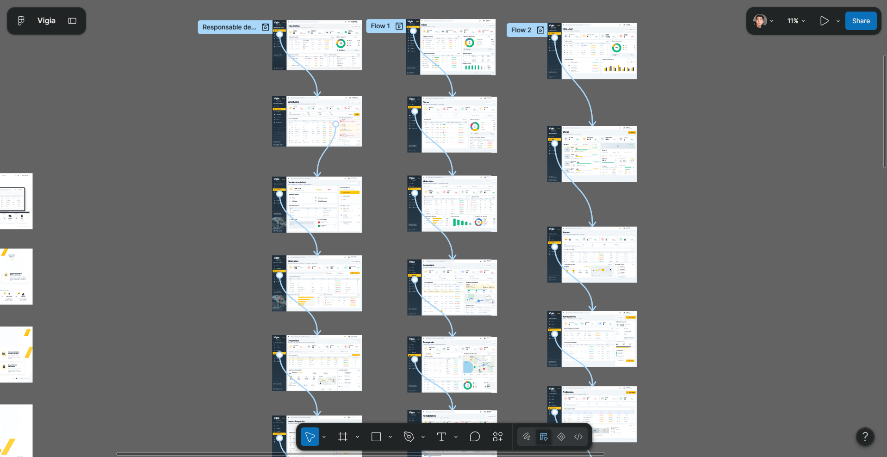

**Enlace al prototipo en Figma:**  
[Desktop Web Application Prototype](https://www.figma.com/design/TqDOrA0R14a6qmep8lPz1H/Vigia?node-id=1218-2290&p=f&t=HegcE0HlCG9iQoek-0)

**Video de navegación del prototipo:**  
[Prototype Navigation Video](https://upcedupe-my.sharepoint.com/:v:/g/personal/u20201a277_upc_edu_pe/IQALhIpva1O8S6xgVQbAXuQ4ARUy4APNGKC6cpgeixn5W5M?nav=eyJyZWZlcnJhbEluZm8iOnsicmVmZXJyYWxBcHAiOiJPbmVEcml2ZUZvckJ1c2luZXNzIiwicmVmZXJyYWxBcHBQbGF0Zm9ybSI6IldlYiIsInJlZmVycmFsTW9kZSI6InZpZXciLCJyZWZlcnJhbFZpZXciOiJNeUZpbGVzTGlua0NvcHkifX0&e=c2dhjG)

<!-- Fuente: report/chapters/chapter-4-product-design/4.6-domain-driven-software-architecture.md -->

### 4.6. Domain-Driven Software Architecture

En esta sección el equipo parte de los logros alcanzados en el Big Picture EventStorming de la sección 2.4 y profundiza en ellos desde la perspectiva de Domain-Driven Design, hasta llegar a la identificación de los Bounded Contexts de la solución y, dentro de cada uno, de sus Aggregates, Commands, Domain Events y Queries. Sobre esa base se presenta a continuación la representación de la arquitectura de software de Vigía aplicando el C4 Model, en sus tres niveles de abstracción: Context, Container y Component.

El recorrido de la sección es el siguiente. La sección 4.6.1 documenta la sesión de Design-Level EventStorming, en la que las agrupaciones candidatas identificadas en 2.4 son revisadas, confirmadas y detalladas hasta el nivel de agregados, comandos, procesos de negocio y modelos de lectura. La sección 4.6.2 presenta el Context Level Diagram, que sitúa a Vigía como un único sistema frente a sus usuarios y a los sistemas externos con los que se integra. La sección 4.6.3 presenta el Container Level Diagram, que descompone ese sistema en unidades de despliegue independientes y expone las principales decisiones de tecnología. La sección 4.6.4 presenta los Component Level Diagrams correspondientes a cada uno de los containers considerados.

Los diagramas del C4 Model se elaboran con Structurizr, herramienta indicada en la sección de Tecnología del enunciado del proyecto para los diagramas de Software Architecture bajo C4 Model.

**Sobre el idioma de los artefactos.** Los nombres de Bounded Contexts y Aggregates se expresan en inglés, con su equivalente en español entre paréntesis en la primera mención de cada contexto. Esta decisión mantiene la correspondencia con el Ubiquitous Language de la sección 2.5, que conforme al enunciado del proyecto se redacta en inglés, y con el idioma por defecto de los productos de la solución. Los comandos, eventos, procesos de negocio y modelos de lectura conservan la redacción en español empleada en los tableros de EventStorming, de modo que la trazabilidad entre las secciones 2.4, 4.6.1 y el código permanezca visible.

<!-- Fuente: report/chapters/chapter-4-product-design/4.6.1-design-level-eventstorming.md -->

#### 4.6.1. Design-Level EventStorming

En esta sección el equipo presenta el proceso y los resultados de la sesión de Design-Level EventStorming realizada para Vigía. La sesión parte del tablero de Big Picture EventStorming de la sección 2.4 con el fin de plantear una aproximación revisada y mejorada al modelado de nivel general del dominio, y a partir de ahí identificar el mayor nivel de detalle posible dentro de cada Bounded Context.

**En qué consiste la revisión y mejora.** El tablero de la sección 2.4 se construyó únicamente con Domain Events dispuestos en una línea de tiempo, lo que permitió acordar qué ocurre en el negocio antes de discutir quién lo dispara. La sesión de nivel de diseño incorpora sobre esa misma base los elementos que el Big Picture deliberadamente omite: los comandos que originan cada evento, los roles que los invocan, los agregados que concentran las reglas y garantizan la consistencia, los procesos de negocio que deciden el desenlace de cada momento, los modelos de lectura que sustentan las decisiones de los usuarios y los sistemas de terceros de los que el dominio depende. El resultado es que las ocho agrupaciones candidatas de la sección 2.4 quedan confirmadas como Bounded Contexts, ya que cada una resultó tener su propio conjunto de agregados y su propio vocabulario.

**Proceso realizado.** La sesión se desarrolló en la herramienta Miro, sobre una copia del tablero de Big Picture, con una duración aproximada de dos horas, conforme a la recomendación del enunciado del proyecto de concentrar el esfuerzo en una única sesión acotada. El trabajo se organizó en cinco pasadas sucesivas:

1. **Comandos y roles.** Se antepuso a cada evento el comando que lo origina y, cuando ese comando lo invoca una persona, el rol de usuario correspondiente. Los eventos que no resultaron precedidos por ningún comando humano se marcaron para su revisión en la pasada siguiente.
2. **Sistemas de terceros.** Los eventos marcados en la pasada anterior se examinaron para determinar su origen. De ahí se identificaron los tres sistemas externos de los que el dominio depende, siguiendo el patrón comando, sistema de terceros, evento.
3. **Agregados.** Los comandos y eventos se agruparon alrededor de la entidad cuyo estado modifican, y se determinó cuál actúa como raíz, es decir, cuál garantiza las invariantes del conjunto.
4. **Procesos de negocio.** Se explicitaron las reglas que deciden el desenlace de cada momento y que hasta entonces estaban implícitas en la bifurcación entre un evento del recorrido principal y sus alternativas.
5. **Modelos de lectura y límites.** Se incorporaron las vistas de datos que un rol necesita consultar antes de decidir, y se revisó la delimitación de cada contexto a la luz de los agregados identificados.

**Notación utilizada.** El tablero emplea los siete elementos de la notación de nivel de diseño:

| Elemento | Color | Significado |
|---|---|---|
| Domain Event | Naranja | Un hecho que ya ocurrió, redactado en pasado y en lenguaje natural |
| Command | Azul | Una acción que modifica el estado de un agregado |
| User Role | Amarillo | El rol que invoca el comando. Se emplea únicamente cuando el comando lo invoca una persona |
| Aggregate | Amarillo lima | Unidad de consistencia que junta los comandos con los eventos. Su nombre es único y la nota se repite en el tablero cada vez que aparece un comando que le pertenece |
| External System | Rosado | Sistema de terceros que el equipo no controla, siempre en el patrón comando, sistema, evento |
| Business Process | Morado | Regla de negocio que procesa un comando y determina el evento resultante |
| Read Model | Verde | Datos que un rol necesita consultar para tomar una decisión |

**Roles de usuario del sistema.** La sesión confirmó tres roles con acceso a la plataforma, más el visitante que aún no es usuario:

| Rol | Alcance |
|---|---|
| Administrador | Representa a la empresa cliente. Registra la organización, activa la suscripción, invita usuarios y asigna roles, define las geocercas, resuelve los casos de discrepancia y consulta los tableros y el detalle de cualquier despacho |
| Encargado de Obra | Solicita materiales, registra la llegada de la unidad, verifica lo recibido y registra la conformidad o reporta la discrepancia |
| Encargado de Almacén | Verifica existencias, conforma la carga, registra el pesaje, emite la guía de remisión, asigna la unidad y el transportista, y registra la salida |
| Visitante | Solicita una demostración desde el Landing Page |

El transportista participa del dominio conduciendo la unidad, pero no invoca ningún comando y por tanto no constituye un rol del sistema. Los hechos que ocurren durante el traslado provienen del dispositivo de seguimiento satelital instalado a bordo, que entra al tablero como sistema de terceros.

**Sistemas de terceros.** Pasarela de pago, para el cobro de la suscripción. Plataforma de telemetría GPS, de la que provienen los eventos del tramo de tránsito. Servicio de correo electrónico, para las invitaciones y notificaciones que salen de la aplicación.

---

**Bounded Contexts confirmados.** Las ocho agrupaciones de la sección 2.4 se confirman como Bounded Contexts. Los contextos BC-05 a BC-08 constituyen el núcleo del dominio, ya que sostienen la continuidad del registro de custodia descrita como problema en la sección 1.2.1 y no pueden resolverse adquiriendo una solución genérica de mercado. Los contextos BC-01 a BC-04 son de soporte: resuelven necesidades comunes a cualquier plataforma de este tipo y no diferencian al producto.

| Código | Bounded Context | Tipo | Agrupación de 2.4 |
|---|---|---|---|
| BC-01 | Lead Management (Captación) | Soporte | 1 |
| BC-02 | Identity and Access Management (Gestión de Cuentas y Accesos) | Soporte | 2 |
| BC-03 | Subscriptions and Payment (Suscripciones y Pagos) | Soporte | 3 |
| BC-04 | Fleet and Device Management (Registro de Flota y Dispositivos) | Soporte | 4 |
| BC-05 | Ordering and Dispatch (Gestión de Pedidos y Despacho) | Core | 5 |
| BC-06 | Transit Traceability (Trazabilidad en Tránsito) | Core | 6 |
| BC-07 | Site Reception and Verification (Recepción y Verificación en Obra) | Core | 7 |
| BC-08 | Discrepancy and Evidence Management (Gestión de Discrepancias y Evidencia) | Core | 8 |

---

##### BC-01. Lead Management

Conserva las solicitudes de demostración originadas en el Landing Page. Es el único contexto anterior a la existencia de una relación comercial.

| Aggregate | Invariante principal |
|---|---|
| Demo Request (Solicitud de Demostración) | Una solicitud registra el segmento declarado por el visitante |

| Rol | Command | Domain Event |
|---|---|---|
| Visitante | Solicitar demostración | Solicitud de demostración enviada |

**Origen en la sección 3.1.** LP-04 y TS-06.

---

##### BC-02. Identity and Access Management

Responde por la identidad de la organización cliente, la de sus usuarios y los permisos asociados a cada rol. Es el contexto del que dependen todos los demás, ya que ningún comando del dominio puede ejecutarse sin un usuario autenticado y con rol habilitado.

| Aggregate | Invariante principal |
|---|---|
| Company (Empresa) | Una empresa no puede tener usuarios activos si su suscripción no está activa |
| User (Usuario) | Un usuario pertenece a una sola empresa y tiene exactamente un rol |
| Invitation (Invitación) | Una invitación pendiente no puede aceptarse dos veces |

| Rol | Command | Aggregate | Domain Event |
|---|---|---|---|
| Administrador | Registrar empresa | Company | Empresa registrada |
| Administrador | Invitar usuario | Invitation | Invitación enviada, Invitación enviada al correo |
| Usuario invitado | Aceptar invitación | User | Invitación aceptada, Rol asignado |
| Administrador, Encargado de Obra, Encargado de Almacén | Iniciar sesión | User | Usuario autenticado |
| Administrador, Encargado de Obra, Encargado de Almacén | Acceder a función restringida | User | Acceso exitoso, Acceso denegado |

**Procesos de negocio.** Asignación de permisos según rol. Validación de rol.

**Eventos alternativos.** Autenticación fallida. Sesión expirada.

**Sistemas de terceros.** Servicio de correo electrónico.

**Origen en la sección 3.1.** US-02, US-15, TS-01.

---

##### BC-03. Subscriptions and Payment

Responde por la relación comercial entre Trazza Labs y la empresa cliente. Se separa del contexto anterior porque gira en torno a un modelo distinto, depende de un sistema externo de cobro y tiene un ciclo de vida independiente del de los usuarios.

| Aggregate | Invariante principal |
|---|---|
| Subscription (Suscripción) | Una empresa tiene como máximo una suscripción vigente |

| Rol | Command | Aggregate | Domain Event |
|---|---|---|---|
| Administrador | Activar suscripción | Subscription | Suscripción activada, Suscripción pagada |
| — | Enviar notificación | Subscription | Estado de suscripción enviado |

**Procesos de negocio.** Habilitación de contratación, que a partir del evento "Empresa registrada" de BC-02 dispara la activación. Retención de suscripción, que ante un pago rechazado deja la suscripción en estado pendiente.

**Eventos alternativos.** Pago rechazado. Suscripción dejada en estado pendiente.

**Sistemas de terceros.** Pasarela de pago. Servicio de correo electrónico.

**Origen en la sección 3.1.** US-01.

---

##### BC-04. Fleet and Device Management

Contexto nuevo respecto del modelado anterior, surgido de la incorporación del seguimiento satelital. Registra las unidades de transporte, vincula el dispositivo a bordo de cada una y define los perímetros sobre el almacén y la obra. Ocurre una sola vez por unidad y por predio, y es condición previa para que un despacho pueda registrarse.

| Aggregate | Invariante principal |
|---|---|
| Vehicle (Unidad de Transporte) | Un dispositivo no puede estar vinculado a más de una unidad al mismo tiempo |
| Geofence (Geocerca) | Una geocerca pertenece a un único predio, almacén u obra |

| Rol | Command | Aggregate | Domain Event |
|---|---|---|---|
| Encargado de Almacén | Registrar unidad de transporte | Vehicle | Unidad de transporte registrada |
| Encargado de Almacén | Vincular dispositivo GPS a la unidad | Vehicle | Dispositivo GPS vinculado a la unidad, Dispositivo registrado en la unidad de transporte |
| Administrador | Definir geocerca del almacén | Geofence | Geocerca de almacén definida |
| Administrador | Definir geocerca de la obra | Geofence | Geocerca de obra definida |

**Procesos de negocio.** Validación de disponibilidad del dispositivo.

**Eventos alternativos.** Vinculación rechazada por dispositivo ya asignado.

**Sistemas de terceros.** Plataforma de telemetría GPS.

---

##### BC-05. Ordering and Dispatch

Cubre desde que el Encargado de Obra solicita materiales hasta que la unidad sale del almacén central. Es el contexto donde se origina el registro de custodia.

| Aggregate | Invariante principal |
|---|---|
| Order (Pedido) | Un pedido no puede quedar en atención total si algún material tiene existencia insuficiente |
| Dispatch (Despacho) | No puede emitirse la guía de remisión de un despacho sin pesaje registrado |
| Route (Recorrido) | Un recorrido pertenece a un único despacho y se abre en el momento de registrar la salida |

| Rol | Command | Aggregate | Domain Event |
|---|---|---|---|
| Encargado de Obra | Solicitar pedido | Order | Pedido solicitado |
| — | Notificar el pedido a almacén | Order | Almacén notificado del pedido, Pedido notificado |
| Encargado de Almacén | Verificar existencias | Order | Existencias verificadas |
| Encargado de Almacén | Conformar carga | Dispatch | Carga conformada |
| Encargado de Almacén | Registrar pesaje | Dispatch | Pesaje registrado, Pesaje marcado correcto |
| Encargado de Almacén | Emitir guía de remisión | Dispatch | Guía de remisión emitida |
| Encargado de Almacén | Asignar unidad y transportista | Dispatch | Unidad y transportista asignados |
| Encargado de Almacén | Registrar salida de la unidad | Dispatch | **Salida de la unidad registrada** |
| — | Registrar recorrido | Route | Recorrido registrado |

**Procesos de negocio.** Derivación al almacén de origen. Evaluación de cobertura del pedido. Comparación del pesaje contra el peso estimado. Validación de pesaje registrado. Detección de salida de geocerca.

**Modelos de lectura.** Existencias disponibles, que el Encargado de Almacén consulta antes de decidir si atiende el pedido de forma total o parcial.

**Eventos alternativos.** Pedido marcado en atención parcial. Material con existencia insuficiente señalado. Pesaje marcado con alerta de revisión. Emisión impedida por falta de pesaje.

**Sistemas de terceros.** Servicio de correo electrónico. Plataforma de telemetría GPS.

**Origen en la sección 3.1.** US-03, US-04, US-05, US-16, TS-02.

"Salida de la unidad registrada" es el evento pivotal que cierra este contexto y abre BC-06, conforme a lo identificado en la sección 2.4.

---

##### BC-06. Transit Traceability

Cubre el traslado de la unidad desde la salida del almacén hasta su llegada al frente de obra. Es el único contexto de la solución en el que no interviene ningún rol de usuario: la totalidad de sus eventos proviene del dispositivo de seguimiento satelital instalado a bordo, procesados por las reglas que los interpretan.

Esta particularidad es la que sostiene el valor probatorio del tramo. Los hechos que ocurren entre la salida y la llegada no los declara ninguna de las dos organizaciones que podrían resultar responsabilizadas por una diferencia.

| Aggregate | Invariante principal |
|---|---|
| Route (Recorrido) | Cada reporte del dispositivo conserva la marca de tiempo de ocurrencia y la de recepción en el servidor |

| Origen | Command | Aggregate | Domain Event |
|---|---|---|---|
| Plataforma de telemetría GPS | — | Route | Posición reportada en tiempo real |
| Plataforma de telemetría GPS | Notificar desvío de la ruta | Route | Desvío de la ruta notificado, Obra de destino notificada del desvío |
| Plataforma de telemetría GPS | Notificar desvío a la obra destino | Route | Detención prolongada detectada |
| Plataforma de telemetría GPS | — | Route | Señal del dispositivo perdida, Señal del dispositivo recuperada, Telemetría acumulada incorporada al recorrido |

**Procesos de negocio.** Comparación contra la ruta prevista. Evaluación de tiempo detenido. Detección de ausencia de reportes. Detección de ingreso a geocerca.

**Sistemas de terceros.** Plataforma de telemetría GPS. Servicio de correo electrónico.

El agregado Route constituye el puente entre BC-05 y BC-06: nace en el contexto anterior al registrarse la salida y es el objeto que este contexto consume y enriquece durante el traslado.

---

##### BC-07. Site Reception and Verification

Cubre la recepción física del despacho en el frente de obra y la comparación de lo recibido contra la guía de remisión. Es el contexto donde el registro de custodia se cierra o se bifurca hacia una discrepancia.

| Aggregate | Invariante principal |
|---|---|
| Reception (Recepción) | Una recepción se valida siempre contra la guía de remisión de un despacho existente |

| Rol | Command | Aggregate | Domain Event |
|---|---|---|---|
| Encargado de Obra | Registrar llegada de la unidad | Reception | **Llegada de la unidad registrada** |
| Encargado de Obra | Corroborar recepción | Reception | Recepción corroborada |
| Encargado de Obra | Verificar material recibido | Reception | Material verificado |
| Encargado de Obra | Registrar conformidad | Reception | Conformidad registrada, Despacho cerrado |
| Encargado de Obra | Reportar discrepancia | Reception | **Discrepancia reportada** |
| Encargado de Obra | Adjuntar evidencia fotográfica | Reception | Evidencia fotográfica adjuntada |

**Procesos de negocio.** Cotejo con la llegada registrada, que contrasta el registro del Encargado de Obra con el ingreso a la geocerca detectado por el dispositivo. Comparación de cantidades despachadas contra recibidas. Evaluación de conformidad.

**Modelos de lectura.** Detalle de la guía de remisión, que el Encargado de Obra consulta para verificar si lo recibido coincide con lo despachado.

**Origen en la sección 3.1.** US-09, US-10.

"Discrepancia reportada" es el evento pivotal que abre BC-08. A diferencia de los dos anteriores, ocurre solo en el camino donde se detecta una diferencia.

---

##### BC-08. Discrepancy and Evidence Management

Cubre la consolidación de la evidencia registrada a lo largo de toda la cadena, la generación del reporte de sustento, la determinación de responsabilidad y el cierre del caso. Es el contexto que materializa el valor probatorio del registro.

| Aggregate | Invariante principal |
|---|---|
| Discrepancy Case (Caso de Discrepancia) | Un caso no puede cerrarse sin una responsabilidad determinada registrada |

| Rol | Command | Aggregate | Domain Event |
|---|---|---|---|
| — | Abrir caso de discrepancia | Discrepancy Case | Caso de discrepancia abierto, Administrador notificado del caso |
| Administrador | Consolidar evidencia | Discrepancy Case | Evidencia consolidada |
| Administrador | Generar reporte de sustento | Discrepancy Case | Reporte de sustento generado |
| Administrador | Determinar responsabilidad | Discrepancy Case | Responsabilidad determinada |
| Administrador | Cerrar caso | Discrepancy Case | Caso cerrado, Resultado incorporado al historial del despacho |
| Administrador | Consultar tablero | — | Tablero consultado |
| Administrador | Consultar detalle de un despacho | — | Detalle del despacho consultado |

**Procesos de negocio.** Apertura automática de caso, que se dispara desde el evento "Discrepancia reportada" de BC-07 sin intervención de ningún rol. Reunión de los registros del despacho, el recorrido y la recepción. Validación de evidencia completa. Validación de responsabilidad determinada.

**Modelos de lectura.** Línea de tiempo consolidada del despacho, que el Administrador consulta para determinar dónde de la cadena se originó la diferencia. Tablero de despachos e incidencias, que le permite saber qué despachos y casos requieren atención.

**Eventos alternativos.** Reporte generado con evidencia faltante señalada.

**Sistemas de terceros.** Servicio de correo electrónico.

**Origen en la sección 3.1.** US-11, US-12, US-13, TS-05.

---

**Relaciones entre Bounded Contexts.** La dependencia entre los contextos del núcleo sigue la secuencia del proceso de negocio y es unidireccional: cada contexto consume los eventos del anterior y no modifica su estado.

| Relación | Qué se transmite |
|---|---|
| BC-02 → BC-03 | El evento "Empresa registrada", que habilita la contratación |
| BC-03 → BC-02 | El estado de la suscripción, del que depende la habilitación de los usuarios |
| BC-02 → todos | La identidad del usuario y su rol, que los demás contextos consumen sin redefinir |
| BC-04 → BC-05 | La unidad disponible con su dispositivo vinculado |
| BC-04 → BC-06, BC-07 | Las geocercas contra las que se detectan la salida y el ingreso |
| BC-05 → BC-06 | El agregado Route, abierto al registrarse la salida |
| BC-06 → BC-07 | El ingreso a la geocerca de la obra, que corrobora la llegada registrada |
| BC-07 → BC-08 | La discrepancia reportada con su evidencia fotográfica |
| BC-05, BC-06, BC-07 → BC-08 | Los registros de cada tramo que alimentan la línea de tiempo consolidada |

---

**Hallazgos de la sesión.** La pasada de comandos y roles produjo dos resultados que el equipo no había anticipado y que modifican decisiones tomadas en secciones anteriores.

El primero es que el contexto de tránsito quedó sin ningún comando invocado por una persona. Lejos de ser un defecto del modelado, esta ausencia es la representación precisa del problema descrito en la sección 1.2.1 y el fundamento del valor probatorio de la solución.

El segundo es una corrección en el orden de resolución de un caso de discrepancia. El modelado situaba inicialmente la determinación de responsabilidad antes de la generación del reporte de sustento. El contraste con las User Stories US-11 a US-13 mostró que el orden correcto es el inverso: el reporte es el sustento sobre el cual se determina la responsabilidad, y no su consecuencia. El tablero recoge el orden corregido.

**Términos incorporados al Ubiquitous Language.** La sesión produjo términos que no figuraban en el glosario de la sección 2.5 y que se incorporan a él: Geofence (geocerca), Onboard GPS Device (dispositivo GPS a bordo), Telemetry (telemetría), Position Report (reporte de posición), Route Deviation (desvío de ruta), Prolonged Stop (detención prolongada), Vehicle (unidad de transporte), Route (recorrido), Demo Request (solicitud de demostración) y Weight Variance (variación de pesaje).

---

**Evidencia de la sesión.**

**Figura n**

*Bounded Context Gestión de Cuentas y Accesos del Design-Level EventStorming de Vigía*

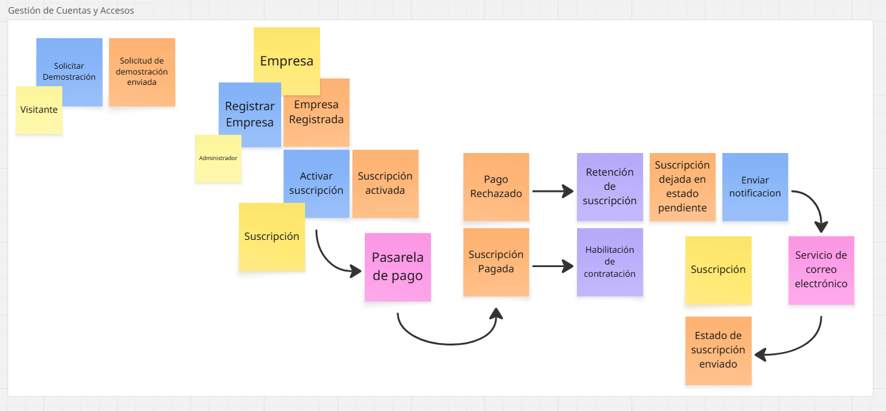

*Nota.* Elaborado por el equipo de Trazza Labs en la herramienta Miro. Muestra el registro de la empresa, la activación de la suscripción a través de la pasarela de pago y el tratamiento del pago rechazado mediante el proceso de negocio de retención de suscripción.

**Figura n**

*Bounded Context Identity and Access Management del Design-Level EventStorming de Vigía*

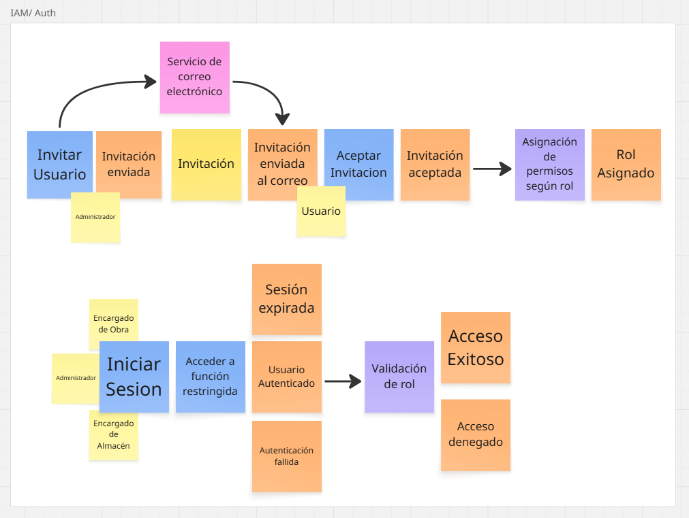

*Nota.* Elaborado por el equipo de Trazza Labs en la herramienta Miro. Muestra el flujo de invitación y asignación de roles, y el flujo de acceso con sus desenlaces alternativos de autenticación fallida, sesión expirada y acceso denegado.

**Figura n**

*Bounded Context Fleet and Device Management del Design-Level EventStorming de Vigía*

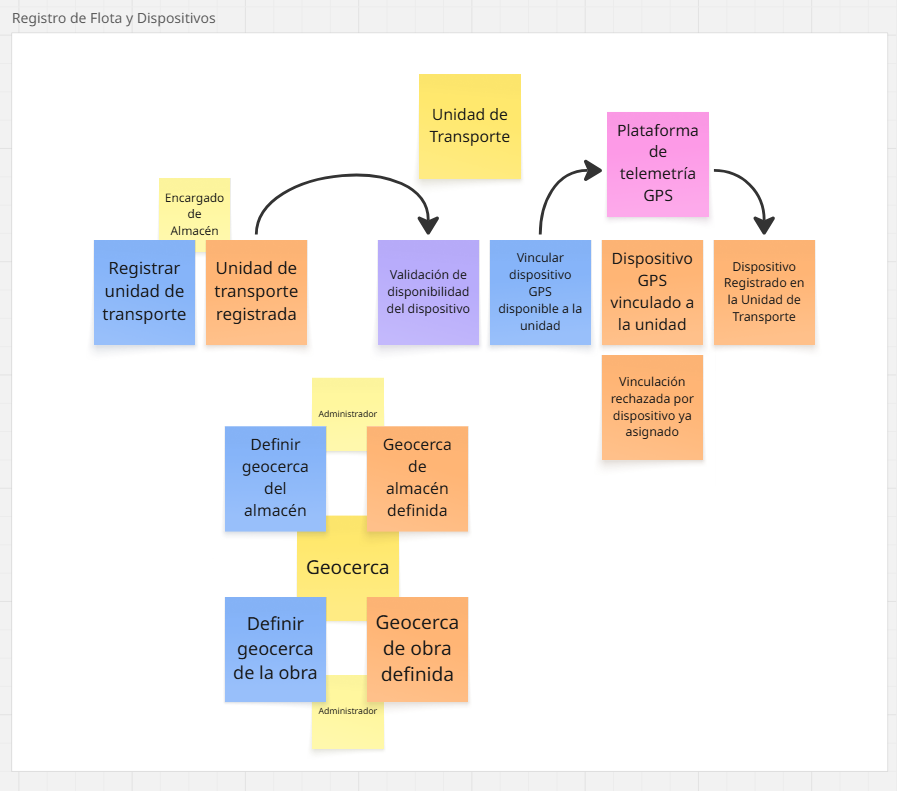

*Nota.* Elaborado por el equipo de Trazza Labs en la herramienta Miro. Muestra el alta de la unidad de transporte, la vinculación del dispositivo GPS con su proceso de validación de disponibilidad, y la definición de las geocercas del almacén y de la obra sobre el agregado Geofence.

**Figura n**

*Bounded Context Ordering and Dispatch del Design-Level EventStorming de Vigía*

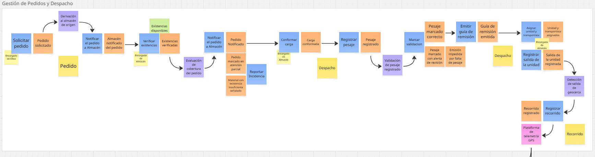

*Nota.* Elaborado por el equipo de Trazza Labs en la herramienta Miro. Muestra la secuencia completa desde la solicitud del pedido hasta el registro de la salida de la unidad, con los agregados Pedido, Despacho y Recorrido, y los procesos de negocio de evaluación de cobertura, validación del pesaje y detección de salida de geocerca.

**Figura n**

*Bounded Context Transit Traceability del Design-Level EventStorming de Vigía*

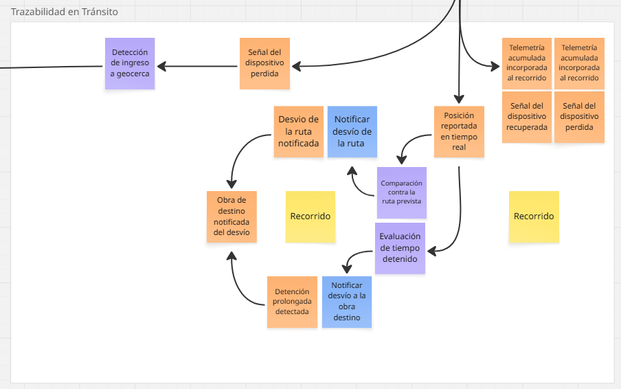

*Nota.* Elaborado por el equipo de Trazza Labs en la herramienta Miro. Muestra los eventos generados por la plataforma de telemetría GPS sobre el agregado Recorrido. Es el único marco del tablero que no contiene ninguna nota de rol de usuario.

**Figura n**

*Bounded Context Site Reception and Verification del Design-Level EventStorming de Vigía*

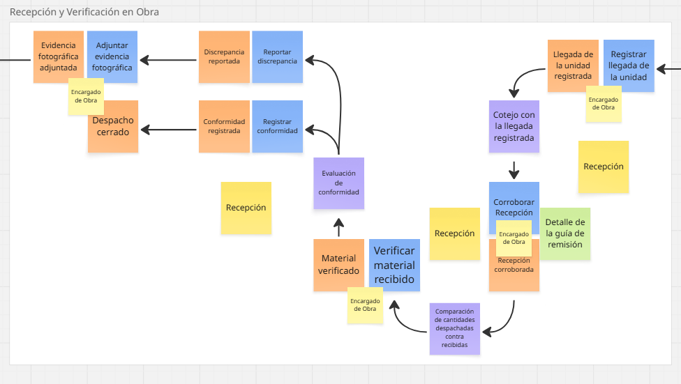

*Nota.* Elaborado por el equipo de Trazza Labs en la herramienta Miro. Muestra el registro de la llegada, su cotejo contra el ingreso a la geocerca, la verificación del material con el modelo de lectura de la guía de remisión, y la bifurcación entre conformidad y discrepancia.

**Figura n**

*Bounded Context Discrepancy and Evidence Management del Design-Level EventStorming de Vigía*

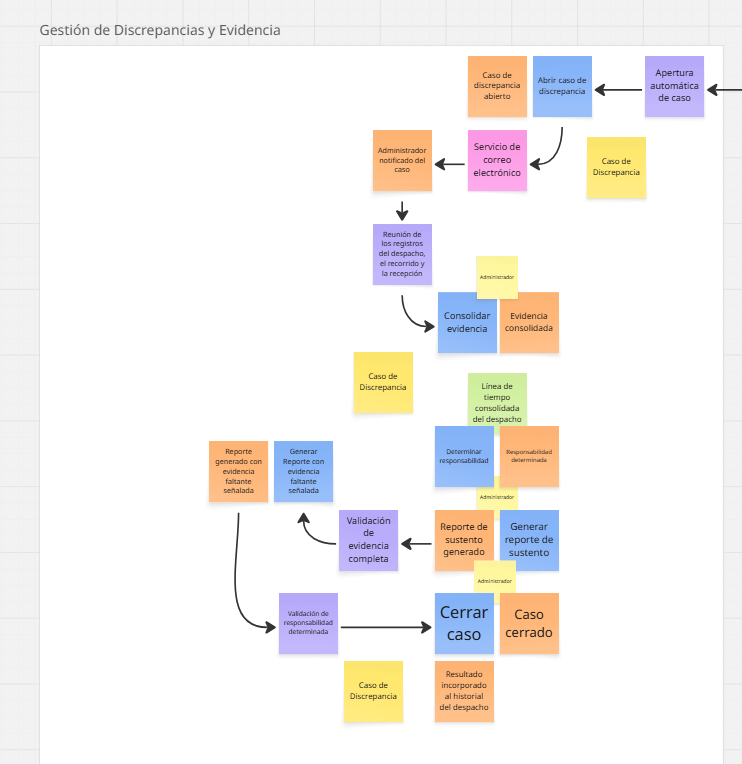

*Nota.* Elaborado por el equipo de Trazza Labs en la herramienta Miro. Muestra la apertura automática del caso, la consolidación de la evidencia de los tres tramos, la generación del reporte de sustento, la determinación de responsabilidad con el modelo de lectura de la línea de tiempo consolidada, y el cierre del caso.

Link del tablero colaborativo en Miro: (Event-Storming)[https://miro.com/app/board/uXjVHmvI2_I=/?share_link_id=10349296586]

<!-- Fuente: report/chapters/chapter-4-product-design/4.6.2-software-architecture-context-diagram.md -->

#### 4.6.2. Software Architecture Context Diagram

En esta sección se presenta el Context Level Diagram del C4 Model para Vigía. Este primer nivel de abstracción sitúa a la solución como un único sistema de software y muestra quiénes la utilizan y con qué sistemas de terceros se integra, sin exponer todavía ninguna decisión interna de tecnología ni de estructura. Su propósito es delimitar el alcance del sistema: qué queda dentro de la responsabilidad del equipo y qué queda fuera.

**Sobre la herramienta empleada.** El enunciado del proyecto indica Structurizr para los diagramas de Software Architecture bajo C4 Model. Su servicio en la nube dejó de admitir el registro de cuentas nuevas, por lo que el equipo no pudo emplear esa modalidad. Los diagramas se elaboraron entonces en draw.io, que dispone de la biblioteca oficial de formas del C4 Model y permite compartir el artefacto editable mediante un enlace, que es la condición que el equipo necesitaba conservar.

**Personas.** Los actores que interactúan con el sistema son los mismos identificados en el Design-Level EventStorming de la sección 4.6.1 y en el conjunto de User Stories de la sección 3.1.

| Persona | Organización | Relación con el sistema |
|---|---|---|
| Administrador | Constructora | Registra la empresa, activa la suscripción, invita usuarios y asigna roles, define las geocercas, resuelve los casos de discrepancia y consulta los tableros |
| Encargado de obra | Constructora | Solicita materiales, registra la llegada de la unidad, verifica el material recibido y registra la conformidad o reporta una discrepancia |
| Encargado de almacén | Operador logístico | Verifica existencias, conforma la carga, registra el pesaje, emite la guía de remisión, asigna la unidad y registra la salida |
| Visitante | Externa | Consulta la propuesta de valor en el Landing Page y solicita una demostración |

El transportista conduce la unidad y participa del dominio, pero no interactúa con el sistema: los hechos del traslado provienen del dispositivo de seguimiento satelital instalado a bordo.

**Sistemas externos.**

| Sistema externo | Relación con Vigía |
|---|---|
| Pasarela de pago | Procesa el pago del plan de suscripción y notifica la aceptación o el rechazo |
| Servicio de correo electrónico | Entrega las invitaciones y las notificaciones que el sistema envía fuera de la aplicación |
| Plataforma de telemetría GPS | Envía a Vigía los reportes de posición del dispositivo instalado en la unidad de transporte |

**Lectura del diagrama.** Tres observaciones se desprenden de este nivel.

En primer lugar, las personas que interactúan con Vigía pertenecen a dos organizaciones distintas: la constructora que contrata el servicio y el operador logístico que ejecuta el traslado. Esta es la condición que el sistema debe sostener y que, según lo expuesto en la sección 1.2.1, ninguna de las soluciones analizadas en la sección 2.1.1 resuelve, ya que operan dentro de los límites de una sola empresa. Por esa razón el diagrama agrupa a las personas mediante dos fronteras organizacionales.

En segundo lugar, la relación con la plataforma de telemetría es la única cuya dirección entra hacia el sistema. Los reportes de posición ingresan sin que ninguna persona los registre, lo que sostiene la continuidad del registro durante el tramo de traslado.

En tercer lugar, Vigía no se integra con sistemas de gestión de obra ni con sistemas de control de flota. Esta ausencia es deliberada para el alcance actual: la solución constituye el registro de origen de los eventos de custodia y no un agregador de información producida por otros sistemas.

**Figura n**

*Diagrama de contexto de la arquitectura de software de Vigía*

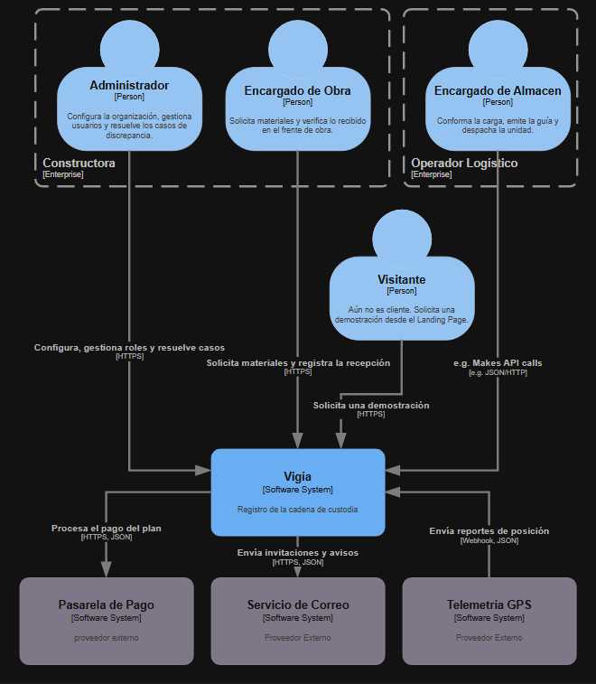

*Nota.* Elaborado por el equipo de Trazza Labs en draw.io, aplicando el C4 Model de Simon Brown. Los recuadros de borde punteado delimitan las dos organizaciones que participan de la cadena de custodia. El diagrama editable puede consultarse en: [ENLACE].

<!-- Fuente: report/chapters/chapter-4-product-design/4.6.3-software-architecture-container-diagrams.md -->

#### 4.6.3. Software Architecture Container Diagrams

En esta sección se presenta el Container Level Diagram del C4 Model para Vigía. Este segundo nivel de abstracción descompone el sistema presentado en la sección 4.6.2 en sus unidades de despliegue independientes, muestra cómo se reparten las responsabilidades entre ellas, expone las principales decisiones de tecnología y describe la forma en que se comunican entre sí. Conforme al C4 Model, cada container representa una unidad que puede desplegarse y ejecutarse por separado.

**Containers de la solución.**

| Container | Tecnología | Responsabilidad |
|---|---|---|
| Landing Page | HTML5, CSS3 y JavaScript | Presenta la propuesta de valor de Vigía y las secciones dirigidas a cada segmento objetivo, y recoge las solicitudes de demostración |
| Web Application | Vue Framework con PrimeVue como biblioteca de componentes de interfaz | Ofrece la interfaz de trabajo de los tres roles del dominio: pedido, despacho, recepción y gestión de discrepancias |
| RESTful API | ASP.NET Core Framework con Entity Framework Core, lenguaje C# | Concentra la lógica de dominio de los ocho Bounded Contexts de la sección 4.6.1, aplica las reglas de los agregados y expone los endpoints consumidos por los dos containers anteriores |
| Base de datos relacional | PostgreSQL | Almacena de forma persistente el estado de los agregados y el historial de eventos de cada despacho |

Las tecnologías corresponden a las indicadas en la sección de Tecnología del enunciado del proyecto: HTML5, CSS3 y JavaScript para el Landing Page; Vue Framework con PrimeVue para las Frontend Web Applications; ASP.NET Core con Entity Framework Core y C# para los Web Services bajo estilo arquitectónico RESTful API; y PostgreSQL como sistema gestor de base de datos relacional.

**Comunicación entre containers.**

| Origen | Destino | Protocolo y formato | Propósito |
|---|---|---|---|
| Landing Page | RESTful API | HTTPS, JSON | Registrar la solicitud de demostración del visitante |
| Web Application | RESTful API | HTTPS, JSON | Ejecutar los comandos y consultas del dominio |
| RESTful API | Base de datos | Entity Framework Core sobre el protocolo del motor | Leer y escribir el estado de los agregados |
| RESTful API | Pasarela de pago | HTTPS, JSON | Procesar el pago y recibir la aceptación o el rechazo |
| RESTful API | Servicio de correo electrónico | HTTPS, JSON | Entregar invitaciones y notificaciones |
| Plataforma de telemetría GPS | RESTful API | Webhook HTTPS, JSON | Entregar los reportes de posición del dispositivo a bordo |

**Decisiones de arquitectura y su justificación.**

*Un único container para los Web Services.* Los ocho Bounded Contexts de la sección 4.6.1 se implementan dentro de una misma RESTful API, manteniéndose separados en su interior como componentes independientes según se detalla en la sección 4.6.4. La separación en unidades de despliegue distintas por contexto no se adopta porque, para el alcance previsto, introduciría costos de coordinación y de despliegue que no se corresponden con el tamaño del equipo ni con el volumen de operación esperado. La delimitación lógica de los contextos se preserva, de modo que esa separación permanece disponible como evolución posterior.

*El Landing Page como container separado.* Se despliega de forma independiente de la Web Application porque responde a una audiencia distinta, no requiere autenticación y, conforme al Product Backlog de la sección 3.3, se aborda desde el primer sprint sin depender de ninguna otra funcionalidad.

*La telemetría ingresa por webhook.* El proveedor de telemetría envía los reportes al RESTful API en el momento en que se producen, en lugar de que el API los consulte de forma periódica. Esta decisión evita interrogar al proveedor por unidades que no se han desplazado y hace que la dirección de la relación, visible en el diagrama, sea la contraria a la de los otros dos sistemas externos.

*Dos marcas de tiempo en los reportes de posición.* El endpoint de ingesta conserva la marca de tiempo de ocurrencia informada por el dispositivo y registra además la marca de tiempo de recepción en el servidor. Conservar ambas permite distinguir cuándo ocurrió el hecho de cuándo llegó su registro, distinción de la que depende el valor probatorio de la evidencia consolidada en un caso de discrepancia.

**Figura n**

*Diagrama de contenedores de la arquitectura de software de Vigía*

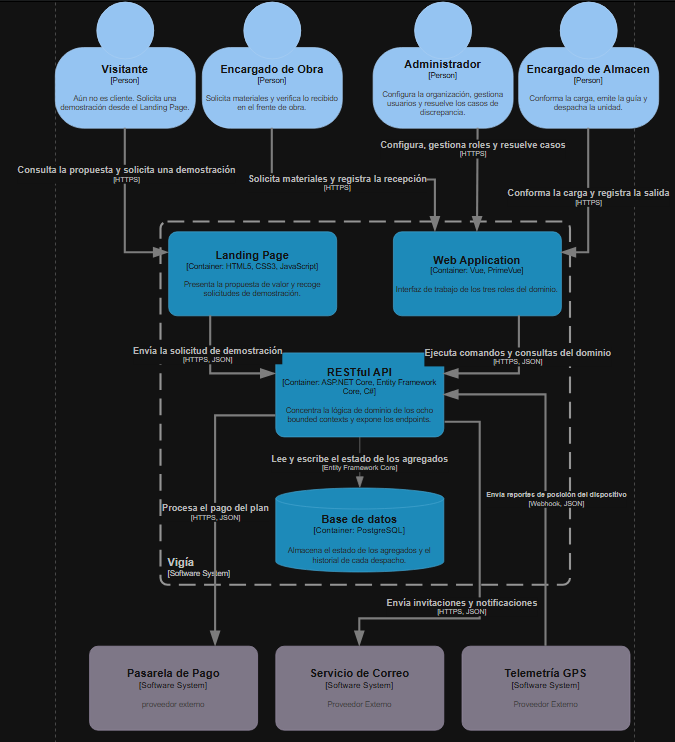

*Nota.* Elaborado por el equipo de Trazza Labs en draw.io, aplicando el C4 Model de Simon Brown. El recuadro de borde punteado delimita el alcance del sistema. El diagrama editable puede consultarse en: [ENLACE].

<!-- Fuente: report/chapters/chapter-4-product-design/4.6.4-software-architecture-components-diagrams.md -->

#### 4.6.4. Software Architecture Components Diagrams

En esta sección se presentan los Component Level Diagrams del C4 Model correspondientes a los containers definidos en la sección 4.6.3. Este tercer nivel de abstracción descompone cada container en sus bloques estructurales principales, indicando de qué responde cada uno y con qué tecnología se implementa. Se elaboran diagramas para los tres containers que contienen lógica propia: el RESTful API, la Web Application y el Landing Page. La base de datos relacional no se descompone en componentes, ya que su estructura interna se aborda en la sección 4.8.

---

##### Component Diagram — RESTful API

Este container concentra la lógica de dominio de la solución. Su descomposición sigue directamente los Bounded Contexts identificados en la sección 4.6.1: cada contexto se implementa como un componente independiente, con sus propios agregados, reglas y endpoints, de modo que los límites establecidos en el modelado se conserven en la estructura del código. Esta correspondencia uno a uno entre contextos y componentes es la razón por la que el API queda dividido de esta manera y no según una preferencia técnica.

| Componente | Bounded Context | Responsabilidad |
|---|---|---|
| Componente de captación | BC-01 | Conserva las solicitudes de demostración originadas en el Landing Page |
| Componente de accesos | BC-02 | Registro de la empresa, invitaciones, asignación de roles, autenticación y validación de sesión |
| Componente de suscripciones | BC-03 | Plan contratado, estado de la relación comercial e integración con la pasarela de pago |
| Componente de flota | BC-04 | Alta de unidades de transporte, vinculación del dispositivo y definición de geocercas |
| Componente de despacho | BC-05 | Pedidos, verificación de existencias, conformación de carga, pesaje, guía de remisión y registro de salida |
| Componente de tránsito | BC-06 | Recorrido de la unidad, desvíos, detenciones prolongadas y estado de la señal del dispositivo |
| Componente de recepción | BC-07 | Registro de llegada, comparación entre lo despachado y lo recibido, conformidad y reporte de discrepancia |
| Componente de discrepancias | BC-08 | Apertura del caso, consolidación de la evidencia, reporte de sustento, determinación de responsabilidad y cierre |

Además de los ocho componentes de dominio, el container incluye tres componentes transversales:

| Componente | Responsabilidad | Tecnología |
|---|---|---|
| Filtro de autenticación | Valida el token de sesión y el rol del usuario antes de que la solicitud alcance cualquier componente de dominio | ASP.NET Core |
| Receptor de telemetría | Recibe los reportes de posición que el proveedor de telemetría envía por webhook y los entrega al componente de tránsito | ASP.NET Core |
| Capa de persistencia | Traduce los agregados a su representación relacional y gestiona las transacciones | Entity Framework Core |

La documentación de la interfaz de los Web Services se publica mediante OpenAPI Specification a través de Swagger, conforme a lo indicado en la sección de Tecnología del enunciado del proyecto.

**Dos observaciones sobre el diagrama.**

El endpoint de solicitud de demostración es el único de acceso público. Atraviesa el filtro de autenticación igual que las demás solicitudes, pero no exige una sesión iniciada, ya que el visitante todavía no es usuario de la plataforma.

El componente de tránsito es el único que no recibe llamadas originadas en la Web Application. Sus datos ingresan por el receptor de telemetría y solo salen por consulta. Esta particularidad es coherente con lo observado en la sección 4.6.1, donde ese Bounded Context resultó no tener ningún rol de usuario asociado, y constituye la expresión arquitectónica del registro continuo durante el traslado.

**Interacción entre componentes.** Los componentes de dominio se comunican entre sí siguiendo las relaciones establecidas en la sección 4.6.1. Por legibilidad, el diagrama representa únicamente las tres relaciones que convergen en el componente de discrepancias desde los componentes de despacho, tránsito y recepción, que son las que sostienen la línea de tiempo consolidada de un caso. El conjunto completo de relaciones entre contextos se encuentra en la tabla correspondiente de la sección 4.6.1.

**Figura n**

*Diagrama de componentes del RESTful API de Vigía*

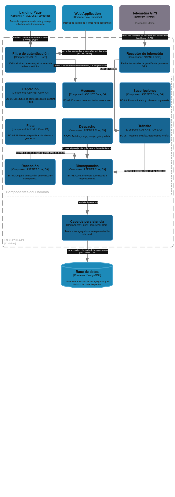

*Nota.* Elaborado por el equipo de Trazza Labs en draw.io, aplicando el C4 Model de Simon Brown. Los ocho componentes de dominio corresponden uno a uno con los Bounded Contexts identificados en la sección 4.6.1. El diagrama editable puede consultarse en: [C4-Model](https://drive.google.com/drive/folders/1ulaVldRC3op0fzlr8bJrSKF164jlX3jc?usp=sharing).

---

##### Component Diagram — Web Application

Este container concentra la interfaz de trabajo de los tres roles del dominio: Administrador, Responsable de obra y Responsable de almacén. A diferencia del RESTful API, su descomposición no sigue directamente los Bounded Contexts de la sección 4.6.1, sino los módulos de navegación reales de la aplicación, construidos en Vue a partir de los mockups de Figma. Cada módulo invoca, a través del cliente del API, los comandos y consultas del componente de dominio correspondiente.

| Componente | Responsabilidad |
|---|---|
| Inicio | Tablero de resumen con los indicadores y pendientes del rol |
| Obras | Estado, avance y responsables de las obras de destino |
| Materiales | Inventario, stock mínimo y alertas de reposición |
| Solicitudes | Pedidos de materiales de las obras y su aprobación |
| Despachos | Conformación, programación y seguimiento de la salida de materiales |
| Transporte | Flota, transportistas y seguimiento de las unidades en ruta |
| Recepciones | Registro de la llegada y comparación entre lo enviado y lo recibido |
| Problemas | Faltantes, retrasos y observaciones, con su evidencia y seguimiento |
| Historial | Registro de movimientos y eventos con su línea de tiempo |
| Reportes | Indicadores de cumplimiento y reportes descargables |
| Configuración | Perfil, preferencias y permisos del usuario |

Además de los once módulos, el container incluye cuatro componentes transversales:

| Componente | Responsabilidad | Tecnología |
|---|---|---|
| Control de acceso | Valida la sesión y habilita los módulos que corresponden al rol del usuario autenticado | Vue Router |
| Cliente del API | Centraliza las llamadas al API y la gestión del token de sesión | JavaScript sobre Vue |
| Componentes UI | Conjunto de componentes de interfaz estandarizado en la sección 4.1.2 | PrimeVue |
| Idiomas | Resuelve los textos en English (en_US) y Latin American Spanish (es_419) | i18n sobre Vue |

**Una observación sobre el diagrama.** El control de acceso es el único punto de entrada de los tres roles: Administrador, Responsable de obra y Responsable de almacén acceden a través de él antes de que se habilite cualquier módulo, y es también el único componente que distingue entre roles. Los módulos que siguen no verifican permisos por sí mismos.

**Interacción entre componentes.** Por legibilidad, el diagrama no traza una flecha individual desde cada uno de los once módulos hacia el cliente del API: todos ellos invocan al cliente de la misma manera, y esa relación se generaliza en una sola flecha entre los módulos y el cliente del API.

**Figura n**

*Diagrama de componentes de la Web Application de Vigía*

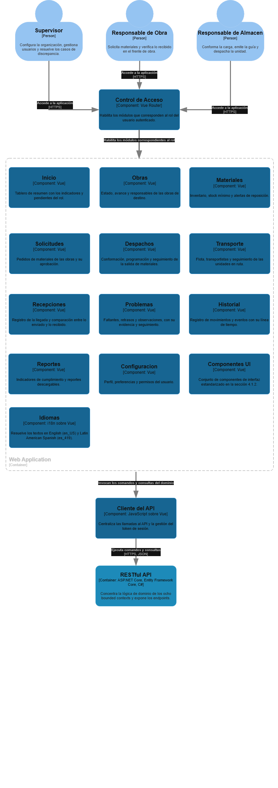

*Nota.* Elaborado por el equipo de Trazza Labs en draw.io, aplicando el C4 Model de Simon Brown. Los módulos se agrupan por la navegación real de la aplicación, construida a partir de los mockups de Figma. El diagrama editable puede consultarse en: [C4-Model](https://drive.google.com/drive/folders/1ulaVldRC3op0fzlr8bJrSKF164jlX3jc?usp=sharing).

---

##### Component Diagram — Landing Page

Este container presenta la propuesta de valor de Vigía y recoge las solicitudes de demostración de los visitantes. Al no exigir autenticación, su descomposición sigue directamente las secciones del sitio, en el orden en que el visitante las recorre.

| Componente | Responsabilidad | Tecnología |
|---|---|---|
| Encabezado | Navegación del sitio (Inicio, Cómo funciona, Beneficios, Planes, Demo, Equipo, Contacto), cambio de idioma y acceso al inicio de sesión | HTML5, CSS3, JavaScript |
| Inicio | Propuesta de valor, vista previa del producto y llamados a la acción hacia Demo y Planes | HTML5, CSS3 |
| Cómo funciona | Presenta el problema que resuelve Vigía y el flujo de seis pasos del proceso | HTML5, CSS3 |
| Beneficios | Presenta los seis beneficios del producto, unificados para ambos segmentos | HTML5, CSS3 |
| Planes | Presenta los planes de suscripción mensual y anual, con su selección | HTML5, CSS3 |
| Demo | Recoge los datos de contacto del visitante (empresa, correo) y los envía al API | JavaScript |
| Equipo | Presenta los perfiles del equipo de desarrollo y el video del equipo | HTML5, CSS3 |
| Pie de página | Enlaces de navegación, información legal y datos de contacto | HTML5, CSS3 |
| Idiomas | Resuelve los textos del sitio en English (en_US) y Latin American Spanish (es_419) | JavaScript |

**Dos observaciones sobre el diagrama.**

El componente de demo es el único con relación directa al RESTful API. El encabezado y planes, en cambio, no llaman al API desde este container: redirigen al visitante hacia la Web Application, para el inicio de sesión y la suscripción del plan elegido respectivamente.

Ninguna de las secciones exige autenticación, a diferencia de los otros dos containers. Es la razón por la que aquí no existe un componente de control de acceso.

**Figura n**

*Diagrama de componentes del Landing Page de Vigía*

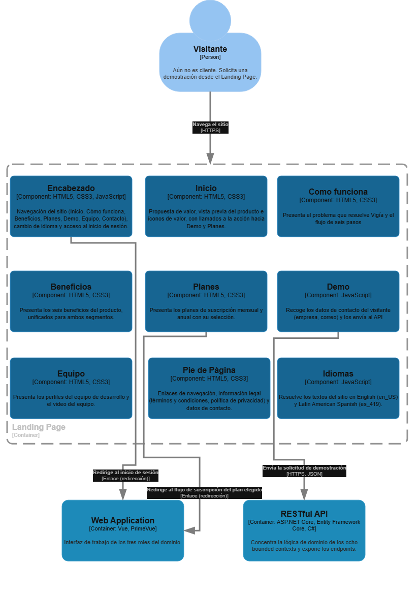

*Nota.* Elaborado por el equipo de Trazza Labs en draw.io, aplicando el C4 Model de Simon Brown. El formulario de demostración es el único componente con relación directa al RESTful API. El diagrama editable puede consultarse en: [C4-Model](https://drive.google.com/drive/folders/1ulaVldRC3op0fzlr8bJrSKF164jlX3jc?usp=sharing).

<!-- Fuente: report/chapters/chapter-4-product-design/4.7-software-object-oriented-design.md -->

## 4.7. Software Object-Oriented Design

En esta sección se detalla el diseño orientado a objetos del backend de la plataforma Vigía, modelado a partir de los conceptos estratégicos y tácticos identificados en el Design-Level EventStorming (sección 4.6.1) y el lenguaje ubicuo (Ubiquitous Language, sección 2.5).   El diseño se estructura bajo los principios de Domain-Driven Design (DDD) y la arquitectura limpia (Clean Architecture), adoptando el paradigma orientado a objetos sobre el lenguaje de programación C# (.NET 8). Los modelos de dominio encapsulan las reglas de negocio e invariantes críticas de cada Bounded Context, abstrayendo la persistencia y la infraestructura mediante contratos e interfaces desacopladas. Para cada contexto delimitado, se presentan las entidades raíz de agregado (Aggregate Roots), entidades secundarias, objetos de valor (Value Objects), enumeraciones (Enums) e interfaces de repositorios o servicios de dominio, garantizando una alta cohesión interna y bajo acoplamiento entre módulos.

<!-- Fuente: report/chapters/chapter-4-product-design/4.7.1-class-diagrams.md -->

## 4.7.1. Class Diagrams

A continuación, se presentan los diagramas de clases UML para cada uno de los Bounded Contexts que conforman el núcleo (Core) y soporte de la solución:

### 1. BC-01: Lead Management (Captación)
Este contexto administra las solicitudes de demostración originadas por los visitantes a través del Landing Page comercial antes de que exista un vínculo contractual formal.

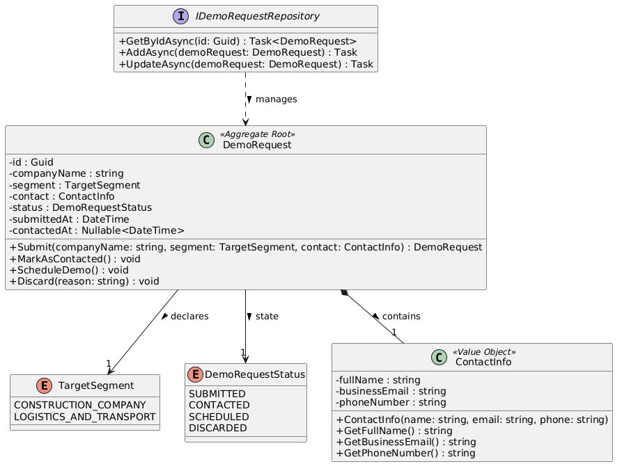

### 2. BC-02: Identity and Access Management (IAM)
Este contexto administra las organizaciones cliente, los usuarios autenticados, la asignación estricta de roles y el ciclo de vida de las invitaciones.

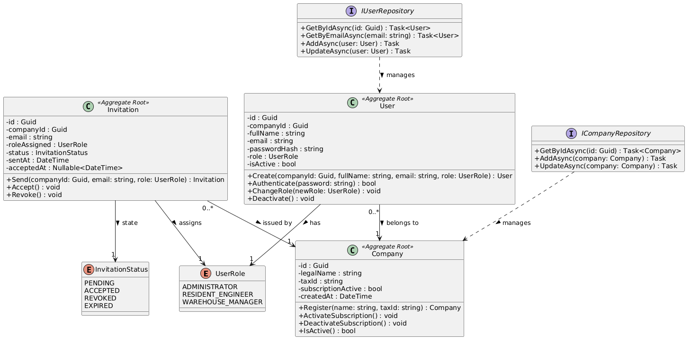

### 3. BC-03: Subscriptions and Payment (Suscripciones y Pagos)
Responde por la relación contractual, los planes SaaS, la facturación recurrente y la integración con la pasarela de pagos externa para autorizar el servicio a las empresas cliente registradas en BC-02.

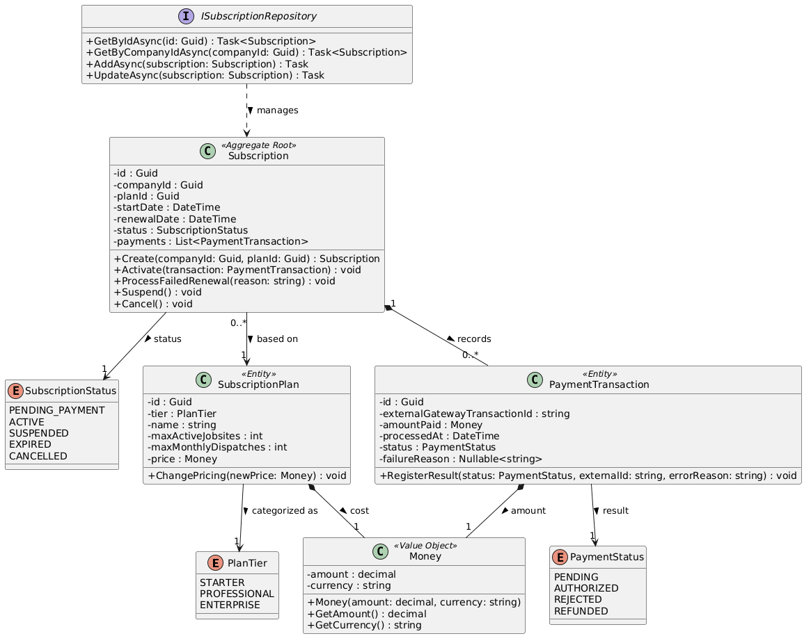

### 4. BC-04: Fleet and Device Management
Responde por el registro de los camiones de carga pesada, la vinculación unitaria de dispositivos telemáticos GPS y la delimitación de geocercas en almacenes y obras.

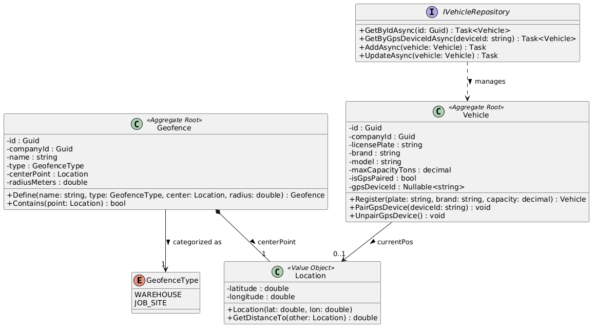

### 5. BC-05: Ordering and Dispatch
Gestiona el requerimiento de materiales, el desglose de ítems, el pesaje certificado en balanza de plataforma, la conformación de carga y la emisión de la guía de remisión que autoriza la salida del almacén central.

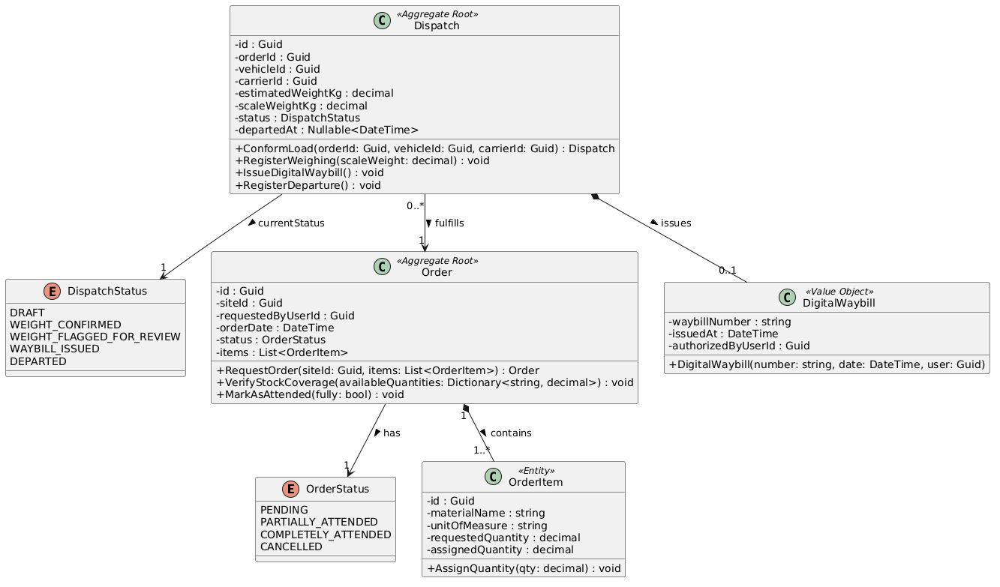

### 6. BC-06: Transit Traceability
Modela el recorrido satelital continuo de la unidad durante su tránsito, capturando los reportes telemáticos del dispositivo GPS sin intervención humana directa y registrando anomalías de ruta.

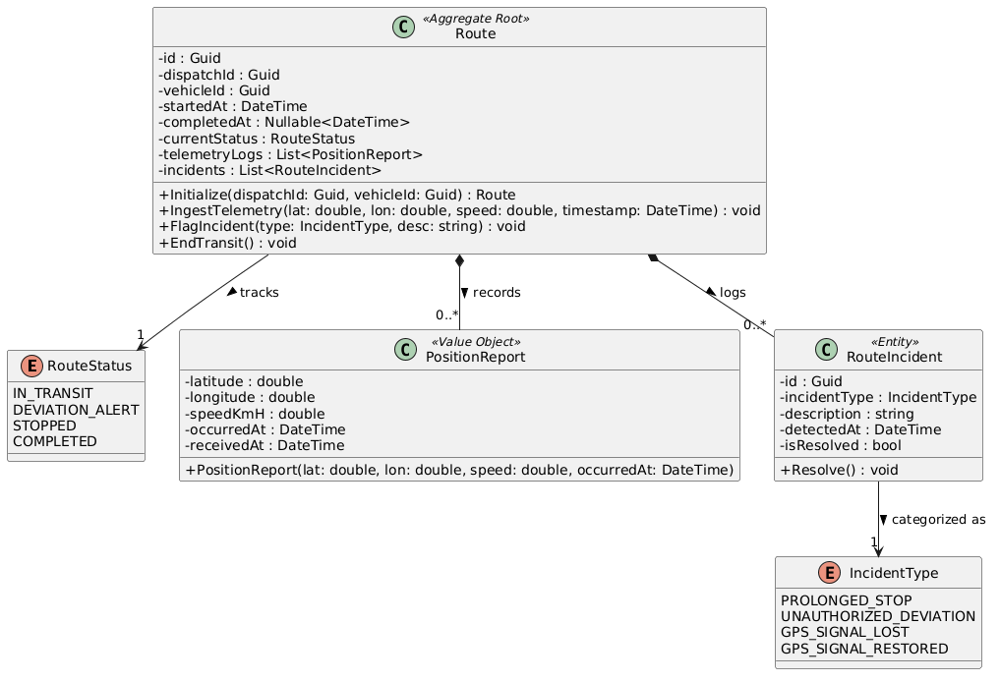

### 7. BC-07: Site Reception and Verification
Cubre la llegada de la unidad al frente de obra, el cotejo de materiales contra la guía digital de remisión y el registro fotográfico de evidencias ante faltantes o daños.

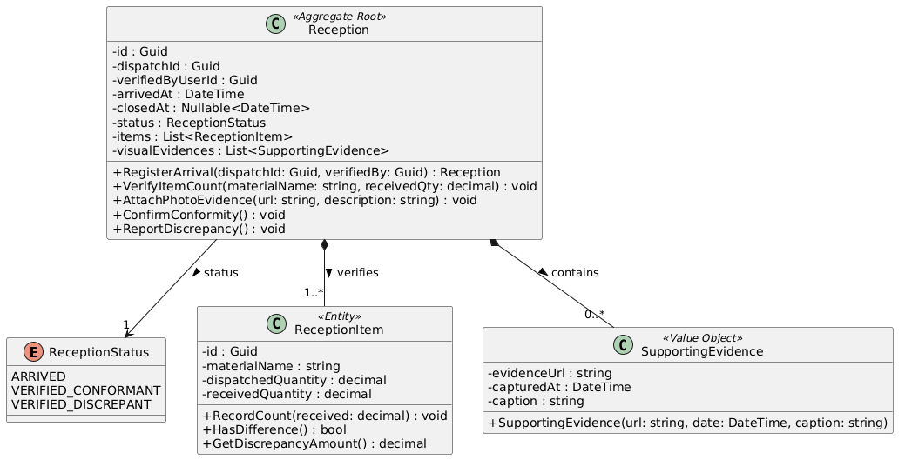

### 8. BC-08: Discrepancy and Evidence Management
Contexto que consolida los historiales del despacho, el trayecto satelital y la recepción en obra para generar el expediente probatorio, expedir el reporte de sustento y adjudicar formalmente la responsabilidad.

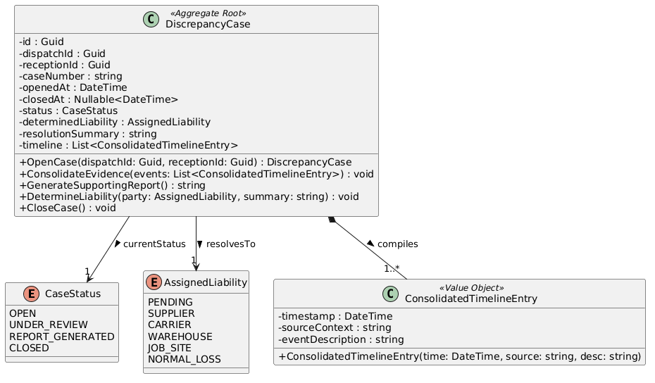


---

<!-- Fuente: report/chapters/chapter-5-product-implementation-validation-deployment/5-capitulo-v-product-implementation.md -->

## Capítulo V: Product Implementation, Validation & Deployment

En este capítulo el equipo documenta la implementación, validación y despliegue de los productos digitales de Vigía, a partir del Product Backlog de la sección 3.3 y de las decisiones de diseño del Capítulo IV. El capítulo se organiza en dos secciones internas: Software Configuration Management, que establece las bases de entorno, control de versiones, convenciones de código y configuración de despliegue comunes a todo el proyecto; y Landing Page, Services & Applications Implementation, que documenta cada Sprint del desarrollo, iniciando con el Sprint 1.

> **Nota sobre el alcance de esta entrega (AV1).** Conforme al enunciado del proyecto, el requisito de implementación para la entrega AV1 es que esté implementada y desplegada la primera versión del Landing Page. Por esa razón, el Sprint 1 documentado en este capítulo cubre únicamente las Landing Page Stories del Product Backlog (LP-01 a LP-04); el RESTful API y la Web Application se implementan a partir del Sprint 2, conforme al orden de prioridad establecido en la sección 3.3.

<!-- Fuente: report/chapters/chapter-5-product-implementation-validation-deployment/5.1-software-configuration-management.md -->

### 5.1. Software Configuration Management

En esta sección el equipo documenta las bases de configuración de software que sostienen el desarrollo de Vigía a lo largo de todo su ciclo de vida: el entorno de desarrollo, el esquema de control de versiones, la guía de estilo del código fuente y la configuración de despliegue. Estas decisiones se establecen desde el Sprint 1 y se amplían conforme el alcance del producto crece en los siguientes Sprints, en particular cuando se incorpore el RESTful API y la Web Application.

<!-- Fuente: report/chapters/chapter-5-product-implementation-validation-deployment/5.1.1-software-development-environment-configuration.md -->

#### 5.1.1. Software Development Environment Configuration

**Alcance en el Sprint 1.** Dado que el Sprint 1 implementa únicamente el Landing Page (sitio estático, sin RESTful API ni base de datos), el entorno de desarrollo configurado hasta esta entrega cubre solo lo necesario para ese alcance. La configuración del entorno para el RESTful API (ASP.NET Core, Entity Framework Core) y para la Web Application (Vue) se documentará a partir del Sprint en que se inicie su implementación, conforme al Product Backlog de la sección 3.3.

**Entorno configurado para el Landing Page.**

| Herramienta | Uso |
|---|---|
| Git | Control de versiones local, instalado en el equipo de cada integrante |
| GitHub | Alojamiento del repositorio y ejecución de GitHub Pages para el despliegue |
| IDE (JetBrains Rider / WebStorm, según integrante) | Edición del código HTML, CSS y JavaScript |
| Navegador web (Chrome/Edge) | Ejecución y verificación local del sitio, sin necesidad de un servidor de desarrollo, dado que el Landing Page es HTML5, CSS3 y JavaScript puro sin paso de compilación |
| Google Fonts (CDN) | Dependencia externa para la tipografía Inter definida en la sección 4.1.1; requiere conexión a internet durante el desarrollo y en producción |

No se requiere gestor de paquetes ni herramienta de build para el Sprint 1, dado que el Landing Page se implementó como HTML5, CSS3 y JavaScript sin frameworks, conforme a lo indicado en la sección de Tecnología del enunciado del proyecto. Esta decisión también simplifica su despliegue directo en GitHub Pages.

<!-- Fuente: report/chapters/chapter-5-product-implementation-validation-deployment/5.1.2-source-code-management.md -->

#### 5.1.2. Source Code Management

El equipo utiliza GIT gestionado desde GitHub, bajo la organización `upc-pre-202620-1asi0730-8084-Developers`, con dos repositorios diferenciados según lo indicado en la sección de Tecnología del enunciado del proyecto:

| Repositorio | Contenido | URL |
|---|---|---|
| Vigia-Report | Informe del proyecto (este documento), en Markdown | https://github.com/upc-pre-202620-1asi0730-8084-Developers/Vigia-Report |
| vigia-landing | Código fuente del Landing Page | https://github.com/upc-pre-202620-1asi0730-8084-Developers/vigia-landing |

**GitFlow Workflow.** El repositorio Vigia-Report aplica GitFlow desde el inicio del proyecto: la rama `main` conserva el historial estable, la rama `develop` integra el trabajo en curso, y cada integrante desarrolla en una rama `feature/<nombre>` propia que se integra a `develop` mediante Pull Request. A la fecha de esta entrega, el repositorio registra las ramas `feature/Sandoval`, `feature/leonardo`, `feature/Apaza` y `feature/Cardenas`, y los Pull Requests #7, #8, #9 y #10 ya fueron revisados y fusionados a `develop`.

El repositorio vigia-landing, al cubrir únicamente la primera versión del Landing Page en un solo Sprint, se mantiene por ahora sobre la rama `main`; el esquema de ramas por feature se incorporará a partir del Sprint 2, cuando el desarrollo del sitio continúe en paralelo con el de la Web Application.

**Conventional Commits.** El equipo redacta los mensajes de commit indicando el tipo de cambio al inicio del mensaje (por ejemplo, `docs:`, `chore:`). Se identifica como punto de mejora para el siguiente Sprint estandarizar el tipo en minúscula y ajustarlo estrictamente al catálogo de Conventional Commits (`feat`, `fix`, `docs`, `chore`, `refactor`, entre otros), dado que en el historial actual conviven variantes como `Add:` o `Doc:` que no siguen la convención de forma exacta.

**Semantic Versioning.** Aún no se han creado tags de versión en ninguno de los dos repositorios. Para el Sprint 2 se adoptará el esquema `MAJOR.MINOR.PATCH`, etiquetando la versión actualmente desplegada del Landing Page como `v0.1.0` (primera versión funcional, previa a la version 1.0.0 que corresponderá al lanzamiento comercial).

**Evidencia de aportes del equipo.** El siguiente cuadro resume los commits registrados en el repositorio Vigia-Report a la fecha de esta entrega, como evidencia de que todos los integrantes participan en la elaboración del informe, conforme lo exige el enunciado:

| Autor (usuario de GitHub) | Commits |
|---|---|
| Leonardo Lopez / Deiko-138 | 39 |
| ApazaEN | 27 |
| FabianSandovalCueto / JFabianSandoval | 20 |
| eliocerdan | 9 |
| Usuario353 | 8 |

<!-- Fuente: report/chapters/chapter-5-product-implementation-validation-deployment/5.1.3-source-code-style-guide-and-conventions.md -->

#### 5.1.3. Source Code Style Guide & Conventions

Para el código del Landing Page (HTML5, CSS3 y JavaScript), implementado en el repositorio vigia-landing, el equipo adopta las siguientes convenciones:

**Organización de archivos.** El sitio se estructura en tres archivos separados por responsabilidad —`index.html` (estructura y contenido), `styles.css` (presentación) y `script.js` (comportamiento)—, más una carpeta `assets/` para imágenes, publicados dentro de una carpeta `docs/` en la raíz del repositorio para su despliegue directo mediante GitHub Pages.

**HTML.** Se utilizan elementos semánticos (`header`, `nav`, `section`, `footer`) en lugar de `div` genéricos, con un atributo `id` por sección que coincide con el ancla usada en la navegación (por ejemplo, `id="demo"` para la sección enlazada desde `href="#demo"`), y atributos `alt` en toda imagen informativa.

**CSS.** Las clases se nombran en minúsculas separadas por guion (kebab-case), con un prefijo corto por componente (`.hero-*`, `.plan-*`, `.t-*` para las tarjetas del equipo), evitando IDs para aplicar estilos. Los valores de color, espaciado y tipografía no se escriben como literales sueltos: se centralizan como variables CSS (`--color-primary`, `--sp-4`, etc.) definidas en `:root`, siguiendo directamente los tokens del Design System de la sección 4.1.1, de modo que un cambio de marca solo requiera modificar esas variables. Las media queries siguen un enfoque mobile-first para la Web Application y desktop-first para el Landing Page, conforme a lo definido en la sección 4.1.2.

**JavaScript.** El script se encapsula en una única función autoejecutable (IIFE) para no exponer variables globales, usa `camelCase` para variables y funciones, y evita dependencias externas: la validación del formulario de demo, el menú móvil y el resaltado de la sección activa en el menú se implementan con JavaScript nativo (ES5, sin transpilación), suficiente para el alcance estático del Sprint 1.

<!-- Fuente: report/chapters/chapter-5-product-implementation-validation-deployment/5.1.4-software-deployment-configuration.md -->

#### 5.1.4. Software Deployment Configuration

El Landing Page de Vigía se despliega mediante **GitHub Pages**, directamente desde el repositorio vigia-landing, sin un pipeline de integración continua independiente por tratarse de un sitio estático sin paso de compilación.

**Configuración aplicada.**

| Parámetro | Valor |
|---|---|
| Repositorio | `upc-pre-202620-1asi0730-8084-Developers/vigia-landing` |
| Rama de despliegue | `main` |
| Carpeta publicada | `/docs` |
| Archivo `.nojekyll` | Presente en `docs/`, para que GitHub Pages sirva los archivos tal cual, sin procesarlos con Jekyll |
| URL de producción | https://upc-pre-202620-1asi0730-8084-developers.github.io/vigia-landing/ |

**Proceso de despliegue actual.** El despliegue es automático a nivel de publicación (GitHub Pages reconstruye el sitio en cada push a `main` sobre la carpeta `/docs`), pero manual a nivel de integración: cada integrante hace `git push` directamente a `main` en este repositorio, dado que el Sprint 1 comprende un único entregable (el Landing Page) sin ramas paralelas en desarrollo todavía.

<!-- Fuente: report/chapters/chapter-5-product-implementation-validation-deployment/5.2-landing-page-services-and-applications-implementation.md -->

### 5.2. Landing Page, Services & Applications Implementation

En esta sección el equipo documenta, Sprint a Sprint, la implementación del Landing Page, del RESTful API y de la Web Application de Vigía. Cada Sprint incluye su planificación, los líderes y colaboradores por aspecto, el Sprint Backlog y la evidencia de desarrollo, ejecución, documentación de servicios, despliegue y colaboración del equipo.

Conforme al alcance de la entrega AV1 (sección 5), esta sección documenta únicamente el **Sprint 1**, correspondiente a la primera versión del Landing Page. El Sprint 2 iniciará el desarrollo del RESTful API y de la Web Application, siguiendo el orden establecido en el Product Backlog de la sección 3.3.

<!-- Fuente: report/chapters/chapter-5-product-implementation-validation-deployment/5.2.1-sprint-1/5.2.1-sprint-1.md -->

#### 5.2.1. Sprint 1

**Duración:** 01 de septiembre de 2026 – 18 de septiembre de 2026 (según el historial de commits del repositorio Vigia-Report y del repositorio vigia-landing).

**Objetivo del Sprint:** Implementar y desplegar la primera versión del Landing Page de Vigía, cubriendo la propuesta de valor del producto, los beneficios diferenciados por segmento objetivo y el formulario de solicitud de demostración, para cumplir el requisito de implementación de la entrega AV1.

Esta sección documenta el Sprint Planning, los líderes y colaboradores por aspecto, el Sprint Backlog y la evidencia de desarrollo, ejecución, documentación de servicios, despliegue y colaboración del equipo durante el Sprint.

<!-- Fuente: report/chapters/chapter-5-product-implementation-validation-deployment/5.2.1-sprint-1/5.2.1.1-sprint-planning-1.md -->

##### 5.2.1.1. Sprint Planning 1

| Campo | Detalle |
|---|---|
| Sprint | 1 |
| Duración | 01/09/2026 – 18/09/2026 |
| Sprint Goal | Implementar y desplegar la primera versión del Landing Page de Vigía, para cumplir el requisito de implementación de la entrega AV1. |
| Definition of Done del Sprint | El Landing Page está desplegado en una URL pública, responsive (desktop y mobile), con los textos e identidad visual del Design System de la sección 4.1, y el formulario de contacto valida los campos requeridos antes de confirmar el envío. |

**Historias comprometidas.** Del Product Backlog de la sección 3.3, se comprometieron las cuatro Landing Page Stories, por ser las que generan valor comercial inmediato sin depender de ningún otro componente, conforme a lo indicado en el enunciado del proyecto:

| # (Orden en el Backlog) | User Story Id | Título | Story Points |
|---|---|---|---|
| 1 | LP-01 | Página de inicio con la propuesta de valor | 2 |
| 2 | LP-02 | Sección para el segmento de empresas constructoras | 2 |
| 3 | LP-03 | Sección para el segmento de logística y transporte | 2 |
| 4 | LP-04 | Formulario de solicitud de demostración | 3 |

**Total comprometido:** 9 Story Points.

**Historia diferida.** TS-06 (Endpoint de solicitud de demostración) se excluye deliberadamente del Sprint 1: al no existir todavía el RESTful API, el formulario de LP-04 valida los datos en el propio navegador pero no los envía a un servicio real. TS-06 se retoma en el Sprint en que se implemente el RESTful API, momento en el cual el formulario del Landing Page se conectará a ese endpoint.

<!-- Fuente: report/chapters/chapter-5-product-implementation-validation-deployment/5.2.1-sprint-1/5.2.1.2-aspect-leaders-and-collaborators.md -->

##### 5.2.1.2. Aspect Leaders and Collaborators

| Aspecto | Líder | Colaboradores |
|---|---|---|
| Landing Page (UI/Frontend) | Elías (UX/UI y Frontend) | Leonardo Lopez |
| Investigación y contenido por segmento | Elizabeth (Investigación y negocio) | Mathias |
| Documentación del informe (Vigia-Report) | Leonardo Lopez (Documentación y soporte) | Todo el equipo |
| Coordinación general y arquitectura | Fabián Sandoval (Team Leader) | Todo el equipo |

<!-- Fuente: report/chapters/chapter-5-product-implementation-validation-deployment/5.2.1-sprint-1/5.2.1.3-sprint-backlog-1.md -->

##### 5.2.1.3. Sprint Backlog 1

| User Story Id | Título | Story Points | Estado | Evidencia |
|---|---|---|---|---|
| LP-01 | Página de inicio con la propuesta de valor | 2 | Completada | Sección "Inicio" en https://upc-pre-202620-1asi0730-8084-developers.github.io/vigia-landing/ |
| LP-02 | Sección para el segmento de empresas constructoras | 2 | Completada | Sección "Cómo funciona" / "Beneficios" del Landing Page desplegado |
| LP-03 | Sección para el segmento de logística y transporte | 2 | Completada | Sección "Beneficios" del Landing Page desplegado |
| LP-04 | Formulario de solicitud de demostración | 3 | Completada (validación en cliente; envío real pendiente de TS-06) | Sección "Demo" del Landing Page desplegado |

**Story Points completados:** 9 / 9 comprometidos (100%).

**Tareas técnicas derivadas (no forman parte del Product Backlog, se gestionan a nivel de Sprint):**

| Tarea | Responsable | Estado |
|---|---|---|
| Definir estructura de archivos (`index.html`, `styles.css`, `script.js`, `docs/`) | Landing Page (Elías) | Completada |
| Aplicar Design System de la sección 4.1 (colores, tipografía, componentes) | Landing Page (Elías) | Completada |
| Implementar validación de formulario y menú responsive en JavaScript | Landing Page (Elías) | Completada |
| Configurar despliegue en GitHub Pages (`/docs`, `.nojekyll`) | Leonardo Lopez | Completada |
| Redactar la documentación del Sprint en el informe | Leonardo Lopez | Completada |

<!-- Fuente: report/chapters/chapter-5-product-implementation-validation-deployment/5.2.1-sprint-1/5.2.1.4-development-evidence-for-sprint-review.md -->

##### 5.2.1.4. Development Evidence for Sprint Review

El código fuente del Landing Page se encuentra en el repositorio [vigia-landing](https://github.com/upc-pre-202620-1asi0730-8084-Developers/vigia-landing), en la carpeta `docs/`, organizado en `index.html`, `styles.css`, `script.js` y `assets/`. El commit `689c72f` ("chore: initial commit") registra la primera versión completa del sitio.

El código aplica directamente los tokens de diseño definidos en la sección 4.1.1 mediante variables CSS (`--color-primary`, `--color-accent`, `--sp-*` para el espaciado de 8px), de modo que la hoja de estilos sea la fuente única de verdad del Design System para este producto.

**`styles.css`** — hoja de estilos completa del Landing Page, con las variables del Design System (`:root`), los componentes reutilizables y las media queries responsivas:

```css
```css
* {
  box-sizing: border-box;
  margin: 0;
  padding: 0;
}

html {
  scroll-behavior: smooth;
}

body {
  font-family: Arial, sans-serif;
  color: #1E2A3B;
  background: #FFFFFF;
  line-height: 1.55;
  overflow-x: hidden;
}

img {
  max-width: 100%;
  display: block;
}

a {
  color: inherit;
  text-decoration: none;
}

button {
  font: inherit;
  cursor: pointer;
  border: 0;
  background: none;
  color: inherit;
}

ul,
ol {
  list-style: none;
}

.container {
  width: 100%;
  max-width: 1240px;
  margin: 0 auto;
  padding: 0 24px;
  position: relative;
  z-index: 1;
}


/* =========================
   DECORACIONES
   ========================= */

.deco {
  position: absolute;
  width: 70px;
  height: 130px;
  background: #F5A623;
  clip-path: polygon(45% 0, 100% 0, 55% 100%, 0 100%);
  z-index: 0;
  pointer-events: none;
}

.deco-hero-1 {
  top: 4%;
  right: 6%;
  opacity: 0.9;
}

.deco-hero-2 {
  bottom: 6%;
  right: 20%;
  width: 46px;
  height: 90px;
  opacity: 0.55;
}

.deco-problem-1 {
  top: -2%;
  right: 8%;
  width: 60px;
  height: 110px;
}

.deco-problem-2 {
  top: 30%;
  right: 2%;
  width: 40px;
  height: 80px;
  opacity: 0.6;
}

.deco-benefits-1 {
  top: 6%;
  right: 4%;
}

.deco-benefits-2 {
  top: 32%;
  right: 0;
  width: 40px;
  height: 80px;
  opacity: 0.55;
}

.deco-plans {
  bottom: 4%;
  right: 12%;
  width: 50px;
  height: 100px;
  opacity: 0.8;
}

.deco-demo {
  top: -14px;
  right: 40px;
  width: 40px;
  height: 70px;
}

.deco-footer {
  bottom: 0;
  left: -20px;
  width: 130px;
  height: 60px;
  clip-path: polygon(30% 0, 100% 0, 70% 100%, 0 100%);
}


/* =========================
   ELEMENTOS REUTILIZABLES
   ========================= */

.eyebrow {
  font-size: 12px;
  font-weight: 700;
  letter-spacing: 2px;
  color: #6B7686;
  text-transform: uppercase;
  position: relative;
  padding-left: 28px;
  margin-bottom: 16px;
}

.eyebrow::before {
  content: "";
  position: absolute;
  left: 0;
  top: 50%;
  transform: translateY(-50%);
  width: 20px;
  height: 3px;
  background: #F5A623;
  border-radius: 2px;
}

.strip-dash {
  display: inline-block;
  width: 20px;
  height: 3px;
  background: #F5A623;
  border-radius: 2px;
  margin-right: 10px;
  vertical-align: middle;
}

.section-title {
  font-size: 44px;
  font-weight: 800;
  color: #14273F;
  line-height: 1.12;
  letter-spacing: -0.5px;
  margin-bottom: 16px;
}

.section-title .accent {
  color: #F5A623;
}

.section-desc {
  color: #6B7686;
  font-size: 16px;
  max-width: 680px;
  margin-bottom: 48px;
}

.section {
  padding: 96px 0;
  position: relative;
  overflow: hidden;
}


/* =========================
   BOTONES
   ========================= */

.btn {
  display: inline-flex;
  align-items: center;
  justify-content: center;
  gap: 8px;
  padding: 14px 24px;
  border-radius: 10px;
  font-weight: 700;
  font-size: 15px;
  transition: 0.15s;
  white-space: nowrap;
}

.btn:active {
  transform: translateY(1px);
}

.btn .arrow {
  transition: 0.15s;
}

.btn:hover .arrow {
  transform: translateX(3px);
}

.btn-primary {
  background: #F5A623;
  color: #17233A;
  box-shadow: 0 6px 16px rgba(245, 166, 35, 0.35);
}

.btn-primary:hover {
  background: #E0961B;
}

.btn-outline {
  border: 1.5px solid #14273F;
  color: #14273F;
  padding: 10px 20px;
  font-weight: 600;
}

.btn-outline:hover {
  background: #14273F;
  color: #FFFFFF;
}

.btn-ghost {
  border: 1.5px solid #D8DEE8;
  color: #14273F;
  font-weight: 600;
}

.btn-ghost:hover {
  border-color: #14273F;
}

.btn-block {
  width: 100%;
  padding: 16px;
}


/* =========================
   PUNTOS
   ========================= */

.dot {
  display: inline-block;
  width: 8px;
  height: 8px;
  border-radius: 50%;
  margin-right: 6px;
  vertical-align: middle;
}

.dot.green {
  background: #2E7D32;
}

.dot.amber {
  background: #F5A623;
}


/* =========================
   HEADER
   ========================= */

.site-header {
  position: sticky;
  top: 0;
  z-index: 50;
  background: #FFFFFF;
  border-bottom: 1px solid #E7EAF0;
}

.header-inner {
  display: flex;
  align-items: center;
  gap: 24px;
  padding: 14px 0;
}

.brand {
  display: flex;
  align-items: flex-end;
  gap: 10px;
}

.brand-name {
  font-size: 26px;
  font-weight: 800;
  color: #14273F;
  letter-spacing: -1px;
  position: relative;
}

.brand-name::after {
  content: "";
  position: absolute;
  right: -18px;
  top: 55%;
  width: 14px;
  height: 3px;
  background: #F5A623;
}

.brand-tag {
  font-size: 8px;
  font-weight: 700;
  letter-spacing: 1.5px;
  color: #6B7686;
  line-height: 1.25;
  padding-left: 6px;
}

.main-nav {
  display: flex;
  align-items: center;
  gap: 24px;
  margin-left: auto;
}

.nav-link {
  font-size: 14px;
  font-weight: 500;
  color: #1E2A3B;
  padding: 6px 2px;
  position: relative;
}

.nav-link:hover {
  color: #14273F;
}

.nav-link.active {
  color: #14273F;
  font-weight: 700;
}

.nav-link.active::after {
  content: "";
  position: absolute;
  left: 0;
  right: 0;
  bottom: -4px;
  height: 3px;
  background: #F5A623;
  border-radius: 2px;
}

.header-actions {
  display: flex;
  align-items: center;
  gap: 16px;
}

.lang-switch {
  display: flex;
  align-items: center;
  gap: 4px;
  font-size: 13px;
  font-weight: 600;
}

.lang-btn {
  color: #6B7686;
  padding: 4px 6px;
}

.lang-btn.active {
  color: #14273F;
}

.lang-sep {
  color: #E7EAF0;
}

.menu-toggle {
  display: none;
  width: 36px;
  height: 36px;
  flex-direction: column;
  align-items: center;
  justify-content: center;
  gap: 4px;
}

.menu-toggle span {
  width: 20px;
  height: 2px;
  background: #14273F;
  border-radius: 1px;
}


/* =========================
   HERO
   ========================= */

.hero {
  position: relative;
  overflow: hidden;
  background: #F9FBFD;
}

.hero-inner {
  display: grid;
  grid-template-columns: 1fr 1.3fr;
  gap: 48px;
  padding: 96px 0 48px;
  align-items: center;
}

.hero-title {
  font-size: 58px;
  font-weight: 800;
  line-height: 1.08;
  letter-spacing: -1.2px;
  margin: 16px 0 24px;
}

.hero-title .ink {
  color: #10192B;
}

.hero-title .accent {
  color: #F5A623;
}

.hero-desc {
  color: #6B7686;
  font-size: 17px;
  max-width: 460px;
  margin-bottom: 32px;
}

.hero-cta {
  display: flex;
  gap: 16px;
  margin-bottom: 48px;
  flex-wrap: wrap;
}

.hero-highlights {
  display: grid;
  grid-template-columns: repeat(3, 1fr);
  gap: 16px;
  color: #6B7686;
  font-size: 13px;
  font-weight: 600;
  margin-bottom: 32px;
  max-width: 460px;
}

.hero-highlights li {
  display: flex;
  align-items: flex-start;
  gap: 8px;
}

.hero-highlights .hh-ico {
  display: inline-flex;
  align-items: center;
  justify-content: center;
  width: 34px;
  height: 34px;
  border-radius: 50%;
  background: #FFFFFF;
  box-shadow: 0 1px 2px rgba(15, 27, 46, 0.06);
  font-size: 15px;
  flex: none;
}

.hero-highlights small {
  display: block;
  font-weight: 400;
  color: #6B7686;
}

.hero-strip {
  color: #6B7686;
  font-size: 11px;
  font-weight: 700;
  letter-spacing: 2px;
  display: flex;
  align-items: center;
}


/* =========================
   HERO VISUAL
   ========================= */

.hero-visual {
  position: relative;
  padding-top: 24px;
}

.watermark {
  position: absolute;
  right: 6px;
  bottom: -6px;
  font-size: 12px;
  font-weight: 700;
  letter-spacing: 2px;
  color: #6B7686;
  opacity: 0.35;
}

.laptop {
  position: relative;
  margin: 0 auto;
  max-width: 620px;
}

.laptop-screen {
  background: #0E1C30;
  border-radius: 14px 14px 4px 4px;
  padding: 10px 10px 0;
  box-shadow: 0 30px 70px rgba(15, 27, 46, 0.22);
}

.mockup {
  display: grid;
  grid-template-columns: 150px 1fr;
  background: #14273F;
  border-radius: 6px 6px 0 0;
  overflow: hidden;
}

.mockup-side {
  background: #0F2038;
  padding: 16px 8px;
}

.mockup-brand {
  font-weight: 800;
  font-size: 14px;
  color: #FFFFFF;
  margin-bottom: 16px;
}

.mockup-brand span {
  display: block;
  font-size: 6px;
  font-weight: 600;
  color: #8E9DB2;
  letter-spacing: 1px;
  margin-top: 2px;
}

.mockup-menu li {
  padding: 7px 8px;
  border-radius: 6px;
  font-size: 11px;
  color: #A9B7C9;
  margin-bottom: 2px;
}

.mockup-menu li.active {
  background: #F5A623;
  color: #1E2A3B;
  font-weight: 700;
}

.mockup-main {
  background: #FFFFFF;
  color: #1E2A3B;
  padding: 16px;
}

.mockup-topbar {
  display: flex;
  justify-content: space-between;
  align-items: center;
  gap: 8px;
  font-size: 10px;
  color: #6B7686;
  margin-bottom: 16px;
}

.search-box {
  flex: 1;
  background: #F7F8FA;
  padding: 6px 10px;
  border-radius: 6px;
  overflow: hidden;
  text-overflow: ellipsis;
  white-space: nowrap;
}

.user-chip {
  white-space: nowrap;
}

.mockup-h {
  font-size: 14px;
  margin-bottom: 8px;
  color: #14273F;
}

.mockup-table {
  width: 100%;
  border-collapse: collapse;
  font-size: 10px;
}

.mockup-table th,
.mockup-table td {
  text-align: left;
  padding: 6px 4px;
  border-bottom: 1px solid #E7EAF0;
}

.mockup-table th {
  color: #6B7686;
  font-weight: 600;
}

.laptop-base {
  height: 16px;
  background: #B8BEC8;
  border-radius: 0 0 10px 10px;
  position: relative;
  box-shadow: 0 6px 12px rgba(15, 27, 46, 0.18);
}

.laptop-notch {
  position: absolute;
  left: 50%;
  top: 0;
  transform: translateX(-50%);
  width: 70px;
  height: 6px;
  background: #9AA2B0;
  border-radius: 0 0 8px 8px;
}

.flow-cards {
  display: flex;
  align-items: center;
  justify-content: space-between;
  gap: 8px;
  margin-top: 32px;
  flex-wrap: wrap;
}

.fc {
  flex: 1;
  min-width: 130px;
  background: #FFFFFF;
  border-radius: 10px;
  padding: 16px;
  box-shadow: 0 1px 2px rgba(15, 27, 46, 0.06);
  display: flex;
  flex-direction: column;
}

.fc span {
  font-size: 22px;
  margin-bottom: 4px;
}

.fc b {
  font-size: 13px;
  color: #14273F;
}

.fc small {
  font-size: 11px;
  color: #6B7686;
}

.flow-cards > .arrow {
  font-size: 18px;
  color: #6B7686;
}


/* =========================
   PROBLEMA
   ========================= */

.problem {
  background: #F7FAFD;
}

.problem-head {
  display: flex;
  justify-content: space-between;
  align-items: flex-start;
  gap: 32px;
}

.side-tag {
  font-size: 11px;
  font-weight: 800;
  letter-spacing: 1.5px;
  color: #6B7686;
  text-align: right;
  border-left: 3px solid #F5A623;
  padding-left: 16px;
  white-space: nowrap;
  margin-top: 8px;
}

.problem-cards {
  display: grid;
  grid-template-columns: repeat(3, 1fr);
  gap: 24px;
  margin-bottom: 96px;
}

.p-card {
  background: #FFFFFF;
  border-radius: 16px;
  padding: 32px;
  box-shadow: 0 1px 2px rgba(15, 27, 46, 0.06);
}

.p-ico {
  width: 56px;
  height: 56px;
  border-radius: 50%;
  background: #FDECC8;
  color: #14273F;
  display: flex;
  align-items: center;
  justify-content: center;
  font-size: 22px;
  margin-bottom: 16px;
}

.p-card h3 {
  font-size: 18px;
  color: #14273F;
  margin-bottom: 8px;
}

.p-card p {
  color: #6B7686;
  font-size: 14px;
}

.how-block {
  margin-top: 48px;
}

.steps {
  display: flex;
  align-items: stretch;
  gap: 8px;
  margin-top: 24px;
  flex-wrap: wrap;
}

.steps li:not(.step-arrow) {
  flex: 1;
  min-width: 130px;
  background: #FFFFFF;
  border-radius: 16px;
  padding: 16px;
  text-align: left;
  border: 1px solid #E7EAF0;
}

.step-arrow {
  display: flex;
  align-items: center;
  color: #6B7686;
  font-size: 16px;
}

.step-num {
  display: inline-flex;
  align-items: center;
  justify-content: center;
  width: 24px;
  height: 24px;
  border-radius: 50%;
  background: #F5A623;
  color: #1E2A3B;
  font-weight: 800;
  font-size: 12px;
  margin-bottom: 8px;
}

.step-ico {
  display: block;
  font-size: 20px;
  margin-bottom: 4px;
}

.steps b {
  display: block;
  color: #14273F;
  font-size: 13px;
  margin-bottom: 4px;
}

.steps small {
  color: #6B7686;
  font-size: 11px;
}


/* =========================
   BENEFICIOS
   ========================= */

.benefits {
  background: #FFFFFF;
}

.benefit-grid {
  display: grid;
  grid-template-columns: repeat(3, 1fr);
  gap: 24px;
}

.b-card {
  background: #FFFFFF;
  border-radius: 16px;
  padding: 32px;
  box-shadow: 0 1px 2px rgba(15, 27, 46, 0.06);
  border: 1px solid #E7EAF0;
  transition: 0.2s;
}

.b-card:hover {
  transform: translateY(-4px);
  box-shadow: 0 10px 30px rgba(15, 27, 46, 0.10);
}

.b-ico {
  width: 56px;
  height: 56px;
  border-radius: 50%;
  background: #FDECC8;
  color: #14273F;
  display: flex;
  align-items: center;
  justify-content: center;
  font-size: 22px;
  margin-bottom: 16px;
}

.b-card h3 {
  font-size: 18px;
  color: #14273F;
  margin-bottom: 8px;
}

.b-card p {
  color: #6B7686;
  font-size: 14px;
}

.section-strip {
  color: #6B7686;
  font-size: 12px;
  font-weight: 700;
  letter-spacing: 1.5px;
  margin-top: 48px;
  display: flex;
  align-items: center;
  gap: 10px;
  flex-wrap: wrap;
}

.section-strip .right {
  margin-left: auto;
}


/* =========================
   DEMO
   ========================= */

.demo {
  background: #EEF3F8;
}

.demo-inner {
  display: grid;
  grid-template-columns: 1fr 1fr;
  gap: 48px;
  align-items: start;
}

.demo-features {
  display: grid;
  gap: 16px;
  margin: 24px 0 32px;
}

.demo-features li {
  display: flex;
  gap: 16px;
  align-items: flex-start;
}

.df-ico {
  width: 40px;
  height: 40px;
  border-radius: 50%;
  background: #FFFFFF;
  box-shadow: 0 1px 2px rgba(15, 27, 46, 0.06);
  display: flex;
  align-items: center;
  justify-content: center;
  font-size: 16px;
  flex: none;
}

.demo-features b {
  display: block;
  color: #14273F;
  font-size: 15px;
  margin-bottom: 2px;
}

.demo-features small {
  color: #6B7686;
  font-size: 13px;
}

.demo-card {
  position: relative;
  background: #FFFFFF;
  border-radius: 16px;
  box-shadow: 0 10px 30px rgba(15, 27, 46, 0.10);
  overflow: hidden;
}

.demo-mock {
  padding: 32px;
  background: #17253C;
  color: #FFFFFF;
  position: relative;
}

.demo-mock h3 {
  font-size: 22px;
  margin-bottom: 6px;
}

.demo-mock p {
  color: #B9C4D3;
  font-size: 14px;
}

.demo-mock .duration {
  font-size: 12px;
  margin-top: 16px;
}

.demo-preview {
  margin-top: 24px;
  background: rgba(255, 255, 255, 0.06);
  border-radius: 10px;
  padding: 24px;
  display: grid;
  gap: 10px;
}

.skeleton-line {
  display: block;
  height: 10px;
  border-radius: 6px;
  background: rgba(255, 255, 255, 0.18);
}

.skeleton-line.w80 {
  width: 80%;
}

.skeleton-line.w60 {
  width: 60%;
}

.skeleton-line.w40 {
  width: 40%;
}

.demo-play {
  position: absolute;
  inset: 0;
  display: flex;
  align-items: center;
  justify-content: center;
  pointer-events: none;
}

.demo-play .play-btn {
  pointer-events: auto;
}

.play-btn {
  width: 48px;
  height: 48px;
  border-radius: 50%;
  background: #FFFFFF;
  box-shadow: 0 10px 30px rgba(15, 27, 46, 0.10);
  color: #14273F;
  font-size: 18px;
  display: inline-flex;
  align-items: center;
  justify-content: center;
}

.demo-form {
  padding: 32px;
}

.field-row {
  display: grid;
  grid-template-columns: 1fr 1fr;
  gap: 16px;
}

.field {
  margin-bottom: 16px;
}

.field label {
  display: block;
  font-size: 13px;
  font-weight: 600;
  color: #14273F;
  margin-bottom: 6px;
}

.field input {
  width: 100%;
  padding: 12px 14px;
  border: 1px solid #E7EAF0;
  border-radius: 10px;
  font: inherit;
  font-size: 14px;
  color: #1E2A3B;
  background: #F7F8FA;
}

.field input:focus {
  outline: none;
  border-color: #14273F;
  background: #FFFFFF;
}

.field input.invalid {
  border-color: #D32F2F;
}

.form-notes {
  display: grid;
  gap: 6px;
  margin-top: 16px;
  font-size: 12px;
  color: #6B7686;
}

.form-status {
  margin-top: 8px;
  font-size: 13px;
}

.form-status.ok {
  color: #2E7D32;
}

.form-status.err {
  color: #D32F2F;
}

.demo-tagline {
  text-align: right;
  font-weight: 800;
  font-size: 13px;
  letter-spacing: 0.5px;
  color: #14273F;
  padding: 0 32px 24px;
  line-height: 1.3;
}


/* =========================
   PLANES
   ========================= */

.plans {
  background: #FFFFFF;
}

.plan-grid {
  display: grid;
  grid-template-columns: repeat(2, 1fr);
  gap: 24px;
  max-width: 900px;
}

.plan-card {
  background: #FFFFFF;
  border-radius: 16px;
  padding: 32px;
  border: 1px solid #E7EAF0;
  box-shadow: 0 1px 2px rgba(15, 27, 46, 0.06);
  transition: 0.2s;
}

.plan-card:hover {
  box-shadow: 0 10px 30px rgba(15, 27, 46, 0.10);
  transform: translateY(-4px);
}

.plan-ico {
  width: 52px;
  height: 52px;
  border-radius: 50%;
  background: #FDECC8;
  color: #14273F;
  display: flex;
  align-items: center;
  justify-content: center;
  font-size: 22px;
  margin-bottom: 16px;
}

.plan-card h3 {
  color: #14273F;
  font-size: 22px;
  margin-bottom: 8px;
}

.plan-desc {
  color: #6B7686;
  font-size: 14px;
  margin-bottom: 24px;
}

.plan-price {
  display: flex;
  align-items: baseline;
  gap: 6px;
  color: #14273F;
  margin-bottom: 16px;
}

.plan-price .cur {
  font-size: 20px;
  font-weight: 700;
}

.plan-price .amt {
  font-size: 44px;
  font-weight: 800;
  letter-spacing: -1px;
}

.plan-price .per {
  font-size: 14px;
  color: #6B7686;
}

.plan-features {
  border-top: 1px solid #E7EAF0;
  padding-top: 16px;
  margin-bottom: 24px;
}

.plan-features li {
  padding: 6px 0;
  color: #1E2A3B;
  font-size: 14px;
}

.plans-footer-strip {
  display: grid;
  grid-template-columns: repeat(5, 1fr);
  gap: 24px;
  margin-top: 48px;
  padding-top: 24px;
  border-top: 1px solid #E7EAF0;
  font-size: 13px;
}

.plans-footer-strip li {
  display: flex;
  gap: 10px;
  align-items: flex-start;
}

.pf-ico {
  font-size: 18px;
}

.plans-footer-strip li b {
  display: block;
  color: #14273F;
}

.plans-footer-strip li small {
  color: #6B7686;
}

.plans-footer-strip .strip-tag {
  align-self: center;
  color: #6B7686;
  font-size: 12px;
  font-weight: 700;
  letter-spacing: 1.2px;
  border-left: 3px solid #F5A623;
  padding-left: 16px;
}


/* =========================
   EQUIPO
   ========================= */

.team {
  background: #F7FAFD;
}

.team-head {
  display: flex;
  justify-content: space-between;
  align-items: flex-end;
  gap: 24px;
  margin-bottom: 48px;
  flex-wrap: wrap;
}

.team-tag {
  display: flex;
  align-items: center;
  gap: 16px;
  border-left: 3px solid #F5A623;
  padding-left: 16px;
  color: #6B7686;
  font-size: 12px;
  font-weight: 700;
  letter-spacing: 1.2px;
}

.team-tag-ico {
  font-size: 26px;
}

.team-grid {
  display: grid;
  grid-template-columns: repeat(5, 1fr);
  gap: 16px;
}

.t-card {
  background: #FFFFFF;
  border-radius: 16px;
  padding: 24px;
  box-shadow: 0 1px 2px rgba(15, 27, 46, 0.06);
  border: 1px solid #E7EAF0;
  text-align: left;
}

.t-photo {
  width: 100%;
  aspect-ratio: 1 / 1;
  background: #F7F8FA;
  border-radius: 10px;
  overflow: hidden;
  display: flex;
  align-items: center;
  justify-content: center;
  margin-bottom: 16px;
  border: 1px solid #E7EAF0;
}

.t-photo img {
  width: 100%;
  height: 100%;
  object-fit: cover;
}

.t-placeholder {
  background: #DCE4EE;
  color: #14273F;
  font-weight: 800;
  font-size: 44px;
  position: relative;
}

.t-placeholder::after {
  content: attr(data-initial);
  display: block;
}

.t-card h3 {
  color: #14273F;
  margin-bottom: 2px;
  font-size: 18px;
}

.t-role {
  color: #1E2A3B;
  font-size: 13px;
  font-weight: 600;
  margin-bottom: 8px;
  position: relative;
  padding-left: 12px;
}

.t-role::before {
  content: "";
  position: absolute;
  left: 0;
  top: 8px;
  width: 6px;
  height: 2px;
  background: #F5A623;
}

.t-desc {
  color: #6B7686;
  font-size: 13px;
}

.video-block {
  margin-top: 48px;
  padding: 24px 32px;
  border: 1px dashed #E7EAF0;
  border-radius: 16px;
  display: flex;
  align-items: center;
  gap: 24px;
  background: #FFFFFF;
}

.video-block b {
  color: #14273F;
  font-size: 16px;
}

.video-block p {
  color: #6B7686;
  font-size: 13px;
}

.team-footer-strip {
  display: flex;
  justify-content: center;
  gap: 48px;
  flex-wrap: wrap;
  margin-top: 48px;
  color: #6B7686;
  font-size: 13px;
}

.team-footer-strip b {
  color: #14273F;
}


/* =========================
   FOOTER
   ========================= */

.site-footer {
  background: #0F1B2E;
  color: #C6D0DE;
  padding-top: 96px;
  position: relative;
  overflow: hidden;
}

.footer-inner {
  display: grid;
  grid-template-columns: 1.4fr repeat(4, 1fr) 1.2fr;
  gap: 32px;
  padding-bottom: 64px;
}

.footer-brand p {
  font-size: 13px;
  margin: 16px 0;
  max-width: 260px;
}

.brand-light .brand-name {
  color: #FFFFFF;
}

.brand-light .brand-name::after {
  background: #F5A623;
}

.brand-light .brand-tag {
  color: #9AA7B8;
}

.socials {
  display: flex;
  gap: 10px;
  margin: 16px 0;
}

.socials a {
  width: 36px;
  height: 36px;
  border-radius: 50%;
  border: 1px solid #2A3A54;
  display: inline-flex;
  align-items: center;
  justify-content: center;
  color: #C6D0DE;
  font-size: 14px;
}

.socials a:hover {
  border-color: #F5A623;
  color: #FFFFFF;
}

.strip-line {
  font-size: 11px;
  font-weight: 700;
  letter-spacing: 1.5px;
  color: #C6D0DE;
  display: flex;
  align-items: center;
}

.footer-col h4 {
  color: #FFFFFF;
  font-size: 15px;
  margin-bottom: 16px;
  position: relative;
  padding-bottom: 8px;
}

.footer-col h4::after {
  content: "";
  position: absolute;
  left: 0;
  bottom: 0;
  width: 24px;
  height: 3px;
  background: #F5A623;
  border-radius: 2px;
}

.footer-col ul li {
  padding: 4px 0;
  font-size: 13px;
}

.footer-col a:hover {
  color: #FFFFFF;
}

.contact-list li {
  display: flex;
  align-items: center;
  gap: 8px;
  padding: 4px 0;
  font-size: 13px;
}

.footer-bottom {
  border-top: 1px solid #1B2A44;
  padding: 16px 0;
  font-size: 12px;
  color: #9AA7B8;
  position: relative;
  z-index: 1;
}

.footer-bottom-inner {
  display: flex;
  justify-content: space-between;
  align-items: center;
  flex-wrap: wrap;
  gap: 8px;
}

.footer-bottom .right {
  display: flex;
  align-items: center;
  margin-left: auto;
}


/* =========================
   RESPONSIVE - TABLET
   ========================= */

@media (max-width: 960px) {

  .hero-inner {
    grid-template-columns: 1fr;
  }

  .team-head {
    flex-direction: column;
    align-items: flex-start;
  }

  .team-grid {
    grid-template-columns: repeat(3, 1fr);
  }

  .plans-footer-strip {
    grid-template-columns: repeat(2, 1fr);
  }

  .footer-inner {
    grid-template-columns: 1fr 1fr;
  }

  .steps {
    justify-content: center;
  }

  .step-arrow {
    display: none;
  }

  .deco {
    display: none;
  }
}


/* =========================
   RESPONSIVE - CELULAR
   ========================= */

@media (max-width: 720px) {

  .main-nav {
    display: none;
    position: absolute;
    top: 100%;
    left: 0;
    right: 0;
    background: #FFFFFF;
    border-top: 1px solid #E7EAF0;
    padding: 16px;
    flex-direction: column;
    align-items: flex-start;
    gap: 8px;
    box-shadow: 0 10px 30px rgba(15, 27, 46, 0.10);
  }

  .main-nav.open {
    display: flex;
  }

  .menu-toggle {
    display: inline-flex;
  }

  .lang-switch {
    display: none;
  }

  .btn-outline {
    padding: 8px 12px;
    font-size: 13px;
  }

  .problem-head {
    flex-direction: column;
  }

  .side-tag {
    text-align: left;
  }

  .problem-cards,
  .benefit-grid {
    grid-template-columns: 1fr;
  }

  .team-grid {
    grid-template-columns: repeat(2, 1fr);
  }

  .plan-grid {
    grid-template-columns: 1fr;
  }

  .demo-inner {
    grid-template-columns: 1fr;
  }

  .field-row {
    grid-template-columns: 1fr;
  }

  .steps li:not(.step-arrow) {
    min-width: 44%;
  }

  .plans-footer-strip {
    grid-template-columns: 1fr;
  }

  .footer-inner {
    grid-template-columns: 1fr;
  }

  .video-block {
    flex-direction: column;
    align-items: flex-start;
  }

  .team-footer-strip {
    justify-content: flex-start;
  }

  .flow-cards {
    flex-direction: column;
    align-items: stretch;
  }

  .flow-cards > .arrow {
    transform: rotate(90deg);
    align-self: center;
  }

  .section {
    padding: 64px 0;
  }

  .demo-tagline {
    text-align: left;
  }

  .section-title {
    font-size: 36px;
  }

  .hero-title {
    font-size: 42px;
  }
}
```

```

**`script.js`** — comportamiento del sitio: menú móvil, resaltado de la sección activa, selector de idioma (solo visual en este MVP) y validación del formulario de demo:

```javascript

(function () {
  'use strict';

  var menuToggle = document.getElementById('menuToggle');
  var mainNav = document.getElementById('mainNav');

  if (menuToggle && mainNav) {
    menuToggle.addEventListener('click', function () {
      var isOpen = mainNav.classList.toggle('open');
      menuToggle.setAttribute('aria-expanded', String(isOpen));
    });

    mainNav.addEventListener('click', function (e) {
      if (e.target.matches('.nav-link')) {
        mainNav.classList.remove('open');
        menuToggle.setAttribute('aria-expanded', 'false');
      }
    });
  }

  var navLinks = Array.prototype.slice.call(document.querySelectorAll('.nav-link'));
  var sections = navLinks
    .map(function (link) {
      var id = link.getAttribute('href');
      if (!id || id.charAt(0) !== '#') return null;
      var el = document.querySelector(id);
      return el ? { id: id, el: el, link: link } : null;
    })
    .filter(Boolean);

  if ('IntersectionObserver' in window && sections.length) {
    var io = new IntersectionObserver(function (entries) {
      entries.forEach(function (entry) {
        if (!entry.isIntersecting) return;
        var match = sections.find(function (s) { return s.el === entry.target; });
        if (!match) return;
        navLinks.forEach(function (l) { l.classList.remove('active'); });
        match.link.classList.add('active');
      });
    }, { rootMargin: '-40% 0px -55% 0px', threshold: 0 });

    sections.forEach(function (s) { io.observe(s.el); });
  }

  var langBtns = document.querySelectorAll('.lang-btn');
  langBtns.forEach(function (btn) {
    btn.addEventListener('click', function () {
      langBtns.forEach(function (b) { b.classList.remove('active'); });
      btn.classList.add('active');
    });
  });

  var form = document.getElementById('demoForm');
  var status = document.getElementById('formStatus');

  if (form) {
    form.addEventListener('submit', function (e) {
      e.preventDefault();
      status.textContent = '';
      status.classList.remove('ok', 'err');

      var empresa = form.elements.empresa;
      var correo = form.elements.correo;
      var valid = true;

      empresa.classList.remove('invalid');
      correo.classList.remove('invalid');

      if (!empresa.value.trim()) {
        empresa.classList.add('invalid');
        valid = false;
      }

      var emailRe = /^[^\s@]+@[^\s@]+\.[^\s@]+$/;
      if (!emailRe.test(correo.value.trim())) {
        correo.classList.add('invalid');
        valid = false;
      }

      if (!valid) {
        status.textContent = 'Por favor completa los campos requeridos.';
        status.classList.add('err');
        return;
      }

      status.textContent = '¡Gracias! Un especialista de Vigía se pondrá en contacto contigo.';
      status.classList.add('ok');
      form.reset();
    });
  }

  document.querySelectorAll('.play-btn').forEach(function (btn) {
    btn.addEventListener('click', function () {
      alert('Video próximamente.');
    });
  });

}());
```

<!-- Fuente: report/chapters/chapter-5-product-implementation-validation-deployment/5.2.1-sprint-1/5.2.1.5-execution-evidence-for-sprint-review.md -->

##### 5.2.1.5. Execution Evidence for Sprint Review

El Landing Page se encuentra desplegado y accesible públicamente en:

**https://upc-pre-202620-1asi0730-8084-developers.github.io/vigia-landing/**

El sitio incluye las secciones Inicio, Cómo funciona, Beneficios, Planes, Demo, Equipo y Contacto, con navegación funcional por anclas, resaltado de la sección activa al hacer scroll, menú adaptado a mobile, y el formulario de solicitud de demo con validación de campos requeridos y de formato de correo electrónico.


<!-- Fuente: report/chapters/chapter-5-product-implementation-validation-deployment/5.2.1-sprint-1/5.2.1.6-services-documentation-evidence-for-sprint-review.md -->

##### 5.2.1.6. Services Documentation Evidence for Sprint Review

Esta subsección no aplica al Sprint 1: el alcance de este Sprint comprendió únicamente el Landing Page (sitio estático), sin ningún servicio del RESTful API implementado todavía. La Technical Story TS-06 (endpoint de solicitud de demostración), que sí generará documentación de servicio mediante OpenAPI Specification vía Swagger conforme a lo indicado en la sección de Tecnología del enunciado, se implementará en el Sprint en que comience el desarrollo del RESTful API. Esta subsección se completará a partir de esa entrega.

<!-- Fuente: report/chapters/chapter-5-product-implementation-validation-deployment/5.2.1-sprint-1/5.2.1.7-software-deployment-evidence-for-sprint-review.md -->

##### 5.2.1.7. Software Deployment Evidence for Sprint Review

El despliegue del Landing Page se configuró en GitHub Pages sobre el repositorio vigia-landing, con la rama `main` y la carpeta `/docs` como origen de publicación, conforme a lo detallado en la sección 5.1.4. La URL pública resultante es https://upc-pre-202620-1asi0730-8084-developers.github.io/vigia-landing/.

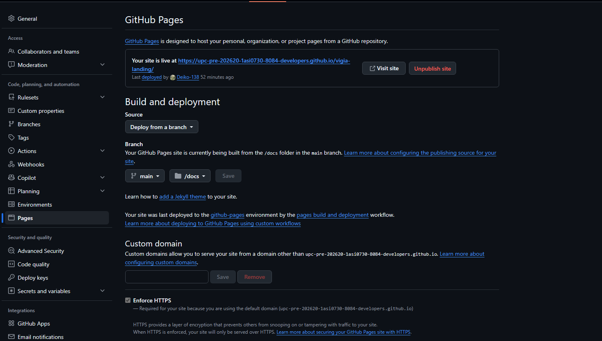

<!-- Fuente: report/chapters/chapter-5-product-implementation-validation-deployment/5.2.1-sprint-1/5.2.1.8-team-collaboration-insights-during-sprint.md -->

##### 5.2.1.8. Team Collaboration Insights during Sprint

El equipo trabajó bajo GitFlow, con una rama `feature/<nombre>` por integrante sobre el repositorio Vigia-Report, integrando el trabajo a `develop` mediante Pull Request. Durante el Sprint 1 se fusionaron los Pull Requests #7, #8, #9 y #10 hacia `develop`, evidenciando revisión antes de la integración en lugar de commits directos sobre la rama compartida.

**Participación registrada (commits en Vigia-Report a la fecha de esta entrega):**

| Integrante (usuario de GitHub) | Commits | Rama de trabajo     |
|---|---|---------------------|
| Leonardo Lopez / Deiko-138 | 39 | `feature/leonardo`  |
| ApazaEN | 27 | `feature/Apaza`     |
| FabianSandovalCueto / JFabianSandoval | 20 | `feature/Sandoval`  |
| eliocerdan | 9 | `feature/Ramos`     |
| Usuario353 | 8 | `feature/Cardenas.` |

Los cinco integrantes registran commits propios durante el Sprint, lo que evidencia participación distribuida en la elaboración del informe y del Landing Page, conforme lo exige el enunciado del proyecto.


---

<!-- Fuente: report/chapters/10-conclusiones.md -->

# Conclusions

