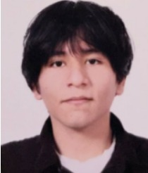
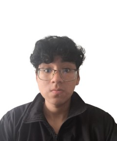
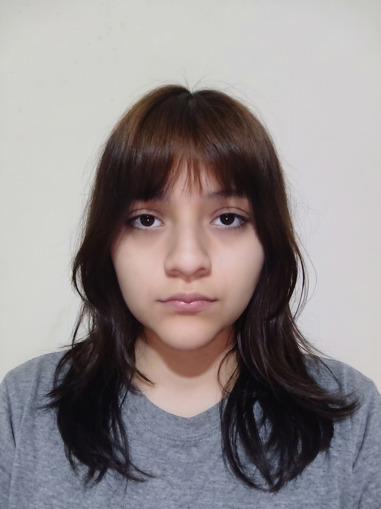

#### 1.1.2. Perfiles de integrantes del equipo

En esta sección se presentan los perfiles de los integrantes de Trazza Labs. Para cada miembro se indican sus nombres y apellidos, su código de estudiante y su carrera, junto con un resumen de los conocimientos técnicos y las habilidades que aporta al desarrollo de Vigía.

El equipo reúne perfiles complementarios en desarrollo backend, desarrollo frontend, diseño de experiencia de usuario y gestión del proyecto, lo que permite cubrir de forma colaborativa las actividades previstas en el ciclo de vida de la solución.

---

<!-- INTEGRANTE 1 -->

| | |
|---|---|
|  | **Apellidos y Nombres:** Sandoval, Fabián  **Código:** u2022XXXXX  **Carrera:** Ingeniería de Software  **Rol en el equipo:** Team Leader |

*Soy estudiante de Ingeniería de Software con experiencia en desarrollo backend con Spring Boot y en desarrollo frontend con Vue 3 y PrimeVue, así como en el uso de Docker para la configuración de entornos de desarrollo. Manejo Git y GitHub aplicando GitFlow y Conventional Commits, lo que me permite coordinar la integración del trabajo del equipo en los repositorios del proyecto. Aporto al equipo en la organización de las tareas, la definición de la arquitectura de la solución y la implementación de los servicios del RESTful API.*

---

<!-- INTEGRANTE 2 -->

| |                                                                                                                                                          |
|---|----------------------------------------------------------------------------------------------------------------------------------------------------------|
|  | **Apellidos y Nombres:** Lopez, Leonardo  **Código:** u20241a649  **Carrera:** Ingeniería de Software  **Rol en el equipo:** Developer |

*(Párrafo de resumen: conocimientos técnicos que domina, herramientas y lenguajes con los que ha trabajado, y aporte concreto al proyecto. Entre 60 y 100 palabras, redactado en primera persona.)*

---

<!-- INTEGRANTE 3 -->

| | |
|---|---|
|  | **Apellidos y Nombres:** Cardenas Huaman, Mathias Andree  **Código:** u202316353  **Carrera:** Ingeniería de Software  **Rol en el equipo:** Developer |

*Actualmente me encuentro estudiando la carrera de Ingeniería de Software. Soy proactivo y comunicativo, trabajo en equipo y resolución de problemas, también me gusta colocarme objetivos desafiantes para mejorar. Me encanta el curso y mi meta es completarla con la máxima nota posible.*

---

<!-- INTEGRANTE 4 -->

| | |
|---|---|
|  | **Apellidos y Nombres:** Apaza Bocanegra, Elizabeth Noelia  **Código:** u20231c197  **Carrera:** Ingeniería de Software  **Rol en el equipo:** Developer |

*Soy estudiante de la carrera de Ingeniería de Software, tengo 20 años y me defino como una persona responsable, organizada y con facilidad para colaborar con los demás. Disfruto mucho del trabajo en equipo porque me permite intercambiar ideas y seguir aprendiendo de mi carrera. Me interesa desarrollar constantemente nuevas habilidades y busco aportar siempre con una comunicación clara y efectiva en cada proyecto. Mi objetivo es fortalecer mi formación académica y aprovechar cada experiencia para crecer tanto en lo profesional como en lo personal.*

---

<!-- INTEGRANTE 5 -->

| |                                                                                                                                                                    |
|---|--------------------------------------------------------------------------------------------------------------------------------------------------------------------|
|  | **Apellidos y Nombres:** Ramos Cerdan, Elis Daniel  **Código:** u20201a277  **Carrera:** Ingeniería de Software  **Rol en el equipo:** Developer |

*Mi nombre es Elias Daniel Ramos Cerdan y estoy en el séptimo ciclo de la carrera de Ingeniería de Software. Me adapto con facilidad a entornos nuevos y siempre busco maneras de mejorar mi ejecución de cada avance en los trabajos. El desarrollo de software es un área de gran interés para mí, tengo conocimientos en C++, python, html, css, y javascript y disfruto abordando problemas que exigen tanto razonamiento lógico como creatividad. Dentro del grupo mi objetivo es brindar soluciones que favorezcan un buen desarrollo del proyecto, y siempre estar al tanto de que se haga lo mejor de lo mejor.*
