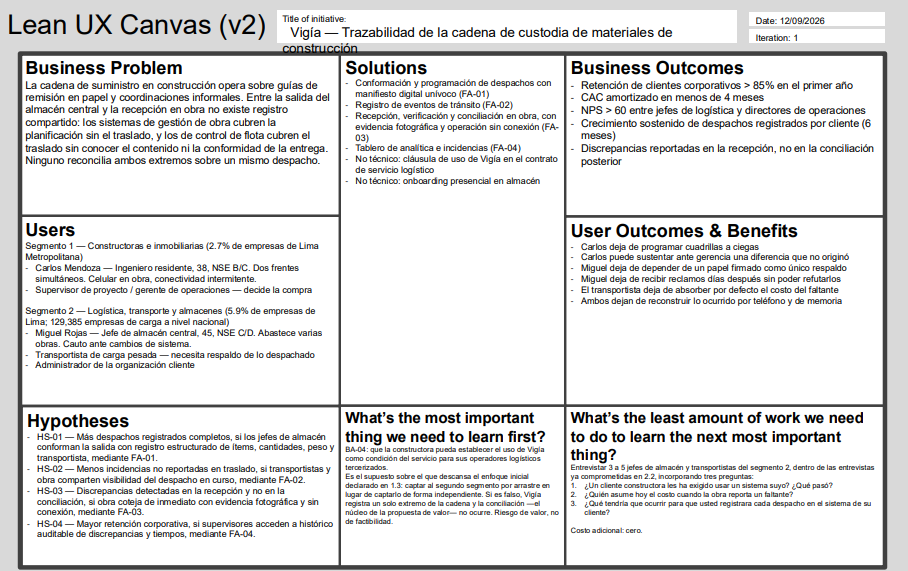

#### 1.2.2.4. Lean UX Canvas

En esta sección se presenta el Lean UX Canvas de Vigía, que consolida en un solo artefacto visual los resultados del proceso Lean UX desarrollado en las secciones anteriores. El canvas no introduce contenido nuevo: cada una de sus cajas recoge, en forma resumida, lo ya desarrollado y sustentado previamente en el informe. La caja 1 resume el problema de negocio planteado en la sección 1.2.2.1; la caja 2 recoge los Business Outcome Assumptions de la sección 1.2.2.2; la caja 3 corresponde a los User Assumptions de esa misma sección, complementados con la caracterización de los segmentos de la sección 1.3; la caja 4 recoge los User Outcome and Benefit Assumptions; la caja 5 recoge los Feature Assumptions; y la caja 6 resume los Hypothesis Statements de la sección 1.2.2.3.

Las dos últimas cajas corresponden al trabajo propio de esta sección. La caja 7 identifica, entre todos los supuestos declarados, aquel cuyo eventual error comprometería en mayor medida el conjunto de la propuesta: el supuesto BA-04, según el cual la empresa constructora tiene capacidad de establecer el uso de la plataforma como condición del servicio para sus operadores logísticos tercerizados. Se selecciona este supuesto porque el enfoque inicial declarado en la sección 1.3 descansa sobre él: la estrategia consiste en captar al primer segmento y alcanzar al segundo por arrastre, de modo que si el supuesto no se cumple, la plataforma registraría un solo extremo de la cadena y la conciliación entre ambos —que constituye la propuesta de valor— no llegaría a producirse. La caja 8 define el experimento de menor esfuerzo capaz de poner a prueba ese supuesto, aprovechando las entrevistas de validación ya previstas en la sección 2.2 con representantes del segmento de logística, transporte y almacenes.

Se emplea la versión 2 del Lean UX Canvas de Jeff Gothelf, que organiza el proceso en las ocho cajas descritas.

**Figura 1**

*Lean UX Canvas de Vigía*

*Nota.* Elaboración propia del equipo de Trazza Labs sobre la plantilla del Lean UX Canvas v2 de Jeff Gothelf, disponible bajo licencia Creative Commons BY-NC-SA. El contenido de cada caja procede de las secciones 1.2.2.1, 1.2.2.2, 1.2.2.3 y 1.3 del presente informe. El artefacto en su resolución original puede consultarse en el siguiente enlace: [Lean-UX-Canvas](https://upcedupe-my.sharepoint.com/:p:/g/personal/u20221a132_upc_edu_pe/IQAzcPXFr7caS6j_tkGE0wjBAQK0Co2JUTRnpW1049vhusM?e=hFzY45).

---

<!--
PENDIENTES DE ESTA SECCIÓN

1. Exportar el canvas a PNG (300 ppp) y guardarlo como assets/chapther-1/lean-ux-canvas.png
2. Reemplazar [ENLACE PENDIENTE] por la URL pública del artefacto (Miro, Figma o la carpeta de Drive del equipo, según decida el equipo)
3. Agregar a la Bibliografía la entrada de Gothelf (ver más abajo)
4. Verificar la numeración: esta es la primera figura numerada del informe. Si el equipo decide numerar también las capturas de las secciones 2.4 y siguientes, la numeración debe correr de forma correlativa a lo largo de todo el documento.

ENTRADA PARA LA BIBLIOGRAFÍA (APA 7)

Gothelf, J. (2019). *The Lean UX Canvas v2*. https://jeffgothelf.com/blog/leanuxcanvas-v2/
-->