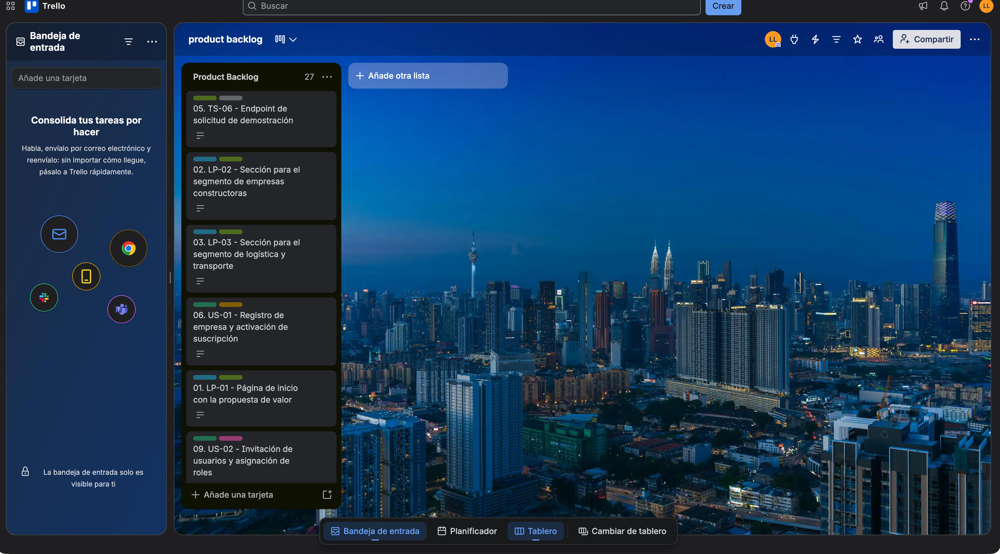

#### 3.3. Product Backlog

En esta sección se presenta el Product Backlog de Vigía, que consolida el conjunto de User Stories, Technical Stories y Landing Page Stories de la sección 3.1, ordenadas según el valor que cada una aporta al negocio y no según el orden técnico en que podrían implementarse. Por esa razón, las Epics de acceso y cuentas (EP-01) no encabezan el backlog: se ubican únicamente los elementos mínimos necesarios para habilitar el registro de la empresa piloto y el inicio de sesión, intercalados en el punto en que efectivamente desbloquean valor para el usuario. En cambio, las Landing Page Stories se consideran desde el primer sprint, conforme a lo indicado en el enunciado, dado que generan valor comercial inmediato sin depender de ninguna otra funcionalidad.

El orden refleja tres bloques de valor: (1) el Landing Page, que permite a Trazza Labs captar los primeros interesados desde el día uno; (2) el flujo núcleo de trazabilidad (pedido, despacho, tránsito y recepción), que constituye la propuesta de valor central de Vigía; y (3) la gestión de discrepancias y evidencia, que es el diferencial competitivo declarado en el Problem Statement de la sección 1.2.2.1. Las historias de robustez (verificación de existencias, incidencias de ruta y sincronización periódica en segundo plano) se ubican al final, dado que refuerzan el producto pero no son indispensables para validar la propuesta de valor con la empresa piloto.

Tras la actualización del modelo de dominio en el Design-Level EventStorming de la sección 4.6.1, se incorporan al backlog las historias de las Epics EP-07 (Suscripciones y Pagos) y EP-08 (Registro de Flota y Dispositivos): US-17 se ubica junto a US-01, por tratarse de la continuación natural de la activación de la suscripción; y US-18, US-19 y TS-08 se ubican como prerrequisito de US-05, dado que un despacho no puede asignarse a una unidad de transporte que no esté registrada y vinculada a su dispositivo de seguimiento satelital.

La estimación se expresa en Story Points, bajo la escala de Fibonacci (1 / 2 / 3 / 5 / 8), asignada por el equipo según la complejidad relativa percibida para cada historia.

| # (Orden) | User Story Id | Título | Descripción | Story Points |
|---|---|---|---|---|
| 1 | LP-01 | Página de inicio con la propuesta de valor | Como Visitante, deseo conocer la propuesta de valor de Vigía en la página de inicio, para entender en qué consiste la solución antes de solicitar más información. | 2 |
| 2 | LP-02 | Sección para el segmento de empresas constructoras | Como Visitante del segmento Empresas Constructoras e Inmobiliarias, deseo ver una sección con los beneficios específicos para residentes y directores de obra, para identificar si la solución responde a mi problema de control de materiales. | 2 |
| 3 | LP-03 | Sección para el segmento de logística y transporte | Como Visitante del segmento Empresas de Logística, Transporte y Almacenes Satélite, deseo ver una sección con los beneficios específicos para almacenes y transportistas, para identificar si la solución responde a mi necesidad de respaldo ante reclamos. | 2 |
| 4 | LP-04 | Formulario de solicitud de demostración | Como Visitante, deseo completar un formulario de contacto para solicitar una demostración, para que el equipo comercial de Trazza Labs se comunique conmigo. | 3 |
| 5 | TS-06 | Endpoint de solicitud de demostración | Como Developer, deseo exponer un endpoint que reciba las solicitudes de demostración del Landing Page, para que el equipo comercial las gestione desde un mismo canal. | 2 |
| 6 | US-01 | Registro de empresa y activación de suscripción | Como Administrador de la constructora, deseo registrar mi empresa y activar un plan de suscripción, para empezar a invitar a mi equipo a usar la plataforma. | 5 |
| 7 | US-17 | Gestión del ciclo de vida de la suscripción | Como Administrador de la constructora, deseo consultar el estado de mi suscripción y renovarla o regularizar un pago rechazado, para mantener el acceso de mi empresa a la plataforma sin interrupciones. | 3 |
| 8 | TS-01 | Endpoint de autenticación de usuarios | Como Developer, deseo exponer un endpoint para la autenticación de usuarios, para que las aplicaciones cliente puedan iniciar sesión de forma segura. | 3 |
| 9 | US-15 | Inicio de sesión | Como Usuario (residente de obra, jefe de almacén, despachador o transportista), deseo iniciar sesión con mis credenciales, para acceder a las funciones que corresponden a mi rol. | 2 |
| 10 | US-02 | Invitación de usuarios y asignación de roles | Como Administrador de la constructora, deseo invitar a los miembros de mi equipo y asignarles un rol, para que cada uno acceda solo a las funciones que le corresponden. | 3 |
| 11 | US-03 | Envío de pedido de materiales | Como Residente de obra, deseo enviar un pedido de materiales al almacén central, para asegurar el abastecimiento de mi frente de obra. | 3 |
| 12 | US-04 | Conformación de carga y registro de pesaje | Como Jefe de almacén, deseo registrar el pesaje y conformar la carga de un despacho, para dejar evidencia verificable de lo que efectivamente se despacha. | 5 |
| 13 | TS-02 | Endpoint de registro de pesaje | Como Developer, deseo exponer un endpoint para registrar el pesaje de un despacho, para que la aplicación cliente lo asocie de forma inmediata a la guía de remisión correspondiente. | 3 |
| 14 | US-18 | Registro de unidad de transporte y vinculación de dispositivo GPS | Como Jefe de almacén, deseo registrar una unidad de transporte y vincularle su dispositivo de seguimiento satelital, para poder asignarla a un despacho con trazabilidad de ubicación. | 5 |
| 15 | US-19 | Definición de geocercas de almacén y obra | Como Jefe de almacén, deseo definir la geocerca del almacén y de cada obra, para que el sistema pueda detectar automáticamente la salida y la llegada de una unidad. | 3 |
| 16 | TS-08 | Endpoint de recepción de reportes del dispositivo GPS | Como Developer, deseo exponer un endpoint que reciba los reportes periódicos de posición del dispositivo de seguimiento satelital, para registrar automáticamente los eventos de tránsito sin intervención del transportista. | 5 |
| 17 | US-05 | Emisión de guía de remisión y asignación de transportista | Como Jefe de almacén, deseo emitir la guía de remisión digital y asignar el transportista, para autorizar la salida del despacho. | 3 |
| 18 | US-06 | Inicio de traslado | Como Transportista, deseo iniciar el traslado desde la aplicación, para que el almacén y la obra conozcan que el despacho está en camino. | 2 |
| 19 | US-09 | Verificación del material recibido | Como Residente de obra, deseo verificar el material recibido contra la guía de remisión digital, para confirmar si el despacho llegó completo. | 5 |
| 20 | US-10 | Reporte de discrepancia en recepción | Como Residente de obra, deseo reportar una discrepancia al momento de la recepción, para dejar constancia inmediata de un faltante o un daño detectado. | 3 |
| 21 | TS-04 | Endpoint de comparación de cantidades | Como Developer, deseo exponer un endpoint que compare las cantidades despachadas con las cantidades recibidas, para que la aplicación cliente muestre la conformidad o la discrepancia de forma inmediata. | 3 |
| 22 | US-11 | Consulta de evidencia consolidada | Como Responsable de oficina técnica, deseo consultar la evidencia consolidada de un despacho con discrepancia, para determinar en qué punto de la cadena se originó la diferencia. | 3 |
| 23 | TS-05 | Endpoint de línea de tiempo consolidada | Como Developer, deseo exponer un endpoint que consolide en una sola respuesta los eventos de un despacho registrados por los tres actores de la cadena, para que la aplicación cliente construya la línea de tiempo del caso. | 5 |
| 24 | US-12 | Generación de reporte de sustento | Como Responsable de oficina técnica, deseo generar un reporte de sustento a partir de un caso de discrepancia, para presentarlo ante la gerencia o ante la empresa de transporte. | 5 |
| 25 | US-13 | Cierre de caso de discrepancia | Como Responsable de oficina técnica, deseo cerrar un caso de discrepancia registrando la responsabilidad determinada, para dejar constancia del resultado y prevenir casos similares. | 2 |
| 26 | US-16 | Verificación de existencias disponibles | Como Jefe de almacén, deseo verificar las existencias disponibles al recibir un pedido, para determinar si puedo atenderlo completo o solo de forma parcial. | 2 |
| 27 | US-07 | Registro de incidencia de ruta | Como Transportista, deseo registrar una incidencia de ruta, para dejar constancia de un desvío o una demora ocurrida durante el traslado. | 3 |
| 28 | US-08 | Sincronización periódica de registros de tránsito | Como Transportista, deseo que mis registros se sincronicen automáticamente de forma periódica en segundo plano, para no tener que enviarlos manualmente uno por uno. | 5 |
| 29 | TS-03 | Endpoint de sincronización en lote | Como Developer, deseo exponer un endpoint para sincronizar en lote los registros de tránsito almacenados localmente, para que la aplicación cliente los envíe en cada ciclo de sincronización periódica. | 5 |
| 30 | US-14 | Sincronización periódica de registros de recepción | Como Residente de obra, deseo que mi registro de recepción se sincronice automáticamente de forma periódica en segundo plano, para no tener que enviarlo manualmente. | 3 |
| 31 | TS-07 | Endpoint de sincronización de registros de recepción | Como Developer, deseo exponer un endpoint para sincronizar en lote los registros de recepción almacenados localmente, para que la aplicación cliente los envíe en cada ciclo de sincronización periódica. | 3 |

