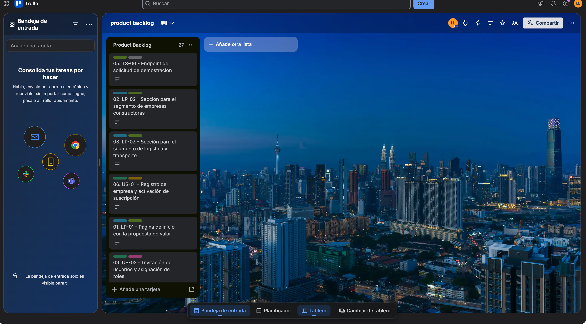

#### 3.3. Product Backlog

En esta sección se presenta el Product Backlog de Vigía, que consolida el conjunto de User Stories, Technical Stories y Landing Page Stories de la sección 3.1, ordenadas según el valor que cada una aporta al negocio y asignadas al Sprint en que se implementan. La asignación parte de la primera versión de cada producto: el Sprint 1 entrega únicamente el Landing Page, y el Sprint 2 entrega la primera versión de la Web Application, limitada al acceso y a la suscripción de la empresa. Las funcionalidades del dominio (pedido, despacho, tránsito, recepción y discrepancias) no se adelantan a esa primera versión; se incorporan en los Sprints siguientes.

El orden refleja tres bloques de valor: (1) el Landing Page, que presenta la propuesta de valor y los planes de suscripción y capta desde el primer día a las empresas interesadas en suscribirse; (2) el flujo núcleo de trazabilidad (pedido, despacho, tránsito y recepción), que constituye la propuesta de valor central de Vigía; y (3) la gestión de discrepancias y evidencia, que es el diferencial competitivo declarado en el Problem Statement de la sección 1.2.2.1. Las historias de robustez (incidencias de ruta y sincronización periódica en segundo plano) se ubican al final, dado que refuerzan el producto pero no son indispensables para validar la propuesta de valor con la empresa piloto.

Las historias de las Epics EP-07 (Suscripciones y Pagos) y EP-08 (Registro de Flota y Dispositivos) se ubican según su dependencia: US-17 acompaña a US-01 en el Sprint 2, por tratarse de la continuación natural de la activación de la suscripción; y US-18 y US-19 se ubican antes de US-04 y US-05, dado que un despacho no puede asignarse a una unidad de transporte que no esté registrada y vinculada a su dispositivo de seguimiento satelital. TS-08 se ubica en el Sprint 4, junto con las historias de tránsito que dependen de los reportes del dispositivo. TS-06 se ubica en el Sprint 2, porque requiere que exista el RESTful API para que el formulario del Landing Page deje de validar solo en el navegador.

Las Technical Stories se redactan desde el rol de desarrollador del frontend, que es quien necesita que el RESTful API exponga una capacidad para poder implementar su pantalla.

La estimación se expresa en Story Points, bajo la escala de Fibonacci (1 / 2 / 3 / 5 / 8), asignada por el equipo según la complejidad relativa percibida para cada historia. El total del Product Backlog es de 103 Story Points.

**Distribución por Sprint**

| Sprint | Alcance | Historias | Story Points |
|---|---|---|---|
| 1 | Landing Page: propuesta de valor, planes y contacto | LP-01, LP-02, LP-03, LP-04 | 9 |
| 2 | Primera versión de la Web Application: acceso y suscripción | TS-06, US-01, TS-01, US-15, US-02, US-17 | 18 |
| 3 | Pedido, flota y conformación de carga | US-03, US-18, US-19, US-04, TS-02 | 19 |
| 4 | Guía de remisión, tránsito y recepción | US-05, TS-08, US-06, US-09, US-10, TS-04 | 21 |
| 5 | Discrepancias y evidencia | US-11, TS-05, US-12, US-13, US-16 | 17 |
| 6 | Robustez y sincronización periódica | US-07, US-08, TS-03, US-14, TS-07 | 19 |

**Product Backlog ordenado**

| # (Orden) | Sprint | User Story Id | Título | Descripción | Story Points |
|---|---|---|---|---|---|
| 1 | 1 | LP-01 | Página de inicio con la propuesta de valor | Como Visitante, deseo conocer la propuesta de valor de Vigía en la página de inicio, para entender en qué consiste la solución antes de decidir suscribirme. | 2 |
| 2 | 1 | LP-02 | Sección para el segmento de empresas constructoras | Como Visitante del segmento Empresas Constructoras e Inmobiliarias, deseo ver una sección con los beneficios específicos para residentes y directores de obra, para identificar si la solución responde a mi problema de control de materiales. | 2 |
| 3 | 1 | LP-03 | Sección para el segmento de logística y transporte | Como Visitante del segmento Empresas de Logística, Transporte y Almacenes Satélite, deseo ver una sección con los beneficios específicos para almacenes y transportistas, para identificar si la solución responde a mi necesidad de respaldo ante reclamos. | 2 |
| 4 | 1 | LP-04 | Formulario de contacto para suscripción | Como Visitante, deseo dejar los datos de mi empresa en un formulario de contacto, para que el equipo comercial de Trazza Labs se comunique conmigo y me ayude a iniciar mi suscripción. | 3 |
| 5 | 2 | TS-06 | Endpoint de contacto para suscripción | Como desarrollador del frontend del Landing Page, necesito un endpoint que reciba los datos de contacto de las empresas interesadas en suscribirse, para poder conectar el formulario del sitio con el equipo comercial de Trazza Labs desde un mismo canal. | 2 |
| 6 | 2 | US-01 | Registro de empresa y activación de suscripción | Como Administrador de la constructora, deseo registrar mi empresa con el plan de suscripción que elegí y pagarlo, para activar mi suscripción y empezar a invitar a mi equipo a usar la plataforma. | 5 |
| 7 | 2 | TS-01 | Endpoint de autenticación de usuarios | Como desarrollador del frontend, necesito un endpoint de autenticación que valide las credenciales y devuelva un token de sesión, para poder implementar el inicio de sesión y restringir las pantallas según el rol del usuario. | 3 |
| 8 | 2 | US-15 | Inicio de sesión | Como Usuario (residente de obra, jefe de almacén, despachador o transportista), deseo iniciar sesión con mis credenciales, para acceder a las funciones que corresponden a mi rol. | 2 |
| 9 | 2 | US-02 | Invitación de usuarios y asignación de roles | Como Administrador de la constructora, deseo invitar a los miembros de mi equipo y asignarles un rol, para que cada uno acceda solo a las funciones que le corresponden. | 3 |
| 10 | 2 | US-17 | Gestión del ciclo de vida de la suscripción | Como Administrador de la constructora, deseo consultar el estado de mi suscripción y renovarla o regularizar un pago rechazado, para mantener el acceso de mi empresa a la plataforma sin interrupciones. | 3 |
| 11 | 3 | US-03 | Envío de pedido de materiales | Como Residente de obra, deseo enviar un pedido de materiales al almacén central, para asegurar el abastecimiento de mi frente de obra. | 3 |
| 12 | 3 | US-18 | Registro de unidad de transporte y vinculación de dispositivo GPS | Como Jefe de almacén, deseo registrar una unidad de transporte y vincularle su dispositivo de seguimiento satelital, para poder asignarla a un despacho con trazabilidad de ubicación. | 5 |
| 13 | 3 | US-19 | Definición de geocercas de almacén y obra | Como Jefe de almacén, deseo definir la geocerca del almacén y de cada obra, para que el sistema pueda detectar automáticamente la salida y la llegada de una unidad. | 3 |
| 14 | 3 | US-04 | Conformación de carga y registro de pesaje | Como Jefe de almacén, deseo registrar el pesaje y conformar la carga de un despacho, para dejar evidencia verificable de lo que efectivamente se despacha. | 5 |
| 15 | 3 | TS-02 | Endpoint de registro de pesaje | Como desarrollador del frontend, necesito un endpoint para registrar el pesaje de un despacho, para poder mostrar en la pantalla de Despachos el peso asociado de forma inmediata a la guía de remisión correspondiente. | 3 |
| 16 | 4 | US-05 | Emisión de guía de remisión y asignación de transportista | Como Jefe de almacén, deseo emitir la guía de remisión digital y asignar el transportista, para autorizar la salida del despacho. | 3 |
| 17 | 4 | TS-08 | Endpoint de recepción de reportes del dispositivo GPS | Como desarrollador de la Web Application, necesito que el API reciba los reportes periódicos de posición del dispositivo de seguimiento satelital, para poder mostrar en las pantallas de Transporte y Envíos la ubicación de la unidad sin que el transportista registre nada. | 5 |
| 18 | 4 | US-06 | Inicio de traslado | Como Transportista, deseo iniciar el traslado desde la aplicación, para que el almacén y la obra conozcan que el despacho está en camino. | 2 |
| 19 | 4 | US-09 | Verificación del material recibido | Como Residente de obra, deseo verificar el material recibido contra la guía de remisión digital, para confirmar si el despacho llegó completo. | 5 |
| 20 | 4 | US-10 | Reporte de discrepancia en recepción | Como Residente de obra, deseo reportar una discrepancia al momento de la recepción, para dejar constancia inmediata de un faltante o un daño detectado. | 3 |
| 21 | 4 | TS-04 | Endpoint de comparación de cantidades | Como desarrollador del frontend, necesito un endpoint que compare las cantidades despachadas con las recibidas, para poder mostrar en la pantalla de Recepciones la conformidad o la diferencia de cada ítem de forma inmediata. | 3 |
| 22 | 5 | US-11 | Consulta de evidencia consolidada | Como Responsable de oficina técnica, deseo consultar la evidencia consolidada de un despacho con discrepancia, para determinar en qué punto de la cadena se originó la diferencia. | 3 |
| 23 | 5 | TS-05 | Endpoint de línea de tiempo consolidada | Como desarrollador del frontend, necesito un endpoint que consolide en una sola respuesta los eventos de un despacho registrados por los tres actores de la cadena, para poder construir la línea de tiempo del caso sin combinar varias consultas. | 5 |
| 24 | 5 | US-12 | Generación de reporte de sustento | Como Responsable de oficina técnica, deseo generar un reporte de sustento a partir de un caso de discrepancia, para presentarlo ante la gerencia o ante la empresa de transporte. | 5 |
| 25 | 5 | US-13 | Cierre de caso de discrepancia | Como Responsable de oficina técnica, deseo cerrar un caso de discrepancia registrando la responsabilidad determinada, para dejar constancia del resultado y prevenir casos similares. | 2 |
| 26 | 5 | US-16 | Verificación de existencias disponibles | Como Jefe de almacén, deseo verificar las existencias disponibles al recibir un pedido, para determinar si puedo atenderlo completo o solo de forma parcial. | 2 |
| 27 | 6 | US-07 | Registro de incidencia de ruta | Como Transportista, deseo registrar una incidencia de ruta, para dejar constancia de un desvío o una demora ocurrida durante el traslado. | 3 |
| 28 | 6 | US-08 | Sincronización periódica de registros de tránsito | Como Transportista, deseo que mis registros se sincronicen automáticamente de forma periódica en segundo plano, para no tener que enviarlos manualmente uno por uno. | 5 |
| 29 | 6 | TS-03 | Endpoint de sincronización en lote | Como desarrollador del frontend, necesito un endpoint que reciba en lote los registros de tránsito almacenados localmente, para poder enviarlos en cada ciclo de sincronización periódica sin que el usuario intervenga. | 5 |
| 30 | 6 | US-14 | Sincronización periódica de registros de recepción | Como Residente de obra, deseo que mi registro de recepción se sincronice automáticamente de forma periódica en segundo plano, para no tener que enviarlo manualmente. | 3 |
| 31 | 6 | TS-07 | Endpoint de sincronización de registros de recepción | Como desarrollador del frontend, necesito un endpoint que reciba en lote los registros de recepción almacenados localmente, para poder enviarlos en cada ciclo de sincronización periódica sin que el residente intervenga. | 3 |

**Figura 12**

