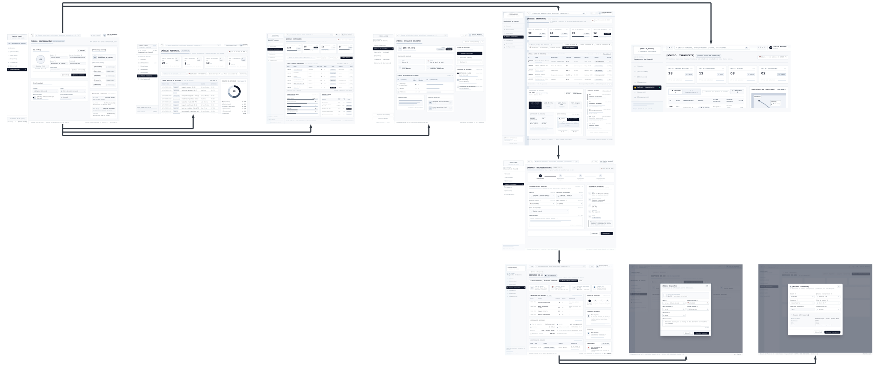
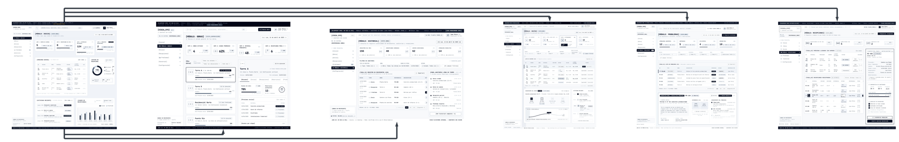
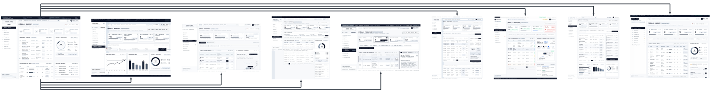

## 4.4.2 Web Applications Wireflow Diagrams

**User Goal:** Creación de un despacho y asignación de transporte

**User Persona:** Jefe de Almacén

**Explicación del Flujo:**
El usuario puede navegar de manera rápida por los módulos principales de la plataforma desde el menú lateral: configurar su perfil y preferencias, consultar los materiales disponibles, revisar el historial de actividades y ver el detalle de las solicitudes que llegan desde las obras (por ejemplo, SOL-104). Para cumplir su objetivo principal, ingresa al módulo de Despachos, donde visualiza los indicadores y la lista de despachos, y selecciona la opción "Nuevo despacho". En el asistente de cuatro pasos completa la información general (obra destino, fecha, prioridad y observaciones), mientras un resumen a la derecha le muestra los datos ingresados, y continúa hasta confirmar el despacho. Una vez creado, accede al detalle del despacho (DS-104), donde puede ver el resumen, la línea de tiempo y los materiales incluidos. Desde allí puede editar el despacho mediante una ventana emergente, modificando la fecha, la prioridad o las observaciones, y asignar el transporte eligiendo el transportista y el vehículo según su capacidad, con lo que el despacho queda listo para salir. Además, puede consultar el módulo de Transporte para ver la flota disponible antes de asignar una unidad.

---

**User Goal:** Confirmación de la recepción de materiales

**User Persona:** Ingeniero de Frente de Obra

**Explicación del Flujo:**
El usuario puede navegar de manera rápida por las secciones principales de la plataforma. Desde Inicio visualiza un resumen de sus obras y de los despachos en camino, en Obras consulta el avance de cada una (Torre A, Residencial Norte, Puente Sur) y en Historial revisa los movimientos de material asociados. Para cumplir su objetivo principal, ingresa al módulo de Recepciones, donde ve la lista de despachos por llegar o pendientes y selecciona el que ha arribado a la obra. En el panel de detalle encuentra un checklist de verificación con las cantidades y el estado de los materiales, y confirma la recepción cuando todo está conforme, con lo que el despacho pasa al estado "Recibido" y la entrega se cierra. Si detecta faltantes, daños o diferencias, puede pasar al módulo de Problemas, donde completa el formulario de reporte con el tipo de incidencia, el despacho u obra relacionada, la descripción y la evidencia, y la incidencia queda registrada con estado "Abierto" para que el almacén o el administrador la atiendan.

---

**User Goal:** Supervisión de la operación global

**User Persona:** Administrador

**Explicación del Flujo:**
El usuario inicia en la pantalla de Inicio, donde visualiza los indicadores clave, la actividad reciente y un gráfico del estado general de la operación, junto con la barra superior que muestra el estado del sistema. Desde el menú lateral se desplaza entre los módulos de supervisión: en Despachos, Transporte y Recepciones sigue el avance logístico, revisa la lista de operaciones y el estado de cada unidad; en Obras revisa el avance y el consumo por obra; y en Historial audita los movimientos y las acciones de todos los usuarios. En Reportes puede analizar el porcentaje de cumplimiento, las tendencias y las comparativas mediante gráficos, aplicar filtros por periodo, obra o tipo, y exportar el resultado. En Problemas visualiza las incidencias reportadas por las obras y el almacén, las filtra por estado y prioridad, y al seleccionar una abre el panel de detalle con la descripción, el responsable y las evidencias, desde donde cambia el estado, asigna un responsable o deja un comentario. Así detecta desvíos y toma decisiones a tiempo.
