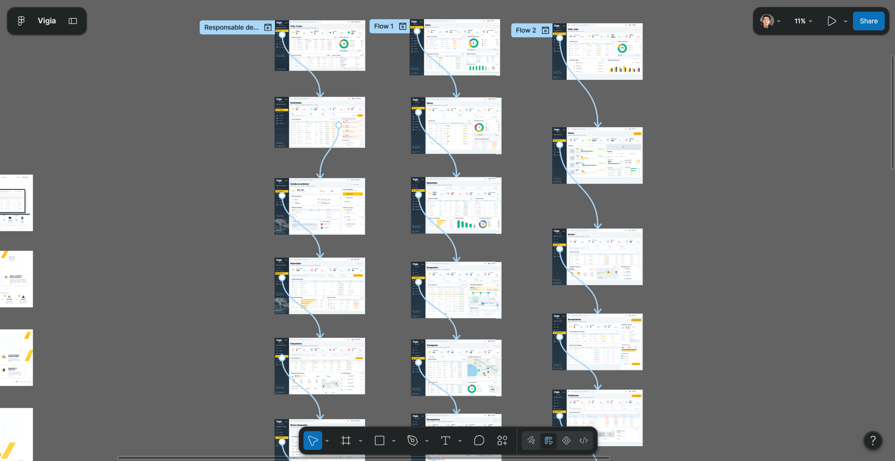

### 4.5. Web Applications Prototyping

En esta sección presentamos el prototipo de la Web Application de Vigía para Desktop Web Browser. El prototipo permite simular la interacción y navegación entre las principales pantallas de la plataforma, considerando los flujos definidos para los roles de Responsable de Almacén, Responsable de Obra y Supervisor.

#### Desktop Web Application Prototype

El prototipo para Desktop Web Browser fue elaborado a partir de los Mock-ups desarrollados previamente. Para su construcción se conectaron las principales pantallas y acciones de cada rol, permitiendo representar de forma interactiva el proceso de seguimiento de los materiales desde la solicitud y despacho hasta el transporte, recepción y registro de posibles problemas.

#### Evidencia del prototipo

**Figura 49**

**Enlace al prototipo en Figma:**  
[Desktop Web Application Prototype](https://da.gd/Ywria)

**Video de navegación del prototipo:**  
[Prototype Navigation Video](https://tinyurl.com/2btzqwvo)
