#### 4.8.1. Database Diagrams

A continuación se presentan los Database Diagrams correspondientes a cada uno de los ocho Bounded Contexts. Cada diagrama entidad-relación se elabora con **Mermaid** (`erDiagram`), de modo que su definición se escribe en texto y se versiona junto con el informe en el repositorio; a partir de esa definición se genera la imagen que acompaña a cada contexto. Para cada Bounded Context se incluye el diagrama, la relación de tablas con sus columnas y tipos de dato, la especificación de constraints y relaciones, y el código fuente Mermaid que lo produce.

---

##### 1. BC-01: Lead Management

Este contexto conserva las solicitudes de demostración originadas en el Landing Page. Se resuelve en una sola tabla, sin relaciones, dado que la captación ocurre antes de que exista vínculo contractual con la empresa solicitante. El Value Object `ContactInfo` se aplana con el prefijo `contact_`.

**Tabla `demo_requests`**

| Columna | Tipo | Constraint | Origen en 4.7.1 |
|---|---|---|---|
| id | uuid | PRIMARY KEY | `DemoRequest.id` |
| company_name | varchar(150) | NOT NULL | `DemoRequest.companyName` |
| segment | varchar(30) | NOT NULL, CHECK | enum `TargetSegment` |
| contact_full_name | varchar(120) | NOT NULL | VO `ContactInfo.fullName` |
| contact_business_email | varchar(150) | NOT NULL | VO `ContactInfo.businessEmail` |
| contact_phone_number | varchar(20) | NOT NULL | VO `ContactInfo.phoneNumber` |
| status | varchar(20) | NOT NULL, CHECK | enum `DemoRequestStatus` |
| submitted_at | timestamptz | NOT NULL | `DemoRequest.submittedAt` |
| contacted_at | timestamptz | NULL | `DemoRequest.contactedAt` |

**Constraints**

| Nombre | Tipo | Definición |
|---|---|---|
| pk_demo_requests | PRIMARY KEY | `(id)` |
| ck_demo_requests_segment | CHECK | `segment IN ('CONSTRUCTION_COMPANY', 'LOGISTICS_AND_TRANSPORT')` |
| ck_demo_requests_status | CHECK | `status IN ('SUBMITTED', 'CONTACTED', 'SCHEDULED', 'DISCARDED')` |

**Figura 70**

*Diagrama de base de datos del Bounded Context BC-01: Lead Management*

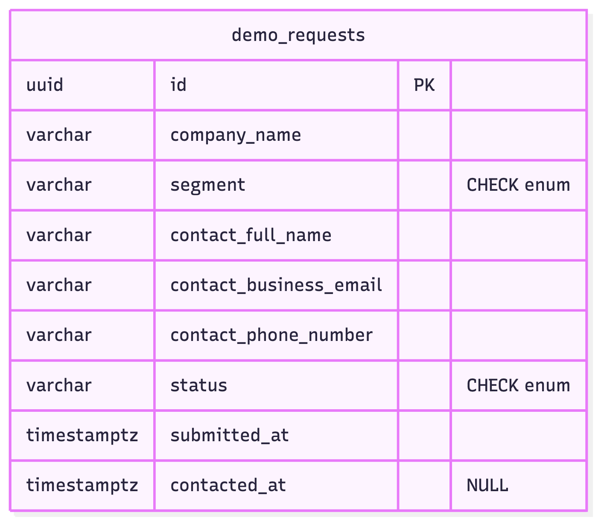
*Nota.* Elaboración propia del equipo de Trazza Labs, derivada del diagrama de clases de la sección 4.7.1. El diagrama se modela como entidad-relación y se genera a partir de su definición en texto (Mermaid `erDiagram`), de modo que permanece versionado junto con el informe.

**Código fuente del diagrama (Mermaid `erDiagram`)**

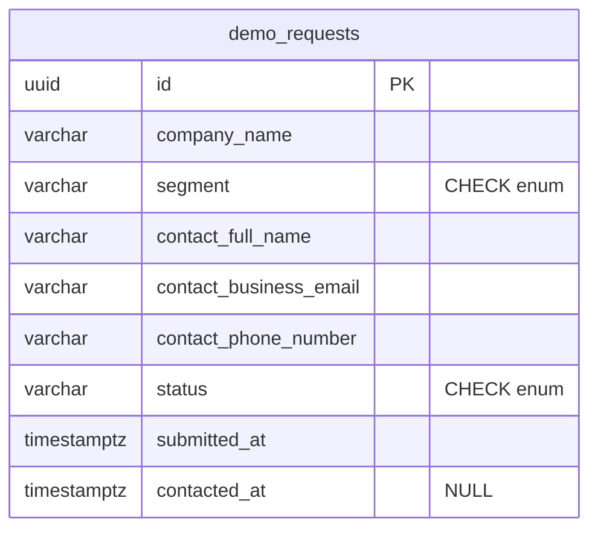
```mermaid
erDiagram
    demo_requests {
        uuid id PK
        varchar company_name
        varchar segment "CHECK enum"
        varchar contact_full_name
        varchar contact_business_email
        varchar contact_phone_number
        varchar status "CHECK enum"
        timestamptz submitted_at
        timestamptz contacted_at "NULL"
    }
```

---

##### 2. BC-02: Identity and Access Management

Este contexto sostiene el registro de las organizaciones cliente, sus usuarios y el ciclo de vida de las invitaciones. La tabla `companies` actúa como raíz y las otras dos dependen de ella. El atributo `role` acota, mediante una restricción `CHECK`, el conjunto de roles que un usuario autenticado puede asumir en la plataforma; este conjunto cubre a todos los actores de la cadena de custodia identificados en las User Stories de la sección 3.1, tanto los del segmento de empresas constructoras (`ADMINISTRATOR`, `RESIDENT_ENGINEER`, `TECHNICAL_OFFICE_MANAGER`) como los del segmento de logística y transporte (`WAREHOUSE_MANAGER`, `DISPATCHER`, `CARRIER`), dado que un usuario del operador logístico pertenece a su propia organización registrada en `companies`.

**Tabla `companies`**

| Columna | Tipo | Constraint |
|---|---|---|
| id | uuid | PRIMARY KEY |
| legal_name | varchar(200) | NOT NULL |
| tax_id | varchar(15) | NOT NULL, UNIQUE |
| subscription_active | boolean | NOT NULL, DEFAULT false |
| created_at | timestamptz | NOT NULL |

**Tabla `users`**

| Columna | Tipo | Constraint |
|---|---|---|
| id | uuid | PRIMARY KEY |
| company_id | uuid | NOT NULL, FOREIGN KEY → `companies(id)` |
| full_name | varchar(120) | NOT NULL |
| email | varchar(150) | NOT NULL, UNIQUE |
| password_hash | varchar(255) | NOT NULL |
| role | varchar(30) | NOT NULL, CHECK |
| is_active | boolean | NOT NULL, DEFAULT true |

**Tabla `invitations`**

| Columna | Tipo | Constraint |
|---|---|---|
| id | uuid | PRIMARY KEY |
| company_id | uuid | NOT NULL, FOREIGN KEY → `companies(id)` |
| email | varchar(150) | NOT NULL |
| role_assigned | varchar(30) | NOT NULL, CHECK |
| status | varchar(20) | NOT NULL, CHECK |
| sent_at | timestamptz | NOT NULL |
| accepted_at | timestamptz | NULL |

**Relaciones**

| Origen | Destino | Cardinalidad | Regla de borrado |
|---|---|---|---|
| users.company_id | companies.id | N:1 | ON DELETE RESTRICT |
| invitations.company_id | companies.id | N:1 | ON DELETE CASCADE |

**Constraints CHECK**

| Nombre | Definición |
|---|---|
| ck_users_role | `role IN ('ADMINISTRATOR', 'RESIDENT_ENGINEER', 'WAREHOUSE_MANAGER', 'TECHNICAL_OFFICE_MANAGER', 'DISPATCHER', 'CARRIER')` |
| ck_invitations_role | `role_assigned IN ('ADMINISTRATOR', 'RESIDENT_ENGINEER', 'WAREHOUSE_MANAGER', 'TECHNICAL_OFFICE_MANAGER', 'DISPATCHER', 'CARRIER')` |
| ck_invitations_status | `status IN ('PENDING', 'ACCEPTED', 'REVOKED', 'EXPIRED')` |

**Figura 71**

*Diagrama de base de datos del Bounded Context BC-02: Identity and Access Management*

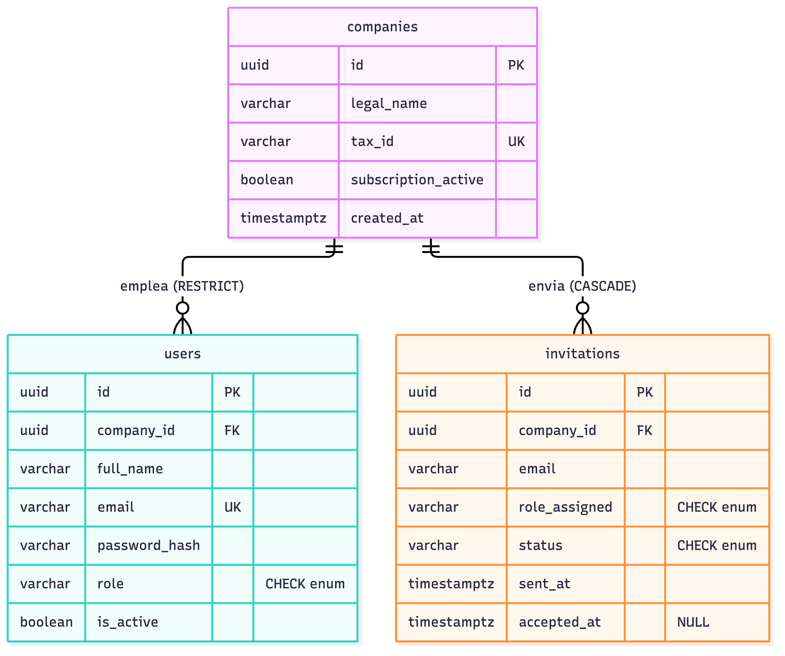
*Nota.* Elaboración propia del equipo de Trazza Labs, derivada del diagrama de clases de la sección 4.7.1. El diagrama se modela como entidad-relación y se genera a partir de su definición en texto (Mermaid `erDiagram`), de modo que permanece versionado junto con el informe.

**Código fuente del diagrama (Mermaid `erDiagram`)**

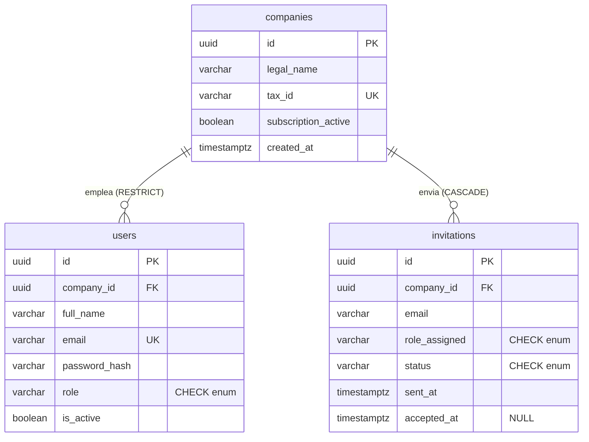
```mermaid
erDiagram
    companies {
        uuid id PK
        varchar legal_name
        varchar tax_id UK
        boolean subscription_active
        timestamptz created_at
    }
    users {
        uuid id PK
        uuid company_id FK
        varchar full_name
        varchar email UK
        varchar password_hash
        varchar role "CHECK enum"
        boolean is_active
    }
    invitations {
        uuid id PK
        uuid company_id FK
        varchar email
        varchar role_assigned "CHECK enum"
        varchar status "CHECK enum"
        timestamptz sent_at
        timestamptz accepted_at "NULL"
    }
    companies ||--o{ users : "emplea (RESTRICT)"
    companies ||--o{ invitations : "envia (CASCADE)"
```

---

##### 3. BC-03: Subscriptions and Payment

Este contexto sostiene la relación contractual con la empresa cliente y el registro de los pagos procesados por la pasarela externa. El Value Object `Money` se aplana en dos tablas distintas, con prefijo `price_` en el plan y `amount_paid_` en la transacción.

**Tabla `subscription_plans`**

| Columna | Tipo | Constraint |
|---|---|---|
| id | uuid | PRIMARY KEY |
| tier | varchar(20) | NOT NULL, CHECK |
| name | varchar(80) | NOT NULL |
| max_active_jobsites | integer | NOT NULL |
| max_monthly_dispatches | integer | NOT NULL |
| price_amount | numeric(12,2) | NOT NULL, CHECK |
| price_currency | char(3) | NOT NULL |

**Tabla `subscriptions`**

| Columna | Tipo | Constraint |
|---|---|---|
| id | uuid | PRIMARY KEY |
| company_id | uuid | NOT NULL |
| plan_id | uuid | NOT NULL, FOREIGN KEY → `subscription_plans(id)` |
| start_date | date | NOT NULL |
| renewal_date | date | NOT NULL |
| status | varchar(20) | NOT NULL, CHECK |

**Tabla `payment_transactions`**

| Columna | Tipo | Constraint |
|---|---|---|
| id | uuid | PRIMARY KEY |
| subscription_id | uuid | NOT NULL, FOREIGN KEY → `subscriptions(id)` |
| external_gateway_tx_id | varchar(120) | NOT NULL, UNIQUE |
| amount_paid_amount | numeric(12,2) | NOT NULL |
| amount_paid_currency | char(3) | NOT NULL |
| processed_at | timestamptz | NOT NULL |
| status | varchar(20) | NOT NULL, CHECK |
| failure_reason | varchar(300) | NULL |

**Relaciones**

| Origen | Destino | Cardinalidad | Regla de borrado |
|---|---|---|---|
| subscriptions.plan_id | subscription_plans.id | N:1 | ON DELETE RESTRICT |
| payment_transactions.subscription_id | subscriptions.id | N:1 | ON DELETE CASCADE |
| subscriptions.company_id | *(BC-02)* | — | Sin clave foránea |

**Constraints CHECK**

| Nombre | Definición |
|---|---|
| ck_subscription_plans_tier | `tier IN ('STARTER', 'PROFESSIONAL', 'ENTERPRISE')` |
| ck_subscription_plans_price | `price_amount >= 0` |
| ck_subscriptions_status | `status IN ('PENDING_PAYMENT', 'ACTIVE', 'SUSPENDED', 'EXPIRED', 'CANCELLED')` |
| ck_payment_transactions_status | `status IN ('PENDING', 'AUTHORIZED', 'REJECTED', 'REFUNDED')` |

**Figura 72**

*Diagrama de base de datos del Bounded Context BC-03: Subscriptions and Payment*

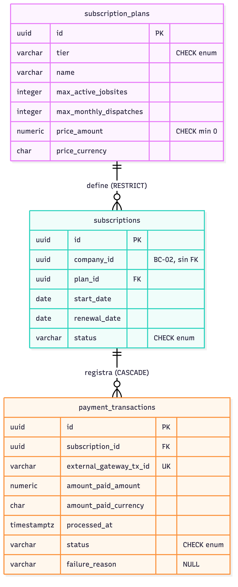
*Nota.* Elaboración propia del equipo de Trazza Labs, derivada del diagrama de clases de la sección 4.7.1. El diagrama se modela como entidad-relación y se genera a partir de su definición en texto (Mermaid `erDiagram`), de modo que permanece versionado junto con el informe.

**Código fuente del diagrama (Mermaid `erDiagram`)**

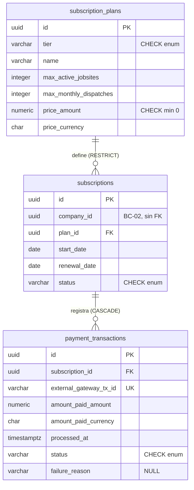
```mermaid
erDiagram
    subscription_plans {
        uuid id PK
        varchar tier "CHECK enum"
        varchar name
        integer max_active_jobsites
        integer max_monthly_dispatches
        numeric price_amount "CHECK min 0"
        char price_currency
    }
    subscriptions {
        uuid id PK
        uuid company_id "BC-02, sin FK"
        uuid plan_id FK
        date start_date
        date renewal_date
        varchar status "CHECK enum"
    }
    payment_transactions {
        uuid id PK
        uuid subscription_id FK
        varchar external_gateway_tx_id UK
        numeric amount_paid_amount
        char amount_paid_currency
        timestamptz processed_at
        varchar status "CHECK enum"
        varchar failure_reason "NULL"
    }
    subscription_plans ||--o{ subscriptions : "define (RESTRICT)"
    subscriptions ||--o{ payment_transactions : "registra (CASCADE)"
```

---

##### 4. BC-04: Fleet and Device Management

Este contexto sostiene el registro de las unidades de transporte y la delimitación de geocercas. Sus dos tablas corresponden a agregados independientes y no existe relación entre ellas: la evaluación de si una unidad se encuentra dentro de una geocerca se resuelve en el componente de dominio, no mediante una relación en la base de datos. El Value Object `Location` se aplana con prefijo `current_pos_` en las unidades y `center_` en las geocercas.

**Tabla `vehicles`**

| Columna | Tipo | Constraint |
|---|---|---|
| id | uuid | PRIMARY KEY |
| company_id | uuid | NOT NULL |
| license_plate | varchar(10) | NOT NULL, UNIQUE |
| brand | varchar(50) | NOT NULL |
| model | varchar(50) | NOT NULL |
| max_capacity_tons | numeric(8,2) | NOT NULL |
| is_gps_paired | boolean | NOT NULL, DEFAULT false |
| gps_device_id | varchar(60) | NULL, UNIQUE |
| current_pos_latitude | double precision | NULL |
| current_pos_longitude | double precision | NULL |

**Tabla `geofences`**

| Columna | Tipo | Constraint |
|---|---|---|
| id | uuid | PRIMARY KEY |
| company_id | uuid | NOT NULL |
| name | varchar(120) | NOT NULL |
| type | varchar(20) | NOT NULL, CHECK |
| center_latitude | double precision | NOT NULL |
| center_longitude | double precision | NOT NULL |
| radius_meters | double precision | NOT NULL, CHECK |

**Constraints**

| Nombre | Tipo | Definición |
|---|---|---|
| uq_vehicles_license_plate | UNIQUE | `(license_plate)` |
| uq_vehicles_gps_device_id | UNIQUE | `(gps_device_id)` — garantiza la vinculación unitaria del dispositivo |
| ck_vehicles_gps_pairing | CHECK | `(is_gps_paired = false AND gps_device_id IS NULL) OR (is_gps_paired = true AND gps_device_id IS NOT NULL)` |
| ck_geofences_type | CHECK | `type IN ('WAREHOUSE', 'JOB_SITE')` |
| ck_geofences_radius | CHECK | `radius_meters > 0` |

**Figura 73**

*Diagrama de base de datos del Bounded Context BC-04: Fleet and Device Management*
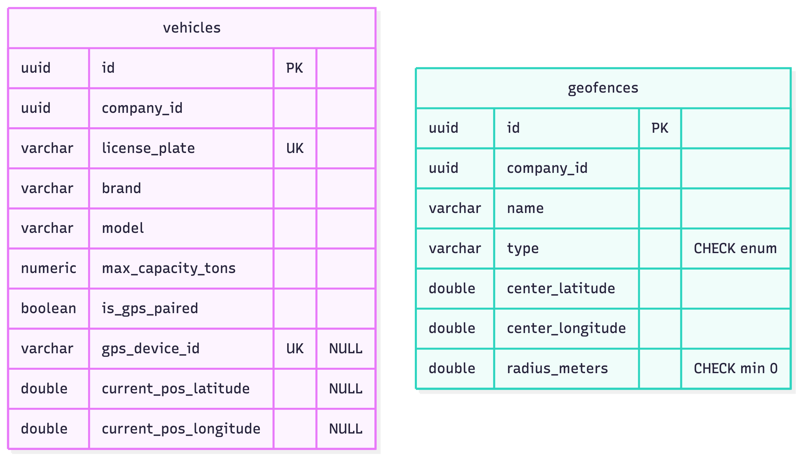

*Nota.* Elaboración propia del equipo de Trazza Labs, derivada del diagrama de clases de la sección 4.7.1. El diagrama se modela como entidad-relación y se genera a partir de su definición en texto (Mermaid `erDiagram`), de modo que permanece versionado junto con el informe.

**Código fuente del diagrama (Mermaid `erDiagram`)**

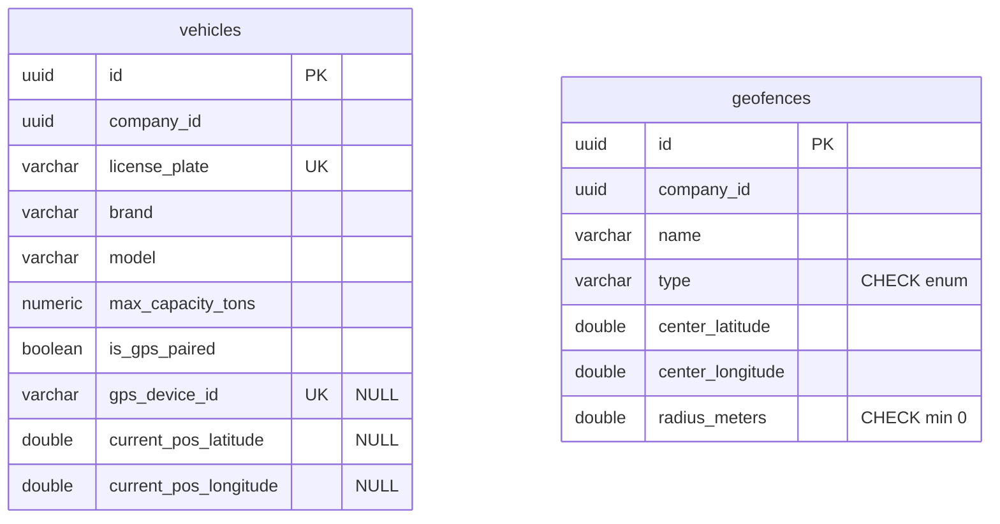
```mermaid
erDiagram
    vehicles {
        uuid id PK
        uuid company_id
        varchar license_plate UK
        varchar brand
        varchar model
        numeric max_capacity_tons
        boolean is_gps_paired
        varchar gps_device_id UK "NULL"
        double current_pos_latitude "NULL"
        double current_pos_longitude "NULL"
    }
    geofences {
        uuid id PK
        uuid company_id
        varchar name
        varchar type "CHECK enum"
        double center_latitude
        double center_longitude
        double radius_meters "CHECK min 0"
    }
```

---

##### 5. BC-05: Ordering and Dispatch

Este contexto sostiene el pedido de materiales, su desglose en ítems y la conformación del despacho que sale del almacén. La tabla `orders` actúa como raíz de las otras dos. El Value Object `DigitalWaybill` se aplana en `dispatches` con prefijo `waybill_`, y sus columnas admiten nulo porque el despacho existe antes de que se emita la guía de remisión.

**Tabla `orders`**

| Columna | Tipo | Constraint |
|---|---|---|
| id | uuid | PRIMARY KEY |
| site_id | uuid | NOT NULL |
| requested_by_user_id | uuid | NOT NULL |
| order_date | timestamptz | NOT NULL |
| status | varchar(25) | NOT NULL, CHECK |

**Tabla `order_items`**

| Columna | Tipo | Constraint |
|---|---|---|
| id | uuid | PRIMARY KEY |
| order_id | uuid | NOT NULL, FOREIGN KEY → `orders(id)` |
| material_name | varchar(150) | NOT NULL |
| unit_of_measure | varchar(15) | NOT NULL |
| requested_quantity | numeric(12,3) | NOT NULL |
| assigned_quantity | numeric(12,3) | NOT NULL, DEFAULT 0 |

**Tabla `dispatches`**

| Columna | Tipo | Constraint |
|---|---|---|
| id | uuid | PRIMARY KEY |
| order_id | uuid | NOT NULL, FOREIGN KEY → `orders(id)` |
| vehicle_id | uuid | NOT NULL |
| carrier_id | uuid | NOT NULL |
| estimated_weight_kg | numeric(12,2) | NOT NULL |
| scale_weight_kg | numeric(12,2) | NOT NULL |
| status | varchar(30) | NOT NULL, CHECK |
| departed_at | timestamptz | NULL |
| waybill_number | varchar(40) | NULL |
| waybill_issued_at | timestamptz | NULL |
| waybill_authorized_by_user_id | uuid | NULL |

**Relaciones**

| Origen | Destino | Cardinalidad | Regla de borrado |
|---|---|---|---|
| order_items.order_id | orders.id | N:1 (1..*) | ON DELETE CASCADE |
| dispatches.order_id | orders.id | N:1 (0..*) | ON DELETE RESTRICT |
| dispatches.vehicle_id | *(BC-04)* | — | Sin clave foránea |
| orders.site_id, orders.requested_by_user_id, dispatches.carrier_id | *(otros contextos)* | — | Sin clave foránea |

**Constraints CHECK**

| Nombre | Definición |
|---|---|
| ck_orders_status | `status IN ('PENDING', 'PARTIALLY_ATTENDED', 'COMPLETELY_ATTENDED', 'CANCELLED')` |
| ck_dispatches_status | `status IN ('DRAFT', 'WEIGHT_CONFIRMED', 'WEIGHT_FLAGGED_FOR_REVIEW', 'WAYBILL_ISSUED', 'DEPARTED')` |
| ck_order_items_quantities | `assigned_quantity <= requested_quantity` |

**Figura 74**

*Diagrama de base de datos del Bounded Context BC-05: Ordering and Dispatch*

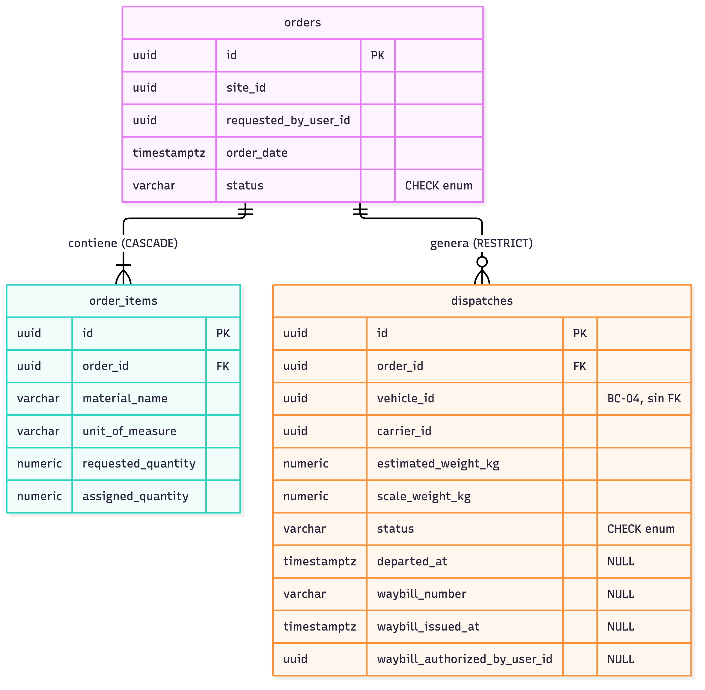
*Nota.* Elaboración propia del equipo de Trazza Labs, derivada del diagrama de clases de la sección 4.7.1. El diagrama se modela como entidad-relación y se genera a partir de su definición en texto (Mermaid `erDiagram`), de modo que permanece versionado junto con el informe.

**Código fuente del diagrama (Mermaid `erDiagram`)**

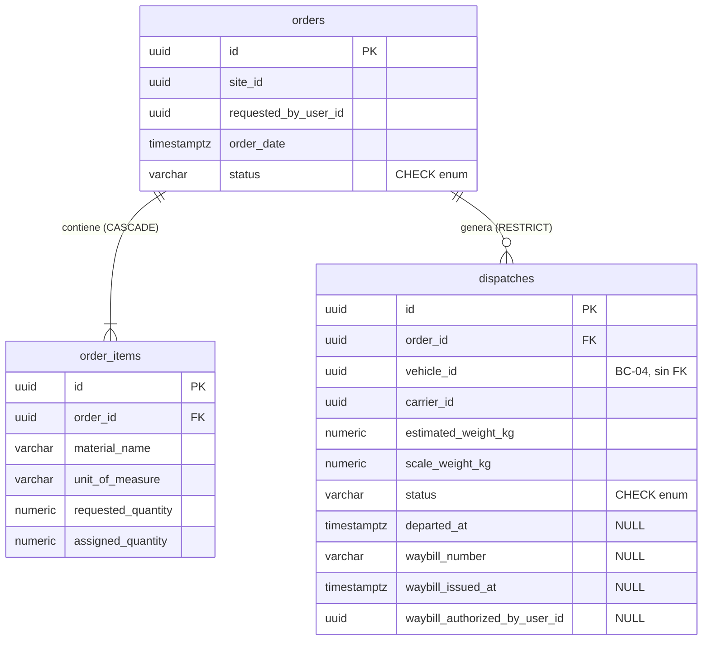
```mermaid
erDiagram
    orders {
        uuid id PK
        uuid site_id
        uuid requested_by_user_id
        timestamptz order_date
        varchar status "CHECK enum"
    }
    order_items {
        uuid id PK
        uuid order_id FK
        varchar material_name
        varchar unit_of_measure
        numeric requested_quantity
        numeric assigned_quantity
    }
    dispatches {
        uuid id PK
        uuid order_id FK
        uuid vehicle_id "BC-04, sin FK"
        uuid carrier_id
        numeric estimated_weight_kg
        numeric scale_weight_kg
        varchar status "CHECK enum"
        timestamptz departed_at "NULL"
        varchar waybill_number "NULL"
        timestamptz waybill_issued_at "NULL"
        uuid waybill_authorized_by_user_id "NULL"
    }
    orders ||--|{ order_items : "contiene (CASCADE)"
    orders ||--o{ dispatches : "genera (RESTRICT)"
```

---

##### 6. BC-06: Transit Traceability

Este contexto sostiene el recorrido de la unidad durante el traslado y las anomalías detectadas en ruta. La tabla `position_reports` constituye el único caso en que un Value Object recibe clave primaria propia, dado que se presenta como colección dentro del agregado. Se emplea `bigserial` en lugar de `uuid` por el volumen previsto: es la tabla que acumula más filas, ya que recibe un registro por cada reporte del dispositivo GPS.

Las columnas `occurred_at` y `received_at` conservan, respectivamente, el momento informado por el dispositivo y el momento de recepción en el servidor. Esta distinción corresponde a la decisión adoptada en la sección 4.6.3 y sostiene el valor probatorio de la evidencia consolidada en el apartado 8 de esta misma sección (BC-08).

**Tabla `routes`**

| Columna | Tipo | Constraint |
|---|---|---|
| id | uuid | PRIMARY KEY |
| dispatch_id | uuid | NOT NULL |
| vehicle_id | uuid | NOT NULL |
| started_at | timestamptz | NOT NULL |
| completed_at | timestamptz | NULL |
| current_status | varchar(25) | NOT NULL, CHECK |

**Tabla `position_reports`**

| Columna | Tipo | Constraint |
|---|---|---|
| id | bigserial | PRIMARY KEY |
| route_id | uuid | NOT NULL, FOREIGN KEY → `routes(id)` |
| latitude | double precision | NOT NULL |
| longitude | double precision | NOT NULL |
| speed_kmh | double precision | NOT NULL |
| occurred_at | timestamptz | NOT NULL |
| received_at | timestamptz | NOT NULL |

**Tabla `route_incidents`**

| Columna | Tipo | Constraint |
|---|---|---|
| id | uuid | PRIMARY KEY |
| route_id | uuid | NOT NULL, FOREIGN KEY → `routes(id)` |
| incident_type | varchar(30) | NOT NULL, CHECK |
| description | varchar(300) | NOT NULL |
| detected_at | timestamptz | NOT NULL |
| is_resolved | boolean | NOT NULL, DEFAULT false |

**Relaciones**

| Origen | Destino | Cardinalidad | Regla de borrado |
|---|---|---|---|
| position_reports.route_id | routes.id | N:1 (0..*) | ON DELETE CASCADE |
| route_incidents.route_id | routes.id | N:1 (0..*) | ON DELETE CASCADE |
| routes.dispatch_id, routes.vehicle_id | *(BC-05 y BC-04)* | — | Sin clave foránea |

**Constraints e índices**

| Nombre | Tipo | Definición |
|---|---|---|
| ck_routes_status | CHECK | `current_status IN ('IN_TRANSIT', 'DEVIATION_ALERT', 'STOPPED', 'COMPLETED')` |
| ck_route_incidents_type | CHECK | `incident_type IN ('PROLONGED_STOP', 'UNAUTHORIZED_DEVIATION', 'GPS_SIGNAL_LOST', 'GPS_SIGNAL_RESTORED')` |
| idx_position_reports_route_occurred | ÍNDICE | `(route_id, occurred_at)` |

**Figura 75**

*Diagrama de base de datos del Bounded Context BC-06: Transit Traceability*

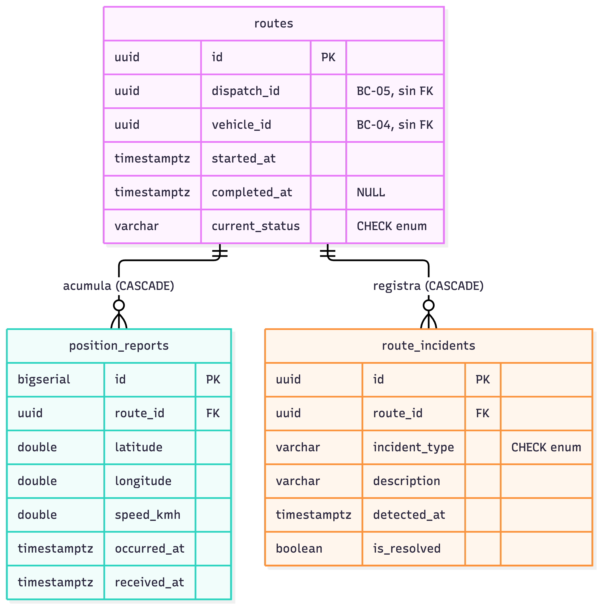
*Nota.* Elaboración propia del equipo de Trazza Labs, derivada del diagrama de clases de la sección 4.7.1. El diagrama se modela como entidad-relación y se genera a partir de su definición en texto (Mermaid `erDiagram`), de modo que permanece versionado junto con el informe.

**Código fuente del diagrama (Mermaid `erDiagram`)**

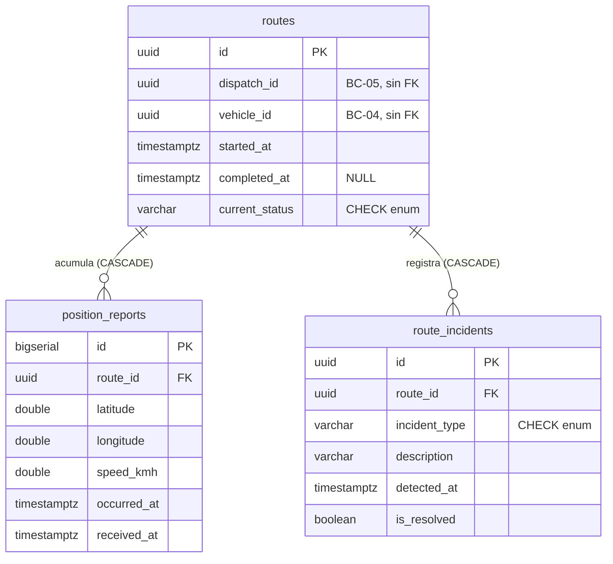
```mermaid
erDiagram
    routes {
        uuid id PK
        uuid dispatch_id "BC-05, sin FK"
        uuid vehicle_id "BC-04, sin FK"
        timestamptz started_at
        timestamptz completed_at "NULL"
        varchar current_status "CHECK enum"
    }
    position_reports {
        bigserial id PK
        uuid route_id FK
        double latitude
        double longitude
        double speed_kmh
        timestamptz occurred_at
        timestamptz received_at
    }
    route_incidents {
        uuid id PK
        uuid route_id FK
        varchar incident_type "CHECK enum"
        varchar description
        timestamptz detected_at
        boolean is_resolved
    }
    routes ||--o{ position_reports : "acumula (CASCADE)"
    routes ||--o{ route_incidents : "registra (CASCADE)"
```

---

##### 7. BC-07: Site Reception and Verification

Este contexto sostiene la llegada de la unidad al frente de obra, el cotejo de lo recibido contra lo despachado y el registro fotográfico de evidencias. La cantidad de diferencia no se almacena como columna: se obtiene de la resta entre `dispatched_quantity` y `received_quantity`, de modo que conservarla duplicaría información ya contenida en ambas columnas.

**Tabla `receptions`**

| Columna | Tipo | Constraint |
|---|---|---|
| id | uuid | PRIMARY KEY |
| dispatch_id | uuid | NOT NULL, UNIQUE |
| verified_by_user_id | uuid | NOT NULL |
| arrived_at | timestamptz | NOT NULL |
| closed_at | timestamptz | NULL |
| status | varchar(25) | NOT NULL, CHECK |

**Tabla `reception_items`**

| Columna | Tipo | Constraint |
|---|---|---|
| id | uuid | PRIMARY KEY |
| reception_id | uuid | NOT NULL, FOREIGN KEY → `receptions(id)` |
| material_name | varchar(150) | NOT NULL |
| dispatched_quantity | numeric(12,3) | NOT NULL |
| received_quantity | numeric(12,3) | NOT NULL |

**Tabla `supporting_evidences`**

| Columna | Tipo | Constraint |
|---|---|---|
| id | uuid | PRIMARY KEY |
| reception_id | uuid | NOT NULL, FOREIGN KEY → `receptions(id)` |
| evidence_url | varchar(500) | NOT NULL |
| captured_at | timestamptz | NOT NULL |
| caption | varchar(300) | NOT NULL |

**Relaciones**

| Origen | Destino | Cardinalidad | Regla de borrado |
|---|---|---|---|
| reception_items.reception_id | receptions.id | N:1 (1..*) | ON DELETE CASCADE |
| supporting_evidences.reception_id | receptions.id | N:1 (0..*) | ON DELETE CASCADE |
| receptions.dispatch_id, receptions.verified_by_user_id | *(BC-05 y BC-02)* | — | Sin clave foránea |

**Constraints**

| Nombre | Tipo | Definición |
|---|---|---|
| uq_receptions_dispatch | UNIQUE | `(dispatch_id)` — un despacho se recibe una sola vez |
| ck_receptions_status | CHECK | `status IN ('ARRIVED', 'VERIFIED_CONFORMANT', 'VERIFIED_DISCREPANT')` |
| ck_reception_items_quantities | CHECK | `dispatched_quantity >= 0 AND received_quantity >= 0` |

**Figura 76**

*Diagrama de base de datos del Bounded Context BC-07: Site Reception and Verification*

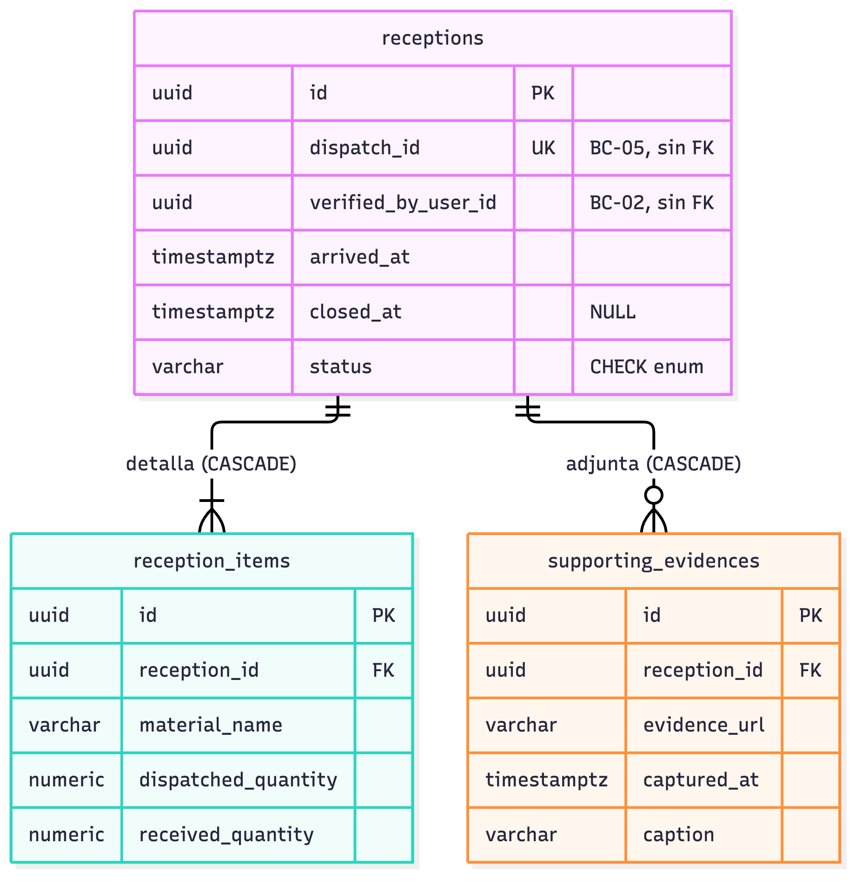
*Nota.* Elaboración propia del equipo de Trazza Labs, derivada del diagrama de clases de la sección 4.7.1. El diagrama se modela como entidad-relación y se genera a partir de su definición en texto (Mermaid `erDiagram`), de modo que permanece versionado junto con el informe.

**Código fuente del diagrama (Mermaid `erDiagram`)**

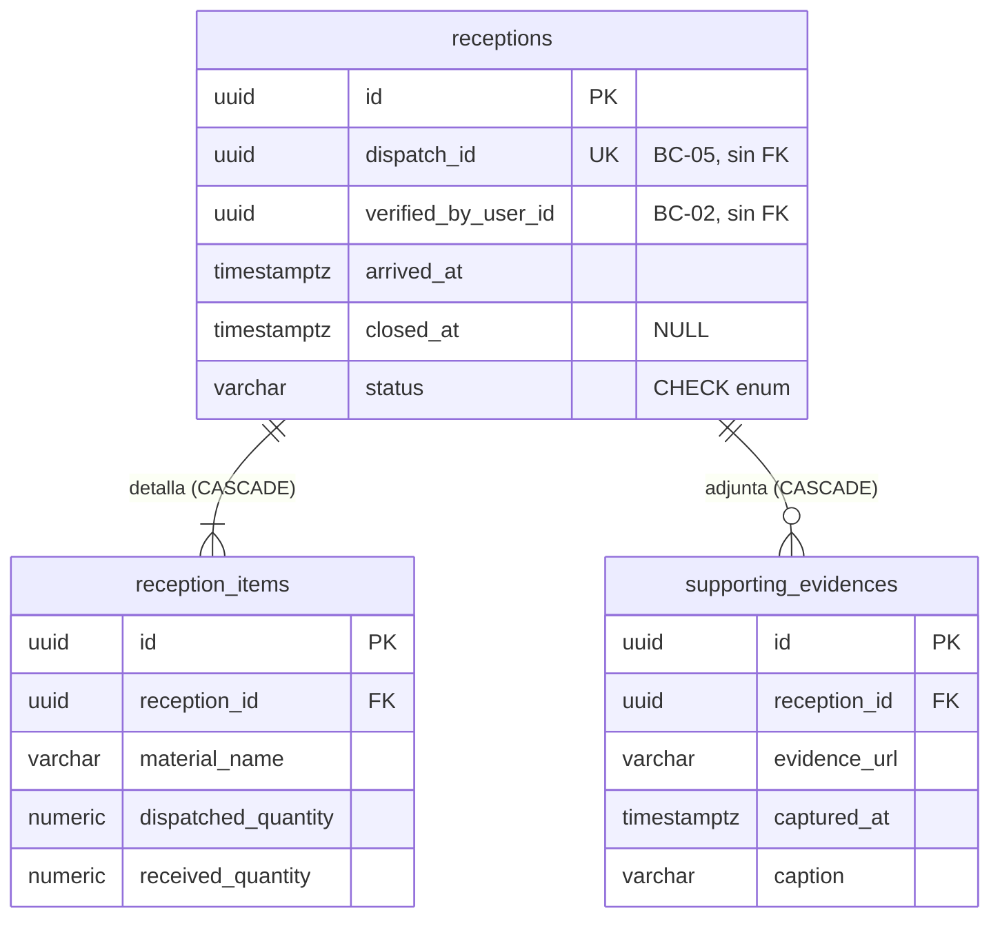
```mermaid
erDiagram
    receptions {
        uuid id PK
        uuid dispatch_id UK "BC-05, sin FK"
        uuid verified_by_user_id "BC-02, sin FK"
        timestamptz arrived_at
        timestamptz closed_at "NULL"
        varchar status "CHECK enum"
    }
    reception_items {
        uuid id PK
        uuid reception_id FK
        varchar material_name
        numeric dispatched_quantity
        numeric received_quantity
    }
    supporting_evidences {
        uuid id PK
        uuid reception_id FK
        varchar evidence_url
        timestamptz captured_at
        varchar caption
    }
    receptions ||--|{ reception_items : "detalla (CASCADE)"
    receptions ||--o{ supporting_evidences : "adjunta (CASCADE)"
```

---

##### 8. BC-08: Discrepancy and Evidence Management

Este contexto sostiene el expediente del caso de discrepancia y la línea de tiempo que consolida los hechos registrados en el despacho, el traslado y la recepción. La columna `source_context` indica de qué Bounded Context proviene cada entrada de la línea de tiempo, lo que permite reunir evidencia de tres contextos sin establecer claves foráneas hacia ninguno de ellos: la trazabilidad se resuelve por copia y no por referencia, de modo que los datos quedan fijados en el momento de la consolidación y no se alteran ante cambios posteriores en los contextos de origen. Esta característica sostiene el valor probatorio del expediente.

El atributo `timestamp` del diagrama de clases se nombra `entry_timestamp` en la base de datos, dado que `timestamp` constituye palabra reservada en SQL. Es la única denominación que se aparta de lo establecido en la sección 4.7.1.

**Tabla `discrepancy_cases`**

| Columna | Tipo | Constraint |
|---|---|---|
| id | uuid | PRIMARY KEY |
| dispatch_id | uuid | NOT NULL |
| reception_id | uuid | NOT NULL |
| case_number | varchar(30) | NOT NULL, UNIQUE |
| opened_at | timestamptz | NOT NULL |
| closed_at | timestamptz | NULL |
| status | varchar(25) | NOT NULL, CHECK |
| determined_liability | varchar(20) | NOT NULL, CHECK |
| resolution_summary | text | NULL |

**Tabla `consolidated_timeline_entries`**

| Columna | Tipo | Constraint |
|---|---|---|
| id | bigserial | PRIMARY KEY |
| case_id | uuid | NOT NULL, FOREIGN KEY → `discrepancy_cases(id)` |
| entry_timestamp | timestamptz | NOT NULL |
| source_context | varchar(50) | NOT NULL |
| event_description | varchar(300) | NOT NULL |

**Relaciones**

| Origen | Destino | Cardinalidad | Regla de borrado |
|---|---|---|---|
| consolidated_timeline_entries.case_id | discrepancy_cases.id | N:1 (1..*) | ON DELETE CASCADE |
| discrepancy_cases.dispatch_id, .reception_id | *(BC-05 y BC-07)* | — | Sin clave foránea |

**Constraints e índices**

| Nombre | Tipo | Definición |
|---|---|---|
| uq_discrepancy_cases_number | UNIQUE | `(case_number)` |
| ck_discrepancy_cases_status | CHECK | `status IN ('OPEN', 'UNDER_REVIEW', 'REPORT_GENERATED', 'CLOSED')` |
| ck_discrepancy_cases_liability | CHECK | `determined_liability IN ('PENDING', 'SUPPLIER', 'CARRIER', 'WAREHOUSE', 'JOB_SITE', 'NORMAL_LOSS')` |
| idx_timeline_case_timestamp | ÍNDICE | `(case_id, entry_timestamp)` |

**Figura 77**

*Diagrama de base de datos del Bounded Context BC-08: Discrepancy and Evidence Management*
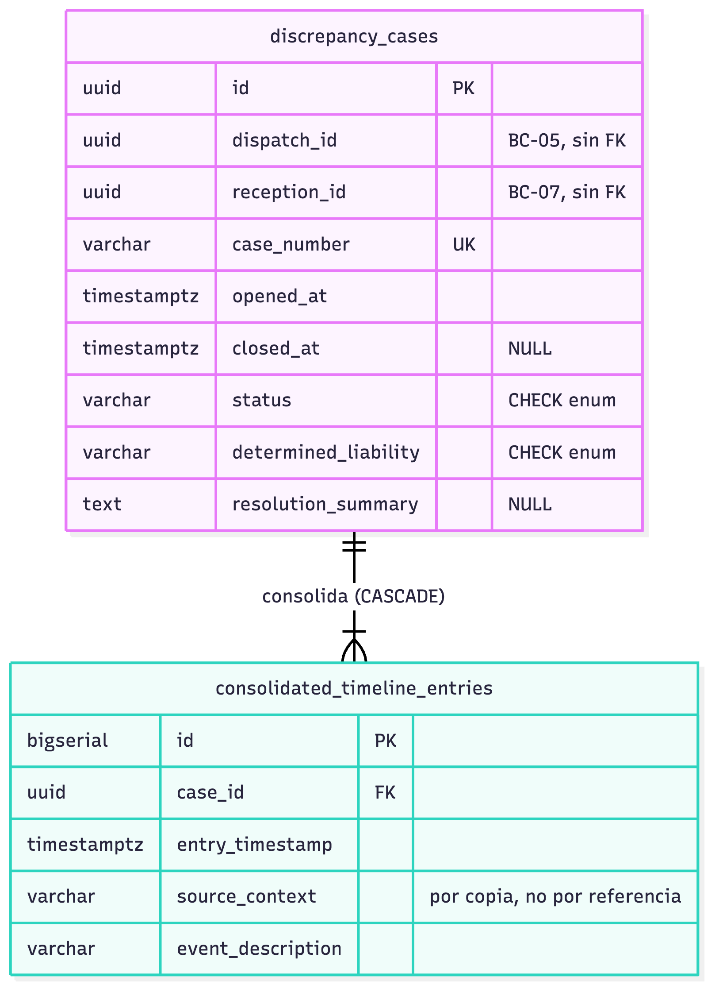

*Nota.* Elaboración propia del equipo de Trazza Labs, derivada del diagrama de clases de la sección 4.7.1. El diagrama se modela como entidad-relación y se genera a partir de su definición en texto (Mermaid `erDiagram`), de modo que permanece versionado junto con el informe.

**Código fuente del diagrama (Mermaid `erDiagram`)**

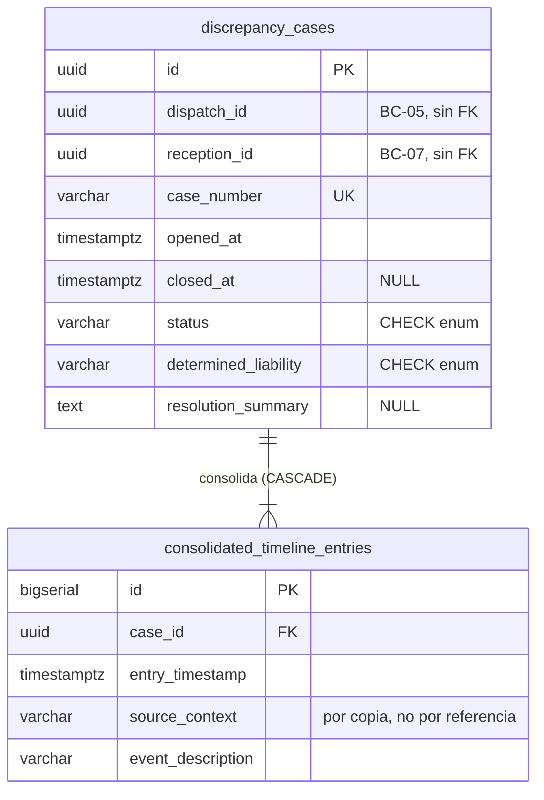
```mermaid
erDiagram
    discrepancy_cases {
        uuid id PK
        uuid dispatch_id "BC-05, sin FK"
        uuid reception_id "BC-07, sin FK"
        varchar case_number UK
        timestamptz opened_at
        timestamptz closed_at "NULL"
        varchar status "CHECK enum"
        varchar determined_liability "CHECK enum"
        text resolution_summary "NULL"
    }
    consolidated_timeline_entries {
        bigserial id PK
        uuid case_id FK
        timestamptz entry_timestamp
        varchar source_context "por copia, no por referencia"
        varchar event_description
    }
    discrepancy_cases ||--|{ consolidated_timeline_entries : "consolida (CASCADE)"
```
