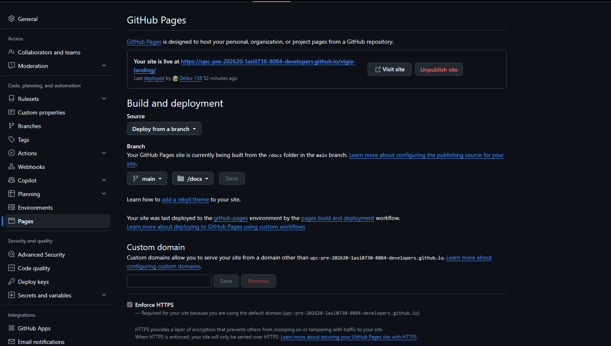

##### 5.2.1.7. Software Deployment Evidence for Sprint Review

El despliegue del Landing Page se configuró en GitHub Pages sobre el repositorio vigia-landing, con la rama `main` y la carpeta `/docs` como origen de publicación, conforme a lo detallado en la sección 5.1.4. La URL pública resultante es https://tinyurl.com/2xto55wc.

**Figura 83**

