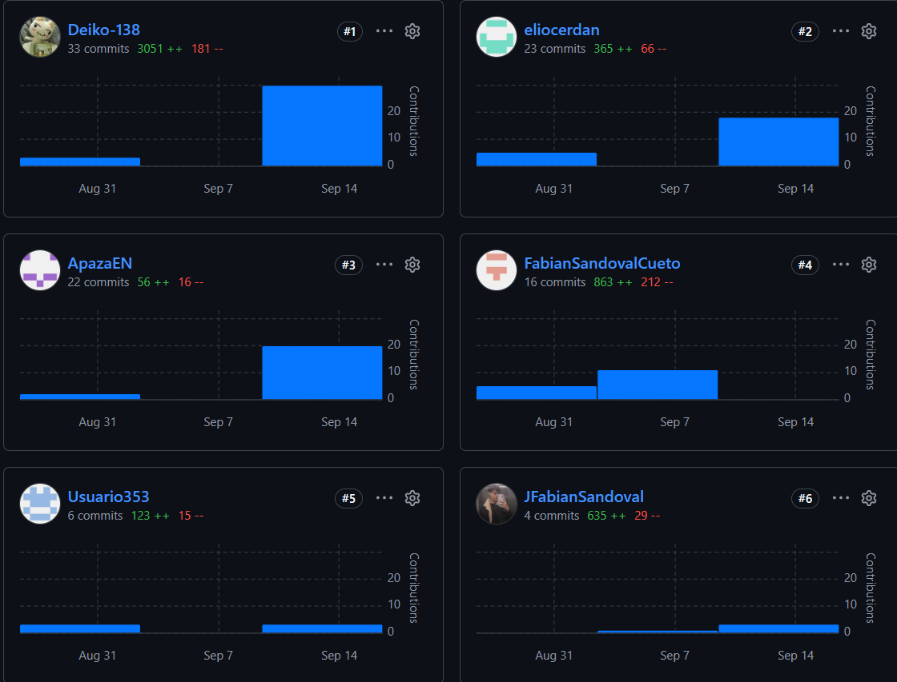

##### 5.2.1.8. Team Collaboration Insights during Sprint

El equipo trabajó bajo GitFlow, con una rama `feature/<nombre>` por integrante sobre el repositorio Vigia-Report, integrando el trabajo a `develop` mediante Pull Request. Durante el Sprint 1 se fusionaron los Pull Requests #7, #8, #9 y #10 hacia `develop`, evidenciando revisión antes de la integración en lugar de commits directos sobre la rama compartida.

**Participación registrada (commits en Vigia-Report a la fecha de esta entrega):**

| Integrante (usuario de GitHub) | Commits | Rama de trabajo |
|---|---|---|
| Leonardo Lopez / Deiko-138 | 39 | `feature/leonardo` |
| ApazaEN | 27 | `feature/Apaza` |
| FabianSandovalCueto / JFabianSandoval | 20 | `feature/Sandoval` |
| eliocerdan | 9 | `feature/Ramos` |
| Usuario353 | 8 | `feature/Cardenas` |

Los cinco integrantes registran commits propios durante el Sprint, lo que evidencia participación distribuida en la elaboración del informe y del Landing Page, conforme lo exige el enunciado del proyecto.

