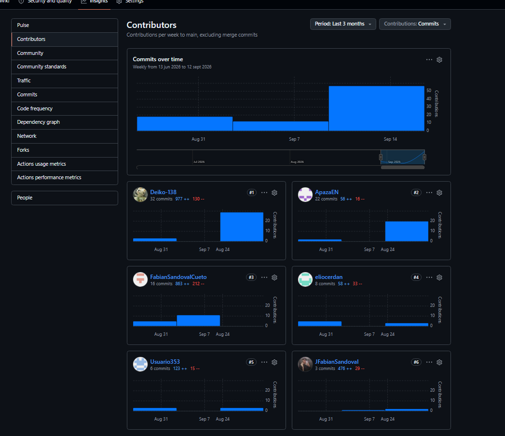

## Project Report Collaboration Insights

Repositorio del Project Report: **https://github.com/upc-pre-202620-1asi0730-8084-Developers/Vigia-Report**

### AV1

Durante esta entrega, la elaboración del informe se organizó bajo GitFlow: cada integrante trabajó sobre su propia rama `feature/<nombre>` (`feature/Sandoval`, `feature/leonardo`, `feature/Apaza`, `feature/Cardenas`, `feature/Ramos`), integrando su avance a la rama `develop` mediante Pull Request, en lugar de hacer commits directos sobre la rama compartida. Durante el periodo del Sprint 1 (01/09/2026 – 18/09/2026) se fusionaron a `develop` los Pull Requests #7, #8, #9 y #10.

El siguiente cuadro resume la participación registrada en commits sobre el repositorio a la fecha de esta entrega:

| Integrante (usuario de GitHub) | Commits | Rama de trabajo |
|---|---|---|
| Leonardo Lopez / Deiko-138 | 39 | `feature/leonardo` |
| ApazaEN | 27 | `feature/Apaza` |
| FabianSandovalCueto / JFabianSandoval | 20 | `feature/Sandoval` |
| eliocerdan | 9 | `feature/Ramos` |
| Usuario353 | 8 | `feature/Cardenas` |

Los cinco integrantes registran commits propios sobre el repositorio durante el Sprint 1, lo que evidencia que todos participaron en la elaboración del informe, conforme lo exige el enunciado del proyecto.

🟢 *Nota: la captura anterior ya fue tomada y usada como evidencia en la sección 5.2.1.8; se reutiliza aquí porque el enunciado pide la misma evidencia de analíticos de colaboración en esta sección del front-matter. Confirmar que la ruta de la imagen cargue correctamente al exportar el informe.*

🟢 **Pendiente de confirmar.** La correspondencia exacta entre los usuarios de GitHub de la tabla y los nombres completos de la sección 1.1.2 debe ser confirmada por el equipo (ver la misma nota en la sección 5.1.2).
